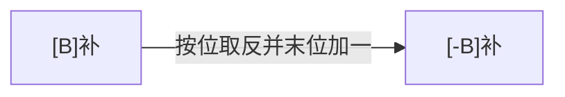

# 进位计数制

## 十进制计数法

十进制计数法是由古印度人发明的阿拉伯数学体系中的一部分，使用了 `0 1 2 3 4 5 6 7 8 9` 这十个符号。

### 十进制表示方法
以十进制数 $975.36$ 为例：
$$
975.36 = 9 \times 10^2 + 7 \times 10^1 + 5 \times 10^0 + 3 \times 10^{-1} + 6 \times 10^{-2}
$$

其中，符号所在的位置反映了其对应的权重（$10^n$）。

### 十进制的一般形式
对于任意十进制数，可以表示为：
$$
K_n K_{n-1} \dots K_2 K_1 K_0 K_{-1} K_{-2} \dots K_{-m}
$$
展开为：
$$
K_n \times 10^n + K_{n-1} \times 10^{n-1} + \dots + K_1 \times 10^1 + K_0 \times 10^0 + \dots + K_{-m} \times 10^{-m}
$$
其中，$10^n$ 是**位权**。

### 十进制计数法特点
1. 基于“乘法”思想的计数方法；
2. 进位制：逢十进一，基数为 10，有 10 个符号（0-9）。

---

## 推广：r 进制计数法

**r 进制数**的表示方法与十进制类似：
$$
K_n K_{n-1} \dots K_2 K_1 K_0 K_{-1} K_{-2} \dots K_{-m}
$$
表示为：
$$
K_n \times r^n + K_{n-1} \times r^{n-1} + \dots + K_1 \times r^1 + K_0 \times r^0 + \dots + K_{-m} \times r^{-m}
$$
其中，$r^n$ 为位权。

### 进制数的基数
**基数**是每个数码位所用到的<u>不同符号的个数</u>。r 进制的基数为 r。

### 常见进制
- **二进制**（r = 2）：使用 0 和 1 两个符号，常用于计算机系统。
- **八进制**（r = 8）：使用 0 到 7 八个符号。
- **十六进制**（r = 16）：使用 0 到 9 和 A 到 F 共 16 个符号。


---

## 二进制的优势

1. **物理实现**：二进制可以通过两个稳定状态的物理器件（如开关、晶体管）表示。
2. **逻辑值映射**：$0$ 和 $1$ 分别对应逻辑值“假”和“真”，方便进行逻辑运算。
3. **计算机实现**：可以通过逻辑门电路高效地实现算术和逻辑运算。

---

## 任意进制转换为十进制

将任意进制数转换为十进制数时，采用的方法是将每个位的数值与该位的基数的幂相乘，并求和。

### 转换方法
1. 每个数位的数字乘以基数的相应幂次；
2. 将所有乘积求和得到十进制数。

### 示例：二进制转十进制
将二进制数 `1011` 转换为十进制：
$$
1011_2 = 1 \times 2^3 + 0 \times 2^2 + 1 \times 2^1 + 1 \times 2^0 = 8 + 0 + 2 + 1 = 11
$$


---

## 二进制与其他进制互相转换

### 二进制 $\leftrightarrow$ 八进制
- 每 3 位二进制数对应一个八进制数位。
- 示例：`11110000010.01101` 转换为八进制。


### 二进制 $\leftrightarrow$ 十六进制
- 每 4 位二进制数对应一个十六进制数位。
- 示例：`11110000010.01101` 转换为十六进制。


### 八进制 $\leftrightarrow$ 二进制
每个八进制位对应 3 位二进制数。
- 示例：$(251.5)_8 \rightarrow (010 \ 101 \ 001 . 101)_2$

### 十六进制 $\leftrightarrow$ 二进制
每个十六进制位对应 4 位二进制数。
- 示例：$(AE86.1)_{16} \rightarrow (1010 \ 1110 \ 1000 \ 0110.0001)_2$

---

## 各种进制常见书写方式

- **二进制**：$(1010001010010)_2$ 或 $1010001010010\text{B}$
- **八进制**：$(1652)_8$
- **十六进制**：$(1652)_{16}$，$1652 \text{H}$，$0\text{x} 1652$
- **十进制**：$(1652)_{10}$，$1652 \text{D}$

---

## 十进制转换为任意进制

### 方法：
1. **整数部分**：通过除法和取余法。
2. **小数部分**：通过乘法和取整法。

### 示例：十进制数 $75.3$ 转换为二进制

#### 整数部分：
将 $75$ 除以 2，直到商为 0，取每次余数：
$$
75 \div 2 = 37 \dots 1 \ (K_0)
$$
$$
37 \div 2 = 18 \dots 1 \ (K_1)
$$
$$
18 \div 2 = 9  \dots 0 \ (K_2)
$$
$$
9 \div 2 = 4 \dots 1 \ (K_3)
$$
$$
4 \div 2 = 2 \dots 0 \ (K_4)
$$
$$
2 \div 2 = 1 \dots 0 \ (K_5)
$$
$$
1 \div 2 = 0 \dots 1 \ (K_6)
$$
所以，整数部分 $75_{10}$ 转换为二进制为 $(1001011)_2$。

#### 小数部分：
将小数部分 $0.3$ 乘以 2，取整部分：
$$
0.3 \times 2 = 0.6 \quad \text{取整部分} 0
$$
$$
0.6 \times 2 = 1.2 \quad \text{取整部分} 1
$$
$$
0.2 \times 2 = 0.4 \quad \text{取整部分} 0
$$
$$
0.4 \times 2 = 0.8 \quad \text{取整部分} 0
$$
继续乘下去可以得到更精确的结果。小数部分转换为二进制大致为 $0.01001$（近似）。

所以，$75.3_{10} \approx (1001011.01001)_2$。


---

## 十进制转换为二进制（拼凑法）

将十进制数（如 $260.75$ 或 $533.125$）转换为二进制，可以分别处理整数部分和小数部分。

### 示例：$260.75$ 和 $533.125$ 的转换


---

## 真值与机器数

- **真值**：符合人类习惯的数字表示方法。
- **机器数**：数字在计算机中实际存储的形式，正负号需要通过补码或其他方式“数字化”。

### 示例：
- $15$ 的机器数表示：`1111` 和 `01111`。
- $-8$ 的机器数表示：`11000`。

---

## 知识回顾

### 进制转换注意事项：
- 某些十进制小数（如 $0.3$）无法用二进制精确表示。


> 例如：$0.3_{10} = 0.01001\dots_2$（无限循环小数）。


---

# BCD 码

BCD（Binary-Coded Decimal）是用二进制表示十进制数的一种编码方式。

### 快速转换：一一对应

8421 码的映射关系如下：

| 十进制 | 二进制 |
| ------ | ------ |
| 0      | 0000   |
| 1      | 0001   |
| 2      | 0010   |
| 3      | 0011   |
| 4      | 0100   |
| 5      | 0101   |
| 6      | 0110   |
| 7      | 0111   |
| 8      | 1000   |
| 9      | 1001   |


### BCD 码加法运算

当进行 8421 码加法时，如果结果超出了有效范围（大于 9），则需要进行修正。具体修正方法是：如果加法结果大于 9，则给<u>结果加上 6（即 $(0110)_2$）</u>，使其回到有效范围。

例如：

- $ 9 + 9 \rightarrow 1001 + 1001 = 1 0010 $
- 修正为 $ 1 0010 + (0110)_2 = 0001 1000 $

> 注：若加法结果本身落入合法范围内，则无需修正。

---

### 不同编码方案

#### 4 个二进制位 → 16 种不同的状态

BCD 码仅使用其中的 10 种编码方式，因此存在不同的映射方案。

#### 余 3 码（8421 码 + $(0011)_2$）

| 十进制 | 二进制 |
| ------ | ------ |
| 0      | 0011   |
| 1      | 0100   |
| 2      | 0101   |
| 3      | 0110   |
| 4      | 0111   |
| 5      | 1000   |
| 6      | 1001   |
| 7      | 1010   |
| 8      | 1011   |
| 9      | 1100   |

#### 2421 码（改变权值定义）

| 十进制 | 二进制 |
| ------ | ------ |
| 0      | 0000   |
| 1      | 0001   |
| 2      | 0010   |
| 3      | 0011   |
| 4      | 0100   |
| 5      | 1011   |
| 6      | 1100   |
| 7      | 1101   |
| 8      | 1110   |
| 9      | 1111   |

对于 2421 码，编码策略是：前 4 位的编码首位为 0；后 4 位的编码首位为 1。

---

## 知识回顾


---

# 无符号整数的表示与运算

无符号整数（即自然数）用于表示 $0, 1, 2, 3, 4, \dots$

在 C 语言中，无符号整数的表示方式如下：

```c
unsigned short a = 1;  // 无符号短整型（2 字节）
unsigned int b = 2;    // 无符号整型（4 字节）
```

### 主要问题

- **无符号整数**如何在计算机硬件中**表示**？
- **无符号整数**的**加法和减法运算**如何通过硬件实现？

## 无符号整数的表示方法


> 注：当前的个人计算机一般是 64 位字长，至少为 32 位。

### 表示细节

1. **无符号整数**的所有二进制位都为数值位，没有符号位，第 $i$ 位的权值为 $2^{i-1}$。
2. 对于 $n$ 位的无符号整数，**取值范围为 $0 \sim 2^n - 1$**；若超出此范围，则会发生**溢出**。
3. 最小值为**全 0**，最大值为**全 1**。

## 无符号整数的加法运算


**加法的硬件实现**：从最低位开始，按位相加，若产生进位则传递至更高位。

## 无符号整数的减法运算


**减法的硬件实现**：

1. <u>保持“被减数”不变，将“减数”按位取反，并对末位加一（即转换为加法形式）</u>。
2. 从最低位开始按位相加，若有进位则传递至更高位。

> 注：由于加法电路成本较低、减法电路较贵，因此通过转化为加法来实现减法更具经济性。

# 带符号整数的表示与运算

带符号整数，即整数的范围如 $-2, -1, 0, 1, 2, 3, 4, \dots$。

在 C 语言中，带符号整数的表示方式如下：

```c
short a = 1;  // 带符号整数（短整型，2B）
int b = -1;   // 带符号整数（整型，4B）
```

不同位数的类型表示的数值范围不同。

> 主要问题：
>
> - **带符号整数**在计算机硬件中是如何**表示**的？
> - **带符号整数**的**加法和减法运算**是如何通过硬件实现的？

$$
带符号整数的表示方式
\begin{cases}
原码 \\ 
补码 \\ 
反码
\end{cases}
$$

即，同一个数值，可以用不同的编码方式来表示。

---

## 原码表示


在书面中，通常表示为 $x = -19$，$[x]_{\text{原}} = 1, 0010011$。  
若未指明机器字长，可以写成 $[x]_{\text{原}} = 1,10011$。

**原码的特点**：

1. 符号位“0/1”分别表示“正/负”，其余位表示数值的绝对值；
2. 如果机器字长为 $n+1$ 位，则带符号整数的原码表示范围为 $-(2^n - 1) \le x \le 2^n - 1$；
3. **真值 0 有两种形式**：$+0$ 和 $-0$，即 $[+0]_{\text{原}} = 0,0000000$；$[-0]_{\text{原}} = 1,0000000$。

---

## 原码的缺点


**原码的缺点**：符号位不能参与运算，这样就需要设计复杂的硬件电路才能处理，加大了成本。

> 使用**补码**表示真值可以解决这个问题，因为**符号位可以参与运算**。

---

## 原码 $\rightarrow$ 反码 $\rightarrow$ 补码 的转换


---

## 原码和补码的快速转换技巧


---

## 补码的加法运算示例

### 例 1


**计算过程**：计算机硬件进行补码加法时，从最低位开始，**按位相加（包括符号位）**，并向更高位**进位**。

### 例 2


计算机硬件从最低位开始**按位相加（符号位参与运算）**，并进位。

---

## 补码的减法运算

补码减法可以转化为加法运算，具体公式如下：

$$
\begin{align*}
[A]_{\text{补}} - [B]_{\text{补}} &= [A]_{\text{补}} + [-B]_{\text{补}}
\end{align*}
$$

> 注：加法电路简单且造价低廉，减法电路造价较高，因此将减法转为加法有助于降低成本。

接下来的问题是：已知减数的补码，如何得到其负数的补码表示？




> 注：通过同一套电路可以实现所有的加减法，节省了硬件成本。

---

## 补码的减法运算示例


**计算过程**：在计算机硬件中进行带符号数的补码减法：

1. 保持“被减数”不变，将“减数”按位取反并末位加一，**将减法转为加法**。
2. 从最低位开始，**按位相加**，并向更高位**进位**。

---

## 知识回顾


> 注：在计算机中，所有带符号整数的加减运算都需要先转化为补码再进行处理。 

---

# 原码、反码、补码特性对比

### 各种码的特性比较

在计算机中，不同的表示方法（原码、反码、补码）有各自的特点和应用场景。以下是对它们的关键特性比较：

$$
几种码的特性对比
\begin{cases}
& n + 1 \ \text{bit} \ 的合法表示范围 \\ \\ 
& 最大数的表示方式、最小数的表示方式 \\ \\ 
& 真值 0 的表示
\end{cases}
$$

---

## 各种码的基本特性总结

| $n + 1$ 位表示方式   | 合法表示范围                   | 最大值                              | 最小值                                 | 真值 0 的表示法                                              |
| -------------------- | ------------------------------ | ----------------------------------- | -------------------------------------- | ------------------------------------------------------------ |
| 带符号整数：**原码** | $-(2^n - 1) \le x \le 2^n - 1$ | $\mathbf{0},111\dots 111 = 2^n - 1$ | $\mathbf{1},111\dots 111 = -(2^n - 1)$ | $\begin{align*}&[+0]_{\text{原}} = \mathbf{0}, 000 \dots 000 \\ &[-0]_{\text{原}} = \mathbf{1}, 000 \dots 000 \end{align*}$ |
| 带符号整数：**反码** | $-(2^n - 1) \le x \le 2^n - 1$ | $\mathbf{0},111\dots 111 = 2^n - 1$ | $\mathbf{1},000\dots 000 = -(2^n - 1)$ | $\begin{align*}&[+0]_{\text{反}} = \mathbf{0}, 000 \dots 000 \\ &[-0]_{\text{反}} = \mathbf{1}, 111 \dots 111 \end{align*}$ |
| 带符号整数：**补码** | $-2^n \le x \le 2^n -1$        | $\mathbf{0},111\dots 111 = 2^n - 1$ | $\mathbf{1},000\dots 000 = -2^n$       | $\begin{align*}&[+0]_{\text{补}} = \mathbf{0}, 000 \dots 000 \end{align*}$ （真值 $0$ 只有一种表现形式） |
| 带符号整数：**移码** | $-2^n \le x \le 2^n - 1$       | $\mathbf{1},111\dots 111 = 2^n - 1$ | $\mathbf{0},000\dots 000 = -2^n$       | $\begin{align*}&[+0]_{\text{补}} = \mathbf{1}, 000 \dots 000 \end{align*}$ （真值 $0$ 只有一种表现形式） |
| **无符号整数**       | $0 \le x \le 2^{n + 1} - 1$    | $111\dots 111 = 2^{n + 1} - 1$      | $000\dots 000 = 0$                     | $000\dots 000$                                               |

---

### 总结要点

- **原码**和**反码**的表示范围相同，都可以用两种方法表示真值 0（+0 和 -0）。
- **补码**的表示范围比原码多一个负数，且真值 0 只有一种表示形式。
- **无符号整数**没有符号位，其数值范围从 $0$ 到 $2^{n + 1} - 1$。

### 常见考点

对于两个数 $A$ 和 $B$ 进行运算后的结果，判断是否发生溢出：

- **手算验证**：可以将结果代入十进制计算，检查结果是否超出合法范围，以判断是否发生溢出。

---

# 带符号整数——移码表示

---

## 原、反、补、移码的表示对比


---

## 移码

**移码**是一种在补码的基础上<u>对符号位进行取反</u>的表示方法。移码的表示形式只适用于整数。


### 移码的特性

- **真值 0 只有一种表示形式**：$[0]_{\text{移}} = 10000000$。
- 如果机器字长为 $n + 1$ 位，那么移码表示的整数范围为 $-2^n \le x \le 2^n - 1$，这与<u>补码的范围</u>相同。


### 移码的优势

移码表示的整数在硬件电路中可以**方便地比较大小**，这使得移码适用于需要直接比较带符号整数大小的场景。

---

## 练习


# 定点小数的表示和运算

---

## 定点整数与定点小数的概念

$$
定点数分类
\begin{cases}
\text{定点整数} \quad (\text{即：带符号整数}) \\\\
\text{定点小数}
\end{cases}
$$


### 定点数的编码表示

- **定点整数**：可以采用原码、反码、补码、或*移码*进行编码。
  
  

- **定点小数**：可以采用原码、反码或补码进行编码。

---

## 定点小数的表示（以原码为例）


> 注意：定点小数的原码、反码、补码转换与定点整数的<u>转换方法一致</u>。

---

## 定点小数的加、减运算

在对两个定点小数 $A$ 和 $B$ 进行加法或减法时，通常需要将数值转换为补码形式。计算机硬件处理定点小数补码的加减运算如下：

### 加法
- **定点小数补码的加法**：从最低位开始**按位相加（包括符号位）**，并向更高位**进位**。

### 减法
- **定点小数补码的减法**：
  1. 保持“被减数”不变，将“减数”**按位取反并末位加一**，将减法转换为加法。
  2. 从最低位开始，**按位相加**，并向更高位**进位**。

---

## 定点小数 VS 定点整数


---

### 特别注意：位数扩展

在位数扩展时，定点小数和定点整数的**扩展位置不同**。


> 加法和减法运算的处理方法与定点整数一致，不再详述。

# 奇偶校验码

校验码用于检测数据传输中的错误，**奇偶校验**是最常用的基本校验方法之一。通过在数据<u>末尾添加一个校验位</u>，确保传输的数据满足特定的奇偶性条件，从而可以检测出单比特错误。

---

## 校验原理

奇偶校验的基本原理是通过在数据的末尾添加一个**校验位**，使整个数据的**1的个数**满足**奇数**或**偶数**的要求。  
- **奇校验**：使数据中 1 的总个数为奇数。
- **偶校验**：使数据中 1 的总个数为偶数。


---

## 奇偶校验码

**奇校验码**与**偶校验码**的生成方式：

- **奇校验码**：数据中1的总个数应为奇数。
- **偶校验码**：数据中1的总个数应为偶数。

例如，给出两个编码 $1001101$ 和 $1010111$ 的奇校验码和偶校验码如下：

- **奇校验**：在数据前面添加一个校验位，使得整个数据1的个数为奇数。
  - $1001101 \rightarrow \underline{1}1001101$
  - $1010111 \rightarrow \underline{0}1010111$

- **偶校验**：在数据前面添加一个校验位，使得整个数据 1 的个数为偶数。
  - $1001101 \rightarrow \underline{0}1001101$
  - $1010111 \rightarrow \underline{1}1010111$

### 硬件实现的偶校验

偶校验位的计算通常通过**异或运算**来实现。各信息位进行**模 2 加**（即**异或**）运算，得到的结果即为偶校验位。


# 算术逻辑单元 (ALU) 的电路基本原理和加法器设计

$$
算术逻辑单元
\begin{cases}
作用、大致原理 \\\\
电路基础知识 \\\\
加法器的实现
\end{cases}
$$

---

## 算术逻辑单元（ALU）

算术逻辑单元（Arithmetic and Logic Unit, ALU）是计算机处理器中的核心组件之一，负责执行基本的**算术运算**（如加、减、乘、除）和**逻辑运算**（如与、或、非、异或）。此外，ALU 还能够完成一些辅助功能，比如移位、求补等操作。

### ALU 的组成及运算功能

1. **算术运算**：加法、减法、乘法、除法等。
2. **逻辑运算**：与、或、非、异或等。
3. **辅助功能**：移位、求补、反转等。


在下图中，通过控制信号 $M$ 的不同状态，ALU 可以选择执行算术运算或逻辑运算。
- $M = 1$ 表示执行逻辑运算。
- $M = 0$ 表示执行算术运算。

此外，控制信号 $S_0 \sim S_3$ 共四位，因此可组合出 16 种算术运算和 16 种逻辑运算。


---

## 最基本的逻辑运算


逻辑运算是电路设计的基础。常见的逻辑运算包括：

- **与** (AND) 运算
- **或** (OR) 运算
- **非** (NOT) 运算

在逻辑表达式中，逻辑运算符的优先级和数学运算类似：
- **与**运算的优先级高于**或**运算，可以类比为乘法和加法的优先级。

例如，对于表达式 $AB + CD$，计算顺序是先进行与运算（$A \cdot B$ 和 $C \cdot D$），再进行或运算（$AB + CD$）。

### 常用的逻辑运算规则

1. **分配律**：$A(C + D) = AC + AD$
2. **结合律**：$ABC = A(BC)$
3. **交换律**：$A + B = B + A$，$AB = BA$

这些规则可以用来简化电路设计。**简化逻辑表达式就是在简化电路，实现成本和效率优化**。

---

## 复合逻辑电路

通过组合多种基本门电路（与、或、非），可以构造复杂的复合逻辑电路。以下示例展示了如何用**与门**、**或门**和**非门**组合实现**异或门**：


---

## 用门电路求偶校验位

在数据传输中，偶校验位用来检测数据是否发生错误。通过将所有位的值逐位异或，可以计算出偶校验位。若所有位的异或结果为 $0$，则数据没有错误；否则，说明传输过程可能出现了单比特错误。

例如，对于数据 $1, 0, 0, 1, 1, 0, 1$，计算校验位如下：

$$
1 \oplus 0 \oplus 0 \oplus 1 \oplus 1 \oplus 0 \oplus 1 = 0
$$


---

## 加法器的设计

### 一位全加器

**一位全加器**是实现多位加法器的基本单元。它计算两个二进制数 $A$ 和 $B$ 的和，并考虑来自低位的进位 $C_{\text{in}}$。输出包括**和**（$S$）以及**进位**（$C_{\text{out}}$）。

1. **进位输出**：
   $$
   C_{\text{out}} = A \cdot B + (A \oplus B) \cdot C_{\text{in}}
   $$
2. **和输出**：
   $$
   S = A \oplus B \oplus C_{\text{in}}
   $$


---

## 串行加法器

**串行加法器**是一种逐位进行加法运算的加法器。它只有一个全加器，数据逐位串行输入到全加器中进行运算，进位会存储在进位触发器中，参与下一位的计算。

特点：
- 适用于每次仅计算一位和的场景。
- 适合对 $n$ 位操作数进行多次循环计算。


---

## 并行加法器

**并行加法器**通过多个全加器的并行计算实现多位数的加法。多个全加器串接在一起，可以同时计算多个二进制位的加法，显著提高了运算效率。

**串行进位的并行加法器**：每一级加法器的进位直接传递给下一级。进位信号是逐级传递的，因此称为“行波进位”。这种设计会受到进位传播的速度限制，**随着位数增加，运算速度会受到影响**。

### 并行加法器的进位计算公式

- **进位输出**：
  $$
  C_i = A_i \cdot B_i + (A_i \oplus B_i) \cdot C_{i-1}
  $$
- **和输出**：
  $$
  S_i = A_i \oplus B_i \oplus C_{i-1}
  $$


这种结构允许加法器快速处理多位数的加法，尤其在数据处理需求较高的应用场景中，极大地提高了计算效率。

# 并行进位加法器

在加法运算中，为了实现更高效的并行加法运算，可以通过提前计算各级的进位信号，实现**并行进位**，从而减少运算延迟。这种设计被称为**并行进位加法器**，也叫做**先行进位加法器**或**同时进位加法器**。

## 如何更快地产生进位？

通常情况下，第 $i$ 位的进位 $C_i$ 依赖于前一位的进位 $C_{i-1}$，递推计算如下：

$$
\begin{align*}
&C_i = A_i B_i + (A_i \oplus B_i) C_{i - 1} \\
&C_i = A_i B_i + (A_i \oplus B_i) (A_{i - 1} B_{i - 1} + (A_{i - 1} \oplus B_{i - 1}) C_{i - 2}) \\
&C_i = A_i B_i + (A_i \oplus B_i) (A_{i - 1} B_{i - 1} + (A_{i - 1} \oplus B_{i - 1}) (A_{i - 2} B_{i - 2} + (A_{i - 2} \oplus B_{i - 2}) C_{i - 3}) )  \\
&\dots
\end{align*}
$$

根据这个推导过程可以得出结论：第 $i$ 位的进位 $C_i$ 可以直接根据被加数 $A$ 和加数 $B$ 的**第 $1$ 到第 $i$ 位的值**，以及初始进位 $C_0$ 来确定。

### 定义符号

- $G_i = A_i B_i$：第 $i$ 位的**生成进位**（Generate），表示即使没有进位输入，$A_i$ 和 $B_i$ 也会产生进位。
- $P_i = A_i \oplus B_i$：第 $i$ 位的**传递进位**（Propagate），表示若有进位输入，则可以向更高位传递。

进位递推关系可以简化为：

$$
C_i = G_i + P_i C_{i - 1}
$$

### 并行计算公式

通过展开以上递推公式，我们可以得到更高位的进位公式：

$$
\begin{align*}
&C_1 = G_1 + P_1 C_0 \\
&C_2 = G_2 + P_2 G_1 + P_2 P_1 C_0 \\ 
&C_3 = G_3 + P_3 G_2 + P_3 P_2 G_1 + P_3 P_2 P_1 C_0 \\
&C_4 = G_4 + P_4 G_3 + P_4 P_3 G_2 + P_4 P_3 P_2 G_1 + P_4 P_3 P_2 P_1 C_0 \\
&\dots
\end{align*}
$$

这样一来，每个进位 $C_i$ 都可以在相同的时间内并行计算得到，无需等待前一位的进位信号。这种设计有效提高了加法器的速度。

---


---

## 并行进位加法器的结构

**并行进位加法器**的设计核心是各级进位信号的**并行计算**，即**先行进位计算**。每一级的进位信号（$C_i$）都在同一时间产生，而不需要逐级传播，因此称为并行进位或同时进位。

在实际电路设计中，并行进位加法器可以通过**多层逻辑门**组合实现。根据传递进位和生成进位的组合逻辑，我们可以实现多个位的进位信号在相同时间生成。


通过并行进位的设计，整体加法运算不再受到单个进位信号逐级传播的限制。这种设计提高了加法器的运算速度，特别适用于需要快速处理多位二进制数相加的场景。

---

# 补码加减运算器

## 加法器原理


### 例子

- 若 $A = 1000$，$B = 0111$，且 $C_{in} = 0$，则 $F = 1111$，$C_{out} = 0$。
- 若 $A = 1000$，$B = 0111$，且 $C_{in} = 1$，则 $F = 0000$，$C_{out} = 1$。


---

### $n$ 位补码加减运算

- $X + Y$ 的补码加法直接逐位相加。
- $X - Y$ 可通过求 $[-Y]_补$（即将 $Y$ 逐位取反并在末位加一）后与 $X$ 相加来实现。

---

## 例子分析

### 例 1

- **$4$ 位补码**表示：
  
  - $X = -8$，$Y = 7$
  - $X_补 = 1000 \ \text{B}$，$Y_补 = 0111 \ \text{B}$
  
  - **加法运算**：$X + Y = 1111 \ \text{B} = -1 \ \text{D}$  ✔️
  - **减法运算**：$X - Y = 1000 + (1000 + 1) = \text{~~1~~}0001 = -15 \ \text{D}$  ❌
  
- **无符号数**使用 $4$ 位：
  
  - $X = 8$，$Y = 7$
  
  - $X = 1000$，$Y = 0111$
  
  - **加法运算**：$X + Y = 1111 \ \text{B} = 15 \ \text{D}$  ✔️
  - **减法运算**：$X - Y = 1000 + (1000 + 1) = \text{~~1~~}0001 = 1 \ \text{D}$  ✔️

> **结论**：在不同编码方式下，溢出判定有所不同。

---

### 例 2

- **$4$ 位补码**表示：
  
  - $X = 3$，$Y = 4$
  - $X_补 = 0011 \ \text{B}$，$Y_补 = 0100 \ \text{B}$
  
  - **加法运算**：$X + Y = 0111 \ \text{B} = 7 \ \text{D}$  ✔️
  - **减法运算**：$X - Y = 0011 + (1011 + 1) = 1111 \ \text{B} = -1 \ \text{D}$  ✔️
  
- **无符号数**使用 $4$ 位：
  
  - $X = 3$，$Y = 4$
  
  - $X = 0011 \ \text{B}$，$Y = 0100 \ \text{B}$
  
  - **加法运算**：$X + Y = 0111 \ \text{B} = 7 \ \text{D}$  ✔️
  - **减法运算**：$X - Y = 0011 + (1011 + 1) = 1111 \ \text{B} = 15 \ \text{D}$  ❌

---

# 加减运算与溢出判断

## 本节总览


---

## 原码的加减运算


---

## 补码的加减运算

### 示例 1：$A = 15, B = -24$

设机器字长为 8 位（含 1 位符号位），求 $[A + B]_{\text{补}}$ 和 $[A - B]_{\text{补}}$。


---

### 示例 2：$C = 124$

求 $[A + C]_{\text{补}}$ 和 $[B - C]_{\text{补}}$：

$$
\begin{aligned}
&[A + C]_{\text{补}} = 0,0001111 + 0,1111100 = 1,0001011 & \quad \text{真值} -117 \\
&[B - C]_{\text{补}} = 1,1101000 + 1,0000100 = 0,1101100 & \quad \text{真值} +108
\end{aligned}
$$

可以看到，运算结果发生了溢出。

---

## 溢出判断

### 溢出情况分析

- **上溢**：只有“正数 + 正数”会出现 $正 + 正 = 负$。
- **下溢**：只有“负数 + 负数”会出现 $负 + 负 = 正$。


---

### 方法一：采用单符号位

设 $A$ 的符号位为 $A_S$，$B$ 的符号位为 $B_S$，运算结果的符号位为 $S_S$，则溢出逻辑表达式为：

$$
V = A_S B_S \overline{S_S} + \overline{A_S} \overline{B_S} S_S
$$

- 若 $V = 0$，表示无溢出；
- 若 $V = 1$，表示有溢出。

即：$A_S = 1$ 且 $B_S = 1$ 且 $S_S = 0$，或 $A_S = 0$ 且 $B_S = 0$ 且 $S_S = 1$。

> 写出逻辑表达式后便于电路实现。

---

### 方法二：采用进位符号位

溢出判断式为：

$$
V = C_S \oplus C_1
$$

- 若 $V = 0$，表示无溢出；
- 若 $V = 1$，表示有溢出。


---

### 方法三：采用双符号位

对于双符号位补码，正数符号为 $00$，负数符号为 $11$。

$$
\begin{aligned}
&[A + C]_{\text{补}} = 00,0001111 + 00,1111100 = 01,0001011 & \quad \text{下溢} \\
&[B - C]_{\text{补}} = 11,1101000 + 11,0000100 = 10,1101100 & \quad \text{上溢}
\end{aligned}
$$

此时，溢出判断式为：

$$
V = S_{S_1} \oplus S_{S_2}
$$

- 若 $V = 0$，表示无溢出；
- 若 $V = 1$，表示有溢出。

> 双符号位补码又被称为 **模 4 补码**（将上面逗号看作小数点，这两位相当于模 4 后的结果）。
>
> 单符号位补码又被称为 **模 2 补码**。

**注意：** 双符号位补码在内存中只存储一个符号位，运算时复制一个符号位。

---

## 符号扩展

### 定点整数的符号扩展

当从 `int` 转为 `long`，或从短数据转为长数据时，新增的位应该如何填补？

- 正数：填补 0；
- 负数：原码填补 0，反/补码填补 1。


### 定点小数的符号扩展

- 正数：填补 0；
- 负数：原码和补码填补 0，反码填补 1。


---

## 知识点回顾


----


**OF（Overflow Flag）：**溢出标志。溢出时为 1，否则置 0。
**SF（Sign Flag）：**符号标志。结果为负时置 1，否则置 0。
**ZF（Zero Flag）：**零标志，运算结果为 0 时 ZF 位置 1，否则置 0。
**CF（Carry Flag）：**进位/借位标志，进位/借位时置 1，否则置 0。


---

# 移位运算

## 知识总览


---

## 移位运算基础

移位运算是通过改变数码位与小数点的位置来调整各位数值的位权。通过移位，我们能够实现一些基本的乘法和除法运算。

### 进制表示
在不同进制下，移位操作通过改变各个数码位的位置，实现数值的增减：

$$
K_n K_{n - 1} \dots K_2 K_1 K_0 K_{-1} K_{-1} \dots K_{-m}
= K_n \times r^n + K_{n - 1} \times r^{n - 1} + \dots + K_1 \times r^1 + K_0 \times r^0 + \dots
$$

其中，$r$ 表示进制，$K$ 表示对应的数字。


---

## 算术移位

算术移位用于有符号数的位操作，它可以执行乘法和除法操作。不同于逻辑移位，算术移位在移位时会保持符号位的完整性，确保运算结果的正确性。

### 原码的算术移位

#### 右移

- **操作：** 高位补 `0`，低位舍弃。
- **效果：** 右移操作相当于除以 2（如果舍弃位为 0）。如果舍弃位不为 0，则会丢失精度。


#### 左移

- **操作：** 低位补 `0`，高位舍弃。
- **效果：** 左移操作相当于乘以 2（如果舍弃位为 0）。如果舍弃位不为 0，则会出现较大的误差。


---

## 不同码的算术移位

### 1. **反码的算术移位**

- **正数：** 反码与原码相同，因此对正数的移位操作与原码一致。
- **负数：** 反码中，数值位与原码相反，移位规则如下：
  - **右移：** 高位补 `1`，低位舍弃。
  - **左移：** 低位补 `1`，高位舍弃。


### 2. **补码的算术移位**

- **正数：** 补码与原码相同，因此对正数的移位操作与原码一致。
- **负数：** 补码的移位规则与反码相同：
  - **右移：** 高位补 `1`，低位舍弃。
  - **左移：** 低位补 `0`，高位舍弃。


---

### 算术移位与乘除法

算术移位可以用来执行乘除法操作：
- **左移：** 相当于乘以 2。
- **右移：** 相当于除以 2。

> **注意：** 由于位数的限制，算术移位有时不能精确等效于乘法和除法，特别是在舍弃位不为零的情况下。


---

### 算术移位应用实例

通过算术移位和加法操作的结合，我们可以实现乘法运算：


---

## 逻辑移位

逻辑移位主要用于无符号数的位运算，它不会考虑符号位的变化。对于逻辑移位操作：
- **逻辑右移：** 高位补 `0`，低位舍弃。
- **逻辑左移：** 低位补 `0`，高位舍弃。


---

### 逻辑移位应用示例

以 RGB 颜色值为例：
```
R = 102   → 01100110
G = 139   → 10001011
B = 139   → 10001011
```

图示说明了如何使用逻辑移位来调整颜色值的表示方式：


---

## 循环移位

循环移位允许位值在移位时循环绕回。它有左移和右移两种类型。

### 循环左移

循环左移操作会将高位的数据移到低位，确保所有的位都参与到移位过程中。


### 带进位的循环左移

带进位的循环左移可以在移位时同时处理进位值，进一步保证数据的完整性和正确性。


---

## 知识点回顾


移位运算在计算机中具有广泛的应用，包括乘法、除法、位操作等。通过合理选择算术移位、逻辑移位和循环移位，可以高效实现许多低级操作。然而，因位数有限，某些运算可能无法精确等效为乘法和除法，需特别注意。

---

# 定点数乘法运算

## 本节总览

本节介绍定点数乘法运算，讨论如何通过机器实现定点数的乘法运算，分析在实际计算过程中如何处理符号位、乘积位数扩展以及部分积的保存与汇总。


## 手算乘法

r 进制：
$$
\begin{align*}
&K_n K_{n-1} \dots K_2 K_1 K_0 K_{-1} K_{-2} \dots K_{-m} \\
= &K_n \times r^n + K_{n-1} \times r^{n - 1} + \dots + K_2 \times r^2 + K_1 \times r^1 + K_0 \times r^0 + K_{-1} \times r^{-1} + K_{-2} \times r^{-2} + \dots + K_{-m} \times r^{-m}
\end{align*}
$$


之所以在竖式中要进行错位运算，与 r 进制的位权有关：
$$
\begin{align*}
&0.211 = 2 \times 10^{-1} + 1 \times 10^{-2} + 1 \times 10^{-3} \\
&0.985 = 985 \times 10^{-3} \\ 
&0.985 \times 0.211 = (985 \times 1 \times 10^{-6}) + (985 \times 1 \times 10^{-5}) + (985 \times 2 \times 10^{-4})
\end{align*}
$$
然后是二进制的例子：


$$
\begin{align*}
&(乘数) 0.1011 = 1 \times 2^{-1} + 0 \times 2^{-2} + 1 \times 2^{-3} + 1 \times 2^{-4} \\ 
&(被乘数)  0.1011 = 1101 \times 2^{-4} \\
&0.1101 \times 0.1011 = (1011 \times 1 \times 2^{-8}) + (1011 \times 1 \times 2^{-7}) + (1011 \times 0 \times 2^{-6}) + (1011 \times 1 \times 2^{-5})
\end{align*}
$$
其中 $2^{-8},\ 2^{-7},\ 2^{-6},\ 2^{-5}$ 在计算机中可以通过“移位”运算来实现。

> 考虑使用机器实现：
>
> - 实际数字有正负，符号位如何处理？
> - 乘积的位数如何处理？
> - 4 个位积都要来最后统一相加？

## 原码一位乘法

设机器字长为 $n + 1 = 5$ 位（含 1 位符号位），$[x]_原 = 1.1101$，$[y]_原 = 0.1011$，采用原码一位乘法求 $x \cdot y$。


**符号位单独处理：**$符号位 = x_s \oplus y_s$ 。

数值为**取绝对值**进行乘法运算：
$$
[|x|]_原 = 0.1101 \\
[|y|]_原 = 0.1011 
$$
**实现方法：**先加法再移位，重复 n 次。

当前位为 1，则 ACC 加上被乘数；当前位为 0，则 ACC 加上 0。

---

在进行乘法运算之前，先将 ACC 置为 0。下图中当前为 1，则让 ACC 加上被乘数。


让 ACC 加上被乘数后，有：


为了模拟实现错位，将 ACC 和 MQ 中的数码位进行逻辑右移运算：


之后进行类似的操作：


> **注意：**红色的部分可以称为“部分积”。


> 可以看到，若当前位为 0，则 ACC 加上 0 之后不会改变。


最后的当前位（即图中的 0 ）是乘数原本的符号位，所以不参与运算。


与下图得到的结果一致：


但是，注意到现在运算的结果其实是 **$|x|$ 和 $|y|$ 的乘积**，因此最后再修改符号位：


> **拓展：**这是原码的一位乘法，每次使用一位进行运算；还有原码的二位乘法，每次使用两位进行运算。

## 原码一位乘法（手算模拟）


> **注：**
>
> - 乘数的符号位不参与运算，可以省略；
> - **原码**一位乘**可以只用单符号位**；
> - 最终结果最好写出原码机器数。

上述过程展现了定点小数的运算过程，对于定点整数而言，只需将小数点改成逗号即可。

## 补码一位乘法

设机器字长为 5 位（含 1 位符号位，$n = 4$），$x = -0.1101$，$y = +0.1011$，采用 ***Booth*** 算法求 $x \cdot y$。

**补码**一位乘法：进行 n 轮加法、移位，**最后再多来一次加法**。

对于**原码**来说，每次加法可能 $+0,\ +[|x|]_原$。

而对于**补码**来说，每次加法可能 $+0,\ +[x]_补,\ +[-x]_补$。

加数由辅助位和 MQ 最低位来决定：

- $辅助位 - MQ中最低位 = 1$时，$(ACC) + [x]_补$
- $辅助位 - MQ中最低位 = 0 $时，$(ACC) + 0$
- $辅助位 - MQ中最低位 = -1 $时，$(ACC) + [-x]_补$

值得注意的是，对于补码来说，每一次的移位是补码的“**算术右移**”；除此之外，补码的**符号位参与运算**，因此补码的符号位是通过加法、移位操作来计算的（原码是通过额外的异或运算来确定符号位）。

---

辅助位是通过将 MQ 拓展 1 位而产生的，初始化为 0，如图所示<font style="color: red;">红色位</font>。(辅助位是实际上的最低位，但为了方便与原码进行类比学习，故称进行乘法运算的最低位为 MQ 的最低位)

此外，由于所以寄存器的大小都是统一的，故所有的寄存器均为 $n + 2$ 位，因此使用双符号补码运算。被乘数采用双符号位的补码，而乘数采用单符号位（因为最后一位用作辅助位）。


## 补码一位乘法（手算模拟）


相较于原码计算，补码的在最后一步右移后再进行了一次加法运算，将符号位带入运算中，此时乘积的符号得以确定。$[x \cdot y] = 11.01110001$，即 $x \cdot y = -0.10001111$ 。

> $Y_5$ 指的是辅助位，$Y_4$ 指的是最低位。

## 知识点回顾


# 原码的除法运算

## 本节总览


## 手算除法

r 进制：
$$
\begin{align*}
&K_n K_{n-1} \dots K_2 K_1 K_0 K_{-1} K_{-2} \dots K_{-m} \\
= &K_n \times r^n + K_{n-1} \times r^{n - 1} + \dots + K_2 \times r^2 + K_1 \times r^1 + K_0 \times r^0 + K_{-1} \times r^{-1} + K_{-2} \times r^{-2} + \dots + K_{-m} \times r^{-m}
\end{align*}
$$

$$
x \div y = a(余数 b) \longrightarrow x = ay + b \\
0.211 = 0.985 * 0.214 + 0.000210
$$
进行类似的操作，有：
$$
\begin{align*}
0.214 &= 2 \times 10^{-1} + 1 \times 10^{-2} + 4 \times 10^{-3} \\
0.985 &= 985 \times 10^{-3} \\
0.985 \times 0.214 & = (985 \times 2 \times 10^{-4}) + (985 \times 1 \times 10^{-5}) + (985 \times 4 \times 10^{-6}) \\
&= 0.1970 + 0.00985 + 0.00394
\end{align*}
$$

---

然后是二进制的例子：


$\dfrac{x}{y}$ 结果为 0.1101，余数为 0.00000111。

**规律：**忽略小数点，每确定一位商，进行一次减法，得到 4 位余数，在余数末尾补 0，再确定下一位商。确定 5 位商即可停止。（机器字长为 5 位）

## 原码除法：恢复余数法


**实现方法：**商取 0 或 1，得到余数，余数末尾补 0。

**符号单独处理：**$符号位 = x_s \oplus y_s$。

数值位取绝对值进行除法运算：
$$
\begin{align*}
&|x| = 0.1011 \\
&|y| = 0.1101 \\
&[|y|]_补 = 0.1101 \\
&[-|y|]_补 = 1.0011
\end{align*}
$$
对 MQ 进行初始化为 0：


在手算时，每一位商取 0 或 1 是通过判断当前余数和除数大小确定的。

**但是**，计算机会默认取商 1，如果错误，则改为取商 0，并“恢复余数”。

求余数：$(ACC) - (除数) \longrightarrow ACC$。

此时，$(ACC) + [-|y|]_补 \longrightarrow ACC$，有 $01011 + 10011 = 11110$。


然后得到如图所示。可以知道相减结果为负数，即 $(ACC)$ 比除数小，因此因该取商 0。


因此判断之前进行的操作是错误的，然后进行取商 0 并进行恢复余数操作。

恢复余数通过 $(ACC) + (除数) \longrightarrow ACC$ 来进行。


恢复后，ACC 中的数不变，因为取商 0。


为了实现舍弃高位，低位补零的操作，对 ACC 和 MQ 进行统一的逻辑左移：


类似的，计算机依旧先取商 1，意味着此时的余数要减去除数。可以得到，此时相减结果为正数，因此取商 1。


之后再进行逻辑左移：


之后进行类似的操作：


> **注意：**若最后一步商余数为负，也需要恢复余数并商 0。

由于计算的是定点小数，所以小数点隐藏在符号位后面，同时确定符号位。


## 原码除法：恢复余数法（手算模拟）


**总结：**


数值位为 n，左移 n 次，上商 n + 1 次，最后一次上商不左移。

对这个恢复余数的过程进行简化，即：


这种方法称为加减交替法。

## 原码除法：加减交替法

设机器字长为 5 位（含 1 位符号位，$n = 4$），$x = 0.1011$，$y = 0.1101$，采用原码恢复余数法求 $\dfrac{x}{y}$。
$$
\begin{align*}
&|x| = 0.1011 \\
&|y| = 0.1101 \\
&[|y|]_补 = 0.1101 \\
&[-|y|]_补 = 1.0011
\end{align*}
$$


**注意：**在最后一步时，若余数为负，需商 0，并加 $[|y|]_补$ 得到正确余数（即也需要“恢复余数”）。

- 若余数为负，则可直接商 0，让余数左移 1 位再加上 |除数|，得到下一个新余数；
- 若余数为正，则商 1，让余数左移 1 位再减去 |除数|，得到下一个新余数。

> - 恢复余数法：当余数为负时商 0，并加 |除数|，再左移，再减 |除数|；
> - 加减交替法：当余数为负是商 0，并左移，再加 |除数|。

**总结：**


加法和减法共执行 n + 1 次，每次加减完确定一位商；左移 n 次（最后一次加减完不移位）；最终可能还要再多一次加法运算（n + 2 次，“恢复余数”）。

---

在定点小数的运算中，被减数要小于除数，否则商的结果大于 1，而定点小数无法表示。**硬件通过第一步的减法运算得到的余数是负值，证明符合条件。**

## 补码除法：加减交替法

设机器字长为 5 位（含 1 为符号位，$n = 4$），$x = +0.1000$，$y = -0.1011$，采用补码加减交替除法求 $\dfrac{x}{y}$。
$$
\begin{align*}
[x]_补 &= 00.1000 \\ 
[y]_补 &= 11.0101 \\ 
[-y]_补 &= 00.1011
\end{align*}
$$


> **补码除法：**
>
> - 符号位参与运算；
> - 被除数/余数、除数采用双符号位。

被除数和除数同号，则被除数减去除数；异号则被除数加上除数。

余数和除数**同号**，商 **1**，余数**左移一位减去除数**；余数和除数**异号**，商**0**，余数**左移一位加上除数**。重复 n 次。


末位商横置为 1，精度误差不超过 $2^{-n}$。

$\left[\dfrac{x}{y}\right]_补 = 1.0101$，余数为 $0.0111 \times 2^{-4}$。

## 除法运算总结回顾


# 强制类型转换

```c
void main() {
  short x = -4321;  // short 型占 2 个字节
  unsigned short y = (unsigned short)x;
  
  int a = 165537, b = -34991;  			 // int 型占用 4 个字节
  short c = (short)a, d = (short)b;  // short 型占用 2 个字节
  
  short x = -4321;
  int m = x;
  unsigned short n = (unsigned short)x;
  unsigned int p = n;
}
```

> **注意：**C 语言中定点整数是用“补码”存储的。

**无符号数与有符号数：**不改变数据内容，改变解释方式。

在上述代码中，`x: 1110 1111 0001 1111`，此时首位的 `1` 被当符号位；而 `y: 1110 1111 0001 1111`，此时全为数值位，真值为 61215。

**长整数变短整数：**高位截断，保留低位。

`a: 0x000286a1` 转换后有 `c: 0x86a1`，真值为 -31071。

`b: 0xffff7751` 转换后有 `d: 0x7751`，真值为 30545。

**短整数变长整数：**符号拓展。

`x: 1110 1111 0001 1111(0xef1f)` 转换后有 `m: 1111 1111 1111 1111 1110 1111 0001 1111(0xffffef1f)`，真值为 -4321。

`n: 1110 1111 0001 1111(0xef1f)` 转换后有 `p: 0000 0000 0000 0000 1110 1111 0001 1111(0x0000ef1f)`，真值为 61215。

# 数据的存储和排列

## 大小端模式


多字节数据在内存中一定是连续的字节。根据存储方式的不同，有：


大端方式便于人类阅读；小端方式便于机器处理。

## 边界对齐

现代计算机通常是按字节编址，即每个字节对应一个地址；通常也支持按字、按半字、按字节寻址。假设存储字长为 32 位，则一个字为 32 bit，半字为 16bit。每次访问内存只能读/写一个字（即下图边界对齐方式的一整行）。


# 浮点数的表示

## 本节总览


## 定点数的局限性


定点数可表示的数字范围有限，但我们不能无限制地增加数据的长度。

> 如何在位数不变的情况下增加数据的表示范围？

## 从科学计数法理解浮点数

- **普通计数法：**$302657264526$
- **科学计数法：**$3.026 \times 10^{11} $

在科学计数法中，默认是以 10 为底数，因此可以表示为：$+11+3026$

将这两个部分分别取名为：


- 阶码反映数值大小；
- 尾数反映精度。

## 浮点数的表示

r 进制：
$$
\begin{align*}
&K_n K_{n-1} \dots K_2 K_1 K_0 K_{-1} K_{-2} \dots K_{-m} \\
= &K_n \times r^n + K_{n-1} \times r^{n - 1} + \dots + K_2 \times r^2 + K_1 \times r^1 + K_0 \times r^0 + K_{-1} \times r^{-1} + K_{-2} \times r^{-2} + \dots + K_{-m} \times r^{-m}
\end{align*}
$$
定点数：如纯小数 0.1011 和纯整数 11110。

浮点数：


- **阶码（E）：**常用补码或移码表示的定点整数；
- **尾数（M）：**常用原码或补码表示的定点小数。

浮点数的真值：$N = r^E \times M$

在二进制中，阶码的底数一般为 2，即 $r = 2$。（也可以 $2^2 = 4$ 为阶码，类似的 $2^3 = 8$ 也可为阶码）

阶码 E 的值反映浮点数的**表示范围**及小数点的实际位置；尾数 M 的数值部分的位数 n 反映浮点数的**精度**。

尾数给出一个小数，阶码指明了小数点要向前（后）移动的位数。

> 例：阶码、尾数均用补码表示，求 a、b 的真值。
> $$
> \begin{align*}
> a &= 0.01; 1.1001 \\
> b &= 0,10; 0.01001
> \end{align*}
> $$
>
> a：阶码 0,01 对应真值 +1，尾数 1.1001 对应真值 $-0.0111 = -(2^{-2} + 2^{-3} + 2^{-4})$。
>
> 因此 a 的真值为 $2^1 \times (-0.0111) = -0.111$。（相当于尾数表示的定点小数算数左移一位，或小数点右移一位）
>
> 
>
> b：阶码 0,10 对应真值 +2，尾数 0.01001 对应真值 $+0.01001 + +(2^{-2} + 2^{-5})$
>
> 因此 b 的真值为 $2^2 \times (+0.01001) = +1.001$。（相当于尾数表示的定点小数算数左移两位，或小数点右移两位）
>
> 
>
> 可以看到由于空间有限，最后一位被抛弃。
>
> **因此如何在存储空间不变的情况下，尽可能保留浮点数的精度呢？**

## 浮点数尾数的规格化

$+302657264526 = +3.026 \times 10^{-11}$ 可记为 $+11+3.026$，也可记为 $+14+0.003$。可以看到第二种表示方式的尾数的最高位是无效值，会丧失精度。因此在限定存储空间的情况下，追求尾数的最高位是有效位。

对于上面的 b 来说，有：
$$
\begin{align*}
b &= 2^2 \times (+0.01001) \\
&= 2^1 \times (+0.10010)
\end{align*}
$$
尾数算数左移 1 位，阶码减 1。直到尾数最高位是有效值。（左规）

在进行加法等运算后，可能会出现 $302.6 \times 10^9$。要求小数点在第一个数值位后，则进行右规，有 $3.026 \times 10^{11}$。

---

**规格化浮点数：**规定<mark>尾数的最高数值位必须是一个有效值。</mark>

**左规：**当浮点数运算的结果为非规格化时要进行规格化处理，将**尾数算数左移一位，阶码减一**。

**右规：**当浮点数运算的结果尾数出现溢出（双符号位为 01 或 10）时，将**尾数算数右移一位，阶码加一**。

例子：$a = 010;00.1100$，$b = 010;00.1000$，求 $a + b$。
$$
\begin{align*}
a &= 2^2 \times 00.1100 \\
b &= 2^2 \times 00.1000 \\
a + b &= 2^2 \times (00.1100) + 2^2 \times (00.1000) \\
&= 2^2 \times (00.1100 + 00.1000) \\
&= 2^2 \times 01.0100 \\
&= 2^3 \times 00.1010
\end{align*}
$$

> **注：**采用“双符号位”，当溢出发生时，可以挽救。更高的符号位是正确的符号位。

## 规格化浮点数的特点

1. 用原码表示的尾数进行规格化：

   正数为 $0.1xx\dots x$ 的形式，其最大值为 $0.11\dots 1$；最小值表示为 $0.10\dots 0$；尾数的表示范围为 $\dfrac{1}{2} \le M \le (1 - 2^{-n})$。

   负数为 $1.1xx\dots x$ 的形式，其最大值表示为 $1.10\dots 0$；最小值表示为 $1.11\dots 1$；尾数的表示范围为 $-(1 - 2^{-n}) \le M \le - \dfrac{1}{2}$。

   规格化的原码尾数，最高数值位一定是 1。

2. 用补码表示的尾数进行规格化：

   正数为 $0.1xx\dots x$ 的形式，其最大值表示为 $0.11\dots 1$；最小值表示为 $0.10\dots0$；尾数的表示范围为 $\dfrac{1}{2} \le M \le (1 - 2^{-n})$。

   负数为 $1.0xx\dots x$ 的形式，其最大值表示为 $1.01\dots1$；最小值表示为 $1.00\dots0$；尾数的表示范围为 $-1 \le M \le -(\dfrac{1}{2} + 2^{-n})$。

   规格化的补码尾数，符号位和最高数值位一定相反。

**例子：**

若某浮点数的阶码、尾数用补码表示，共 4 + 8 位：$0110;1.1110100$ 如何规格化？
$$
\begin{align*}
1.1110100 &\longrightarrow 1.0100000 \\
0110 &\longrightarrow 0011
\end{align*}
$$

> **注：**补码算数左移，低位补 0；补码算数右移，高位补 1。


遇到正下溢或负下溢通常当作机器数的 0 来处理；而遇到正上溢或负上溢的情况，通常抛出一个系统的异常，也可以说是中断。

## 知识点回顾


# IEEE 754

## 移码

**移码：**补码的基础上将符号位取反。

> **注意：**移码只能用于表示整数。


**定义：**$移码 = 真值 + 偏置位$

此处 8 位移码的**偏置值**为 `128D = 1000 0000B`，即 $2^{n - 1}$。

真值为 `-127 = -1111111B`，则移码 `-1111111 + 10000000 = 0000 0001`；

真值 `-3 = -11B`，则移码 `-11 + 10000000 = 0111 1101`；

真值 `+127 = +1111111B`，则移码 `+1111111 + 10000000 = 1111 1111`。

> 偏置值一般取 $2^{n - 1}$，此时移码为补码符号位取反的结果。（偏置值可以取其他值）

取偏置值为 `127D = 0111 1111B`，即 $2^{n - 1} - 1$。

真值 `-128 = -1000 0000B`，其移码为 `-1000 0000 + 0111 1111 = 1111 1111`。

真值 `-127 = -111 1111B`，其移码为 `-111 1111 + 0111 1111 = 0000 0000`。


## IEEE 754 标准


由于默认最高位为 1（即规格化后的结果），尾数位数 23 位实际可表示的位数为 24 位。

**阶码全 1、全 0 用作特殊用途**，因此真值正常范围为：$-126 \sim 127$。


$阶码真值 = 移码 - 偏移量$。

规格化的短浮点数的真值为：$(-1)^s \times 1.M \times 2^{E - 127}$。

规格化的长浮点数的真值为：$(-1)^s \times 1.M \times 2^{E - 1023}$。

**例 1：**

将十进制数 -0.75 转换为 IEEE 754 的单精度浮点数格式表示。
$$
(-0.75)_{10} = (-0.11)_2 = (-1.1)_2 \times 2^{-1}
$$
符号位为 1，尾数部分为 $.1000000\dots$（隐含最高位 1），阶码真值为 -1，单精度浮点型偏移量为 127D，所以：
$$
移码 = 阶码真值 + 偏移量 = -1 + 111\ 1111 = 0111\ 1110
$$
因此：


**例 2：**

IEEE 754 的单精度浮点数 C0 A0 00 00 H 的值。

```BASH
C0 A0 00 00 H -> 1100 0000 1010 0000 0000 0000 0000 0000
```

符号位为 1，说明是个负数；尾数部分为 $.0100 \dots$（隐含最高位 1），代表尾数真值为 $(1.01)_2$；移码为 $10000001$，若看作无符号数为 `129D`，而单精度浮点型偏移量为 `127D`，则阶码真值为移码减去偏移量，即 $1000\ 0001 - 111\ 1111 = (0000\ 0010)_2 = (2)_{10}$。

因此浮点数的真值为：
$$
(-1.01)_2 \times 2^2 = -1.25 \times 2^2 = -5.0
$$

---

IEEE 754 单精度浮点型能表示的最小绝对值、最大绝对值是多少？

**最小绝对值：**尾数全为 0，阶码真值最小为 -126，对应移码机器数 `0000 0001`，此时整体的真值为 $(1.0)_2 \times 2^{-126}$。

**最大绝对值：**尾数全为 1，阶码真值最大 127，对应移码机器数 `1111 1110`，此时整体的真值为 $(1.111\dots 11)_2 \times 2^{127}$。


> **注意：**<mark>只有 $1 \le E \le 254$ 时，$真值 = (-1) \times 1.M \times 2^{E - 127}$。</mark>
>
> ---
>
> 当<u>阶码 E 全为 0，尾数 M 不全为 0 时，表示非规格化小数 $\pm(0.xx\dots x)_2 \times 2^{-126}$</u>。（隐含最高位变为 0，阶码真值固定为 -126）；
>
> 当<u>阶码 E 全为 0，尾数 M 全为 0 时，表示真值 $\pm 0$</u>。
>
> ---
>
> 当<u>阶码 E 全为 1，尾数 M 全为 0 时，表示无穷大 $\pm \infty$</u>。
>
> 当<u>阶码 E 全为 1 时，尾数 M 不全为 0 时，表示非数值 `NaN`（Not a Number）</u>。（如：`0/0`、$\infty - \infty$ 等非法运算的结果为 `NaN`）

## 知识回顾


# 浮点数的运算

## 本节总览

$$
浮点数的运算
\begin{cases}
加减运算 \\ 
强制类型转换
\end{cases}
$$

## 浮点数的加减运算


**例：**

已知进制数 $X=-\dfrac{5}{256}$、$Y=+\dfrac{59}{1024}$，按机器补码浮点运算规则计算 $X-Y$，结果用二进制表示，浮点数格式如下：阶符取 2 位，阶码取 3 位，数符取 2 位，尾数取 9 位。


### 舍入规则

**“0” 舍 “1” 入法：**类似于十进制数运算中的“四舍五入”法，即在尾数右移时，被移去的最高数值位为0，则舍去；被移去的最高数值位为1，则在尾数的末位加1。这样做可能会使尾数又溢出，此时需再做一次右规。

**恒置“1”法：**尾数右移时，不论丢掉的最高数值位是“1”还是“0”都使右移后的尾数末位恒置“1”。这种方法同样有使尾数变大和变小的两种可能。


>有的计算机可能会把浮点数的尾数部分单独拆出去计算（24bit→32bit)，算完
>了经过舍入（32bit→24bit）再拼回浮点数。

## 强制类型转换

| 类型        | 16位机器 | 32位机器 | 64位机器 |
| ----------- | -------- | -------- | -------- |
| `char`      | 8        | 8        | 8        |
| `short`     | 16       | 16       | 16       |
| `int`       | 16       | 32       | 32       |
| `long`      | 32       | 32       | 64       |
| `long long` | 64       | 64       | 64       |
| `float`     | 16       | 32       | 32       |
| `double`    | 64       | 64       | 64       |

**无损转换：**

`char -> int -> long -> double`

`float -> double`

范围、精度从小到大，转换过程没有损失。


`int -> float`：可能损失精度；

`float -> int`：可能溢出及损失精度。

## 本节回顾


