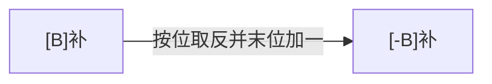

# 进位计数制

## 十进制计数法

十进制计数法是由古印度人发明的阿拉伯数学体系中的一部分，使用了 `0 1 2 3 4 5 6 7 8 9` 这十个符号。

### 十进制表示方法
以十进制数 $975.36$ 为例：
$$
975.36 = 9 \times 10^2 + 7 \times 10^1 + 5 \times 10^0 + 3 \times 10^{-1} + 6 \times 10^{-2}
$$

其中，符号所在的位置反映了其对应的权重（$10^n$）。

### 十进制的一般形式
对于任意十进制数，可以表示为：
$$
K_n K_{n-1} \dots K_2 K_1 K_0 K_{-1} K_{-2} \dots K_{-m}
$$
展开为：
$$
K_n \times 10^n + K_{n-1} \times 10^{n-1} + \dots + K_1 \times 10^1 + K_0 \times 10^0 + \dots + K_{-m} \times 10^{-m}
$$
其中，$10^n$ 是**位权**。

### 十进制计数法特点
1. 基于“乘法”思想的计数方法；
2. 进位制：逢十进一，基数为 10，有 10 个符号（0-9）。

---

## 推广：r 进制计数法

**r 进制数**的表示方法与十进制类似：
$$
K_n K_{n-1} \dots K_2 K_1 K_0 K_{-1} K_{-2} \dots K_{-m}
$$
表示为：
$$
K_n \times r^n + K_{n-1} \times r^{n-1} + \dots + K_1 \times r^1 + K_0 \times r^0 + \dots + K_{-m} \times r^{-m}
$$
其中，$r^n$ 为位权。

### 进制数的基数
**基数**是每个数码位所用到的不同符号的个数。r 进制的基数为 r。

### 常见进制
- **二进制**（r = 2）：使用 0 和 1 两个符号，常用于计算机系统。
- **八进制**（r = 8）：使用 0 到 7 八个符号。
- **十六进制**（r = 16）：使用 0 到 9 和 A 到 F 共 16 个符号。


---

## 二进制的优势

1. **物理实现**：二进制可以通过两个稳定状态的物理器件（如开关、晶体管）表示。
2. **逻辑值映射**：$0$ 和 $1$ 分别对应逻辑值“假”和“真”，方便进行逻辑运算。
3. **计算机实现**：可以通过逻辑门电路高效地实现算术和逻辑运算。

---

## 任意进制转换为十进制

将任意进制数转换为十进制数时，采用的方法是将每个位的数值与该位的基数的幂相乘，并求和。

### 转换方法
1. 每个数位的数字乘以基数的相应幂次；
2. 将所有乘积求和得到十进制数。

### 示例：二进制转十进制
将二进制数 `1011` 转换为十进制：
$$
1011_2 = 1 \times 2^3 + 0 \times 2^2 + 1 \times 2^1 + 1 \times 2^0 = 8 + 0 + 2 + 1 = 11
$$


---

## 二进制与其他进制互相转换

### 二进制 $\leftrightarrow$ 八进制
- 每 3 位二进制数对应一个八进制数位。
- 示例：`11110000010.01101` 转换为八进制。


### 二进制 $\leftrightarrow$ 十六进制
- 每 4 位二进制数对应一个十六进制数位。
- 示例：`11110000010.01101` 转换为十六进制。


### 八进制 $\leftrightarrow$ 二进制
每个八进制位对应 3 位二进制数。
- 示例：$(251.5)_8 \rightarrow (010 \ 101 \ 001 . 101)_2$

### 十六进制 $\leftrightarrow$ 二进制
每个十六进制位对应 4 位二进制数。
- 示例：$(AE86.1)_{16} \rightarrow (1010 \ 1110 \ 1000 \ 0110.0001)_2$

---

## 各种进制常见书写方式

- **二进制**：$(1010001010010)_2$ 或 $1010001010010\text{B}$
- **八进制**：$(1652)_8$
- **十六进制**：$(1652)_{16}$，$1652 \text{H}$，$0\text{x} 1652$
- **十进制**：$(1652)_{10}$，$1652 \text{D}$

---

## 十进制转换为任意进制

### 方法：
1. **整数部分**：通过除法和取余法。
2. **小数部分**：通过乘法和取整法。

### 示例：十进制数 $75.3$ 转换为二进制

#### 整数部分：
将 $75$ 除以 2，直到商为 0，取每次余数：
$$
75 \div 2 = 37 \dots 1 \ (K_0)
$$
$$
37 \div 2 = 18 \dots 1 \ (K_1)
$$
$$
18 \div 2 = 9  \dots 0 \ (K_2)
$$
$$
9 \div 2 = 4 \dots 1 \ (K_3)
$$
$$
4 \div 2 = 2 \dots 0 \ (K_4)
$$
$$
2 \div 2 = 1 \dots 0 \ (K_5)
$$
$$
1 \div 2 = 0 \dots 1 \ (K_6)
$$
所以，整数部分 $75_{10}$ 转换为二进制为 $(1001011)_2$。

#### 小数部分：
将小数部分 $0.3$ 乘以 2，取整部分：
$$
0.3 \times 2 = 0.6 \quad \text{取整部分} 0
$$
$$
0.6 \times 2 = 1.2 \quad \text{取整部分} 1
$$
$$
0.2 \times 2 = 0.4 \quad \text{取整部分} 0
$$
$$
0.4 \times 2 = 0.8 \quad \text{取整部分} 0
$$
继续乘下去可以得到更精确的结果。小数部分转换为二进制大致为 $0.01001$（近似）。

所以，$75.3_{10} \approx (1001011.01001)_2$。


---

## 十进制转换为二进制（拼凑法）

将十进制数（如 $260.75$ 或 $533.125$）转换为二进制，可以分别处理整数部分和小数部分。

### 示例：$260.75$ 和 $533.125$ 的转换


---

## 真值与机器数

- **真值**：符合人类习惯的数字表示方法。
- **机器数**：数字在计算机中实际存储的形式，正负号需要通过补码或其他方式“数字化”。

### 示例：
- $15$ 的机器数表示：`1111` 和 `01111`。
- $-8$ 的机器数表示：`11000`。

---

## 知识回顾

### 进制转换注意事项：
- 某些十进制小数（如 $0.3$）无法用二进制精确表示。


> 例如：$0.3_{10} = 0.01001\dots_2$（无限循环小数）。


---

# BCD 码

BCD（Binary-Coded Decimal）是用二进制表示十进制数的一种编码方式。

### 快速转换：一一对应

8421 码的映射关系如下：

| 十进制 | 二进制 |
| ------ | ------ |
| 0      | 0000   |
| 1      | 0001   |
| 2      | 0010   |
| 3      | 0011   |
| 4      | 0100   |
| 5      | 0101   |
| 6      | 0110   |
| 7      | 0111   |
| 8      | 1000   |
| 9      | 1001   |


### BCD 码加法运算

当进行 8421 码加法时，如果结果超出了有效范围（大于 9），则需要进行修正。具体修正方法是：如果加法结果大于 9，则给结果加上 6（即 $(0110)_2$），使其回到有效范围。

例如：

- $ 9 + 9 \rightarrow 1001 + 1001 = 1 0010 $
- 修正为 $ 1 0010 + (0110)_2 = 0001 1000 $

> 注：若加法结果本身落入合法范围内，则无需修正。

---

### 不同编码方案

#### 4 个二进制位 → 16 种不同的状态

BCD 码仅使用其中的 10 种编码方式，因此存在不同的映射方案。

#### 余 3 码（8421 码 + $(0011)_2$）

| 十进制 | 二进制 |
| ------ | ------ |
| 0      | 0011   |
| 1      | 0100   |
| 2      | 0101   |
| 3      | 0110   |
| 4      | 0111   |
| 5      | 1000   |
| 6      | 1001   |
| 7      | 1010   |
| 8      | 1011   |
| 9      | 1100   |

#### 2421 码（改变权值定义）

| 十进制 | 二进制 |
| ------ | ------ |
| 0      | 0000   |
| 1      | 0001   |
| 2      | 0010   |
| 3      | 0011   |
| 4      | 0100   |
| 5      | 1011   |
| 6      | 1100   |
| 7      | 1101   |
| 8      | 1110   |
| 9      | 1111   |

对于 2421 码，编码策略是：前 4 位的编码首位为 0；后 4 位的编码首位为 1。

---

## 知识回顾


---

# 无符号整数的表示与运算

无符号整数（即自然数）用于表示 $0, 1, 2, 3, 4, \dots$

在 C 语言中，无符号整数的表示方式如下：

```c
unsigned short a = 1;  // 无符号短整型（2 字节）
unsigned int b = 2;    // 无符号整型（4 字节）
```

### 主要问题

- **无符号整数**如何在计算机硬件中**表示**？
- **无符号整数**的**加法和减法运算**如何通过硬件实现？

## 无符号整数的表示方法


> 注：当前的个人计算机一般是 64 位字长，至少为 32 位。

### 表示细节

1. **无符号整数**的所有二进制位都为数值位，没有符号位，第 $i$ 位的权值为 $2^{i-1}$。
2. 对于 $n$ 位的无符号整数，**取值范围为 $0 \sim 2^n - 1$**；若超出此范围，则会发生**溢出**。
3. 最小值为**全 0**，最大值为**全 1**。

## 无符号整数的加法运算


**加法的硬件实现**：从最低位开始，按位相加，若产生进位则传递至更高位。

## 无符号整数的减法运算


**减法的硬件实现**：

1. 保持“被减数”不变，将“减数”按位取反，并对末位加一（即转换为加法形式）。
2. 从最低位开始按位相加，若有进位则传递至更高位。

> 注：由于加法电路成本较低、减法电路较贵，因此通过转化为加法来实现减法更具经济性。

# 带符号整数的表示与运算

带符号整数，即整数的范围如 $-2, -1, 0, 1, 2, 3, 4, \dots$。

在 C 语言中，带符号整数的表示方式如下：

```c
short a = 1;  // 带符号整数（短整型，2B）
int b = -1;   // 带符号整数（整型，4B）
```

不同位数的类型表示的数值范围不同。

> 主要问题：
>
> - **带符号整数**在计算机硬件中是如何**表示**的？
> - **带符号整数**的**加法和减法运算**是如何通过硬件实现的？

$$
带符号整数的表示方式
\begin{cases}
原码 \\ 
补码 \\ 
反码
\end{cases}
$$

即，同一个数值，可以用不同的编码方式来表示。

---

## 原码表示


在书面中，通常表示为 $x = -19$，$[x]_{\text{原}} = 1, 0010011$。  
若未指明机器字长，可以写成 $[x]_{\text{原}} = 1,10011$。

**原码的特点**：

1. 符号位“0/1”分别表示“正/负”，其余位表示数值的绝对值；
2. 如果机器字长为 $n+1$ 位，则带符号整数的原码表示范围为 $-(2^n - 1) \le x \le 2^n - 1$；
3. **真值 0 有两种形式**：$+0$ 和 $-0$，即 $[+0]_{\text{原}} = 0,0000000$；$[-0]_{\text{原}} = 1,0000000$。

---

## 原码的缺点


**原码的缺点**：符号位不能参与运算，这样就需要设计复杂的硬件电路才能处理，加大了成本。

> 使用**补码**表示真值可以解决这个问题，因为**符号位可以参与运算**。

---

## 原码 $\rightarrow$ 反码 $\rightarrow$ 补码 的转换


---

## 原码和补码的快速转换技巧


---

## 补码的加法运算示例

### 例 1


**计算过程**：计算机硬件进行补码加法时，从最低位开始，**按位相加（包括符号位）**，并向更高位**进位**。

### 例 2


计算机硬件从最低位开始**按位相加（符号位参与运算）**，并进位。

---

## 补码的减法运算

补码减法可以转化为加法运算，具体公式如下：

$$
\begin{align*}
[A]_{\text{补}} - [B]_{\text{补}} &= [A]_{\text{补}} + [-B]_{\text{补}}
\end{align*}
$$

> 注：加法电路简单且造价低廉，减法电路造价较高，因此将减法转为加法有助于降低成本。

接下来的问题是：已知减数的补码，如何得到其负数的补码表示？




> 注：通过同一套电路可以实现所有的加减法，节省了硬件成本。

---

## 补码的减法运算示例


**计算过程**：在计算机硬件中进行带符号数的补码减法：

1. 保持“被减数”不变，将“减数”按位取反并末位加一，**将减法转为加法**。
2. 从最低位开始，**按位相加**，并向更高位**进位**。

---

## 知识回顾


> 注：在计算机中，所有带符号整数的加减运算都需要先转化为补码再进行处理。 

---

优化后的排版如下：

---

# 原码、反码、补码特性对比

### 各种码的特性比较

在计算机中，不同的表示方法（原码、反码、补码）有各自的特点和应用场景。以下是对它们的关键特性比较：

$$
几种码的特性对比
\begin{cases}
& n + 1 \ \text{bit} \ 的合法表示范围 \\ \\ 
& 最大数的表示方式、最小数的表示方式 \\ \\ 
& 真值 0 的表示
\end{cases}
$$

---

## 各种码的基本特性总结

| $n + 1$ 位表示方式   | 合法表示范围                   | 最大值                              | 最小值                                 | 真值 0 的表示法                                              |
| -------------------- | ------------------------------ | ----------------------------------- | -------------------------------------- | ------------------------------------------------------------ |
| 带符号整数：**原码** | $-(2^n - 1) \le x \le 2^n - 1$ | $\mathbf{0},111\dots 111 = 2^n - 1$ | $\mathbf{1},111\dots 111 = -(2^n - 1)$ | $\begin{align*}&[+0]_{\text{原}} = \mathbf{0}, 000 \dots 000 \\ &[-0]_{\text{原}} = \mathbf{1}, 000 \dots 000 \end{align*}$ |
| 带符号整数：**反码** | $-(2^n - 1) \le x \le 2^n - 1$ | $\mathbf{0},111\dots 111 = 2^n - 1$ | $\mathbf{1},000\dots 000 = -(2^n - 1)$ | $\begin{align*}&[+0]_{\text{反}} = \mathbf{0}, 000 \dots 000 \\ &[-0]_{\text{反}} = \mathbf{1}, 111 \dots 111 \end{align*}$ |
| 带符号整数：**补码** | $-2^n \le x \le 2^n -1$        | $\mathbf{0},111\dots 111 = 2^n - 1$ | $\mathbf{1},000\dots 000 = -2^n$       | $\begin{align*}&[+0]_{\text{补}} = \mathbf{0}, 000 \dots 000 \end{align*}$ （真值 $0$ 只有一种表现形式） |
| 带符号整数：**移码** | $-2^n \le x \le 2^n - 1$       | $\mathbf{1},111\dots 111 = 2^n - 1$ | $\mathbf{0},000\dots 000 = -2^n$       | $\begin{align*}&[+0]_{\text{补}} = \mathbf{1}, 000 \dots 000 \end{align*}$ （真值 $0$ 只有一种表现形式） |
| **无符号整数**       | $0 \le x \le 2^{n + 1} - 1$    | $111\dots 111 = 2^{n + 1} - 1$      | $000\dots 000 = 0$                     | $000\dots 000$                                               |

---

### 总结要点

- **原码**和**反码**的表示范围相同，都可以用两种方法表示真值 0（+0 和 -0）。
- **补码**的表示范围比原码多一个负数，且真值 0 只有一种表示形式。
- **无符号整数**没有符号位，其数值范围从 $0$ 到 $2^{n + 1} - 1$。

### 常见考点

对于两个数 $A$ 和 $B$ 进行运算后的结果，判断是否发生溢出：

- **手算验证**：可以将结果代入十进制计算，检查结果是否超出合法范围，以判断是否发生溢出。

优化后的排版如下：

---

# 带符号整数——移码表示

---

## 原、反、补、移码的表示对比


---

## 移码

**移码**是一种在补码的基础上对符号位进行取反的表示方法。移码的表示形式只适用于整数。


### 移码的特性

- **真值 0 只有一种表示形式**：$[0]_{\text{移}} = 10000000$。
- 如果机器字长为 $n + 1$ 位，那么移码表示的整数范围为 $-2^n \le x \le 2^n - 1$，这与补码的范围相同。


### 移码的优势

移码表示的整数在硬件电路中可以**方便地比较大小**，这使得移码适用于需要直接比较带符号整数大小的场景。

---

## 练习


# 定点小数的表示和运算

---

## 定点整数与定点小数的概念

$$
定点数分类
\begin{cases}
\text{定点整数} \quad (\text{即：带符号整数}) \\\\
\text{定点小数}
\end{cases}
$$


### 定点数的编码表示

- **定点整数**：可以采用原码、反码、补码、或*移码*进行编码。
  
  

- **定点小数**：可以采用原码、反码或补码进行编码。

---

## 定点小数的表示（以原码为例）


> 注意：定点小数的原码、反码、补码转换与定点整数的转换方法一致。

---

## 定点小数的加、减运算

在对两个定点小数 \( A \) 和 \( B \) 进行加法或减法时，通常需要将数值转换为补码形式。计算机硬件处理定点小数补码的加减运算如下：

### 加法
- **定点小数补码的加法**：从最低位开始**按位相加（包括符号位）**，并向更高位**进位**。

### 减法
- **定点小数补码的减法**：
  1. 保持“被减数”不变，将“减数”**按位取反并末位加一**，将减法转换为加法。
  2. 从最低位开始，**按位相加**，并向更高位**进位**。

---

## 定点小数 VS 定点整数


---

### 特别注意：位数扩展

在位数扩展时，定点小数和定点整数的**扩展位置不同**。


> 加法和减法运算的处理方法与定点整数一致，不再详述。

# 奇偶校验码

校验码用于检测数据传输中的错误，**奇偶校验**是最常用的基本校验方法之一。通过在数据末尾添加一个校验位，确保传输的数据满足特定的奇偶性条件，从而可以检测出单比特错误。

---

## 校验原理

奇偶校验的基本原理是通过在数据的末尾添加一个**校验位**，使整个数据的**1的个数**满足**奇数**或**偶数**的要求。  
- **奇校验**：使数据中1的总个数为奇数。
- **偶校验**：使数据中1的总个数为偶数。


---

## 奇偶校验码

**奇校验码**与**偶校验码**的生成方式：
- **奇校验码**：数据中1的总个数应为奇数。
- **偶校验码**：数据中1的总个数应为偶数。

例如，给出两个编码 $1001101$ 和 $1010111$ 的奇校验码和偶校验码如下：

- **奇校验**：在数据前面添加一个校验位，使得整个数据1的个数为奇数。
  - $1001101 \rightarrow \underline{1}1001101$
  - $1010111 \rightarrow \underline{0}1010111$

- **偶校验**：在数据前面添加一个校验位，使得整个数据1的个数为偶数。
  - $1001101 \rightarrow \underline{0}1001101$
  - $1010111 \rightarrow \underline{1}1010111$

### 硬件实现的偶校验

偶校验位的计算通常通过**异或运算**来实现。各信息位进行**模2加**（即**异或**）运算，得到的结果即为偶校验位。


# 算术逻辑单元 (ALU) 的电路基本原理和加法器设计

$$
算术逻辑单元
\begin{cases}
作用、大致原理 \\\\
电路基础知识 \\\\
加法器的实现
\end{cases}
$$

---

## 算术逻辑单元（ALU）

算术逻辑单元（Arithmetic and Logic Unit, ALU）是计算机处理器中的核心组件之一，负责执行基本的**算术运算**（如加、减、乘、除）和**逻辑运算**（如与、或、非、异或）。此外，ALU 还能够完成一些辅助功能，比如移位、求补等操作。

### ALU 的组成及运算功能

1. **算术运算**：加法、减法、乘法、除法等。
2. **逻辑运算**：与、或、非、异或等。
3. **辅助功能**：移位、求补、反转等。


在下图中，通过控制信号 $M$ 的不同状态，ALU 可以选择执行算术运算或逻辑运算。
- $M = 1$ 表示执行逻辑运算。
- $M = 0$ 表示执行算术运算。

此外，控制信号 $S_0 \sim S_3$ 共四位，因此可组合出 16 种算术运算和 16 种逻辑运算。


---

## 最基本的逻辑运算


逻辑运算是电路设计的基础。常见的逻辑运算包括：

- **与** (AND) 运算
- **或** (OR) 运算
- **非** (NOT) 运算

在逻辑表达式中，逻辑运算符的优先级和数学运算类似：
- **与** 运算的优先级高于**或**运算，可以类比为乘法和加法的优先级。

例如，对于表达式 $AB + CD$，计算顺序是先进行与运算（$A \cdot B$ 和 $C \cdot D$），再进行或运算（$AB + CD$）。

### 常用的逻辑运算规则

1. **分配律**：$A(C + D) = AC + AD$
2. **结合律**：$ABC = A(BC)$
3. **交换律**：$A + B = B + A$，$AB = BA$

这些规则可以用来简化电路设计。**简化逻辑表达式就是在简化电路，实现成本和效率优化**。

---

## 复合逻辑电路

通过组合多种基本门电路（与、或、非），可以构造复杂的复合逻辑电路。以下示例展示了如何用 **与门**、**或门**和**非门**组合实现 **异或门**：


---

## 用门电路求偶校验位

在数据传输中，偶校验位用来检测数据是否发生错误。通过将所有位的值逐位异或，可以计算出偶校验位。若所有位的异或结果为 $0$，则数据没有错误；否则，说明传输过程可能出现了单比特错误。

例如，对于数据 $1, 0, 0, 1, 1, 0, 1$，计算校验位如下：

$$
1 \oplus 0 \oplus 0 \oplus 1 \oplus 1 \oplus 0 \oplus 1 = 0
$$


---

## 加法器的设计

### 一位全加器

**一位全加器**是实现多位加法器的基本单元。它计算两个二进制数 $A$ 和 $B$ 的和，并考虑来自低位的进位 $C_{\text{in}}$。输出包括**和**（$S$）以及**进位**（$C_{\text{out}}$）。

1. **进位输出**：
   $$
   C_{\text{out}} = A \cdot B + (A \oplus B) \cdot C_{\text{in}}
   $$
2. **和输出**：
   $$
   S = A \oplus B \oplus C_{\text{in}}
   $$


---

## 串行加法器

**串行加法器**是一种逐位进行加法运算的加法器。它只有一个全加器，数据逐位串行输入到全加器中进行运算，进位会存储在进位触发器中，参与下一位的计算。

特点：
- 适用于每次仅计算一位和的场景。
- 适合对 $n$ 位操作数进行多次循环计算。


---

## 并行加法器

**并行加法器**通过多个全加器的并行计算实现多位数的加法。多个全加器串接在一起，可以同时计算多个二进制位的加法，显著提高了运算效率。

1. **串行进位的并行加法器**：每一级加法器的进位直接传递给下一级。进位信号是逐级传递的，因此称为“行波进位”。这种设计会受到进位传播的速度限制，随着位数增加，运算速度会受到影响。

### 并行加法器的进位计算公式

- **进位输出**：
  $$
  C_i = A_i \cdot B_i + (A_i \oplus B_i) \cdot C_{i-1}
  $$
- **和输出**：
  $$
  S_i = A_i \oplus B_i \oplus C_{i-1}
  $$


这种结构允许加法器快速处理多位数的加法，尤其在数据处理需求较高的应用场景中，极大地提高了计算效率。

# 并行进位加法器

在加法运算中，为了实现更高效的并行加法运算，可以通过提前计算各级的进位信号，实现**并行进位**，从而减少运算延迟。这种设计被称为**并行进位加法器**，也叫做**先行进位加法器**或**同时进位加法器**。

## 如何更快地产生进位？

通常情况下，第 $i$ 位的进位 $C_i$ 依赖于前一位的进位 $C_{i-1}$，递推计算如下：

$$
\begin{align*}
&C_i = A_i B_i + (A_i \oplus B_i) C_{i - 1} \\
&C_i = A_i B_i + (A_i \oplus B_i) (A_{i - 1} B_{i - 1} + (A_{i - 1} \oplus B_{i - 1}) C_{i - 2}) \\
&C_i = A_i B_i + (A_i \oplus B_i) (A_{i - 1} B_{i - 1} + (A_{i - 1} \oplus B_{i - 1}) (A_{i - 2} B_{i - 2} + (A_{i - 2} \oplus B_{i - 2}) C_{i - 3}) )  \\
&\dots
\end{align*}
$$

根据这个推导过程可以得出结论：第 $i$ 位的进位 $C_i$ 可以直接根据被加数 $A$ 和加数 $B$ 的**第 $1$ 到第 $i$ 位的值**，以及初始进位 $C_0$ 来确定。

### 定义符号

- $G_i = A_i B_i$：第 $i$ 位的**生成进位**（Generate），表示即使没有进位输入，$A_i$ 和 $B_i$ 也会产生进位。
- $P_i = A_i \oplus B_i$：第 $i$ 位的**传递进位**（Propagate），表示若有进位输入，则可以向更高位传递。

进位递推关系可以简化为：

$$
C_i = G_i + P_i C_{i - 1}
$$

### 并行计算公式

通过展开以上递推公式，我们可以得到更高位的进位公式：

$$
\begin{align*}
&C_1 = G_1 + P_1 C_0 \\
&C_2 = G_2 + P_2 G_1 + P_2 P_1 C_0 \\ 
&C_3 = G_3 + P_3 G_2 + P_3 P_2 G_1 + P_3 P_2 P_1 C_0 \\
&C_4 = G_4 + P_4 G_3 + P_4 P_3 G_2 + P_4 P_3 P_2 G_1 + P_4 P_3 P_2 P_1 C_0 \\
&\dots
\end{align*}
$$

这样一来，每个进位 $C_i$ 都可以在相同的时间内并行计算得到，无需等待前一位的进位信号。这种设计有效提高了加法器的速度。

---


---

## 并行进位加法器的结构

**并行进位加法器**的设计核心是各级进位信号的**并行计算**，即**先行进位计算**。每一级的进位信号（$C_i$）都在同一时间产生，而不需要逐级传播，因此称为并行进位或同时进位。

在实际电路设计中，并行进位加法器可以通过**多层逻辑门**组合实现。根据传递进位和生成进位的组合逻辑，我们可以实现多个位的进位信号在相同时间生成。


通过并行进位的设计，整体加法运算不再受到单个进位信号逐级传播的限制。这种设计提高了加法器的运算速度，特别适用于需要快速处理多位二进制数相加的场景。

---

# 补码加减运算器

## 加法器原理


### 例子

- 若 $A = 1000$，$B = 0111$，且 $C_{in} = 0$，则 $F = 1111$，$C_{out} = 0$。
- 若 $A = 1000$，$B = 0111$，且 $C_{in} = 1$，则 $F = 0000$，$C_{out} = 1$。


---

### $n$ 位补码加减运算

- $X + Y$ 的补码加法直接逐位相加。
- $X - Y$ 可通过求 $[-Y]_补$（即将 $Y$ 逐位取反并在末位加一）后与 $X$ 相加来实现。

---

## 例子分析

### 例 1

- **$4$ 位补码**表示：
  
  - $X = -8$，$Y = 7$
  - $X_补 = 1000 \ \text{B}$，$Y_补 = 0111 \ \text{B}$
  
  - **加法运算**：$X + Y = 1111 \ \text{B} = -1 \ \text{D}$  ✔️
  - **减法运算**：$X - Y = 1000 + (1000 + 1) = \text{~~1~~}0001 = -15 \ \text{D}$  ❌
  
- **无符号数**使用 $4$ 位：
  
  - $X = 8$，$Y = 7$
  
  - $X = 1000$，$Y = 0111$
  
  - **加法运算**：$X + Y = 1111 \ \text{B} = 15 \ \text{D}$  ✔️
  - **减法运算**：$X - Y = 1000 + (1000 + 1) = \text{~~1~~}0001 = 1 \ \text{D}$  ✔️

> **结论**：在不同编码方式下，溢出判定有所不同。

---

### 例 2

- **$4$ 位补码**表示：
  
  - $X = 3$，$Y = 4$
  - $X_补 = 0011 \ \text{B}$，$Y_补 = 0100 \ \text{B}$
  
  - **加法运算**：$X + Y = 0111 \ \text{B} = 7 \ \text{D}$  ✔️
  - **减法运算**：$X - Y = 0011 + (1011 + 1) = 1111 \ \text{B} = -1 \ \text{D}$  ✔️
  
- **无符号数**使用 $4$ 位：
  
  - $X = 3$，$Y = 4$
  
  - $X = 0011 \ \text{B}$，$Y = 0100 \ \text{B}$
  
  - **加法运算**：$X + Y = 0111 \ \text{B} = 7 \ \text{D}$  ✔️
  - **减法运算**：$X - Y = 0011 + (1011 + 1) = 1111 \ \text{B} = 15 \ \text{D}$  ❌
