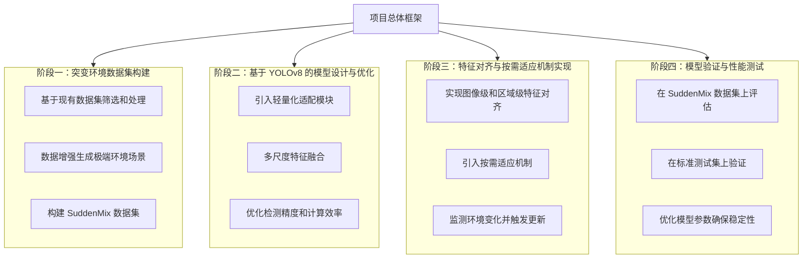

- # 模型预测基本使用

  使用 YOLO 模型进行预测的基本命令行和代码示例：

  ## 命令行方式

  ```bash
  yolo task=detect mode=predict model=./yolov8n.pt source="./ultralytics/assets/bus.jpg"
  ```

  ## Python 代码方式

  ```python
  from ultralytics import YOLO
  
  # 加载模型并设置任务类型为检测
  yolo = YOLO("./yolov8n.pt", task='detect')
  
  # 执行预测
  result = yolo(source='./ultralytics/assets/bus.jpg')
  ```

  ***

  ## 可选参数

  以下是 YOLO 预测中的一些可选参数及其作用：

  ```python
  # Prediction settings
  prediction_settings = {
      "source": "",               # 图片或视频的源目录
      "show": False,              # 如果可能，显示结果
      "save_txt": False,          # 将结果保存为 .txt 文件
      "save_conf": False,         # 保存带有置信度分数的结果
      "save_crop": False,         # 保存带结果的裁剪图像
      "hide_labels": False,       # 隐藏标签
      "hide_conf": False,         # 隐藏置信度分数
      "vid_stride": 1,            # 视频帧率间隔
      "line_thickness": 3,        # 边框线条粗细（像素）
      "visualize": False,         # 可视化模型特征
      "augment": False,           # 对预测源应用图像增强
      "agnostic_nms": False,      # 类别无关的非极大值抑制 (NMS)
      "classes": None,            # 按类别筛选结果，例如 class=0 或 class=[0,2,3]
      "retina_masks": False,      # 使用高分辨率的分割掩码
      "boxes": True               # 在分割预测中显示边框
  }
  ```

  ***

  ## 其他重要参数

  ### `conf` 参数（置信度阈值）

  - **功能**：设置置信度阈值（confidence threshold）。仅保留模型置信度高于该阈值的检测结果，低于该阈值的结果会被过滤掉。
  - **取值范围**：`conf` 的取值范围为 0 到 1。
    - 较高的 `conf` 值（例如 `0.7`）会仅显示高置信度的结果，有助于减少误检。
    - 较低的 `conf` 值（例如 `0.3`）则会显示更多检测结果，但可能增加误检的数量。

  ```python
  from ultralytics import YOLO
  
  yolo = YOLO("./yolov8n.pt", task='detect')
  
  # 设置保存结果且置信度阈值为0.05
  result = yolo(source="./ultralytics/assets/bus.jpg", save=True, conf=0.05)
  ```

  ### `iou` 参数（交并比阈值）

  - **功能**：设置非极大值抑制（NMS）过程中的交并比（Intersection over Union, IoU）阈值。`iou` 参数用于控制相邻检测框的抑制，防止输出重叠的检测框。
  - **取值范围**：`iou` 的取值范围为 0 到 1。
    - 较高的 `iou` 值（如 `0.7`）允许更多重叠的检测框。
    - 较低的 `iou` 值（如 `0.3`）会更严格地去除重叠框。

  ```python
  from ultralytics import YOLO
  
  yolo = YOLO("./yolov8n.pt", task='detect')
  
  # 设置保存结果，置信度阈值为 0.5，IoU 阈值为 0.4
  result = yolo(source="./ultralytics/assets/bus.jpg", save=True, conf=0.5, iou=0.4)
  ```

  ***

  # 如何找到更多参数

  可以在项目目录下查找参数配置文件，以了解更多可配置的预测参数：

  

  也可以在 Ultralytics 的文档中查看更详细的说明，以便了解更多高级用法和参数设置：

  

  ***

  # 注意事项

  1. **Jupyter Notebook 使用**

     - 使用 `%matplotlib inline` 来可视化模型预测结果，否则无法显示预测图像。
     - 如果修改了模型或预测参数，需重新加载模型，否则更新可能不会生效。

  2. **文件路径**

     - 确保所有文件路径正确无误，特别是在 Windows 系统中，使用正斜杠 `/` 或双反斜杠 `\\`。

  3. **预测结果保存**
     - 设置 `save=True` 可以将预测结果保存到默认输出文件夹中。



