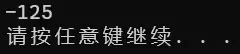

# 运算符、表达式和语句

## `b = a++` 和 `b = ++a` 的区别

考察操作符的优先级。

```c
#include <stdio.h>

int main(void) {
  int a = 1, b = 1;

  b = a++;
  printf("%d %d", a, b);

  return 0;
}
```

上述代码属于先将把 `b` 的值赋值给 `a`，然后 `a` 再进行 `+1` 的运算；最终会输出 `2 1`。

```c
#include <stdio.h>

int main(void) {
  int a = 1, b = 1;

  b = ++a;
  printf("%d %d", a, b);

  return 0;
}
```

上述代码先执行给 `a` 加 `1` 的操作，然后再将 `a` 的值赋值给 `b`，会输出 `2 2`。

```c
return n++;
return ++n;
return n + 1;
```

上述代码中，第 1 行仅会返回 `n`，因为 `++` 运算符放在之后，会先返回再 `++`；第 2 行和第 3 行都会正确执行想要的操作。

在函数传参中也是相同的效果。

## 分数运算

考察算术转换。

```c
#include <stdio.h>

int main(void) {
  printf("%f", 4.0 / 3);  // 由于其中一个数为浮点型，3被算数转换进行计算
  return 0;
}
```

如果要输出 $\dfrac{4}{3}$ 的结果的小数，4 或 3 其中一个要写成如 4.0 或 3.0 这种形式，才会输出 1.333333。将其中一个操作数替换为浮点型来进行计算。

## 算术操作符

```C
+ - / * %
```

在 C 语言中，整数运算时的取整运算是向 0 取整，如：

```c
#include <stdio.h>

int main(void) {
  int a = -10;
  int b = 3;

  printf("%d\n", a / b);
  printf("%d\n", a % b);

  return 0;
}
```

会输出：


对于取模操作符，它的两个操作数必须是整数。此外，从上述输出可以看出，取模的操作具体定义如下：

> [!tip]
>
> 如果 `a` 和 `d` 是两个自然数，`d` 非零，可以证明存在两个唯一的整数 `q` 和 `r`，满足 `a = q * d + r` 且 `0 <= |r| < |d|`。其中 `q` 被称为商，`r` 被称为余数。

上述计算可以解释为：`-10 = (-3) * 3 + (-1)`；其中，`-1` 为取模的值。

## 条件运算符

条件运算符（三目操作符）根据条件选择返回两个值之一。

语法如下：

```c
条件表达式 ? 结果 1 : 结果 2
```

结果 1 是当条件表达式成立的时候会运行的语句（即条件真），而结果 2 是当条件表达是不成立时会运行的语句（即条件假）。

如：

```c
#include <stdio.h>

int main(void) {
  int x = 5;
  int y = (x > 0) ? 10 : -10;

  printf("y = %d\n", y);

  return 0;
}
```

上述代码 `x > 5` 成立，运行结果 `1`，即返回一个 `10` 的值。最终输出 `10`。

## 逗号表达式

逗号表达式从左向右每个语句都会执行，但最终返回的是最后一个语句的结果。

语法如下：

```c
表达式 1, 表达式 2, 表达式 3, ..., 表达式 n
```

代码示例：

```c
#include <stdio.h>

int main(void) {
  int x = 5, y = 10, z;

  z = (x++, y++,
       x + y);  // 逗号表达式中的x++和y++会被依次执行，最后的结果是x+y赋给z
  printf("z = %d\n", z);

  return 0;
}
```

最终会输出 `17`。

## 逻辑操作符

```C
&& 逻辑与
|| 逻辑或
```

两者输出的结果为 `0` 或 `1`。

```c
#include <stdio.h>

int main(void) {
  int i = 0, a = 0, b = 2, c = 3, d = 4;

  i = a++ && ++b && d++;
  printf("a = %d\nb = %d\nc = %d\nd = %d\n");
  // 因为逻辑运算符是从左向右运算的
  // 上述代码中，因 a = 0，所以使得左边为假，整体为假，导致右边的表达式不进行运算
  return 0;
}
```

```c
#include <stdio.h>

int main(void) {
  int i = 0, a = 1, b = 2, c = 3, d = 4;

  i = a++ || ++b || d++;
  printf("a = %d\nb = %d\nc = %d\nd = %d\n");
  // 因为最左边的表达式为真，整体为真
  // 所以在算完第一个表达式后，不再进行后面表达式的计算
  return 0;
}
```

对于 `&&`，左边为假，右边不计算；对于 `||`，左边为真，右边不计算。

## 位操作符

这些运算符与二进制有关。

正整数的原码、反码、补码是相同的；负整数的原码、反码、补码是要计算的。

而整数在内存中存的是补码。

### `&` 位与运算

位与运算：

```c
#include <stdio.h>

int main(void) {
  printf("%d\n", 3 & 2);

  return 0;
}
```

上述代码会输出 `2`。

因为：

```c
0000 0011
0000 0010
// 进行位与运算
0000 0010
= 2
```

### `|` 位或运算

位或运算：

```c
#include <stdio.h>

int main(void) {
  printf("%d\n", 3 | 2);

  return 0;
}
```

上述代码会输出 `3`。

因为：

```c
0000 0000 0000 0011
0000 0000 0000 0010
// 进行位或运算
0000 0011
= 3
```

### `~` 按位取反

按位取反：

```c
#include <stdio.h>

int main(void) {
  printf("%d\n", ~2);

  return 0;
}
```

上述代码会输出 `-7`。

因为：

```c
0000 0000 0000 0010
// 进行按位取反
1111 1111 1111 1101
= -7
```

### `^` 异或运算

异或运算：

```c
#include <stdio.h>

int main(void) {
  printf("%d\n", 3 ^ 2);

  return 0;
}
```

上述代码会输出 `1`。

因为：

```c
0000 0000 0000 0011
0000 0000 0000 0010
// 进行异或运算
0000 0000 0000 0001
= 1
```

### `<<` 左移运算

左移运算：

```c
#include <stdio.h>

int main(void) {
  printf("%d\n", 3 << 2);  // 代表整体移动两位，抛弃最左侧，往最右边添上0

  return 0;
}
```

上述代码会输出 `12`。

因为：

```c
0000 0000 0000 0011
// 进行左移运算
0000 0000 0000 1100
= 12
```

左移操作符代表 `*2` 两次。

需要注意的是，左移操作符以及右移操作符只针对整数，并且移动的位数必须是正整数。

### `>>` 右移运算

右移运算分为两种：

- **算数移位**：右边丢弃，左边补原符号位。
- **逻辑移位**：右边丢弃，左边补 0。

```c
#include <stdio.h>

int main(void) {
  printf("%d\n", 4 >> 1);

  return 0;
}
```

上述代码会输出 `2`。

MSVC 编译器采用的是算数移位。

因为:

```c
0000 0000 0000 0100
// 进行右移运算
0000 0000 0000 0010
= 2
```

举例：

```c
#include <stdio.h>

int main(void) {
  printf("%d\n", -7 >> 1);

  return 0;
}
```

上述代码会输出 `-4`。

### 相关例题

- 在不创建临时变量的情况下，交换两个量。

  1. 方法一：

     ```c
     #include <stdio.h>

     // 但这个方法有溢出的危险
     int main(void) {
       int a = 3;
       int b = 5;

       a = a + b;  // 把a赋值成a + b
       b = a - b;  // 此时a + b - b就等于a
       a = a - b;  // a + b减去已经是a的b，就是b原来的值

       return 0;
     }
     ```

  2. 方法二，首先，有两个公式 $a \oplus a = 0$ 和 $a \oplus 0 = a$，且满足交换率，因此有：

     ```c
     #include <stdio.h>

     // 需要注意的是该种方法运行速度较慢，而且只适用于整形
     int main(void) {
       int a = 3;
       int b = 5;

       a = a ^ b;  // a = 3 ^ 5
       b = a ^ b;  // b = 3 ^ 5 ^ 5 = 3 ^ 0 = 3
       a = a ^ b;  // a = 3 ^ 5 ^ 3 = 5 ^ 0 = 5

       return 0;
     }
     ```

- **编写代码实现**：求一个整数存储在内存中的二进制中 1 的个数（求补码的二进制中 1 的个数）。

  首先需要知道，与 1 进行与运算的数，如果表示为二进制时的 LSB 为 1，则运算结果为 1；反之，运算结果为 0。

  ```c
  #include <stdio.h>

  int main(void) {
    int n = 0;
    int i = 0;
    int sum = 0;

    scanf("%d", &n);
    for (i = 0; i < 32; i++) {
      // 每个数与 1 进行与运算，如果那个数的 LSB 为 1，则返回 1；反之，返回 0
      sum += n & 1;
      n >>= 1;  // 进行右移运算，根据循环进行 32 次，更新 LSB
    }

    return 0;
  }
  ```

## 赋值运算符

```c
int a = 1;  // 初始化
a = 2;      // 赋值，两者不相同
```

赋值运算符可以连续使用：

```c
a = x = y + 1;   // 连续赋值
a = (x = y + 1);
```

上述代码表示，先将 `y + 1` 的值赋给了 `x`，再将 `x` 的值赋给了 `a`。

复合赋值符：

```c
+=
-=
*=
%=
>>=
<<=
&=
|=
^=
```

## 单目操作符

与双目操作符不同，单目操作符只有一个操作数；举例：

```c
a &= (~(1 << 4)); // 1 & a = a
a |= (1 << 4); // 0 | a = a
```

1. `a &= (~(1 << 4));`：这行代码将 `a` 与 `~(1 << 4)` 的按位与结果进行赋值操作；首先，`1 << 4` 将二进制数 1 左移 4 位，得到二进制数 00010000；然后，`~(1 << 4)` 对这个结果取反，得到二进制数 11101111；最后，`a &= (~(1 << 4))` 将 `a` 与 11101111 进行按位与操作，即将 `a` 的第 5 位设置为 0，其他位保持不变
2. `a |= (1 << 4);`：这行代码将 `a` 与 `1 << 4` 的按位或结果进行赋值操作；同样地，`1 << 4` 得到二进制数 00010000；然后，`a |= (1 << 4)` 将 `a` 与 00010000 进行按位或操作，即将 `a` 的第 5 位设置为 1，其他位保持不变

```C
sizeof a == sizeof(a);
sizeof(int);
```

可以看出它不是函数而且可以计算数据类型的大小。

> [!tip]
>
> `%zu` 是用来返回 `sizeof` 值的转换说明。

## 下标引用、函数调用和结构成员

### `[]` 下标引用操作符

操作数：一个数组名 + 一个索引值

```c
int arr[10];
arr[9] = 10;
// 本质是 *(arr+9)，满足交换律
// [] 的两个操作数是 arr 和 9。
9[arr] = 8;  // 因为它是一个操作符，所以也是可以实现的
```

上述代码中，`9` 代表 9 个元素的偏移量，每个单位的偏移量的大小由数据类型决定，才能使加上相应的偏移量指向相应的地址。

- `char`：1 字节
- `short`：2 字节
- `int`：4 字节
- `long`：4 或 8 字节（取决于平台）
- `float`：4 字节
- `double`：8 字节

例如，如果有一个 `int` 类型的数组 `arr`，那么 `arr + 1` 的偏移量将是 4 字节，因为 `int` 类型占用 4 个字节。

对于其他类型的数组，也是类似的原理。根据数组元素的类型确定每个单位的偏移量大小。请注意，这里的单位是指数组元素的个数，而不是字节。

需要注意的是，**指针的加法操作是基于指针类型的大小来计算偏移量的**。因此，在进行指针运算时要确保不会越界访问数组元素。

### `()` 函数调用操作符

接受一个或多个操作数：第一个操作数是函数名，剩余的操作数就是传给函数的参数。

`.`：`结构体.成员名`
`->`：`结构体指针->成员名`

```c
#include <stdio.h>

struct Stu {
  char name[10];
  int age;
  char sex[5];
  double score;
};

void set_age1(struct Stu stu) { stu.age = 18; }

void set_age2(struct Stu* pStu) {
  pStu->age = 18;  // 结构成员访问
}

int main(void) {
  struct Stu stu;
  struct Stu* pStu = &stu;  // 结构成员访问

  stu.age = 20;  // 结构成员访问
  set_age1(stu);
  pStu->age = 20;  // 结构成员访问
  set_age2(pStu);

  return 0;
}
```

## 表达式求值

### 隐式类型转换

C 语言的**整型算术运算总是至少以缺省整型类型**的精度来进行的。（缺省就是默认的意思）

只要在表达式中，如 `a == 111111`、`c = a + b`、`+c`，就会整形提升。

为了获得这个精度，**表达式中的字符（`char`）和短整型（`short`）操作数在使用之前被转换为普通整型**，这种转换称为整型提升。

整形提升的意义：

表达式的整型运算要在 CPU 的相应运算器件内执行，CPU 内整型运算器（ALU）的操作数的字节长度。一般就是 `int` 的字节长度，同时也是 CPU 的通用寄存器的长度。因此，即使两个 `char` 类型的相加，在 CPU 执行时实际上也要先转换为 CPU 内整型操作数的标准长度。

通用 CPU（general-purpose CPU）是难以直接实现两个 8 比特字节直接相加运算（虽然机器指令中可能有这种字节相加指令）。所以，表达式中各种长度可能小于 int 长度的整型值，都必须先转换为`int`或`unsigned int`，然后才能送入 CPU 去执行运算。

```c
char a, b, c;
a = b + c;
```

因为 1 个字符用 1byte 表示，而一个整形用 4byte 表示，所以要整形提升。

`b` 和 `c` 的值被提升为普通整型，然后再执行加法运算。

加法运算完成之后，结果将被截断，然后再存储于 `a` 中。

> [!tip]
>
> 整形提升是按照变量的数据类型的符号位来提升的。

```c
// 负数的整形提升
char c1 = -1;
// 变量c1的二进制位（补码）中只有8个比特位：
1111111
// 因为 char 为有符号的 char
// 所以整形提升的时候，高位补充符号位，即为 1
// 提升之后的结果是：
11111111111111111111111111111111
// 正数的整形提升
char c2 = 1;
// 变量 c2 的二进制位（补码）中只有 8 个比特位：
00000001
// 因为 char 为有符号的 char
// 所以整形提升的时候，高位补充符号位，即为 0
// 提升之后的结果是：
00000000000000000000000000000001
// 无符号整形提升，高位补 0
```

整形提升的方式看的是存储该数据的类型，如 `char`，那在提升时当成有符号数来提升。在打印的时候，整形提升的过程与转换说明无关，如用 `%u` 打印 `char` 类型。

例子：

```c
#include <stdio.h>

int main(void) {   // 存进去的时候要截断
  char a = 5;      // 00000000000000000000000000000101 -> 00000101
  char b = 126;    // 00000000000000000000000001111110 -> 01111110
  char c = a + b;  // 两个数进行整形运算时要进行整形提升
                   // 00000000000000000000000010000111 -> 10000111

  // 算完之后再打印，有一次进行整型提升
  // 11111111111111111111111110000111（1 被当成符号位了，根据原则补1，这是补码）
  printf("%d\n", c);
  return 0;  // 最后按照 %d 输出 -125，而不是 131
}
```

输出：



### 算术转换

如果某个操作符的各个操作数属于不同的类型，那么除非其中一个操作数的转换为另一个操作数的类型，否则操作就无法进行。下面的层次体系称为寻常算术转换。

其中一个操作数向着大的类型转换，如 `int` 转换成 `long`、`float` 之类的。

```c
long double
double
float
unsigned long int
long int
unsigned int
int
```

有：

```c
float f = 3.14;
int num = f;  // 隐式转换，会有精度差异
```

举例：

```c
#include <stdio.h>

int i;  // 在全局变量中，被初始化为 0

int main(void) {
  --i;
  if (i > sizeof(i))  // 由于 sizeof 返回的是无符号整形，所以i进行算数转换
    printf(">\n");    // 从二进制的 -1 变成一个有符号数
  else
    printf("<\n");

  return 0;
}
```

### 操作符的属性

复杂表达式的求值有三个影响的因素。

1. 操作符的优先级
2. 操作符的结合性
3. 是否控制求值顺序

两个相邻的操作符先执行哪个？取决于他们的优先级。如果两者的优先级相同，取决于他们的结合性。

| 操作符   | 描述                 | 用法示例                         | 结果类型   | 结合性 | 是否控制求值顺序 |
| -------- | -------------------- | -------------------------------- | ---------- | ------ | ---------------- |
| `()`     | 聚组                 | `(表达式)`                       | 与表达式同 | N/A    | 否               |
| `()`     | 函数调用             | `rexpr(rexp, ..., rexp)`         | rexpr      | L-R    | 否               |
| `[]`     | 下标引用             | `rexpr[rexp]`                    | lexp       | L-R    | 否               |
| `.`      | 访问结构成员         | `lexp.member_name`               | lexp       | L-R    | 否               |
| `->`     | 访问结构指针成员     | `rexpr->member_name`             | lexp       | L-R    | 否               |
| `++`     | 后缀自增             | `lexp ++`                        | rexpr      | L-R    | 否               |
| `--`     | 后缀自减             | `lexp --`                        | rexpr      | L-R    | 否               |
| `!`      | 逻辑反               | `! rexpr`                        | rexpr      | R-L    | 否               |
| `~`      | 按位取反             | `~ rexpr`                        | rexpr      | R-L    | 否               |
| `+`      | 单目，表示正值       | `+ rexpr`                        | rexpr      | R-L    | 否               |
| `-`      | 单目，表示负值       | `- rexpr`                        | rexpr      | R-L    | 否               |
| `++`     | 前缀自增             | `++ lexp`                        | rexpr      | R-L    | 否               |
| `--`     | 前缀自减             | `-- lexp`                        | rexpr      | R-L    | 否               |
| `*`      | 间接访问（解引用）   | `* rexpr`                        | lexp       | R-L    | 否               |
| `&`      | 取地址               | `& lexp`                         | rexpr      | R-L    | 否               |
| `sizeof` | 取其长度，以字节表示 | `sizeof rexpr` 或 `sizeof(类型)` | rexpr      | R-L    | 否               |
| `(类型)` | 类型转换             | `(类型) rexpr`                   | rexpr      | R-L    | 否               |
| `*`      | 乘法                 | `rexpr * rexpr`                  | rexpr      | L-R    | 否               |
| `/`      | 除法                 | `rexpr / rexpr`                  | rexpr      | L-R    | 否               |
| `%`      | 整数取余             | `rexpr % rexpr`                  | rexpr      | L-R    | 否               |
| `+`      | 加法                 | `rexpr + rexpr`                  | rexpr      | L-R    | 否               |
| `-`      | 减法                 | `rexpr - rexpr`                  | rexpr      | L-R    | 否               |
| `<<`     | 左移位               | `rexpr << rexpr`                 | rexpr      | L-R    | 否               |
| `>>`     | 右移位               | `rexpr >> rexpr`                 | rexpr      | L-R    | 否               |
| `>`      | 大于                 | `rexpr > rexpr`                  | rexpr      | L-R    | 否               |
| `>=`     | 大于等于             | `rexpr >= rexpr`                 | rexpr      | L-R    | 否               |
| `<`      | 小于                 | `rexpr < rexpr`                  | rexpr      | L-R    | 否               |
| `<=`     | 小于等于             | `rexpr <= rexpr`                 | rexpr      | L-R    | 否               |


```c
// 表达式的求值部分由操作符的优先级决定。
// 表达式 1
a * b + c * d + e * f
```

> [!tip]
>
> 上述代码在计算的时候，由于比 `+` 的优先级高，只能保证 `a * b` 的计算是比 `+` 早，但是优先级并不能决定第三个 `*` 比第一个 `+` 早执行。

例 1：

```c
a * b
c * d
a * b + c * d
e * f
a * b + c * d + e * f
```

或者：

```c
a * b
c * d
e * f
a * b + c * d
a * b + c * d + e * f
```

例 2：

```c
int fun() {
  static int count = 1;
  return ++count;
}

int main(void) {
  int answer;

  answer = fun() - fun() * fun();
  printf("%d\n", answer);  // 输出多少？

  return 0;
}
```

虽然在大多数的编译器上求得结果都是相同的。但是上述代码 `answer = fun() - fun() * fun()`；中我们只能通过操作符的优先级得知：先算乘法，再算减法。

> [!tip]
>
> 函数的调用先后顺序无法通过操作符的优先级确定。

---

**拓展**：

在 `*dest++` 这个表达式中，我们看到的是两个操作符：

1. 解引用操作符 `*`：这个操作符用于取得指针所指向的值
2. 自增操作符 `++`：这个操作符用于将指针指向下一个内存位置

这个表达式中的操作符的特性被称作“操作符的优先级”和“操作符的结合性”。

**优先级**决定了在含有多个操作符的表达式中哪个操作符会先被求值。在 `*dest++` 中，解引用操作符 `*` 和自增操作符 `++` 有不同的优先级。根据 C 语言的规则，后缀自增操作符 `++` 的优先级高于解引用操作符 `*`。

**结合性**决定了当两个操作符拥有相同优先级时，表达式的计算顺序。结合性可以是从左到右或从右到左。在 C 语言中，大多数操作符的结合性是从左到右，但是赋值操作符和所有的一元操作符（包括解引用 `*` 和自增 `++`）的结合性是从右到左。

在表达式 `*dest++` 中：

- 自增操作符 `++` 是后缀操作符，它的优先级高于解引用操作符 `*`
- 解引用操作 `*` 会在自增操作 `++` 完成后发生，但是由于 `++` 是后缀操作符，它会在整个表达式的值被求出后才应用自增效果

因此，实际的操作顺序是：

1. 评估 `*dest`（解引用 `dest`，取出指向的值）
2. 自增操作 `dest++` 发生，但是其效果会延迟，直到下一次 `dest` 的值被使用

这种操作的特性，即先取值后自增，是后缀自增操作符 `++` 的典型行为。类似的，`a = b++` 会先 `b` 赋值给 `a` 再进行 `++` 操作。
