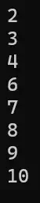
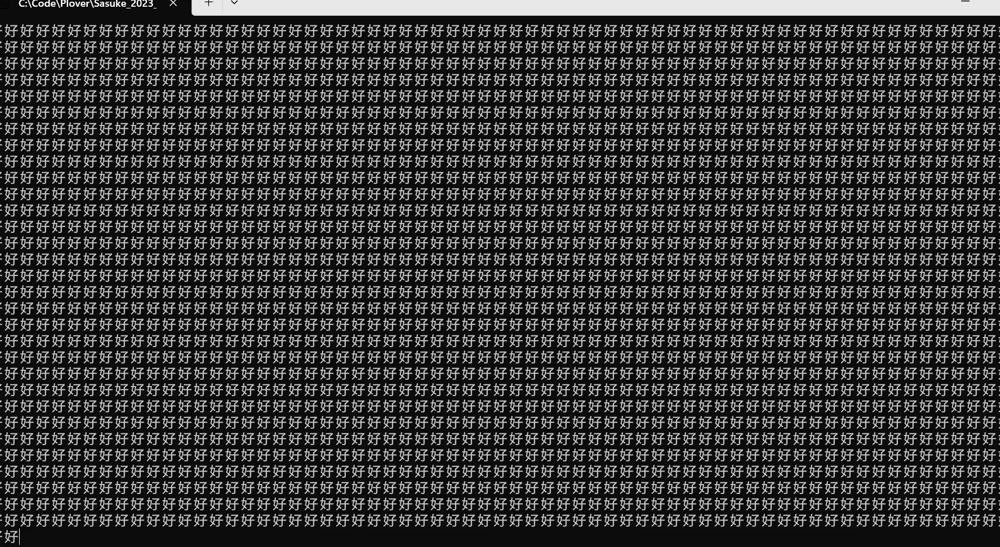
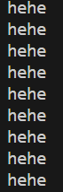
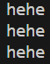

# C 控制语句：循环

## `while` 语句的基本知识

```c
#include <stdio.h>

int main(void) {
  int a = 1;

  while (a < 10) {
    if (5 == a) break;
    printf("%d\n", a);
    ++a;
  }

  return 0;
}
```

上述代码会输出：

```
1
2
3
4
```

说明在 `while` 语句中遇到 `break` 代表着退出循环。后面的循环就不会执行。因此到 5 时，它就输出到 4，因为到 5 的时候就退出循环了。

```c
#include <stdio.h>

int main(void) {
  int a = 1;

  while (a < 10) {
    if (5 == a) continue;
    printf("%d\n", a);
    ++a;
  }

  return 0;
}
```

而在 `switch` 语句中遇到 `continue` 就会就会终止本次循环中，`continue` 后面的语句，开始下一次循环。由于上述代码中，`++a` 这个语句在 `continue` 后面，因此一直会满足 `continue` 的条件，最终会导致：


`4` 下面的光标会一直闪。因为这个程序一直在执行。

```c
#include <stdio.h>

int main(void) {
  int i = 1;

  while (i < 10) {
    i++;
    if (5 == i) continue;
    printf("%d\n", i);
  }

  return 0;
}
```

倘若像上面这样从，便会输出：



从 2 开始，少了个 5，到 10。

## `for` 语句的基本知识

```c
#include <stdio.h>

int main(void) {
  int i = 0;

  for (i = 1; i <= 10; i++) {
    if (i == 5) continue;
    printf("%d ", i);
  }

  return 0;
}
```

此处展示 `continue`。之所以遇到 `continue` 不会出现光标一直闪的情况，是因为对于 `for` 循环来说，比如到 5 时，它会跳到 `for` 循环的循环头。先进行 `i++` 的运算。（简单的说，就是跳过 `continue` 后面的代码，而 `i++` 不在这个范畴）

等效为 `while` 的代码是：

```c
#include <stdio.h>

int main(void) {
  int i = 0;

  while (i < 10) {
    i++;
    if (i == 5) continue;
    printf("%d ", i);
  }

  return 0;
}
```

还有，若 `for` 循环的判断条件（中间那个）没写，则会默认判定循环恒成立。

```c
#include <stdio.h>

int main(void) {
  for (;;) {
    printf("好好好");
  }

  return 0;
}
```



则会一直执行循环。此外，`for` 循环的初始条件最好不要省略。

```c
#include <stdio.h>

int main(void) {
  int i = 0, j = 0;

  for (i = 0; i < 3; i++) {
    for (j = 0; j < 3; j++) {
      printf("hehe\n");
    }
  }

  return 0;
}
```

这个代码会输出：



```c
#include <stdio.h>

int main(void) {
  int i = 0, j = 0;

  for (; i < 3; i++) {
    for (; j < 3; j++) {
      printf("hehe\n");
    }
  }

  return 0;
}
```



因为省略了初始化条件，在 `i` 完成第一次循环后，`i` 没有重新初始化，导致后两次的 `j` 都是 3，导致无法执行后两次的循环。

## `do while` 语句的基本知识

其特殊的结构注定它一定会执行一次循环。（在还没有判断条件的时候）
