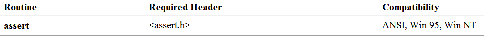
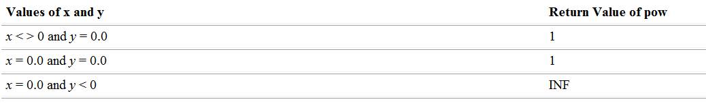
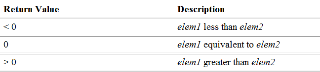
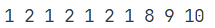
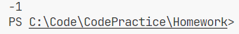
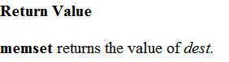
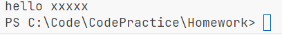

# 函数

## `Sleep` 函数

头文件为 `<windows.h>`。

Windows 系统中的函数。可以减缓程序运行的速度，当运行该语句时，如 `Sleep(2000)` 时，里面的数字代表停止 2000 毫秒。在 Windows 系统中要带有 `<windows.h>` 的头文件，而在其他系统中要其他的头文件。

## `system` 函数

头文件是 `<stdlib.h>`。

`system` 函数是 Windows 特有的库函数，执行系统命令。如在系统命令中，`system("cls")` 代表清空命令控制台，其中 `cls` 为系统命令。执行一次会将整个终端原有输出内容清空。

还有系统命令如 `shutdown = -s` 代表关机，`shutdown = -s -t 60` 代表 60 秒后关机，而 `shutdown = -a` 代表取消关机。

## `rand` 函数、`srand` 函数、`time` 函数

### `rand` 函数

头文件为 `<stdlib.h>`。

用法示例：

| `v1 = rand() % 100`           | **`v1` 取值范围 0~99**      |
| ----------------------------- | --------------------------- |
| **`v2 = rand() % 100 + 1`**   | **`v2` 取值范围 1~100**     |
| **`v3 = rand() % 30 + 1985`** | **`v3` 取值范围 1985~2014** |

`rand` 函数是返回一个介于 0 和 `RAND_MAX`（32767）之间的伪随机整数。

这个数字是由一个算法生成的，该算法每调用一次它就会产生一个毫不相关的数字序列。该算法是通过一个固定的种子来生成随机数的，因此每次运行时，产生的随机数也是相同的。

而 `rand` 函数返回值取模 100，而任何一个整数除以 100 的余数范围在 0\~99 之间，而加 1 就能表示 1~100 的数。

代码示例：

```c
#include <stdio.h>
#include <stdlib.h>

int main(void) {
  int i = 0;

  for (int i = 0; i < 10; i++) {
    printf("%d ", rand() % 10);
  }
  system("pause");

  return 0;
}
```

运行上述代码时，它会将每一次循环所生成的随机数打印出来。而每一次运行程序的结果均为下图所示：


### `srand` 函数

头文件为 `<stdlib.h>`。

`srand` 函数是定义种子的函数，如果没有调用 `srand` 函数来初始化，系统会自动调用一次 `srand` 函数来初始化种子。每次循环初始化的种子不同，但每次运行程序时每个种子的顺序和数值都相同，导致上述结果相同。

因此要通过向 `srand` 函数输入一个随机值，使它随机返回一个种子，从而使 `rand` 函数产生一个随机值。而输入的随机值是时间戳。

```C
void srand(unsigned int seed);
```

可知 `srand` 函数需要输入的是一个无符号整形。

### `time` 函数

头文件为 `<time.h>`。

```C
time_t time(time_t *timer);
```

简要介绍：

时间戳是指自协调世界时（UTC）1970 年 1 月 1 日 00:00:00 开始经过的秒数，不考虑闰秒。Unix 时间戳可以是正数或负数，其中正数表示 1970 年之后的时间，负数表示 1970 年之前的时间。

简而言之，时间戳就是一串可以代表时间的数字序列。而 `time` 函数的返回值类型为 `time_t`，本质上是一个整形。而 `srand` 函数所需要的输入值是一个无符号整形，所以需要进行强制类型转换。而在强制类型转换中可能会有数据的丢失，但我们不要求精准的数字，只要求一个随机值，所以可以不用考虑。

而其输入值为一个指针变量，因此我们可以输入 `NULL`（空指针）或者 0。

代码示例：

```c
#include <stdio.h>

int main() {
  int i = 0;

  srand((unsigned int)time(
      0));  // 此处一定要注意，srand()一定不要写在生成随机数的函数中！
  for (int i = 0; i < 10; i++) {
    printf("%d ", rand() % 10);
  }
  system("pause");

  return;
}
```

因为如果每次返回的时间间隔不超过一秒，就会返回一个相同的时间戳，从而返回一个相同的种子，从而导致每次生成的数都相同。

## `sqrt` 函数

头文件为 `<math.h>`。

可以求一个 `double` 类型的数的平方根。

```C
double sqrt(double x);
```

## 实参和形参与传值调用和传址调用

函数传递参数可以传参数、函数和表达式（表达式可以是逗号表达式）。

### 实参和形参

案例：交换数字。错误代码示例：

```c
#include <stdio.h>

void swap(int x, int y) {
  int temp = x;
  x = y;
  y = temp;
}

int main(void) {
  int a = 0, b = 0;

  scanf("%d %d", &a, &b);
  swap(a, b);
  printf("%d %d\n", a, b);

  return 0;
}
```

输入和输出结果：

```
10 40
10 40
```

因为再运行 `swap` 函数的时候，仅仅是把 `a` 和 `b` 的值传给了 `x` 和 `y`，`x` 和 `y` 新创建了两个与 `a` 和 `b` 不同的内存空间，`x` 与 `y` 的值确实进行了交换，但不会影响 `a` 和 `b` 的值。

`a` 和 `b` 是实际参数，`x` 和 `y` 是形式参数。两者有不同的内存空间，修改形式参数不会影响实际参数。（形参是实参的临时拷贝）

正确代码示范：

```c
#include <stdio.h>

void swap(int *x, int *y) {
  int temp = *x;
  *x = *y;
  *y = temp;
}

int main(void) {
  int a = 0, b = 0;

  scanf("%d %d", &a, &b);
  swap(&a, &b);
  printf("%d %d\n", a, b);

  return 0;
}
```

在上述代码中，传给 `swap` 函数的是两个指针变量，因此指针变量的形参的地址、与实参是否相同就不重要。再通过形参的地址与外部变量建立联系，用解引用来改变外部两个变量的值，从而实现交换的效果。（因此，如果想对实参进行操作，就要取地址来进行操作）

### 传值调用和传址调用

根据错误示范，传值调用让函数对形参进行修改，因为实参与形参有不同的内存块，所以对其的修改不会影响到实参。而传址调用通过传递地址从而建立起内部与外部真正的联系，全局变量不用传参。

## 函数的声明与定义

如果要在后面定义函数，要满足先声明后使用，则要如下述代码：

```c
#include <stdio.h>

int Add(int, int);  // 函数的声明

int main(void) {
  int a = 0;
  int b = 0;
  int sum = Add(a, b);

  printf("%d\n", sum);

  return 0;
}

// 函数的定义
int Add(int x, int y) { return x + y; }
```

（对函数进行声明时，可以只写函数的参数的数据类型，或者在声明处加上 `x` 和 `y` 与定义一致。）

函数的声明一般放在头文件中，函数的定义一般放在源文件中，两者形成一个模块。

因此，如上，创建一个 `add.h` 和 `add.c`。在原代码中，这样用：

```c
#include <stdio.h>

#include "add.h"

int main(void) {
  int a = 0;
  int b = 0;
  int sum = add(a, b);

  printf("%d\n", sum);

  return 0;
}
```

> [!tip]
>
> 可以让代码编译成静态库，便于商业使用，而后将代码放入目录中，使用静态库时，使用下列的代码 `#pragma comment(lib, "add.lib")`，这是导入静态库的方法。

在 C 语言中，`extern` 是一个关键字，用于声明一个变量或函数是在其他文件中定义的。通过使用 `extern` 关键字，可以在当前文件中引用其他文件中定义的全局变量或函数。

例如，在一个文件 A 中定义了一个全局变量 `int globalVar;`，如果想在另一个文件 B 中引用这个全局变量，可以在文件 B 中使用 `extern int globalVar;` 来声明这个全局变量，从而使得文件 B 能够访问到文件 A 中定义的 `globalVar` 变量。

在函数声明中，`extern` 关键字通常是可以省略的，因为函数默认就是外部链接的。但在某些情况下，为了明确表示函数是在其他文件中定义的，也可以使用 `extern` 关键字来声明函数。

## 函数递归

### 递归两个必要条件

- 存在限制条件，当满足这个限制条件的时候，递归便不再继续。
- 每次函数调用之后越来越接近这个限制条件。

### 例题

接受一个无符号整形（无符号），按照顺序打印它的每一位：

```c
#include <stdio.h>

void print(unsigned int n) {
  if (n > 9) {
    print(n / 10);  // 通过递归，在满足n为个数的情况下，跳过if语句进行打印
  }  // 而后，完成了if语句，再打印十位，完成一次print函数，以此类推
  printf("%d ", n % 10);  // 自己调用自己，完成递归
}

int main(void) {
  unsigned int num = 0;

  scanf("%d", &num);
  print(num);

  return 0;
}
```

编写函数不允许创建临时变量，求字符串的长度：

```c
// 版本 1，递归函数版
#include <stdio.h>

int my_strlen(char str[]) {
  if (*str != '\0') return 1 + my_strlen(str + 1);
  return 0;
}

int main(void) {
  char arr[] = "asda";

  printf("%d\n", my_strlen(arr));

  return 0;
}
```

```c
// 版本 2，指针变量版
int my_strlen(char *str) {
  char *start = str;  // 将字符串的第一个字符的地址放在start里面

  while (*str != '\0') {
    str++;  // 由指针运算，每次+1都是跳过一个字节的变量长度
  }
  // 将最后的地址减去最开始的地址，得到的就是字符串长度，因为指针减指针代表其中元素的个数，就是字符的个数
  return (str - start);
}
```

- n 的阶乘：

  ```c
  int factorial(int n) {
    if (n == 1)
      return 1;
    else if (n != 1)
      return n * factorial(n - 1);
  }
  ```

- 斐波那契数列：

  $$
  f(n) =
  	\begin{cases}
  		1, & \text {n=1}\\
  		nf(n-1), & \text {n>1}
  	\end{cases}
  $$

  ```c
  // 版本 1：递归
  int fib(int n) {
    if (n == 1 || n == 2)
      return 1;
    else
      return fib(n - 1) + fib(n - 2);
  }
  ```

  使用了递归但会造成算力的浪费。

  ```c
  // 版本 2：迭代
  int fib(int n) {
    int a = 1;
    int b = 1;
    int c = 1;  // 当 n <= 2 时，也会返回 1

    while (n > 2) {
      c = a + b;  // 用 c 来表示所求的数
      a = b;      // 依次赋值
      b = c;
      n--;
    }

    return c;
  }
  ```

  使用迭代，使得计算量减少，避免了算力的浪费。

## `assert` 函数

头文件为 `<assert.h>`。

```c
void assert(int expression);
```



```c
#include <assert.h>
#include <stdio.h>

char *myStrcpy(char *dest, const char *src) {
  char *original_dest = dest;
  assert(src || dest);  // 当其中至少一个为空指针时，报警告
  // dest 解引用被赋值后的结果是 '\0' 时，跳出循环，此时，'\0' 也被拷贝到 dest 中
  while (*dest++ = *src++) {
    ;
  }
  return original_dest;  // 返回
}

int main(void) {
  char arr1[20] = "XXXXXXXXXXXXXXX";
  char arr2[] = "hello world";

  my_strlen(arr1, arr2);
  return 0;
}
```

当表达式为假时，终止程序并报错。如上述代码中，如果传了一个空指针，就会报错。

## `pow` 函数

头文件为 `<math.h>`。

```c
double pow(double x, double y);
```

` pow` 返回 $x^{y}$ 的值。在溢出或下溢时不会打印错误信息。



## `qsort` 函数

头文件为 `<stdlib.h>`。

```c
void qsort(void *base, size_t num, size_t width,
           int (*cmp)(const void *e1, const void *e2));
```

`qsort` 函数使用快速排序实现的方法。

- `base`：你要排序的数据的起始位置，该指针可以接受任意类型指针的地址，也就是泛式，之后要进行强制类型转换。
- `num`：待排序的数据元素的个数。
- `width`：待排序的数据元素的大小，单位是字节。
- `cmp`：函数指针——比较函数。

`void*` 是无具体类型的指针，可以接受任意类型的地址。但是又因为它是无具体类型的指针，所有不能进行解引用的操作，也不能进行指针加减操作。这个函数可以排序任意类型的数据。



`qsort` 函数默认是升序排序。使用案例：

```c
#include <stdio.h>
#include <stdlib.h>

int cmp_int(const void *e1, const void *e2) {
  // 在解引用前，先强制类型转换；如果要排降序，交换e1和e2的位置
  return *(int *)e1 - *(int *)e2;
}

int main(void) {
  int arr[10] = {9, 8, 7, 6, 5, 4, 3, 2, 1, 0};
  int sz = sizeof(arr) / sizeof(arr[0]);
  int i = 0;

  qsort(arr, sz, sizeof(arr[0]), cmp_int);
  for (i = 0; i < sz; i++) {
    printf("%d ", arr[i]);
  }

  return 0;
}
```

结构体的排序：

```c
#include <stdlib.h>
#include <string.h>

struct Stu {
  char name[20];
  int age
};

int cmp_stu_by_name(const void *e1, const void *e2) {
  strcmp(((struct Stu *)e1)->name, ((struct Stu *)e2)->name);
}

void test(void) {
  struct Stu s[] = {{"张三", 15}, {"李四", 30}, {"王五", 25}};
  int sz = sizeof(s) / sizeof(s[0]);
  qsort(s, sz, sizeof(s[0]), cmp_stu_by_name);
}
```

## `memcpy` 函数

头文件为 `<string.h>`。可以拷贝任何类型的数据。

- 函数 `memcpy` 从 `source` 的位置开始向后复制 `num` 个字节的数据到 `destination` 的内存位置
- 这个函数在遇到 `\0` 的时候并不会停下来
- 如果 `source` 和 `destination` 有任何的重叠，复制的结果都是未定义的

```c
void *memcpy(void *dest, const void *src, size_t count);
```

**自我实现**：

```c
void *myMemcpy(void *dest, const void *src, size_t num) {
  assert(dest && src);
  void *ret = dest;
  while (num--) {
    *(char *)dest = *(char *)src;
    dest = (char *)dest + 1;  // 先强制类型转换，然后再++
    src = (char *)src + 1;
  }
  return ret;
}
```

**案例分析**：

```c
int main(void) {
  int arr[] = {1, 2, 3, 4, 5, 6, 7, 8, 9, 10};
  // 由于原本的 3，4 位置被 1，2 给覆盖，在 arr + 2 到 5，6 时，也会被 arr 的
  // 3，4 位置上的 1，2 覆盖
  myMemcpy(arr + 2, arr, 20);
  for (int i = 0; i < 10; i++) {
    printf("%d ", arr[i]);
  }
  printf("\n");
  return 0;
}
```



因此用另一个函数 `memmove`。

## `memmove` 函数

```c
void *memmove( void *dest, const void *src, size_t count );
```

- 和 `memcpy` 的差别就是 `memmove` 函数处理的源内存块和目标内存块是可以重叠的。

- 如果源空间和目标空间出现重叠，就得使用 `memmove` 函数处理。

实现方法：



`dest` 位置的不同会导致不同的效果。采用方案二模拟实现，因为只需判断 `dest` 和 `src` 的位置即可。

**自我实现**：

```c
int *myMemmove(void *dest, void *src, size_t num) {
  assert(dest && src);
  void *ret = dest;
  if (dest < src) {
    while (num--) {  // 与 memcpy 一致
      *(char *)dest = *(char *)src;
      dest = (char *)dest + 1;
      src = (char *)src + 1;
    }
    return ret;
  } else {
    while (num--) {  // num 判断后 --，只剩 num - 1 个字节
      // 跳过 num - 1
      // 个字节后就时指向目标数据的最后一个字节，然后解引用赋值
      *((char *)dest + num) = *((char *)src + num);
    }  // 之后 num 再 --，就可以实现
    return ret;
  }
}
```

## `memcmp` 函数

```c
int memcmp(const void *buf1, const void *buf2, size_t count);
```

`memcmp` 函数是一个字节一个字节地进行比较。

```c
#include <stdio.h>
#include <string.h>

int main(void) {
  // 01 00 00 00 02 00 00 00 03 00 00 00 04 00 00 00 05 00 00 00
  int arr1[] = {1, 2, 3, 4, 5};
  int arr2[] = {1, 3, 2};  // 01 00 00 00 03 00 00 00 02 00 00 00
  printf("%d\n", memcmp(arr1, arr2, 5));
  return 0;
}
```

比较前 5 个字节，然后：



## `memset` 函数

```c
void *memset(void *dest, int c, size_t count);
```



案例：

```c
#include <assert.h>
#include <stdio.h>
#include <string.h>

int main(void) {
  char arr[] = "hello world";
  memset(arr + 6, 'x', 5);
  printf("%s\n", arr);
  return 0;
}
```



但是：

```c
memset(arr, 1, 40);
```

这是不可以将数组初始化的，因为它是一个字节一个字节的初始化的。

## `strtol` 函数

`strtol` 函数用于将字符串转换为长整型数（`long`），并提供了更多的错误检查。以下是 `strtol` 函数的原型：

```c
long strtol(const char *str, char **endptr, int base);
```

- `str` 是要转换的字符串。
- `endptr` 是一个指向字符指针的指针，用于存储转换结束后第一个无效字符的地址；可以将其设置为 `NULL`，以忽略这个信息。
- `base` 是进制数，可以是 2 ～ 36 之间的任意值，或者特殊值 0。

下面是一个简单的例子，演示如何使用 `strtol` 函数：

```c
#include <stdio.h>
#include <stdlib.h>

int main() {
  const char *str = "12345";
  char *endptr;
  long result = strtol(str, &endptr, 10);

  if (*endptr == '\0') {
    printf("The converted number is: %ld\n", result);
  } else {
    printf("Conversion failed. Invalid character: %c\n", *endptr);
  }

  return 0;
}
```

在这个例子中，`strtol` 将字符串 "12345" 转换为长整型数，并检查转换后的指针 `endptr` 是否指向字符串的结尾，以确定转换是否成功。如果 `endptr` 不是结尾，说明在转换过程中遇到了无效字符。

请注意，`strtol` 也可以处理负数。例如，如果字符串是 "-12345"，则 `result` 将包含负数 -12345。

如果你想要确保更严格的错误检查，可以使用 `errno` 来判断是否发生了溢出，因为 `strtol` 不会设置 `errno` 为 0 表示成功。例如：

```c
#include <errno.h>
#include <stdio.h>
#include <stdlib.h>

int main() {
  const char *str = "12345678901234567890";
  char *endptr;
  errno = 0;
  long result = strtol(str, &endptr, 10);

  if ((errno == ERANGE && (result == LONG_MAX || result == LONG_MIN)) ||
      (errno != 0 && result == 0)) {
    perror("strtol");
    return EXIT_FAILURE;
  }

  if (*endptr == '\0') {
    printf("The converted number is: %ld\n", result);
  } else {
    printf("Conversion failed. Invalid character: %c\n", *endptr);
  }

  return 0;
}
```

在这个例子中，我们检查了 `strtol` 是否设置了 `errno`，以及是否发生了溢出。这样可以更全面地处理错误情况。

## `abs` 函数

```c
int abs(int x);
```

`abs` 函数是 C 语言中的一个数学函数，用于求取一个整数的绝对值。在使用 `abs` 函数之前，需要包含 `<stdlib.h>` 头文件。
