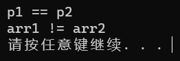

# 数组与指针

## 数组元素的数量

```c
int main(void) {
  int arr[] = {31, 22, 23, 87, 5, 6, 7, 100, 31};
  int sz = sizeof(arr) / sizeof(arr[0]);

  printf("%d", sz);

  return 0;
}
```

上述代码通过关键字 `sizeof` 来计算数组的大小和数组内一个元素的大小，最后两者相除，得到数组内元素的数量。

用此方法计算字符数组的元素个数时，会同时计算末尾的 `\0`，导致偏多。（计算字符数组最好用 `strlen()` 函数）

> **注意**：
>
> - `sizeof` 是一个操作符，是用来计算变量（类型）所占内存空间的大小，不关注内存中存放的具体内容，但是是字节
> - `strlen` 是一个库函数，是专门求字符串长度的，只能针对字符串，从给定参数的地址向后一直找 `\0`，统计 `\0` 之前出现的字符的个数

在二维数组中，将每一行的**一维数组**当成**一个元素**，它的数组名代表第一行的地址，也就是所谓首元素的地址。

```c
printf("%d\n", sizeof(arr) / sizeof(arr[0]));  // arr[0] 代表第一行数据
printf("%d\n", sizeof(arr[0]) / sizeof(arr[0][0]));
```

第一行代码可以算出数组有几行，第二行代码可以算出数组有几列。（通过算一行元素中有几个）

## 数组名

```c
arr[1] == *(arr + 1);
```

`[]` 代表一个操作符，如上图。

所加的 1 代表移动 1 个该数据类型大小的地址。如 `int` 类型的数组，就在地址上加上 4 个或 8 个字节。

数组名能代表第一个元素的地址。

数组名存储着地址，数组名指向的地址是它第一个元素的地址。因此不用像变量那样进行**取地址的操作**（即 `&`）。因此在传给函数时，实际上是传址操作，传的是第一个元素的地址。

**但是有两个例外：**

- `sizeof(数组名)`，当数组名被**单独**放在 `sizeof` 内部时，计算的是整个数组的大小，单位是字节

- `&数组名`，这里的数组名表示整个数组，取出的是整个数组的地址；例如，`printf("%p\n", &arr);` 在执行 `printf("%p\n", &arr+1)` 时，与 `printf("%p\n", &arr[0]+1)` 不同，前者的地址是首元素的地址再加上整个数组，后者的地址是下一个元素的地址。这涉及到指针运算

二维数组的数组名相当于指针数组，指向的是首元素（对于二维数组是第一行数组），可以通过 `*(arr + i)` 来跳到下一行的一维数组的首元素。

## 一维数组的创建和初始化

### 数组的创建

在 C99 标准之前，数组的大小必须是常量或者常量表达式；在 C99 标准之后，数组的大小可以是变量，为了支持变长数组。在支持 C99 标准的编译器上可以运行，而 MSVC 不支持，而 gcc 支持。同时，变长数组不支持初始化。

### 数组的初始化

```C
int main(void) {
  int arr[10] = {1, 2, 3};
  return 0;
}
```

需要注意的是，在上述数组中，除了前三个元素被初始化，其他都默认为 0。

除了 `int arr[10] = {0}` 之外，不能出现 `int arr[10] = {1}` 的情况，它只有第一个元素被初始化为 1，其他的都是 0。

## 二维数组的创建和初始化

### 数组的创建

```c
// 数组创建
int arr[3][4];
char arr[3][5];
double arr;
```

前面那个括号代表有几行，后面那个括号代表有几列。二维数组的首元素是第一行。

### 数组的初始化

```c
int arr1[3][4] = {1, 2, 3, 4, 2, 3, 4, 5, 3, 4, 5, 6};
```

根据数据直接进行初始化，将元素反在数组中，不足的补零。

```C
int arr1[3][4] = {{1, 2}, {3, 4}, {5, 6}};
```

通过括号里面括号的方式，将 `{1, 2}` 放在第一行，将 `{3, 4}` 放在第二行，将 `{5, 6}` 放在第三行。可以进行分组。

```C
int arr[][4] = {{2, 3}, {4, 5}};  // 二维数组如果有初始化，行可以省略，列不能省略
```

访问数组元素的方式与一维数组类似。

## 数组作为函数参数

冒泡排序：


一次 n 个元素的冒泡排序会将最大的元素放在最后，然后在做 n-  1 个元素的冒泡排序。

完成 9 次冒泡排序会让 9 个元素到正确的位置，最后一个元素自然会在正确的位置。

```c
// 数组传参有两种写法
// 第一种是数组的方法：int arr[]
// 第二种是指针的方法：int* str
void bubble_sort(int arr[], int sz) {  // sz 要在函数外部求
  int i = 0;                           // 传参时只传了第一个元素地址
  for (i = 0; i < sz - 1; i++) {       // 表示进行sz-1次排序
    int j = 0;
    for (j = 0; j < sz - 1 - i; j++) {  // 进行 sz - 1 - i 个元素的排序
                                        // 每排序一次，i++
      if (arr[j] > arr[j + 1]) {        // 需要排序的元素个数减少

        int tmp = arr[j + 1];  // 将两个相邻的数进行交换
        // 经过循环后，该次循环最大的数就会位于该次循环元素的最后
        arr[j + 1] = arr[j];
        arr[j] = tmp;
      }
    }
  }
}
```

## 数组的数据类型

以 `int arr[10] = {0}` 为例，它的类型就是 `int [10]`。

```c
sizeof(arr);
sizeof(int[10]);
```

通过计算，两者的大小是一致的。

## 变长数组

在 gcc 中，有：

```c
#include <stdio.h>

int main(void) {
  int n = 0;
  int i = 0;
  int arr[n];  // 变长数组不能初始化

  scanf("%d", &n);
  for (i = 0; i < n; i++) {
    scanf("%d ", arr[i]);
  }
  for (i = 0; i < n; i++) {
    printf("%d ", arr[i]);
  }  // 常规的输入输出

  return 0;
}
```

## 指针的定义

内存被切割成一个个内存单元，一个内存单元是 1byte（1 个字节）：

1. 指针是内存中一个最小单元的编号，也就是地址
2. 平时说的指针通常指的是指针变量，是用来存放内存地址的变量


在取地址的时候，是取变量的第一个地址。如 `&a`，如果 `a` 是整形，则取地址时取的是**第一个内存单元**的地址。

指针变量中存放的是地址，通过地址可以找到一个内存单元。

对 32 位的机器，有 32 条地址线，每根地址线在寻址的时候会产生高电平和低电平：

```bash
00000000 00000000 00000000 00000000
```

而上面的组合有 $2^{32}$ 种，有 $2^{32}$ 个地址，64 位机器同理。在 32 位机器上，因为有 32 位数，所以要 4 个字节来存储。额外：

```c
int* a = NULL;
*a = 50;  // 这句代码是错的，因为这个地址不能访问，C语言中存在一些不能访问的地址。
```

## 指针和指针类型

```c
#include <stdio.h>

int main(void) {
  int a = 0x11223344;
  char* pc = (char*)&a;

  *pc = 0;

  return 0;
}
```

对于上述代码，因为只访问了一个内存单元，所以只改变了一个内存单元的值，如下图：


变为：


因此，**指针类型决定了解引用时访问内存单元的个数**，如字符类型只访问 1 个字节，而整形访问 4 个字节。

```c
#include <stdio.h>

int main(void) {
  int a = 0x11223344;
  int *pa = &a;
  char *pc = (char *)&a;

  printf("%p\n", pa);
  printf("%p\n", pa + 1);
  printf("%p\n", pc);
  printf("%p\n", pc + 1);

  return 0;
}
```


由上述代码可知，**指针的类型决定了指针加一或减一时（例子是 1，可以是整数），跳过字节的个数**，如 `int` 类型是跳过 4 个字节，`char` 类型是跳过 1 个字节。

```c
#include <stdio.h>

int main(void) {
  int a = 0;
  int *pi = &a;
  float *pf = &a;

  *pi = 100;  // *pf = 100.0;

  return 0;
}
```


虽然 `float`、`int` 类型都有跳过 4 个字节等特性，但由于类型不用，所以解引用时访问内存的方式不同，所以不能混用。

如上述代码，因为指针类型不同，存储类型的方式不同。

总之，指针类型决定了两件事：

- 指针加一或减一的操作，跳过字节的个数
- 解引用操作时的权限

## 野指针

一个局部的指针变量没有初始化，就会随机指向一个地址，而后解引用，此时就是非法访问内存，这就是野指针，如果不知道赋何值，可以赋值 `int *p = NULL`，这是空指针。

```c
int* p;
*p = 10;
```

这是一种情况，还有一种是指针越界访问：

```c
#include <stdio.h>

int main(void) {
  int arr[10] = {0};  // 定义一个包含 10 个元素的整型数组，并初始化为 0
  int *p = arr;       // 将指针 p 指向数组 arr 的第一个元素
  int i = 0;

  // 使用 sizeof 计算数组的长度，避免硬编码
  int length = sizeof(arr) / sizeof(arr[0]);

  // 遍历数组并赋值
  for (i = 0; i < length; i++) {
    *p = i;  // 将当前索引 i 的值赋给指针 p 所指向的数组元素
    p++;     // 移动指针到数组的下一个元素
  }

  return 0;  // 程序正常结束
}
```

还有：

```c
#include <stdio.h>

int *test(void) {
  int a = 0;

  return &a;
}

int main(void) {
  int *p = test();

  return 0;
}
```

在上述代码中，因为 `a` 是局部变量，运行完函数就销毁了。然而在 `p` 中存有 `a` 的地址，但 `a` 的内存已经归还了，此时它也是野指针。这时候就是赋值空指针也没有用。

举例：

```c
#include <stdio.h>

int* test(void) {
  int a = 10;

  return &a;
}

int main(void) {
  int* p = test();

  if (p != NULL) printf("%d\n", *p);

  return 0;
}
```

在 MSVC 中，会输出：


由此可知，此时 `p != NULL` 这句代码不能实现，并且虽然变量 `a` 已经销毁，但在那个地址的值还没有被其他值覆盖，所以解引用的时候依旧会输出 10。而：

```c
#include <stdio.h>

int* test(void) {
  int a = 10;

  return &a;
}

int main(void) {
  int* p = test();
  printf("hada\n");

  if (p != NULL) printf("%d\n", *p);

  return 0;
}
```

输出：


这是因为调用函数时会创建自己的函数栈帧，原来的被覆盖了。

规避野指针方法集锦：

1. 指针初始化
2. 小心指针越界
3. 指针指向的空间释放，即使初始化为 `NULL`
4. 避免返回局部变量的地址
5. 指针使用之前检查有效性

## 指针运算

- 指针 `+` 或 `-` 整数
- 指针 `-` 指针
- 指针的关系运算

下面的代码反映了指针的关系运算：

```c
#define N_VALUES 5  // 定义常量N_VALUES，表示数组的长度

int main(void) {
  float *vp;               // 定义一个指向 float 类型的指针 vp
  float values[N_VALUES];  // 定义一个长度为 N_VALUES 的 float 数组 values

  // 使用指针 vp 遍历数组 values，并将每个元素初始化为 0
  // vp 从数组的第一个元素开始（&values[0]），直到数组的最后一个元素（&values[N_VALUES]）
  // 注意：&values[N_VALUES] 是数组最后一个元素的下一个地址，循环条件为 vp < &values[N_VALUES]
  for (vp = &values[0]; vp < &values[N_VALUES];) {
    *vp++ = 0;  // 将当前指针 vp 指向的元素赋值为 0，然后将指针 vp 移动到下一个元素
    // 等价于：
    // *vp = 0;  // 将当前元素赋值为 0
    // vp++;     // 指针移动到下一个元素
    // 注意：(*vp)++ 表示将当前元素的值加 1，与 *vp++ 不同
  }

  return 0;  // 程序正常结束
}
```

因此，遍历数组可以写成：

```c
#include <stdio.h>

int main(void) {
  int arr[10] = {0};
  int *p = arr;
  int i = 0;

  for (i = 0; i < 10; i++) {
    *(p + i) = 1;
  }

  return 0;
}
```

而在 `指针 - 指针` 中，有：

```C
#include <stdio.h>

int main(void) {
  int arr[10] = {0};

  printf("%d\n", &arr[9] - &arr[0]);

  return 0;
}
```


因为 `指针 - 指针` 得到的这个数值的绝对值是两个指针中元素的个数。（前提条件：不是所有的指针都能相减，指向同一块内存空间的两个指针才能相减）

错误示范：

```c
#include <stdio.h>

int main(void) {
  int arr[10] = {0};
  char ch[5] = {0};

  printf("%d\n", &ch[0] - &arr[0]);  // 没有意义的东西

  return 0;
}
```

值得注意的是，`指针 + 指针` 没有意义。

关系运算：

```c
for (vp = &value[N_VALUES]; vp > &value[0];) {
  *--vp = 0;  // 先 vp -= 1，然后再解引用进行赋值操作
}
```

```C
for (vp = &value[N_VALUES - 1]; vp >= &value[0]; vp--) {
  *vp = 0;  // 这个向前越界访问了 p1，标准不支持
}
```

虽然上面的代码看起来比下面的代码要更好，但是由于**标准规定**：

> **注意**：
>
> 允许指向数组元素的指针与指向数组最后一个元素后面的哪一个内存位置的指针比较，但是不允许指向第一个元素之前的那个内存位置的指针进行比较。

从上面那个代码来看，下面那个代码在最后一次循环中地址 `vp` 与 `&value[0]` 进行比较，违反了规定。（虽然在大部分编译器下可以运行）但如果是正着初始化，就不会有问题。


在 C 语言中，解引用操作符 `*` 和加加操作符 `++` 的优先级如下：

1. 解引用操作符 `*` 的优先级高于加法操作符 `+` 和减法操作符 `-`，但低于自增自减操作符 `++` 和 `--`
2. 自增自减操作符 `++` 和 `--` 的优先级高于解引用操作符 `*`

因此，当代码中同时存在这些操作符时，编译器会按照上述优先级规则进行处理。举个例子：

```c
int arr[5] = {1, 2, 3, 4, 5};
int *ptr = arr;
int result = *ptr++;
```

在这个例子中，`*ptr++` 会首先执行指针的自增操作，然后再执行解引用操作。这是因为自增操作符的优先级高于解引用操作符。

总结一下，解引用操作符 `*` 的优先级较高，但仍要留意自增自减操作符的影响。

## 二级指针

```c
#include <stdio.h>

int main(void) {
  int a = 0;
  int *pa = &a;
  int **ppa = &pa;  // 二级指针表示方式

  **ppa = 20;  // 二级指针解引用方法
  printf("%d\n", a);

  return 0;
}
```

大体上关系如图：


二级指针变量是用来存储一级指针变量的地址的变量。

## 指针数组

指针数组：存放指针的数组就是指针数组。

```c
#include <stdio.h>

int main(void) {
  int a = 10, b = 20, c = 30;
  int arr[10];
  // int *pa = &a, *pb = &b, *pc = &c;  // 这种写法是一个个写。
  int *parr[10] = {&a, &b, &c};  // 写成数组，此时 parr 就是指针数组。

  return 0;
}
```

适当修改后：

```c
#include <stdio.h>

int main(void) {
  int a = 10, b = 20, c = 30, i = 0;
  int *parr[10] = {&a, &b, &c};

  for (i = 0; i < 3; i++) {
    printf("%d\n", *(parr[i]));  // 此时就和直接遍历数组进行打印效果类似
  }

  return 0;
}
```

指针数组可以模拟二维数组。但二维数组在内存中是连续存放的，而用指针数组来模拟的效果，那三个数组不一定放在一起。

直接写法：

```C
#include <stdio.h>

int main(void) {
  int i = 0, j = 0;
  int arr[3][4] = {1, 2, 3, 4, 2, 3, 4, 5, 3, 4, 5, 6};

  for (i = 0; i < 3; i++) {
    for (j = 0; j < 4; j++) {
      printf("%d ", arr[i][j]);
    }
    printf("\n");
  }

  return 0;
}
```

模拟写法：

```c
#include <stdio.h>

int main(void) {
  int i = 0, j = 0;
  int arr1[4] = {1, 2, 3, 4};
  int arr2[4] = {2, 3, 4, 5};
  int arr3[4] = {3, 4, 5, 6};
  int *parr[3] = {&arr1, &arr2, &arr3};

  for (i = 0; i < 3; i++) {
    for (j = 0; j < 4; j++) {
      printf(
          "%d ",
          parr[i]
              [j]);  // 调用两次下标引用操作符，第一次是找到相应的数组，第二次是找到相应数组的相应元素
    }
    printf("\n");
  }

  return 0;
}
```

均可打印出：


指针数组的数组名就是二维数组。

## 字符指针

1. 第一种写法：

   ```c
   #include <stdio.h>
   
   int main(void) {
     char ch = 'w';
     char *pc = &ch;
     *pc = 'b';
   
     printf("%c\n", ch);
   
     return 0;
   }
   ```
   
2. 第二种写法：

   ```c
   #include <stdio.h>
   
   int main(void) {
     char *p = "acvafva";  // 将字符串首字符的地址赋给p
   
     printf("%s\n", p);  // 打印字符串时，当遇到\0的时候停止
   
     return 0;
   }
   ```
   
   但是当：
   
   ```c
   #include <stdio.h>
   
   int main(void) {
     char *p = "acvafva";  // 将字符串首字符的地址赋给p
   
     *p = "dad";
     printf("%s\n", p);  // 打印字符串时，当遇到\0的时候停止
   
     return 0;
   }
   ```
   
   它就会报错，因为 “acvafva” 是一个常量字符串，它赋值给 `*p` 不能随便改变。所以在 `*` 左边加上 `const`，代表不能改变。

举例：

```c
#include <stdio.h>

int main(void) {
  const char *p1 = "abcdef";
  const char *p2 = "abcdef";

  char arr1[] = "abcdef";
  char arr2[] = "abcdef";

  if (p1 == p2)
    printf("p1 == p2\n");
  else
    printf("p1 != p2\n");

  if (arr1 == arr2)
    printf("arr1 == arr2\n");
  else
    printf("arr1 != arr2\n");

  return 0;
}
```



因为 `p1` 和 `p2` 放的都是 ”abcdef“ 的首元素地址，它是一个常量字符串，放在只读存储区；而 `arr1` 和 `arr2` 会另外开辟一个空间来存储赋值给它的字符串，它们表示的是各自首元素的地址。

## 数组指针

```c
int *p1[10];    // p1 是指针数组的数组名
int (*p2)[10];  // p2 是指向某个数组的指针
```

而定义一个数组指针的方法是：

```c
#include <stdio.h>

int main(void) {
  int arr[100] = {0};
  int *p = arr;         // 这里的arr代表首元素地址，p存的是首元素的地址
  int(*p2)[10] = &arr;  // 这里的&arr代表取出整个数组的地址

  return 0;
}
```

总而言之，就是：

```c
<数据类型> (*<指针变量名>)[<数组大小>];
```

之所以要括号是为了保证先和星号结合，否则就会变成指针数组的形式。一个应用：

```c
#include <stdio.h>

void print1(int arr[3][5], int row, int col)  // 传统的写法
{
  int i = 0;
  for (i = 0; i < row; i++) {
    int j = 0;
    for (j = 0; j < col; j++) {
      printf("%d ", arr[i][j]);
    }
    printf("\n");
  }
}

// 因为二维数组的第一个元素是第一行，也就是第一个数组
void print2(int (*p)[5], int row, int col) {
  int i = 0;
  for (i = 0; i < row; i++) {
    int j = 0;
    for (j = 0; j < col; j++) {
      // p + i 代表行数，解引用相当于拿到这一行的首元素的地址
      // 而 +j 代表这一行的元素的地址，解引用后就是该元素；其实等价于
      // p[i][j]，用这个替代也可以
      printf("%d ", *(*(p + i) + j));
    }
    printf("\n");
  }
}

int main(void) {
  int arr[3][5] = {1, 2, 3, 4, 5, 2, 3, 4, 5, 6, 3, 4, 5, 6, 7};
  print2(arr, 3, 5);
  return 0;
}
```

因为 `p` 指向的类型是 `int (*)[5]`，所以进行加 1 操作跳过 `5` 个字节。

难的例子：

```c
int(*parr3[10])[5];  // 代表着一个十个元素大小的数组，数组内的每个元素分别指向一个五个元素的数组
```

这是十个元素的数组。

## 数组参数、指针参数

一维数组的传参：

```c
void test(int *arr);  // 表示数组传参的办法
void test(int arr[]);
void test(int arr[10]);
void test(int *arr[]);  // 表示指针数组传参数的两种办法
void test(int **arr);
```

二维数组的传参：

```c
void test(int arr[3][5]);
void test(int arr[][]);  // 不能空行
void test(int arr[][5]);

void test(int *arr);     // 不行
void test(int *arr[5]);  // 不行
// 这是二维数组传参的方式，因为二维数组的首元素是一个一维数组，传进去要是个数组指针
void test(int (*arr)[5]);
void test(int **arr);  // 不行，一维数组的地址放不到二级指针的地址
```

## 函数指针

指向函数的指针。

```c
#include <stdio.h>

int Add(int x, int y) { return x + y; }

int main(void) {
  printf("%p\n", &Add);
  printf("%p\n", Add);

  return 0;
}
```

可以看到两者都输出一样的值，说明对于函数名来说，`&Add` 和 `Add` 都指向的是函数的地址。

返回值是函数指针的函数，定义时：

```c
int (*selectFunction(char op))(int, int);
```

定义函数指针的方式为：

```c
int (*p)(int, int) = &Add;
```

使用例子：

```c
#include <stdio.h>

int Add(int x, int y) { return x + y; }

int main(void) {
  int (*p)(int, int) = &Add;

  printf("%d\n", (*p)(2, 3));
  printf("%d\n", p(2, 3));

  return 0;
}
```


可以看到不加 `*` 号也可以，这就说明了 `&Add` 和 `Add` 是等价的，上面的 `&` 也可以省略。（但要记住要加圆括号）

使用案例：

```c
#include <stdio.h>

int Add(int x, int y) { return x + y; }

int calc(int p(int, int)) { return p(3, 5); }

int main(void) {
  printf("%d\n", calc(Add));

  return 0;
}
```


1. 难的例子：

   ```c
   (*(void (*)())0)();
   ```

   以上代码是一次函数调用，通过解引用，调用的是 `0` 作为地址处的函数。

   `(void (*)())` 代表数据类型，然后对 `0` 进行强制类型转换为返回类型是 `void` 的无参函数的指针，调用 `0` 地址处的这个函数。

2. 难的例子：

   ```c
   void (*signal(int, void (*)(int)))(int);
   ```

   以上代码是一次函数声明，声明的`signal`函数的第一个参数的类型是`int`，第二参数的类型是函数指针，该函数指针指向的函数类型是`int`，`void`是返回类型，表示返回一个无类型（`void`）指针。

   简化写法：

   ```c
   typedef void (*pf_t)(int);
   pf_t signal(int, pf_t);
   ```

   对该类型进行重名名的写法是这样的。（注意 `typedef` 的写法）

案例使用（计算器）：

```c
#include <stdio.h>

void menu(void) {
  printf("***************************\n");
  printf("***********1.add***********\n");
  printf("***********2.sub***********\n");
  printf("***********3.mul***********\n");
  printf("***********4.div***********\n");
  printf("***********0.exit**********\n");
  printf("***************************\n");
}

int Add(int x, int y) { return x + y; }

int Sub(int x, int y) { return x - y; }

int Mul(int x, int y) { return x * y; }

int Div(int x, int y) { return x / y; }

int main(void) {
  int x = 0;
  int y = 0;
  int input = 0;
  int ret = 0;

  do {
    menu();
    printf("请选择:>");
    scanf("%d", &input);

    switch (input) {
      case 1:
        printf("请输入两个操作数:>");
        scanf("%d %d", &x, &y);
        ret = Add(x, y);
        printf("%d\n", ret);
        break;
      case 2:
        printf("请输入两个操作数:>");
        scanf("%d %d", &x, &y);
        ret = Sub(x, y);
        printf("%d\n", ret);
        break;
      case 3:
        printf("请输入两个操作数:>");
        scanf("%d %d", &x, &y);
        ret = Mul(x, y);
        printf("%d\n", ret);
        break;
      case 4:
        printf("请输入两个操作数:>");
        scanf("%d %d", &x, &y);
        ret = Div(x, y);
        printf("%d\n", ret);
        break;
      case 0:
        printf("退出计算器\n");
        break;
      default:
        printf("选择错误\n");
        break;
    }
  } while (input);

  return 0;
}
```

可以看到有很多冗余的代码；将部分代码优化后，有：

```c
void calc(int (*pf)(int, int)) {
  int x = 0, y = 0, ret = 0;

  printf("请输入两个操作数:>");
  scanf("%d %d", &x, &y);
  ret = pf(x, y);
  printf("%d\n", ret);
}

int main(void) {
  int x = 0;
  int y = 0;
  int input = 0;
  int ret = 0;

  do {
    menu();
    printf("请选择:>");
    scanf("%d", &input);

    switch (input) {
      case 1:
        calc(Add);
        break;
      case 2:
        calc(Sub);
        break;
      case 3:
        calc(Mul);
        break;
      case 4:
        calc(Div);
        break;
      case 0:
        printf("退出计算器\n");
        break;
      default:
        printf("选择错误\n");
        break;
    }
  } while (input);

  return 0;
}
```

这种实现方式叫回调函数机制。（因为传参不能传函数，那就传它的指针）

## 关于指针的定义与初始化

因为函数指针、数组指针也是一种数据类型，如 `void (*)(int)`。我们发现，它的变量名定义在哪里，那对应的函数名，以及它的参数也要放在那个函数名的位置。

如：

```c
void (*signal(int, void (*)(int)))(int);
```

因此简化写法：

```c
typedef void (*pf_t)(int);
pf_t signal(int, pf_t);
```

对这个类型重命名也要放进去。

类似的，对于返回值是一个数组的指针的函数：

```c
int (*functionName())[5]；
```

此外，对于一个包含着指向数组的指针的数组的定义为：

```c
int(*parr3[10])[5];
```

其中 `int (*)[5]` 代表这是一个指向 5 个元素的数组的指针的数据类型，`parr3[10]` 代表一个大小为 10 个元素的数组。

## 函数指针数组

函数指针数组是存放函数指针的数组。

```c
int (*arr[4])(int, int) = {Add, Sub, Mul, Div};  // 参数和返回类型都相同的函数指针放在同一个数组
```

案例使用：

```c
#include <stdio.h>

void menu(void) {
  printf("****************************\n");
  printf("***********1.add ***********\n");
  printf("***********2.sub ***********\n");
  printf("***********3.mul ***********\n");
  printf("***********4.div ***********\n");
  printf("***********0.exit***********\n");
  printf("****************************\n");
}

int Add(int x, int y) { return x + y; }

int Sub(int x, int y) { return x - y; }

int Mul(int x, int y) { return x * y; }

int Div(int x, int y) { return x / y; }

int main(void) {
  int x = 0;
  int y = 0;
  int input = 0;
  int ret = 0;
  int (*pfArr[])(int, int) = {0, Add, Sub, Mul, Div};

  do {
    menu();
    printf("请选择:>");
    scanf("%d", &input);

    if (input == 0) {
      printf("退出计算器\n");
    } else if (input >= 1 && input <= 4) {
      printf("请输入两个操作数:>");
      scanf("%d %d", &x, &y);
      ret = pfArr[input](x, y);
      printf("%d\n", ret);
    } else {
      printf("选择错误\n");
    }

  } while (input);

  return 0;
}
```

使用函数指针的数组，极大简化了将来的修改量，只需要增加数组的元素就行了。这种数组也被称作**转移表**。

## 指向函数指针数组的指针

```c
#include <stdio.h>

int Add(int x, int y) { return x + y; }

int Sub(int x, int y) { return x - y; }

int Mul(int x, int y) { return x * y; }

int Div(int x, int y) { return x / y; }

int main(void) {
  int (*pfArr[])(int, int) = {0, Add, Sub, Mul, Div};
  int (*(*ppfArr)[5])(int, int) = &pfArr;

  return 0;
}
```

定义方式为：

```c
int (*(*ppfArr)[5])(int, int) = &pfArr;
```

`pfArr`先与星号结合说明它是一个指针，`int (*)[5]`说明它指向的数据类型。

```c
int (**ppfArr[5])(int, int);
```

上述代码代表这定义了一个二级指针数组，数据类型为：`int (**[5])(int, int)`。

## 回调函数

回调函数就是一个通过函数指针调用的函数。如果你把函数的指针（地址）作为参数传递给另一个函数，当这个指针被用来调用其所指向的函数时，我们就说这是回调函数。回调函数不是由该函数的实现方直接调用，而是在特定的事件或条件发生时另外的一方调用的，用于对该事件或条件进行响应。

## `sizeof`、`strlen` 函数与数组名

1. 例 1：

   ```c
   #include <stdio.h>
   
   int main(void) {
     int a[] = {1, 2, 3, 4};
   
     printf("%d\n", sizeof(a));  // 16
     // sizeof(数组名)，数组名表示整个数组，计算的是整个数组的大小，单位是字节
   
     printf("%d\n", sizeof(a + 0));  // 4 or 8
     // a 不是单独放在 sizeof 内部，也没有取地址，所以 a 就是首元素的地址，a +
     // 0 还是首元素的地址是地址，大小就是 4 or 8；a <=> &a[0]；so a + 0 <=> &a[0] +
     // 0
   
     printf("%d\n", sizeof(*a));  // 4
     // *a 中的 a 是数组首元素的地址，*a 就是对首元素的地址解引用，找到的就是首元素
     // 首元素的大小就是 4 个字节
   
     printf("%d\n", sizeof(a + 1));  // 4 or 8
     // 这里的 a 是数组首元素的地址
     // a + 1 是第二个元素的地址
     // szieof(a + 1) 就是地址的大小
   
     printf("%d\n", sizeof(a[1]));  // 4
     // 计算的是第二个元素的大小
   
     printf("%d\n", sizeof(&a));  // 4 or 8
     // &a 取出的数组的地址，数组的地址，也就是地址，
   
     printf("%d\n", sizeof(*&a));  // 16
     // &a --> int(*)[4]
     // &a 拿到的是数组名的地址，类型是 int(*)[4] 是一种数组指针
     // 数组指针解引用找到的是数组
   
     printf("%d\n", sizeof(&a + 1));  // 4 or 8
     // &a 取出的是数组的地址
     // &a --> int(*)[4]
     // &a + 1 是从数组 a 的地址向后跳过了一个包含 4 个整形元素的数组的大小
     // &a + 1 还是地址，是地址就是 4 / 8 个字节
   
     printf("%d\n", sizeof(&a[0]));  // 4 or 8
     // &a[0] 就是第一个元素的地址
     // 计算的是地址的大小
   
     printf("%d\n", sizeof(&a[0] + 1));  // 4 or 8
     // &a[0] + 1 是第二个元素的地址
     // 大小是 4 or 8 个字节
     // &a[0] + 1 --> &a[1]
   
     return 0;
   }
   ```

   

   可以看出，如果直接对数组名进行加减计算，它代表的是首元素地址。

2. 例 2：

   ```c
   #include <stdio.h>
   
   int main(void) {
     char arr[] = {'a', 'b', 'c', 'd', 'e', 'f'};
   
     printf("%d\n", sizeof(arr));  // 6
     // sizeof(数组名)
   
     printf("%d\n", sizeof(arr + 0));  // 4 or 8
     // arr + 0 是数组首元素的地址
   
     printf("%d\n", sizeof(*arr));  // 1
     // *arr --> arr[0]
     // *(arr + 0) --> arr[0]
   
     printf("%d\n", sizeof(arr[1]));  // 1
   
     printf("%d\n", sizeof(&arr));
     // &arr 是数组的地址，是地址就是 4 or 8 个字节
   
     printf("%d\n", sizeof(&arr + 1));  // 4 or 8 个字节
     // &arr + 1 是数组后的地址
   
     printf("%d\n", sizeof(&arr[0] + 1));  // 4 or 8
     // &arr[0] + 1 是第二个元素的地址
   
     return 0;
   }
   ```

   扩展：

   ```c
   printf("%d\n", sizeof(arr[0] + 1));  // 4
   // arr[0] 与 1 进行计算时发生了整形提升，最后得出的结果也为整形
   ```

3. 例 3：

   ```c
   #include <stdio.h>
   #include <string.h>
   
   int main(void) {
     char arr[] = {'a', 'b', 'c', 'd', 'e', 'f'};
   
     // 随机值，从首元素地址找到 '\0' 再停
     printf("%d\n", strlen(arr));
     // 随机值，首元素地址 +0 还是首元素
     printf("%d\n", strlen(arr + 0));
     // --> strlen('a')-->strlen(97)，97 是野指针；代码无法编译
     printf("%d\n", strlen(*arr));
     // --> strlen('b')-->strlen(98)，98 是野指针；代码无法编译
     printf("%d\n", strlen(arr[1]));
     // 随机值，与 1、2 的代码一样，因为起始地址一样，还是一个字节一个字节地找
     printf("%d\n", strlen(&arr));
     // 比 1、2 的随值减 6，因为跳过了 6 个字符，少数了 6 个字符
     printf("%d\n", strlen(&arr + 1));
     // 与上面值相同
     printf("%d\n", strlen(&arr[0] + 1));
     // 比 1、2 的随机值少 1，因为跳过了 1 个字符
     printf("%d\n", strlen(arr[0] + 1));
   
     return 0;
   }
   ```

   将野指针两个代码注释掉后，执行程序：

   

4. 例 4：

   ```c
       char arr[] = "abcdef";
   	  // a b c d e f \0
       printf("%d\n", sizeof(arr));         // 7个元素，因为字符串末尾有'\0'
       printf("%d\n", sizeof(arr + 0));     // 4 or 8，首元素地址
   	  printf("%d\n", sizeof(*arr));        // 1
   	  printf("%d\n", sizeof(arr[1]));      // 1
       printf("%d\n", sizeof(&arr));        // 4 or 8
    		printf("%d\n", sizeof(&arr + 1));    // 4 or 8
       printf("%d\n", sizeof(&arr[0] + 1)); // 4 or 8
   ```

5. 例 5：

   ```c
   #include <stdio.h>
   #include <string.h>
   
   int main(void) {
     char arr[] = "abcdef";
     // a b c d e f \0
     printf("%d\n", strlen(arr));      // 6
     printf("%d\n", strlen(arr + 0));  // 6
     // printf("%d\n", strlen(*arr));  //err
     // printf("%d\n", strlen(arr[1]));  //err
     printf("%d\n", strlen(&arr));         // 6
     printf("%d\n", strlen(&arr + 1));     // 0，跳过最后的 '\0'，然后随机值
     printf("%d\n", strlen(&arr[0] + 1));  // 5
   
     return 0;
   }
   ```

6. 例 6：

   ```c
   #include <stdio.h>
   #include <string.h>
   
   int main(void) {
     char *p = "abcdef";
   
     printf("%d\n", sizeof(p));          // 4 or 8
     printf("%d\n", sizeof(p + 1));      // 4 or 8
     printf("%d\n", sizeof(*p));         // 1
     printf("%d\n", sizeof(p[0]));       // 1
     printf("%d\n", sizeof(&p));         // 4 or 8
     printf("%d\n", sizeof(&p + 1));     // 4 or 8
     printf("%d\n", sizeof(&p[0] + 1));  // 4 or 8
   
     printf("%d\n", strlen(p));      // 6
     printf("%d\n", strlen(p + 1));  // 5
     printf("%d\n", strlen(*p));     // err
     printf("%d\n", strlen(p[0]));   // err
     printf("%d\n", strlen(&p));     // 随机值
     printf("%d\n", strlen(&p + 1));
     // p 是指针变量，占 4 or 8 个字节，二级指针在进行指针运算的时候
     // 会跳过 4 个字节
     // 而 strlen 会一个字节一个字节得找，可能在之前跳过的 4 个字节中就有 '\0'
     printf("%d\n", strlen(&p[0] + 1));  // 与上面同理
   
     return 0;
   }
   ```

   `p` 存储的只是字符串第一个字符的地址，因为它的类型是 `char *`，指向的是一个字符的地址，解引用后权限也是一个字符。

7. 例 7：

   ```c
   #include <stdio.h>
   #include <string.h>
   
   int main(void) {
     int a[3][4] = {0};
   
     printf("%d\n", sizeof(a));        // 3 * 4 * 4 = 48
     printf("%d\n", sizeof(a[0][0]));  // 4
     printf("%d\n", sizeof(a[0]));     // 4 * 4 = 16
     // a[0] 代表第一行元素的数组名，又单独放在 sizeof 内部，就是数组大小的计算
     // 计算的就是第一行的数组大小
   
     printf("%d\n", sizeof(a[0] + 1));  // 4
     // 此时 a[0] 代表第一行的一维数组的首元素地址
     // 把它理解为一个数组名，数组名没有单独放，就当成首元素地址
   
     printf("%d\n", sizeof(*(a[0] + 1)));  // 4
     // 此时 *(a[0] + 1) 代表把第一行的一维数组的第二个元素地址解引用到它
   
     printf("%d\n", sizeof(a + 1));  // 4
     // a 没有单独放，代表第一行一维数组的地址，a + 1 代表第二行的地址
   
     printf("%d\n", sizeof(*(a + 1)));  // 4 * 4 = 16
     // 相当对数组指针解引用，代表第二行数组，计算它的大小就为它的大小
   
     printf("%d\n", sizeof(&a[0] + 1));  // 4
     // &a[0] 代表取出第一行的一维数组的地址，再进行加 1 操作，得到的是第二行的地址
     // 与 a + 1 一样，因为 a 是二维数组，所以它的数组名就是首元素地址，即 &a[0]
   
     printf("%d\n", sizeof(*(&a[0] + 1)));  // 4 * 4 = 16
     // 对第二行地址进行解引用
   
     printf("%d\n", sizeof(*a));  // 16
     // 数组名 a 没有单独放进去，此时代表首元素地址
     // 对其解引用，拿到的就是第一行的数组，计算的大小就是数组的大小
   
     printf("%d\n", sizeof(a[3]));  // 16
     // 虽然第四行不存在，但对 sizeof 不会真的访问这个第四行
     // 而是去分析这个数据的数据类型
   
     int a = 0;
   
     sizeof(a) == sizeof(int);
     // 类似的
     // sizeof 是通过分析数据类型来判断大小的，不会真访问
   
     return 0;
   }
   ```

**总结**：

- `sizeof(arr)`，这里的数组名表示整个数组，计算的是整个数组的大小
- `&arr`，这里的数组名表示整个数组，取出的是整个数组的地址
- 除此之外，所有数组名代表首元素地址

**拓展**：

在 C 语言中，`sizeof`是一个运算符，用于计算给定类型或表达式的大小（以字节为单位）。它不会引发越界访问错误。

在你的代码中，`sizeof(a[3])` 计算的是 `a[3]` 这个元素的大小，其中 `a` 是一个二维数组。然而，需要注意的是，C 语言中的数组索引是从 0 开始的，所以 `a[3]` 实际上是访问了数组 `a` 中的第 4 行（下标为 3）。

在这种情况下，`a[3]` 将访问到一个不存在的行，因为数组 `a` 只有 3 行。然而，由于 `sizeof` 是在编译时求值的，它只关心类型的大小而不涉及实际的访问操作。所以，`sizeof(a[3]) `将返回 `sizeof(int[4])`，即整型数组 `int[4]` 的大小，通常是 16 个字节（假设 int 类型占用 4 个字节）。

## 指针的相关问题

1. 例 1：

   ```c
   #include <stdio.h>
   
   int main(void) {
     int a[5] = {1, 2, 3, 4, 5};
     // &a 代表取出整个数组的地址，加 1
     // 代表跳过整个数组，然后将它强制转换为整形指针
     int *ptr = (int *)(&a + 1);
     // ptr - 1 是整形指针的运算，对其解引用就是数组最后一个元素
     printf("%d %d\n", *(a + 1), *(ptr - 1));
   
     return 0;
   }
   ```

   

2. 例 2：

   ```c
   #include <stdio.h>
   
   // 这个结构体的大小是 20 个字节，X86 环境（根据具体环境而定）
   struct Test {
     int Num;
     char *pcName;
     short sDate;
     char cha[2];
     short sBa[4];
   } *p = (struct Test *)0x100000;
   
   int main(void) {
     printf("%p\n", p + 0x1);  // 结构体指针加 1 跳过一个结构体
     // 指针被强制类型转换成无符号长整形，进行普通的加法运算
     printf("%p\n", (unsigned long)p + 0x1);
     // 转换为无符号整形后，进行整形指针的运算
     printf("%p\n", (unsigned int *)p + 0x1);
   
     return 0;
   }
   ```

   

   在 C 语言中，使用 `%p` 格式打印出的地址同样是以十六进制显示的。`%p` 格式在 C 语言中也用于打印指针类型的变量，以及内存地址。

3. 例 3：

   ```c
   #include <stdio.h>
   
   int main(void) {
     int a[4] = {1, 2, 3, 4};
     // 前两个元素是这样排的 01 00 00 00, 02 00 00 00
   
     int *ptr1 = (int *)(&a + 1);
     // ……03 00 00 00, 04 00 00 00, ?
     //                指向这个问号 ^
   
     int *ptr2 = (int *)((int)a + 1);
     // 原来的：01 00 00 00
     // 原来的：^
     // a 变成整数加 1 后，所指向的值变为：
     // 变后的：01 00 00 00, 02 00 00 00
     // 变后的：   ^
     // 每个指针指向的是一个字节的大小，加 1 后又转回来，就变跳过了一个字节
     // 因为它是整形指针，所以会读取四个字节：
     // 00 00 00 02
     // 02000000
     printf("%x\n%x\n", ptr1[-1], *ptr2);
     return 0;
   }
   ```
   
   
   
4. 例 4：

   ```c
   #include <stdio.h>
   
   int main(void) {
     // 注意这个逗号表达式，因此 (0, 1) 就是 1
     int a[3][2] = {(0, 1), (2, 3), (4, 5)};
     // 上述真实数据是 {1, 3, 5}
     int *p;
     p = a[0];  // 将第一行的数组名代表着第一行的一维数组的首元素的地址
   
     // p[0] == *p;  // 对第一行的一维数组首元素的地址进行解引用，访问到它
     printf("%d", p[0]);
     return 0;
   }
   ```

   

5. 例 5：

   ```c
   #include <stdio.h>

   int main(void) {
     int a[5][5];  // 5 * 5 的二维数组
     int(*p)[4];   // p 指向的是一个 4 个元素大小的整形数组
     p = a;        // 将第一行的地址（int(*)[5]）赋给 p（int(*)[4]）
     // 但是 p 只能访问 4 个元素大小的地址，所以进行加 1 操作时仅能跳过四个整形
     // 对于 p[4] 来说，相较于 a[4]，它只跳过了 4 * 4 = 16 个的内容，而 a[4] 跳过了
     // 4 * 5 个的内容
     printf("%p,%d\n", &p[4][2] - &a[4][2], &p[4][2] - &a[4][2]);
     // p[4][2] = p0 + 4 * 4 + 2
     // a[4][2] = p0 + 4 * 5 + 2
     return 0;
   }
   ```

   

   

   `%p` 直接打印内存中的值，而内存存的是补码，它直接将这个值打印出来。（与 `%X` 类似）

6. 例 6：

   ```c
   #include <stdio.h>
   
   int main(void) {
     int aa[2][5] = {1, 2, 3, 4, 5, 6, 7, 8, 9, 10};
     // 取出整个数组的地址，然后加 1，再强制类型转换
     int *ptr1 = (int *)(&aa + 1);
     // 对第二行的地址进行解引用，就是第二行首元素的地址
     int *ptr2 = (int *)(*(aa + 1));
     printf("%d,%d\n", *(ptr1 - 1), *(ptr2 - 1));  // 2, 5
     return 0;
   }
   ```

7. 例 7：

   ```c
   #include <stdio.h>
   
   int main(void) {
     char *a[] = {"work", "at", "alibaba"};  // 运用指针数组存放常量字符串
     char **pa = a;                          // 将首元素地址赋给二级指针 pa
     pa++;                                   // pa 进行加 1 操作，跳过一个一级指针
     printf("%s\n", *pa);  // 对第二个指针进行解引用操作，访问的就是 "at"
     return 0;
   }
   ```
   
8. 例 8：

   ```c
   #include <stdio.h>
   
   int main(void) {
     char *c[] = {"ENTER", "NEW", "POINT", "FIRST"};
     // 将 4 个字符串首字符的地址存到 c 数组中
     char **cp[] = {c + 3, c + 2, c + 1, c};
     // cp 数组存的是 char **，因为 c 数组是 char *
     // 的地址，要存指针数组中元素的地址 所以是 char **
     char ***cpp = cp;
     // 因为 cp 是首元素地址，其类型为 char **；所以存它的地址就要用 char ***
     // cpp 指向的是 c + 3；加加操作后，指向 c + 2
     printf("%s\n", **++cpp);
     // POINT  // 解引用操作后得到 c + 2 的内容
     // c + 2 的地址加加后指向 c + 1，然后 c + 1 再减 1 就是 c，解引用后指向
     // ENTER，再进行 +3 操作，从第四个字符开始打印
     printf("%s\n", *--*++cpp + 3);
     // ER
     // cpp[-2]==*(cpp-2)，代表此时 cpp - 2 的地址指向 c + 3，再对 c + 3
     // 进行解引用操作，就是 FIRST，然后 +3，从第四个字符打印
     printf("%s\n", *cpp[-2] + 3);
     // ST
     // 注意 cpp-- 会改变值，而 cpp - 2 不会
     // cpp 还是指向 c + 1，cpp - 1 后指向 c + 2，然后解引用得到 c + 2，c + 2 -
     // 1就是 c + 1，对 c + 1 解引用，指向 NEW 的首字符，+1 后从第二个字符开始打印
     printf("%s\n", cpp[-1][-1] + 1);
   
     return 0;
   }
   ```
   
   
   
   
