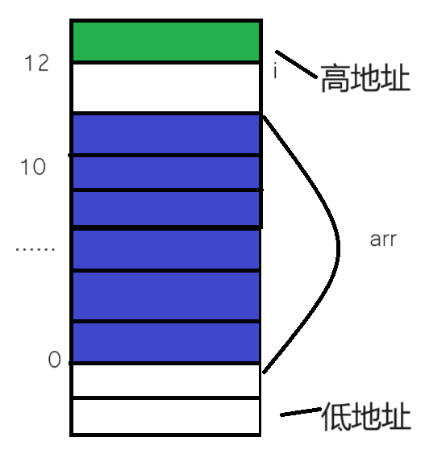

# 存储类别、链接和内存管理

## 栈区、堆区和静态区

内存中的不同区域可以概括如下：

| 内存区域         | 描述                                                                                                                                                         |
| ---------------- | ------------------------------------------------------------------------------------------------------------------------------------------------------------ |
| 栈区             | 由编译器自动分配释放，存放函数的参数值，局部变量的值等。                                                                                                     |
| 堆区             | 一般由程序员分配释放，若程序员不释放，程序结束时可能由操作系统回收。                                                                                         |
| 全局区（静态区） | 全局变量和静态变量的存储是放在一块的，初始化的全局变量和静态变量在一块区域，未初始化的全局变量和未初始化的静态变量在相邻的另一块区域。程序结束后有系统释放。 |
| 文字常量区       | 常量字符串就是放在这里的。程序结束后由系统释放。                                                                                                             |
| 程序代码区       | 存放函数体的二进制代码。                                                                                                                                     |
| 内核区           | 操作系统内核使用的内存区域，用于存储内核代码、数据结构等。对普通应用程序来说是受限制的，直接访问内核空间可能导致系统崩溃或其他严重问题。                     |

这些区域在内存中按照一定的布局进行分配和管理，每个区域有不同的特点和用途，对于程序的运行和内存管理至关重要。


在静态区中，静态变量和全局变量默认被初始化为 0，而在栈区中，默认被初始化为随机值。

举一个在栈区中的例子：

```c
#include <stdio.h>

int main(void)
{
	int i = 0;
	int arr[10] = { 1,2,3,4,5,6,7,8,9,10 };

	for (i = 0; i <= 12; i++)
	{
		arr[i] = 0;
		printf("hello world\n");
	}

	return 0;
}
```


在这个越界访问的例子中，可以看到 `i` 的值与 `arr[12]` 的值相等，两个变量所占据的空间相同。



1. 栈区内存的使用习惯是先使用高地址处的空间，再使用低地址处的空间。
2. 数组随着下标的增长，地址是由低到高变化的。
3. 如果 `i` 和 `arr` 之间由适当的空间，利用数组的越界操作就可能会覆盖到，就可能会导致死循环的出现。

另外：

数字在内存中是倒着存的，如 0x11223344，它在内存在由低地址存向高地址（这体现了从低到高存）：

```bash
   44 33 22 11
// 低        高
```

> [!tip]
>
> 在 Release 版本里面，内存开辟的方式与 Debug 的不同，`i` 在低地址，而 `arr` 在高地址，所谓的优化。

## 类型的基本归类

- 整型家族：

  ```c
  char
  	unsigned char
  	signed char
  short
  	unsigned short [int]
  	signed short [int]
  int
  	unsigned int
  	signed int
  long
  	unsigned long [int]
  	signed long [int]
  long long
    unsigned long long [int]
    signed long long [int]
  ```

  > [!tip]
  >
  > `char` 被当作 `unsigned char` 或者 `signed char` 取决于编译器的类型，而其他的类型都是 `signed`，其他的要加 `unsigned`。

- 浮点型家族：

  ```c
  float
  double
  ```

- 构造类型：

  ```c
  > 数据类型
  > 结构体类型 struct
  > 枚举类型 enum
  > 联合类型 union
  ```

举例：

```c
int arr1[5] = {0};   // 类型为 int[5]
int arr2[8] = {0};   // 类型为 int[8]
char arr3[5] = {0};  // 类型为 char[5]
```

- 指针类型：

  ```c
  int *pi
  char *pc
  float *pf
  void *pv
  ```

- 空类型：

  ```c
  void  // 表示为空类型
  ```

通常应用于函数的返回类型、函数的参数、指针类型。

## 原码、反码、补码

在计算机系统中，数值一律用补码来表示和存储。原因在于，使用补码，可以将符号位和数值位统一处理；同时，加法和减法也可以统一处理（**CPU 只有加法器**）。此外，补码与原码相互转换，其运算过程是相同的，不需要额外的硬件电路。

`char` 类型能存的数据大小 $[-127,128]$，而 `unsigned char` 的取值范围是 $[0,255]$。

- 例 1：

  ```c
  #include <stdio.h>
  #include <string.h>

  int main(void) {
    char a[1000];
    int i;

    for (i = 0; i < 1000; i++) {
      a[i] = -1 - i;
    }
    printf("%d\n", strlen(a));

    return 0;
  }
  ```

  可知字符串靠 `\0` 来截止，那就看 $[-128,127]$，一开始是 -1，通过减一后面变成 -128 （10000000）时，再减一就变成了 127（`01111111`）；而后再进行 -1 运算，直到 0。

- 例 2：

  ```c
  #include <stdio.h>
  #include <string.h>

  int main(void) {
    if (strlen("abc") - strlen("abcdef") > 0) {
      printf(">\n");
    } else {
      printf("<\n");
    }

    return 0;
  }
  ```

  

  因为 `strlen()` 的返回类型为 `size_t` 即 `unsigned int`，所以进行的是无符号整形的计算，因此返回的也是无符号整形。

## 大小端介绍

大小端字节序指的是数据在电脑上存储的字节顺序。（不是二进制位顺序）

> [!tip]
>
> - 大端（存储）模式，是指数据的低位保存在内存的高地址中，而数据的高位，保存在内存的低地址中。
>
> - 小端（存储）模式，是指数据的低位保存在内存的低地址中，而数据的高位，保存在内存的高地址中。

举例：存储一个数 0x11223344。

判断大小端：

```c
#include <stdio.h>

int main(void) {
  int a = 1;

  if (*(char *)&a == 1)
    printf("小端\n");
  else
    printf("大端\n");

  return 0;
}
```

升级版：

```c
int check_sys(void) {
  int a = 1;

  return *(char *)&a;  // 返回第一个字节，如果是 1，就返回 1；是 0，就返回 0
}
```

因为指针所指向的是从低地址指向高地址的第一个字节的地址，所以当指向 4 个字节的整形指针被截断为指向第一个字节的字符指针，该指针所指向的就是存在内存中的第一个字节的地址，也就是一个字节的内容。此时如果是小端字节序，低位存在低地址，就会显示 `1`，而如果是大端字节序，高位存储在低地址，就会显示 `0`。

## 浮点数存储

### IEEE 754 浮点数表示规则

#### 有效数字 M 的表示

- M 可以表示为 `1.xxxxxx` 的形式，其中 `xxxxxx` 表示小数部分。
- 在计算机内部存储时，IEEE 754 规定 **M** 的第一位总是 **1**，因此可以省略，只保存 `xxxxxx` 部分；例如，存储 **1.01** 时，只保存 **01**，读取时再补回第一位的 **1**。
- 这样做可以节省 **1** 位有效数字。以 32 位浮点数为例，**M** 只有 23 位存储空间，省略第一位后，相当于可以保存 **24** 位有效数字

#### 指数 E 的表示

1. **E 不全为 0 或不全为 1**：

   - 浮点数采用以下规则表示：
     1. 指数 **E** 的计算值减去 **127**（32 位）或 **1023**（64 位）得到真实值。
     2. 有效数字 **M** 前加上第一位的 **1**。
   - 例如：
     - **0.5**（$\dfrac{1}{2}$）的二进制为 **0.1**。
     - 规定正数部分为 **1**，小数点右移 **1** 位，得 $1.0 \times 2^{-1}$。
     - 阶码为 $-1 + 127 = 126$，即 `01111110`。
     - 尾数 **1.0** 去掉整数部分为 **0**，补齐 **23** 位 **0**。
     - 最终二进制表示为：`00111111000000000000000000000000`。

2. **E 全为 0**：

   - 指数 **E** 的真实值为 $1 - 127$（32 位）或 $1 - 1023$（64 位）。
   - 有效数字 **M** 不再加上第一位的 **1**，而是还原为 `0.xxxxxx` 的小数。
   - 这种表示用于表示 $\pm 0$ 以及接近于 **0** 的很小的数字。

3. **E 全为 1**：

   如果有效数字 **M** 全为 **0**，表示 $\pm \infty$（正负取决于符号位 **s**）。

## 动态内存分配

### `malloc` 和 `free`

`malloc` 函数：

头文件为 `<stdlib.h>`。

```c
void *malloc(size_t size);
```

这个函数向内存申请一块连续可用的空间，并返回指向这块空间的指针。

- 如果开辟成功，则返回一个指向开辟好空间的指针。
- 如果开辟失败，则返回一个 `NULL` 指针，因此 `malloc` 的返回值一定要做检查。
- 返回值的类型是 `void*` ，所以 `malloc` 函数并不知道开辟空间的类型，具体在使用的时候使用者自己来决定。
- 如果参数 `size` 为 0，`malloc` 的行为是标准是未定义的，取决于编译器。

`free` 函数：

头文件为 `<stdlib.h>`。

```c
void free (void* ptr);
```

`free` 函数用来释放动态开辟的内存：

- 如果参数 `ptr` 指向的空间不是动态开辟的，那 `free` 函数的行为是未定义的。
- 如果参数 `ptr` 是 `NULL` 指针，则函数什么事都不做。

例子：

```c
#include <errno.h>
#include <stdio.h>
#include <stdlib.h>
#include <string.h>

int main(void) {
  int *p = (int *)malloc(40);
  if (p == NULL) {
    printf("%s\n", strerror(errno));  // 开辟失败返回错误信息
    return 1;  // 历史习惯，返回 0 代表正常进行，所以用 return 1 表示正常返回
  }

  for (int i = 0; i < 10; ++i) {
    *(p + i) = i;
    printf("%d ", *(p + i));
  }

  return 0;
}
```


失败案例：

```c
#include <errno.h>
#include <stdio.h>
#include <stdlib.h>
#include <string.h>

int main(void) {
  int *p = (int *)malloc(2 * INT_MAX);  // C 语言定义的一个非常大的数

  if (p == NULL) {
    printf("%s\n", strerror(errno));
    return 1;
  }

  return 0;
}
```


代表没有足够的空间可以开辟。

这些申请空间都在堆区中，而数组等是申请在栈区。

虽然没有 `free`，但是**在程序退出后，系统会自动回收内存空间**。

```c
  free(p);   // 释放相应的内存空间
  p = NULL;  // 将p的值赋值为空指针，防止有人使用，变成野指针
  // 之后就没人用，可以很安全
```

### `calloc` 函数

C 语言还提供了一个函数叫 `calloc` ， `calloc` 函数也用来动态内存分配。原型如下：

```c
void* calloc (size_t num, size_t size);
```

- 函数的功能是为 `num` 个大小为 `size` 的元素开辟一块空间，并且把空间的每个字节初始化为 0。

- 与函数 `malloc` 的区别只在于 `calloc` 会在返回地址之前把申请的空间的每个字节初始化为全 0；举个例子：

  ```c
  #include <errno.h>
  #include <stdio.h>
  #include <stdlib.h>
  #include <string.h>

  int main(void) {
    int *p = (int *)calloc(10, sizeof(int));
    if (p == NULL) {
      printf("%s\n", strerror(errno));
    }
    for (int i = 0; i < 10; ++i) {
      printf("%d ", *(p + i));
    }
    free(p);
    p = NULL;
    return 0;
  }
  ```

  

### `realloc` 函数

- `realloc` 函数的出现让动态内存管理更加灵活。
- 有时会我们发现过去申请的空间太小了，有时候我们又会觉得申请的空间过大了，那为了合理的时候内存，我们一定会对内存的大小做灵活的调整。那 `realloc` 函数就可以做到对动态开辟内存大小的调整。

函数原型如下：

```c
void* realloc(void *ptr, size_t size);
```

- `ptr` 是要调整的内存地址。
- `size` 调整之后新大小。
- 返回值为调整之后的内存起始位置。
- 这个函数调整原内存空间大小的基础上，还会将原来内存中的数据移动到新的空间。
- `realloc` 在调整内存空间的是存在两种情况：
  - 情况 1：原有空间之后有足够大的空间。
  - 情况 2：原有空间之后没有足够大的空间。


**情况 1**：

当是情况 1 的时候，要扩展内存就直接原有内存之后直接追加空间，原来空间的数据不发生变化。

**情况 2**：

当是情况 2 的时候，原有空间之后没有足够多的空间时，扩展的方法是：在堆空间上另找一个合适大小的连续空间来使用。这样函数返回的是一个新的内存地址。 由于上述的两种情况，`realloc` 函数的使用就要注意一些。

```c
#include <errno.h>
#include <stdio.h>
#include <string.h>

int main(void) {
  int *p = (int *)malloc(40);
  if (NULL == p) {
    printf("%s\n", strerror(errno));
  }
  for (int i = 0; i < 10; ++i) {
    *(p + i) = i + 1;
  }
  int *ptr = (int *)realloc(p, 80);  // 定义一个新的变量去接收，而不是原来的变量，防止出现空指针
  if (ptr != NULL) {
    p = ptr;
    ptr = NULL;
  }
  for (int i = 0; i < 10; ++i) {
    printf("%d ", *(p + i));
  }
  return 0;
}
```

实现 `malloc` 函数的功能：

```c
#include <stdio.h>
#include <stdlib.h>

int main(void) {
  realloc(NULL, 20);
  return 0;
}
```

### 常见错误

#### 对 `NULL` 的解引用操作

错误示例：

```c
#include <stdio.h>
#include <stdlib.h>

int main(void) {
  int *p = (int *)malloc(40);
  *p = 20;  // 如果 p 是空指针，就会出问题
  return 0;
}
```

正确示例：

```c
#include <stdio.h>
#include <stdlib.h>

int main(void) {
  int *p = (int *)malloc(40);
  if (p == NULL) {
    return 1;
  }
  *p = 20;
  return 0;
}
```

#### 对动态开辟空间的越界访问

错误示例：

```c
#include <errno.h>
#include <stdio.h>
#include <stdlib.h>
#include <string.h>

int main(void) {
  int *p = (int *)malloc(40);
  if (p == NULL) {
    return 1;
  }
  for (int i = 0; i <= 10; ++i) {
    p[i] = i;  // 循环到 11 次，会越界访问
  }
  free(p);
  p = NULL;
  return 0;
}
```

#### 对非动态内存使用 `free` 释放

错误示范：

```c
#include <errno.h>
#include <stdio.h>
#include <stdlib.h>
#include <string.h>

int main(void) {
  int a = 10;
  int *p = &a;
  free(p);  // 对非动态进行释放
  p = NULL;
  return 0;
}
```

#### 使用 `free` 释放动态开辟内存的一部分

错误示范：

```c
#include <errno.h>
#include <stdio.h>
#include <stdlib.h>
#include <string.h>

int main(void) {
  int *p = (int *)malloc(40);
  if (p == NULL) {
    return 1;
  }

  for (int i = 0; i < 10; ++i) {
    *p = i;
    ++p;  // 整形指针加一，指针没有这块空间的起始位置，无法释放
  }

  free(p);
  p = NULL;

  return 0;
}
```

#### 对同一块空间的多次释放

错误示范：

```c
#include <stdio.h>

int main(void) {
  int *p = (int *)malloc(40);

  free(p);
  free(p);

  return 0;
}
```

正确示范 1：

```c
#include <stdio.h>

int main(void) {
  int *p = (int *)malloc(40);

  free(p);

  return 0;
}
```

正确示范 2：

```c
#include <stdio.h>

int main(void) {
  int *p = (int *)malloc(40);

  free(p);
  p = NULL;
  free(p);

  return 0;
}
```

#### 动态开辟内存的忘记释放（内存泄漏）

```c
#include <stdio.h>

void test(void) {
  int *p = (int *)malloc(100);
  int flag = 0;

  scanf("%d", &flag);
  if (flag == 5) return;  // 因为退出，这块空间无法通过地址找到，造成内存泄漏
  free(p);
  p = NULL;
}
```

使用空间后不归还，他人无法使用，造成内存泄漏。

```c
#include <stdio.h>

int test(void) {
  // 开辟空间
  int *p = (int *)malloc(100);
  if (p == NULL) return p;

  return p;
}

int main(void) {
  int *ret = test();  // 忘记释放

  return 0;
}
```

### 常见问题

```c
#include <stdio.h>

void getMemory(char *p) { p = (char *)malloc(100); }
// 因为传的是形参，所以函数执行完后销毁，无法找到

void test(void) {
  char *str = NULL;
  getMemory(str);
  strcpy(str, "hello world");  // 对空指针进行解引用，还将值赋进去，程序崩溃
  printf(str);
}

int main(void) {
  test();
  return 0;
}
```

```c
#include <stdio.h>
#include <string.h>

char *getMemory(void) {
  char p[] = "hello world";  // 创建了一个数组
  return p;  // 返回了数组的地址，但是数组是临时数组
}

void test(void) {
  char *str = NULL;
  str = getMemory();
  printf(str);  // 对于str指向的内存，已经归还给操作系统，里面的内容未知
}

int main(void) {
  test();
  return 0;
}
```

## 柔性数组

**柔性数组（flexible array）**，在 C99 中，结构中的最后一个元素允许是未知大小的数组，这就叫做“柔性数组”成员。

```c
typedef struct st_type {
  int i;
  int a[0];  // 柔性数组成员，有些编译器报错，写成 a[]
} type_a;
```

### 柔性数组的特点

- 结构中的柔性数组成员前面必须有一个其他成员。
- `sizeof` 返回的这种结构大小不包括柔性数组的内存。
- 包含柔性数组成员的结构用 `malloc()` 函数进行内存的动态分配，并且分配的内存应该大于结构的大小，以适应柔性数组的预期大小。

例如：

```c
#include <stdio.h>

typedef struct st_type {
  int i;
  int a[];
} type_a;

int main(void) {
  int sz = sizeof(type_a);
  printf("%d\n", sz);
  return 0;
}
```


```c
int main(void) {
  type_a t; // 错误写法，因为只开辟了 i 的大小，数组大小未知，要用 malloc 来创建
  return 0;
}
```

### 柔性数组的使用

```c
#include <stdio.h>
#include <stdlib.h>

typedef struct st_type {
  int i;
  int a[];
} type_a;

int main(void) {
  type_a* pt = (type_a*)malloc(sizeof(type_a) + 40);
  if (pt == NULL) return 1;
  pt->i = 100;
  for (int i = 0; i < 10; ++i) {
    pt->a[i] = i;
  }
  for (int i = 0; i < 10; ++i) {
    printf("%d ", pt->a[i]);
  }
  type_a* ptr = (type_a*)realloc(pt, sizeof(type_a) + 80);
  if (ptr != NULL) {
    pt = ptr;
    ptr = NULL;
  }
  free(pt);
  pt = NULL;

  return 0;
}
```


指针方法：

```c
#include <stdio.h>

struct S {
  int n;
  int *arr;
}

int main(void) {
  struct S *ps = (struct S *)malloc(sizeof(struct S));
  if (ps == NULL) return 1;
  ps->n = 100;
  ps->arr = (int *)malloc(40);
  if (ps->arr == NULL) return 1;
  for (int i = 0; i < 10; ++i) {
    ps->arr[i] = i;
  }
  for (int i = 0; i < 10; ++i) {
    printf("%d ", ps->arr[i]);
  }
  int *ptr = (int *)realloc(ps->arr, 80);
  if (ptr == NULL) return 1;
  free(ps->arr);
  free(ps);
  ps = NULL;
  return 0;
}
```

上面代码思路换一个（这段代码与柔性数组类似，但是没有全部放在堆区上）：

```c
#include <stdio.h>

struct S {
  int n;
  int *arr;
};

int main(void) {
  struct S s;
  s.n = 100;
  s.arr = (int *)malloc(40);
  if (s.arr == NULL) return 1;
  for (int i = 0; i < 10; ++i) {
    s.arr[i] = i;
  }
  for (int i = 0; i < 10; ++i) {
    printf("%d ", s.arr[i]);
  }
  int *ptr = (int *)realloc(s.arr, 80);
  if (ptr == NULL) return 1;
  free(s.arr);
  s.arr = NULL;
  return 0;
}
```

### 柔性数组的优势

1. **方便内存释放**：如果我们的代码是在一个给别人用的函数中，你在里面做了二次内存分配，并把整个结构体返回给用户。用户调用 `free` 可以释放结构体，但是用户并不知道这个结构体内的成员也需要 `free`，所以你不能指望用户来发现这件事。所以，我们把结构体的内存以及成员内的内存一次性分配好了，并返回给用户一个结构体指针，用户做一次 `free` 可以把所有的内存也给释放掉。

2. 连续的内存有益于提高访问速度，也有益于减少内存碎片。
