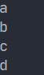
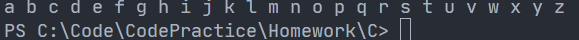
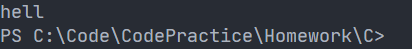
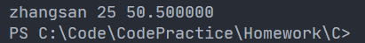
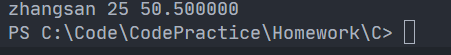

# 文件输入、输出

使用文件我们可以将数据直接存放在电脑的硬盘上，做到了数据的持久化。我们一般数据持久化的方法有，把数据存放在磁盘文件、存放在数据库等方式。

## 什么是文件

磁盘上的文件是文件。但是在程序设计中，我们谈的文件分为两种：程序文件和数据文件。（从文件功能角度来分类）

### 程序文件

包括源程序文件（后缀为 `.c`），目标文件（Windows 环境后缀为 `.obj`），可执行程序（Windows 环境后缀为 `.exe`）。

### 数据文件

> [!tip]
>
> 文件的内容不一定是程序，而是程序运行时读写的数据，比如程序运行需要从中读取数据的文件，或者输出内容的文件。

之前所处理数据的输入输出都是以终端为对象的，即从终端的键盘输入数据，运行结果到显示器上。

其实有时候我们也会把信息输出到磁盘上，当需要的时候再从磁盘上把数据读取到内存上使用，这里处理的就是磁盘上的文件。

## 文件名

一个文件要有一个唯一的文件标识，以便用户识别和引用。文件名包含 3 部分：文件路径 + 文件名主干 + 文件后缀。

例如：`C:\code\test.txt`。

为了方便起见，文件标识常被称为**文件名**。

## 文件的打开和关闭

### 文件指针

缓冲文件系统中，关键的概念是**文件类型指针**，简称**文件指针**。

每个被使用的文件都在内存中开辟了一个相应的文件信息区，用来存放文件的相关信息（如文件的名字、文件状态及文件当前的位置等）。这些信息是保存在一个结构体变量中的。该结构体是有系统声明的，取名 `FILE`。

每当打开一个文件的时候，系统会根据文件的情况自动创建一个 `FILE` 结构的变量，并填充其中的信息，使用者不必关心细节。

一般都是通过一个 `FILE` 的指针来维护这个 `FILE` 结构的变量，这样使用起来更加方便。

下面我们可以创建一个 `FILE*` 的指针变量：

```c
FILE* pf;  // 文件指针变量
```

定义 `pf` 是一个指向 `FILE` 类型数据的指针变量。可以使 `pf` 指向某个文件的文件信息区（是一个结构体变量）。通过该文件信息区中的信息就能访问该文件。也就是说，**通过文件指针变量能够找到与它相关联的文件**。

### 文件的打开和关闭

头文件为 `<stdlib.h>`。

文件在读写之前应该先**打开文件**，在使用结束之后应该**关闭文件**。

编写程序时，在打开文件的同时，都会返回一个 `FILE*` 的指针变量指向该文件，也相当于建立了指针和文件的关系。

ANSIC 规定使用 `fopen` 函数来打开文件，`fclose` 来关闭文件。

```c
// 打开文件
FILE *fopen(const char* filename, const char *mode);
// 关闭文件
int fclose(FILE *stream);
```

`mode` 指的是文件的打开模式，有：


部分正确翻译：


例如：

```c
#include <errno.h>
#include <stdio.h>
#include <string.h>

int main(void) {
  FILE *pf = fopen("test.txt", "r");
  if (pf == NULL) {
    printf("%s\n", strerror(errno));
    return 1;
  }
  fclose(pf);  // 类似 free
  pf = NULL;
  return 0;
}
```


可以看出，没有这个文件。


## 文件的顺序读取

以下的输入、输出是以内存为第一人称的，不是其他外部设备。输出指的是从内存输出进外部设备，输入指的是从外部设备输入内存。（所以是出、入）


```c
int fputc ( int character, FILE * stream );
```

```c
#include <errno.h>
#include <stdio.h>
#include <string.h>

int main(void) {
  FILE *pf = fopen("test_1.txt", "w");
  if (pf == NULL) {
    printf("%s\n", strerror(errno));
    return 1;
  }
  for (int i = 'a'; i <= 'z'; ++i) {
    fputc(i, pf);
  }
  fclose(pf);
  pf = NULL;
  return 0;
}
```


```c
int fgetc ( FILE * stream );
```

`fgetc` 函数每次读取一个字符，并将文件位置指示器向前移动一个位置。如果文件中没有更多字符可以读取，`fgetc` 会返回 `EOF`（End Of File）。

```c
#include <errno.h>
#include <stdio.h>
#include <string.h>

int main(void) {
  FILE *pf = fopen("test_1.txt", "r");
  if (pf == NULL) {
    printf("%s\n", strerror(errno));
    return 1;
  }
  int ch = fgetc(pf);
  printf("%c\n", ch);
  ch = fgetc(pf);
  printf("%c\n", ch);
  ch = fgetc(pf);
  printf("%c\n", ch);
  ch = fgetc(pf);
  printf("%c\n", ch);
  fclose(pf);
  pf = NULL;
  return 0;
}
```



这样更好理解些（打印在终端都一样）：

```c
#include <errno.h>
#include <stdio.h>
#include <string.h>

int main(void) {
  FILE *pf = fopen("test_1.txt", "r");
  if (pf == NULL) {
    printf("%s\n", strerror(errno));
    return 1;
  }
  printf("%c\n", fgetc(pf));
  printf("%c\n", fgetc(pf));
  printf("%c\n", fgetc(pf));
  printf("%c\n", fgetc(pf));
  fclose(pf);
  pf = NULL;
  return 0;
}
```

一个示例：

```c
#include <errno.h>
#include <stdio.h>
#include <string.h>

int main(void) {
  FILE *pf = fopen("test_1.txt", "r");
  if (pf == NULL) {
    printf("%s\n", strerror(errno));
    return 1;
  }
  int ch = 0;
  while ((ch = fgetc(pf)) != EOF) printf("%c ", ch);
  fclose(pf);
  pf = NULL;
  return 0;
}
```



```c
int fputs (const char * str, FILE * stream);
```

将 `str` 指向的 C 字符串写入数据流。函数从指定的地址（`str`）开始复制，直到到达终止空字符（`'\0'`）。这个终止的空字符不会被复制到数据流中。

```c
#include <errno.h>
#include <stdio.h>
#include <string.h>

int main(void) {
  FILE *pf = fopen("test_1.txt", "w");
  if (pf == NULL) {
    printf("%s\n", strerror(errno));
    return 1;
  }
  fputs("hello world", pf);
  fclose(pf);
  pf = NULL;
  return 0;
}
```


写文件时，它会把文件内容销毁，然后重新添加。因此改成 `a` 模式，便可以追加。

```c
char * fgets(char * str, int num, FILE * stream);
```

从数据流中读取字符，并将其作为 C 语言字符串存储到 `str` 中，直到 `num - 1` 个字符被读取，或者出现换行符或文件结束符，以先发生者为准。

换行符会使 `fgets` 停止读取，但函数会将其视为有效字符，并将其包含在复制到 `str` 的字符串中。

函数 `fgets` 从输入流参数中读取字符串并将其存储在字符串中。`fgets` 从当前流位置读取字符，包括第一个换行符，直到流结束，或直到读取的字符数等于 `n - 1`，以先到者为准。存储在字符串中的结果会附加一个空字符。如果读取到换行符，换行符会包含在字符串中。

```c
#include <errno.h>
#include <stdio.h>
#include <string.h>

int main(void) {
  FILE *pf = fopen("test_12_23.txt", "r");
  if (pf == NULL) printf("%s\n", strerror(errno));
  char arr[20] = {0};
  fgets(arr, 5, pf);
  printf("%s\n", arr);
  fclose(pf);
  pf = NULL;
  return 0;
}
```

因此虽然指定了 5 个，最后也只有 4 个，因为最后一个要放换行符。



读取失败或遇到文件末尾会返回一个空指针。

**扩展**：

`perror` 函数可替代 `scanf("%s\n", strerror(errno));`。

```c
void perror(const char * str);
```

打印错误信息。将 `errno` 的值解释为错误信息，并将其打印到 `stderr`（标准错误输出流，通常是控制台），可选择在其前面加上 `str` 中指定的自定义信息。

`errno` 是一个积分变量，其值描述了调用库函数时产生的错误条件或诊断信息（C 标准库的任何函数都可以设置 `errno` 值，即使没有在本引用中明确指定，也即使没有发生错误），更多信息请参阅 `errno`。

`perror` 产生的错误信息与平台有关。

如果参数 `str` 不是空指针，则打印 `str` 后的冒号（`:`）和空格。然后，无论 `str` 是否是空指针，都会打印出生成的错误描述，后面跟一个换行符（`'\n'`）。

`perror` 应在错误发生后立即调用，否则会被其他函数的调用覆盖。

```c
#include <errno.h>
#include <stdio.h>
#include <string.h>

int main(void) {
  FILE *pf = fopen("test_12_23.txt", "r");
  if (pf == NULL) perror("");
  char arr[20] = {0};
  fgets(arr, 20, pf);
  printf("%s\n", arr);
  fclose(pf);
  pf = NULL;
  return 0;
}
```

输出与原来的相同。当然，也可以 `perror("fopen");`，来表示错误信息出于何处。有：


自动添加冒号。但是它会自动打印，如果只想拿到错误信息，就使用 `strerror` 即可。

```c
int fprintf(FILE *stream, const char *format [, argument ]...);
```

```c
#include <stdio.h>

typedef struct Stu {
  char arr[10];
  int age;
  float score;
} Stu;

int main(void) {
  Stu s = {"zhangsan", 25, 50.5f};
  FILE* pf = fopen("test_12_23.txt", "w");
  if (pf == NULL) {
    perror("fopen");
    return 1;
  }
  fprintf(pf, "%s %d %f", s.arr, s.age, s.score);
  fclose(pf);
  return 0;
}
```

```c
int fscanf( FILE *stream, const char *format [, argument ]... );
```

```c
#include <stdio.h>

typedef struct Stu {
  char arr[10];
  int age;
  float score;
} Stu;

int main(void) {
  Stu s = {"zhangsan", 25, 50.5f};
  FILE* pf = fopen("test_12_23.txt", "r");
  if (pf == NULL) {
    perror("fopen");
    return 1;
  }
  fscanf(pf, "%s %d %f", s.arr, &(s.age), &(s.score));
  printf("%s %d %f\n", s.arr, s.age, s.score);
  fclose(pf);
  return 0;
}
```



**扩展**：

打开文件时，会返回一个 `FILE*` 的指针，这个值可以称为文件流。

但是使用 `printf` 和 `scanf` 时，不用打开或者关闭，为什么？因为 C 程序运行起来后，会默认打开三个流：

- `FILE* stdin`：标准输入流（键盘）
- `FILE* stdout`：标准输出流（屏幕）
- `FILE* stderr`：标准错误流（屏幕）

因此可以用 `fprintf(stdout, "%s %d %f\n", s.arr, s.age, s.score);` 代替 `printf` 语句。

类似的函数：

- `sscanf`
- `sprintf`

它们第一个参数所指向的指针是字符串。

`scanf` 是针对标准输入的格式化输出语句；`printf` 是针对标准输出的格式化输出语句；`fscanf` 是针对所有输出流的格式化输入语句；`fprintf` 是针对所有输出流的格式化输出语句；`sscanf` 从一个字符串中转换出一个格式化的数据；`sprintf` 是把一个格式化的数据转换成字符串。

```c
size_t fwrite(const void *buffer, size_t size, size_t count, FILE *stream);
```

- `buffer`：要写入数据的指针

- `size`：项目大小（字节）

- `count`：要写入的项目的最大数目
- `stream`：指向 `FILE` 结构的指针

```c
#include <stdio.h>
#include <stdlib.h>

int main() {
    FILE *file;
    char data[] = "Hello, fwrite!";

    // 以二进制写入方式打开文件，如果文件不存在则创建，如果文件已存在则清空文件内容
    file = fopen("output.txt", "wb");
    if (file == NULL) {
        fprintf(stderr, "无法打开文件\n");
        return 1;
    }

    // 将数据写入文件
    fwrite(data, sizeof(char), sizeof(data), file);

    // 关闭文件
    fclose(file);

    printf("数据已写入到文件中\n");

    return 0;
}

```


类似的（需要注意的是，它的返回值为正确读取的个数）：

```c
size_t fread(void *buffer, size_t size, size_t count, FILE *stream);
```

```c
#include <stdio.h>

typedef struct Stu {
  char arr[10];
  int age;
  float score;
} Stu;

int main(void) {
  Stu s = {0};
  FILE* pf = fopen("test_12_23.txt", "rb");
  if (pf == NULL) {
    perror("fopen");
    return 1;
  }
  fread(&s, sizeof(Stu), 1, pf);
  printf("%s %d %f\n", s.arr, s.age, s.score);
  fclose(pf);
  pf = NULL;
  return 0;
}
```



## 文件的随机读写

### `fseek`

因为 `fgetc` 是根据文件指针来读取字符的，所以想要读取指定的字符，就要指定文件指针到指定位置。

> [!tip]
>
> 根据文件指针的位置和偏移量来定位文件指针。

```c
int fseek(FILE *stream, long int offset, int orignal);
```

**将文件指针移动到指定位置。**

如果成功，`fseek` 返回 0。否则，返回一个非零值。 在无法寻址的设备上，返回值是未定义的。

- `offset`：偏移量
- `orignal`：文件指针的起始位置

- `SEEK_CUR`：文件指针的当前位置
- `SEEK_END`：文件结束
- `SEEK_SET`：文件开始

例子：

```c
#include <stdio.h>
#include <stdlib.h>

int main(void) {
  FILE *pf = fopen("test_12_23.txt", "r");

  if (pf == NULL) {
    perror("fopen");
    return 1;
  }

  fseek(pf, 2, SEEK_SET);
  int ch = fgetc(pf);
  printf("%c\n", ch);

  return 0;
}
```


### `ftell`

返回文件指针相对于起始位置的偏移量。

```c
long int ftell(FILE *stream);
```

例子：

```c
#include <stdio.h>
#include <stdlib.h>

int main(void) {
  FILE *pf = fopen("test_12_23.txt", "r");

  if (pf == NULL) {
    perror("fopen");
    return 1;
  }

  fseek(pf, 2, SEEK_SET);
  int ch = fgetc(pf);
  printf("%c\n", ch);
  printf("%d\n", ftell(pf));

  fclose(pf);
  pf = NULL;

  return 0;
}
```


因为已经读取了一个字符，所以是 `3`。

### `rewind`

使文件指针回到文件的初始位置。

```c
void rewind(FILE *stream);
```

## 文本文件和二进制文件

根据数据的组织形式，数据文件被称为**文本文件**或**二进制文件**。

数据在内存中以二进制的形式存储，如果不加转换输出到外存，就是 **二进制文件**。

如果要求在外存上以 ASCII 码的形式存储，则需要在存储前转换。以 ASCII 字符的形式存储的文件就是**文本文件**。

字符一律以 ASCII 形式存储，数值型数据既可以用 ASCII 形式存储，也可以使用二进制形式存储。

如有整数 10000，如果以 ASCII 码的形式输出到磁盘，则磁盘中占用 5 个字节（每个字符一个字节），而二进制形式输出，则在磁盘上只占 4 个字节（VS2013 测试）。


## 文件读取结束的判定

### 被错误使用的 `feof`

`feof` 是用来判断是否是读到文件末尾结束，`ferror` 是用来判断是否是因为读取错误而结束。

该函数接受一个指向 `FILE` 对象的指针作为参数，并返回一个非零值表示文件流已到达文件结尾，否则返回 0。

牢记：在文件读取过程中，不能用`feof`函数的返回值直接用来判断文件的是否结束。

而是应用于当文件读取结束的时候，判断是读取失败，还是遇到文件尾结束。

1. 文本文件读取是否结束，判断返回值是否为 `EOF`（`fgetc`），或者 `NULL`（`fgets`）；例如：

   - `fgetc` 判断是否为 `EOF`。
   - `fget` 是判断返回值是否为 `NULL`。

2. 二进制文件的读取结束判断，判断返回值是否小于实际要读的个数；例如，`fread` 判断返回值是否小于实际要读的个数

`ferror` 函数是 C 语言中的一个标准库函数，用于检测文件流的错误指示器；它的原型如下：

```c
int ferror(FILE *stream);
```

该函数接受一个指向 `FILE` 对象的指针作为参数，并返回一个非零值表示文件流发生了错误，否则返回 0。

在 C 语言中，文件流通常通过 `fopen` 函数打开，然后使用各种输入/输出函数进行读写操作。当文件流发生错误时，比如读取或写入失败，可以使用 `ferror` 函数来检查错误状态。

```c
#include <stdio.h>
#include <stdlib.h>

int main(void) {
  int c = 0;  // 注意：int，非 char，要求处理 EOF
  FILE *fp = fopen("test.txt", "r");

  if (!fp) {
    perror("File opening failed");
    return EXIT_FAILURE;
  }

  // fgetc 当读取失败或遇到文件结束的时候，都会返回 EOF
  while ((c = fgetc(fp)) != EOF) putchar(c);  // 标准 C I/O 读取文件循环

  // 判断是什么原因结束的
  if (ferror(fp)) {
    puts("I/O error when reading");
  } else if (feof(fp)) {
    puts("End of fiel reached successfully");
  }

  fclose(fp);
  fp = NULL;

  return 0;
}
```

```c
#include <stdio.h>

enum { SIZE = 5 };

int main(void) {
  double a[SIZE] = {1.0, 2.0, 3.0, 4.0, 5.0};
  FILE *fp = fopen("test_12_27.bin", "wb");  // 必须用二进制模式
  fwrite(a, sizeof *a, SIZE, FP);  // 写 double 的数组
  fclose(fp);

  double b[SIZE] = {0.0};
  fp = fopen("test_12_27.bin", "rb");
  size_t ret_code = fread(b, sizeof(*b), SIZE, fp);  // 读 double 的数组
  if (ret_code == SIZE) {
    puts("Array read successfully, contents: ");
    for (int i = 0; i < SIZE; ++i) printf("%f ", b[n]);
    putchar('\n');
  } else {
    if (feof(fp)) {
      printf("Error reading test.bin: unexpected end of file\n");
    } else if (ferror(fp)) {
      perror("Error reading test.bin");
    }
  }

  fclose(fp);

  return 0;
}
```

## 文件缓存区

ANSIC 标准采用“缓冲文件系统”处理的数据文件的，所谓缓冲文件系统是指系统自动地在内存中为程序中每一个正在使用的文件开辟一块“文件缓冲区”。从内存向磁盘输出数据会先送到内存中的缓冲区，装满缓冲区后才一起送到磁盘上。如果从磁盘向计算机读入数据，则从磁盘文件中读取数据输入到内存缓冲区（充满缓冲区），然后再从缓冲区逐个地将数据送到程序数据区（程序变量等）。缓冲区的大小根据 C 编译系统决定的。

可以提高操作系统的效率。

```c
#include <stdio.h>

int main(void) {
  int a = 10000;
  FILE *pf = fopen("test.txt", "wb");
  fwrite(&a, 4, 1, pf);  // 系统调用，操作系统提供的接口
  fclose(pf);
  pf = NULL;
  return 0;
}
```


在 `fclose` 关闭文件后，缓冲区的内容会自动读进文件。

而流（`stream`）是一种设计思想，在写文件时，仅把数据写入流中，而具体的读取有 C 语言底层实现。

```c
#include <stdio.h>
#include <windows.h>

int main(void) {
  FILE *pf = fopen("test_12_27.txt", "w");
  fputs("abcded", pf);
  printf("睡眠 10 秒-已经写数据了,打开 test.txt 文件发现文件没有内容\n");
  Sleep(10000);
  printf("刷新缓冲区\n");
  fflush(pf);  // 刷新缓冲区时，才将输入缓冲区的数据写到文件（磁盘）
  fclose(pf);  // 注：fclose 在关闭文件的时候，也会刷新缓冲区
  pf = NULL;
  return 0;
}
```

**结论**：

因为有缓冲区的存在，C 语言在操作文件的时候，需要做刷新缓冲区或者在文件操作结束的时候关闭文件。如果不做，可能导致读写文件的问题。
