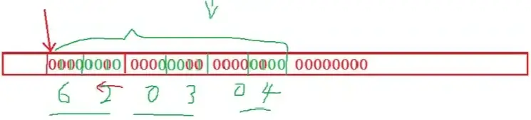

# 结构和其他数据形式

## 结构体

### 结构的基础知识

结构是一些值的集合，这些值被称为成员变量。结构的每个成员都可以是不同类型的变量。

### 结构的声明

举例：

```c
struct Peo {
  char name[20];
  char tele[12];
  char sex[5];
  int high;
};  // 声明的结构体类型 Peo

```

语法支持，可以添加变量：

```c
// p1，p2 是使用该结构体创建的变量
// 此时这两个变量为全局变量，因此还是使用上一种方法
struct Peo {
  char name[20];
  char tele[12];
  char sex[5];
  int high;
} p1, p2;
```

### 结构成员的类型

结构的成员可以是标量、数组、指针，甚至是其他结构体。如：

```C
struct Peo {
  char name[20];
  char tele[12];
  char sex[5];
  int high;
};

struct St {
  struct Peo p;
  int num;
  float f;
};
```

### 结构体变量的定义和初始化

有了结构体变量，那么如何定义变量，其实很简单。

```c
struct Peo  // 这是类型不是变量
{
  char name[20];
  char tele[12];
  char sex[5];
  int high;
} p1, p2;
struct Peo p3, p4;  // 两种创建结构体变量的方式
```

```c
// 结构体变量的创建和初始化
int main(void) {
  struct Peo p1 = {"张三", "13905162347", "男", 178};
  return 0;
}
```

而对于嵌套的结构体，有：

```c
int main(void) {
  struct St p2 = {{"张三", "13905162347", "男", 178}, 100, 3.14f};

  return 0;
}  // 在大括号里再加一个大括号来初始化被嵌套的结构体
```

可以这样初始化：

```c
struct Student stu = {0};
```

## 结构体成员的访问

结构体变量是通过点操作符 `.` 访问的，左边是结构体变量，右边是结构体成员。点操作符接受两个操作数。

如想要打印，有以下格式：

```c
int main(void) {
  struct Peo p1 = {"张三", "13905162347", "男", 178};
  struct St p2 = {{"张三", "13905162347", "男", 178}, 100, 3.14f};

  printf("%s %s %s %d\n", p1.name, p1.tele, p1.sex, p1.high);
  printf("%s %s %s %d %d %f\n", p2.p.name, p2.p.tele, p2.p.sex, p2.p.high,
         p2.num, p2.f);

  return 0;
}
```

打印结果为：


另一种访问方式 `->`，左边是结构体指针，右边是结构体成员：

```c
void print(struct Peo *p) {
  printf("%s %s %s %d\n", p->name, p->tele, p->sex, p->high);
}

int main(void) {
  struct Peo p1 = {"张三", "13905162347", "男", 178};

  print(&p1);

  return 0;
}
```

这是结构体指针访问结构体成员的方法。

## 结构体传参

```c
#include <stdio.h>

void print1(struct Peo *p) {
  printf("%s %s %s %d\n", p->name, p->tele, p->sex, p->high);
}

void print2(struct Peo p) {
  printf("%s %s %s %d\n", p.name, p.tele, p.sex, p.high);
}

int main(void) {
  struct Peo p1 = {"张三", "13905162347", "男", 178};

  print1(&p1);
  print2(p1);

  return 0;
}
```

如上述代码，这就是传参的方式：一种传结构体本身，一种传结构体指针。而 `print2` 的方式，当结构体内容较大时，复制一份形参浪费的空间就会比较多，时间比较长。因此主要采用 `print1` 的方式。

## 自定义类型：结构体、枚举、联合

### 结构体

#### 结构的基本知识

结构是一些值的集合，这些值被称为成员变量。结构的每个成员可以是不同类型的变量。

#### 结构的声明

```c
struct tag {
  member-list;
} variable-list;
```

#### 特殊的声明

```c
// 匿名结构体类型
struct {
  member-list;
} s1;
// 匿名结构类型只能使用一次，即在创建该类型的时候再创建变量
```

例子：

```c
#include <stdio.h>

struct {
  int a;
} x;

struct {
  int a;
} *p;

int main(void) {
  p = &x;
  // 这样是不行的，因为编译器认为上面两种匿名结构体类型不是同一个
  // 即使它们里面成员的类型一样
  return 0;
}
```

#### 结构体自引用

通过一个元素找到下一个元素：


错误案例：

```c
struct Note {
  int date;
  struct Note next;
};
// 看似合理，但是结构体的大小不定
// sizeof(struct Note) == ?
```

正确案例：

```c
struct Note {
  int date;  // 数据域
  struct Note* next;  // 指针域
};
// 正确的定义方式
```

重名名案例 1：

```c
typedef struct Note {
  int data;
  struct Note *next;
} Note;

int main(void) {
  struct Note s1;  // 两种写法等价，因为被重命名
  Note s2;

  return 0;
}
```

重命名案例 2：

```c
// 1
typedef struct Note {
  int data;
  struct Note *next;  // 不能用新的别名
} *linklist;
// 2
struct Note {
  int date;  // 数据域
  struct Note* next;  // 指针域
};
typedef struct Note *linklist;
// 上下等价，而且第一个即定义了一个结构体类型，又重命名了一个指针
```

#### 结构体变量的定义和初始化

有了结构体类型，定义变量的方法。

```c
struct Point {
  int x;
  int y;
} p1 = {2, 3};

struct Stu {
  char name[20];
  int age;
  struct Sco s;
};

struct Sco {
  int n;
  char ch;
};

int main(void) {
  int i = 0;
  struct Point p2 = {3, 4, {3, "hello"}};
  struct Stu s1 = {"张三", 29};
  return 0;
}
```

#### 结构体内存对齐

```c
#include <stdio.h>

struct S1 {
  char c1;
  int i;
  char c2;
};

struct S2 {
  char c1;
  char c2;
  int i;
};

int main(void) {
  printf("%d\n", sizeof(struct S1));
  printf("%d\n", sizeof(struct S2));
  return 0;
}
```


**结构体的对齐规则**：

1. 第一个成员在结构体变量偏移量为 0 的地址处。

2. 其他成员变量要对齐到某个数字（对齐数）的整数倍的地址处。

   `对齐数 = 编译器默认的一个对齐数与该成员大小的较小者`

   - VS 中默认的值为 8。
   - `gcc`（以及其他编译器）没有默认对齐数，就是成员的自身大小（除了嵌套的结构体），对于数组，其对齐数为数组内元素的对齐数，于嵌套结构体类似（与数组类型无关，与元素类型有关）`char arr[3]` 被当成 `char c1; char c2; char c3;` 来计算。

3. 结构体总大小为最大对齐数（每个成员变量都有一个对齐数）的整数倍。

4. 如果嵌套了结构体的情况，嵌套的结构体对齐到自己的最大对齐数的整数倍处，结构体的整体大小就是所有最大对齐数（含嵌套结构体的对齐数）的整数倍。


```c
#include <stdio.h>

struct S3 {
  double d;
  char c;
  int i;
};

struct S4 {
  char c1;  // 偏移量为 0
  struct S3 s;  // 嵌套的结构体，其最大对齐数为 8，那就对齐到偏移量为 8 的整数倍,可以把结构体拆开看
  double d;  // 对齐数为 8，对齐到 8 的整数倍
};

int main(void) {
  printf("%d\n", sizeof(struct S3));
  printf("%d\n", sizeof(struct S4));
  return 0;
}
```

数据结构（尤其是栈）应该尽可能地在自然边界上对齐。原因在于，为了访问未对齐的内存，处理器需要作两次内存访问；而对齐的内存仅需要进行一次访问。（32 位的机器，CPU 读取一次数据 4 个字节；64 位的机器，读取一次数据 8 个字节）

因此在定义结构体类型将小的类型集中到一起。因此 S2 优于 S1。

可以修改默认对齐数：

```c
#include <stdio.h>

#pragma pack(4)  // 修改默认对齐数为 4

struct S {
  int i;  // 此时以对齐数 4 来设置
  double d;
};

#pragma pack()  // 初始化到原来的状态

int main(void) {
  printf("%d\n", sizeof(struct S));
  return 0;
}
```

如果不对齐的话，就是 `#pragma pack(1)`。

#### 有意思的东西

```c
#include <stdio.h>
struct str {
  int len;
  char s[0];
};

struct foo {
  struct str* a;
};

int main(int argc, char** argv) {
  struct foo f = {0};
  if (f.a->s) {
    printf("%x\n", f.a->s);
  }
  return 0;
}
```

须知，在 gcc 编译器下，`NULL` 为 0；之所以用空指针访问结构体成员不会报错，因为对于结构体来说，访问其成员就是加上成员的偏移量（可知已经被赋值为 0 了）。所以根据内存对齐的相关知识，会打印出：


所以不管结构体的实例是什么，访问它的成员就是加上相应成员的偏移量，而之所以 `f.a->s` 不会报错，因为它没有真是占据一块内存空间，并没有实际的访问。类似的：

```c
#include <stdio.h>

struct test {
  int i;
  short c;
  char *p;
  char s[10];
};

int main(void) {
  struct test *pt = NULL;
  printf("&s = %x\n", pt->s);  // 等价于 printf("%x\n", &(pt->s));
  printf("&i = %x\n", &pt->i);  // 因为操作符优先级，我没有写成 &(pt->i)
  printf("&c = %x\n", &pt->c);
  printf("&p = %x\n", &pt->p);
  return 0;
}
```

但是，将 `char s[0]` 改为 `char *s`，便会：


因为当我们尝试访问一个未初始化的指针所访问的内存空间。（上述的柔性数组没有实际的内存空间，所以无所谓访问）

而上面代码只打印了地址，而没有进行解引用，所以没报错。

#### 例题

```c
#include <stddef.h>
#include <stdio.h>

struct S {
  char c1;
  int i;
  char c2;
};

int main(void) {
  struct S s = {0};
  printf("%d\n", offsetof(struct S, c1));
  printf("%d\n", offsetof(struct S, i));
  printf("%d\n", offsetof(struct S, c2));
  return 0;
}
```


模拟实现上面可以计算偏移量的函数。

```c
#define OFFSETOF(TYPE, M_NAME) (size_t) & (((TYPE*)0)->M_NAME)
```

### 位段

#### 何为位段

1. 位段的成员必须是 `int`、`unsigned int` 或 `signed int`（也可以是 `char`）。

2. 位段的成员名后边有一个冒号和一个数字。

例如：

```c
struct A {
  int _a : 2;
  int _b : 5;
  int _c : 10;
  int _d : 30;
};
```

后面代表这个成员只需要相应的 bit 位（1 个字节 8bit），比如用 `flag` 代表真假只需要 1 个位段，需要表示一个二位的二进制数，只需要 2 个位段。

#### 位段的内存分配

1. 位段的成员可以是 `int`、`unsigned int`、`signed int` 或者是 `char`（属于整形家族）类型。
2. 位段的空间上是按照需要以 4 个字节（`int`）或者 1 个字节（`char`）的方式来开辟的。
3. 位段涉及很多不确定因素（**原来占不下的位是先用原来剩下的空间，还是用新开辟的空间**），位段是不跨平台的，注重可移植的程序应该避免使用位段。

```c
struct A {
  int _a : 2;
  int _b : 5;
  int _c : 10;
  int _d : 30;
  // 4byte 不够，再来 4byte
};
```

> [!tip]
>
> 冒号后面的数值大小不能超过前面数据类型的大小。

```c
#include <stdio.h>

struct A {
  int a : 3;
  int b : 4;
  int c : 5;
  int d : 4;
};

int main(void) {
  struct S s = {0};
  s.a = 10;
  s.b = 12;
  s.c = 3;
  s.d = 4;
  return 0;
}
```

开辟时，是在一个字节中从右往左（从高到低）存（不要错认为是大小端字节序，因为它一次开辟一个字节），最左边的那个可能会被浪费。（虽然如此，此仅为 VS 的状况，并不能表示一定从左向右或从右向左）。



同时，由于 `int` 等类型在 16 位、32 位等平台占用的字节不同，跨平台性差。

### 枚举

枚举顾名思义就是——列举。

把可能的取值一一列举。

比如我们现实生活中：

- 一周的星期一到星期日是有限的 7 天，可以一一列举。

- 性别有男、女、保密，也可以一一列举。

- 月份有 12 个月，也可以一一列举。

这里就可以使用枚举了。

#### 枚举的定义

```c
enum Day { Mon, Tues, Wed, Thur, Fri, Sat, Sun };

enum Sex { MALE, FAMALE, SERCET };
```

```c
#include <stdio.h>

enum Day { Mon, Tues, Wed, Thur, Fri, Sat, Sun };
// 枚举类型将可能的取值列出

int main(void) {
  enum Day d = Fri;
  // 这里面的值只能是枚举常量的可能取值

  printf("%d\n", Mon);
  printf("%d\n", Tues);
  printf("%d\n", Wed);

  return 0;
}
```


可以看出枚举常量也是有值的，且默认按顺序从 0 开始，每次加 1。

将代码修改为下述情况：

```c
#include <stdio.h>

enum Day { Mon = 1, Tues, Wed, Thur, Fri, Sat, Sun };
// 枚举类型将可能的取值列出

int main(void) {
  enum Day d = Fri;
  // 这里面的值只能是枚举类型中的可能取值，明确指出了其为该类型的变量
  int d = Fri;  // 这个不能体现 d 是枚举常量

  printf("%d\n", Mon);
  printf("%d\n", Tues);
  printf("%d\n", Wed);

  return 0;
}
```


便可以从 1 开始。

当然，你也可以这样：

```c
#include <stdio.h>

enum Day { Mon = 1, Tues = 3, Wed = 5, Thur, Fri, Sat, Sun };  // 枚举常量在被赋值初始值后不能被修改
// 枚举类型将可能的取值列出，这些值叫做枚举常量

int main(void) {

  printf("%d\n", Mon);
  printf("%d\n", Tues);
  printf("%d\n", Wed);
  printf("%d\n", Thur);

  return 0;
}
```


匿名枚举类型可以重命名。

#### 枚举的优点

枚举的优点：

1.  增加代码的可读性和可维护性。

2.  和 `#define` 定义的标识符比较枚举有类型检查，更加严谨。

需要注意的是在 C 语言编译器（不严谨）中 `enum Day d = 5` 不会报错（即使 5 是整形而不是 `enum` 类型）,而在 C++ 中不行。

3.  防止了命名污染（封装）。

4.  便于调试；与 `#define` 在代码预处理阶段会将相应的替换，而这个就不会；因此前者不便于调试。

5.  使用方便，一次可以定义多个常量。

#### 枚举的使用

```c
// 颜色
enum Color { RED = 1, GREEN = 2, BLUE = 4 };
enum Color clr = GREEN;  // 只能拿枚举常量给枚举变量赋值，才不会出现类型的差异。
clr = 5;                 // 错误的
```

### 联合（共用体）

#### 联合体的定义

联合也是一种特殊的自定义类型 这种类型定义的变量也包含一系列的成员，特征是这些成员公共用同一块空间（所以联合也叫共用体）。

```c
#include <stdio.h>

union Un {
  int a;
  char c;
};

struct St {
  int a;
  char c;
};

int main(void) {
  printf("%zu\n", sizeof(union Un));
  return 0;
}
```


发现它的大小是一个整形。

再执行下面这段代码：

```c
#include <stdio.h>

union Un {
  int a;
  char c;
};

struct St {
  int a;
  char c;
};

int main(void) {
  union Un u;
  printf("%zu\n", sizeof(union Un));
  printf("%p\n", &u);
  printf("%p\n", &(u.a));
  printf("%p\n", &(u.a));
  return 0;
}
```


发现它们打印出来的地址居然一样，可以看出它们共用同一块内存空间。

#### 联合体的特点

联合的成员是共用同一块内存空间的，这样一个联合变量的大小，至少是最大成员的大小。（因为联合至少得有能力保存最大的那个成员）

```c
#include <stdio.h>

union Un {
  int a;
  char c;
};

int main(void) {
  union Un u;
  u.a = 0x11223344;
  printf("%p\n", u.a);
  u.c = 0x00;
  printf("%p\n", u.a);
  return 0;
}
```


可以看出已经改变了，此时可以解决大小端字节序的问题。

原来的：

```c
#include <stdio.h>

int checkSys(void) {
  int a = 1;

  return *(char *)&a;
}

int main(void) {
  printf(checkSys() ? "小端\n" : "大端\n");
  return 0;
}
```

新的：

```c
#include <stdio.h>

int checkSys(void) {
  union Un {
    char c;
    int a;
  } u;  // 定义一个联合体变量
  u.c = 1;  // 将其中的 c 赋值为 1
  return u.a;  // 由于它们两个共用一块空间，就可以看这些变量是怎么存在内存中的
}

int main(void) {
  printf(checkSys() ? "小端\n" : "大端\n");
  return 0;
}
```

因为这个联合体只使用一次，所以类似的，可以像结构体一样，定义一个匿名联合体。

更好的：

```c
#include <stdio.h>

int checkSys(void) {
  union {  // 匿名的联合体
    char c;
    int a;
  } u;
  u.c = 1;
  return u.a;
}

int main(void) {
  printf(checkSys() ? "小端\n" : "大端\n");
  return 0;
}
```

#### 联合体大小的计算

```c
#include <stdio.h>

union Un {
  char arr[5];
  int i;
};

int main(void) {
  printf("%d\n", sizeof(union Un));
  return 0;
}
```


对于联合体，也存在**内存对齐**，对于 `char arr[5]`，它的最大对齐数是 1（每个元素每个元素看），因此根据对齐，最后浪费了三个字节的空间（没有使用）。最后联合体的大小为最大对齐数的整数倍（刚好能容纳下）。

```c
#include <stdio.h>

int main(void) {
  union {
    short k;
    char i[2];
  } *s, a;
  s = &a;
  s->i[0] = 0x39;
  s->i[1] = 0x38;
  printf("%x\n", a.k);

  return 0;
}
```


同时需要注意的是，因为 `0x39` 存储两个 16 进制数字，每个数字占 4 个 bit 位，所以这个数刚好占一个 `char` 类型大小的量。
