# 词法分析

## 词法分析概念

**词法分析的任务**：从左至右逐个字符地对源程序进行扫描，产生一个个单词符号（token）。

词法分析器（Lexical Analyzer）又称扫描器（Scanner）：执行词法分析的程序。

词法扫描器输入的**是源代码，本质是字符串**。

输出的是**单词符号串**。

### 程序源代码中可能出现的语法元素

- **关键字**：如 `while`、`if`、`int`……
- **标识符**——表示各种名字：如变量名、数组名、标号名、过程名、函数名等等。
- **常数**：各种类型的常数。
- **运算符**：`+`、`-`、`*`、`/`、`(`、`)`……
- **界符**：逗号，分号，冒号……
- **空白符**：空格、制表符、换行符……
- **注释**。

### 剔除空白和注释

大部分语言都允许词法单元之间出现任意数量的**空白**。空白除了分隔的含义对后续语法分析没有作用，可以考虑在词法扫描阶段剔除它们。

**注释**本身不是有用的编译信息，但都有固定的格式，因此也可以考虑在词法扫描阶段去除。

### 预读

在词法扫描器的处理过程中需要**预读**一些字符来进行单词记号的判断。

例如：在 C 语言中如果当前读取的字符为 `>`，那么并不能确定该输出的单词记号就是 `>`，因为若下一个记号是 `=`，那么就应该输出 `>=`，如果下一个记号为 3，那么输出 `>`，但是词法扫描器就多读了一个字符。

通用的做法是**使用输入缓冲区**。词法扫描器可以从缓冲区中取出字符，也可以把字符返回去。

### 词法扫描器的结构

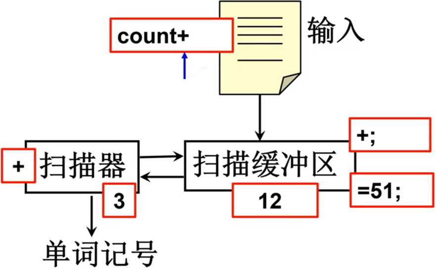

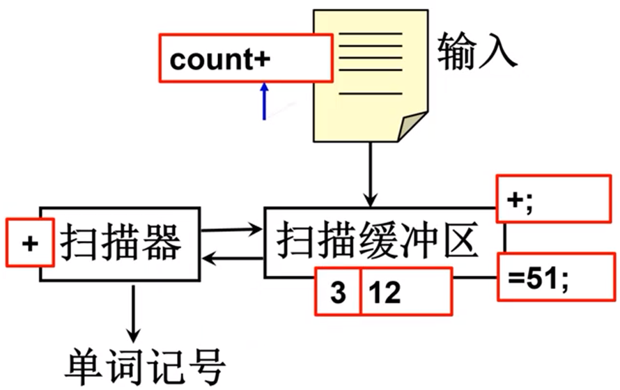

### 单词记号的表示形式

常见的单词符号的表示形式：`(单词种别,  单词自身的值)`。

单词种类通常用整数编码表示（枚举）。

若一个种别只有一个单词符号，则种别编码就代表该单词符号。

一般关键字、运算符和界符都是一符一种。

---

若一个种别有多个单词符号，则对于每个单词符号，给出种别编码和自身的值。

- **标识符**单列一种；标识符自身的值表示按机器字节划分的内部码。
- **常数**按类型（整、实、布尔等等）分种；常数的值则表示成标准的二进制形式。

词法扫描结果示例：

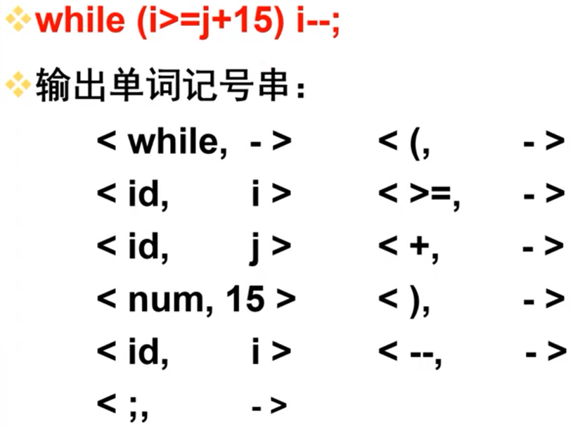

相关数据结构示例：

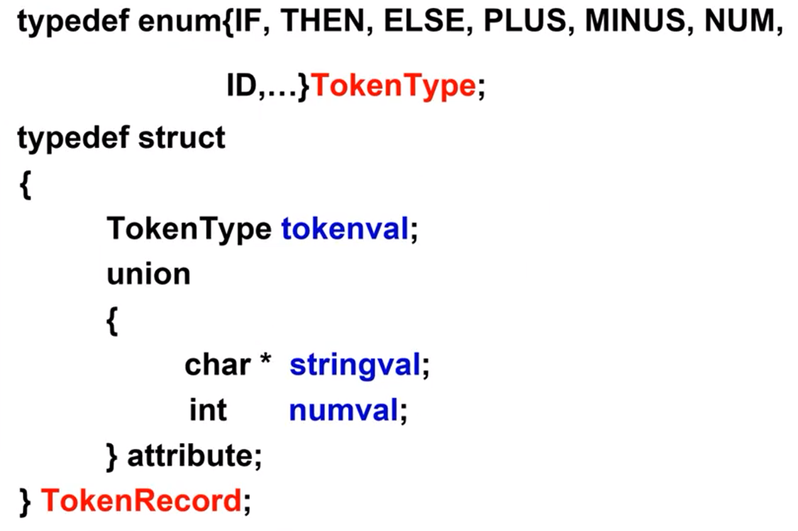

### 词法分析器作为一个独立子程序

词法分析是作为一个独立的阶段，是否应当将其处理为一遍呢？

- **作为独立阶段的优点**：结构简洁、清晰和条理化，有利于集中考虑词法分析一些枝节问题。
- **不作为一遍的优点**：将其处理为一个子查询，减少资源开销。

### 词法分析器作为一个接口被语法分析调用

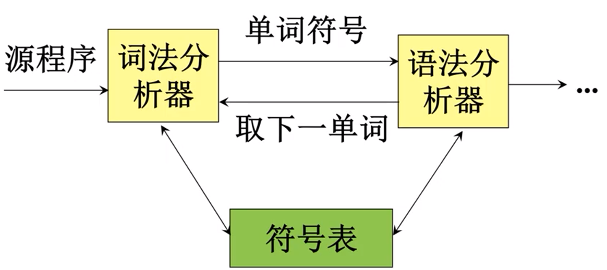

### 需要输出的单词记号

- **关键字识别**：程序语言规定的保留字。
- **标识符识别**：记录标识符的字符串。
- **常数识别**：识别出算术常数并将其转变为二进制内码表示。
- **算符和界符的识别**：记录类别，主要涉及把多个字符复合而成的算符和界符拼合成一个单一单词符号；`:=`、`++`、`--`、`>=`。

### 最长子串原则

在涉及到标识符和算符的结束判定时通常采用**最长子串原则**。

思考：扫描串 `int sum1= 3;` 你为什么会认为 `sum1` 是一个标识符？而非 `s`、`su`、`sum`？

思考：扫描串 `a++`；你为什么认为 `++` 是一个自增运算符而非两个加法运算符？

**当输入串的多个前缀与一个或多个模式匹配时，总是选择最长的前缀进行匹配。**

### 几点说明

- 所有关键字都是保留字；用户不能用它们作为自己的标识符。
- 关键字作为特殊的标识符来处理；不用特殊的状态图来识别，只要查保留字表。
- 若关键字、标识符和常数（或标号）之间没有确定的运算符或界符作间隔，则必须使用一个空白符作间隔。例如：`D099K =1,10` 要写为 `DO 99 K = 1,10`。

## 语言运算

### 语言上的运算

- **字母表** $\Sigma$ 是一个**有穷**符号集合。
- **符号**：字母、数字、标点符号……

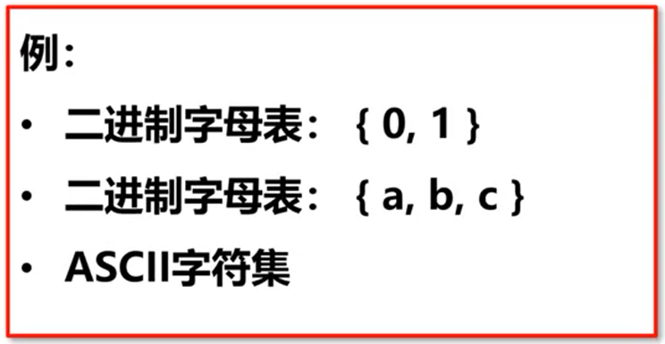

### 字

**字母表**中的每一个元素称为一个**字符**。

字母表上的**字**（也叫**字符串**）是指字母表中的字符所构成的一个有穷序列。

- 不包含任何字符的序列称为**空字**，即为 $\varepsilon$。
- 用 $\Sigma^*$ 表示 $\Sigma$ 上的所有字的全集，包含空字 $\varepsilon$。
- 例如：$\Sigma = \{a, b\}$，则 $\Sigma^* = \{\varepsilon, a, b, aa, ab, ba, bb, aaa...\}$。

$\Sigma^*$ 的子集 U 和 V 的**并运算**定义为：
$$
U \cup V = \{\alpha | \alpha \in U 或 \alpha \in V\}
$$
例如：

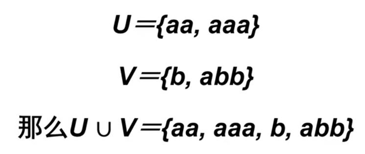

$\Sigma^*$ 的子集 U 和 V 的**连接（积）**定义为：
$$
UV = \{\alpha \beta | \alpha \in U \& \beta \in V \}
$$
例如：

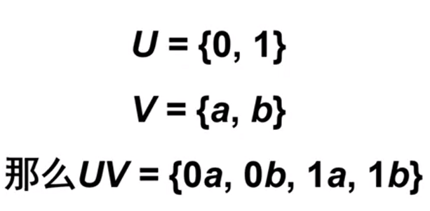

V 自身的 **n 次积**记为 $V^n = VV...V$。规定 **$V^0 = \{\varepsilon\}$**，令 $V^* = V^0 \cup V^1 \cup V^2 \cup V^3...$，称 $V^*$ 是 V 的**闭包**；记 $V^+ = VV^*$，称 $V^+$ 是 $V$ 的**正闭包**。

例如：

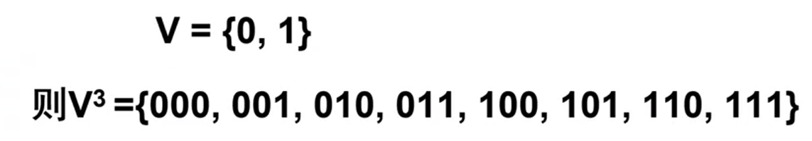

$V^n$ 就是字母表上长度为 n 的符号串构成的集合。

---

$V^*$ 就是字母表上所有字的全集合。

例如：

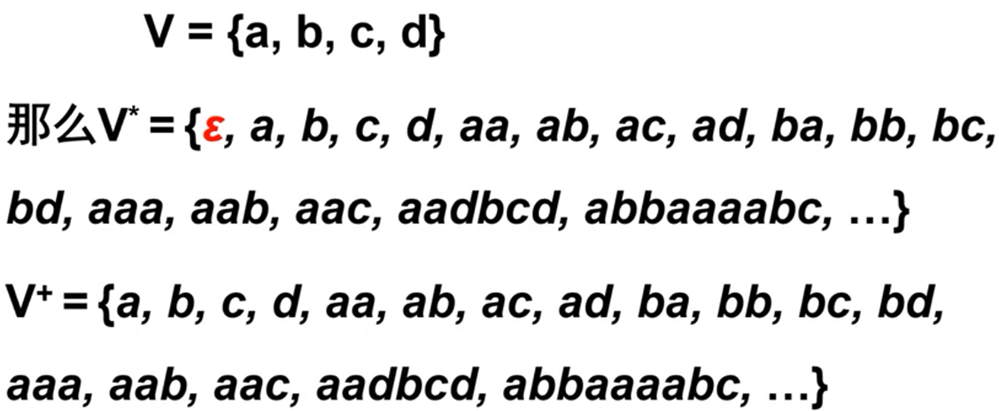

### 练习

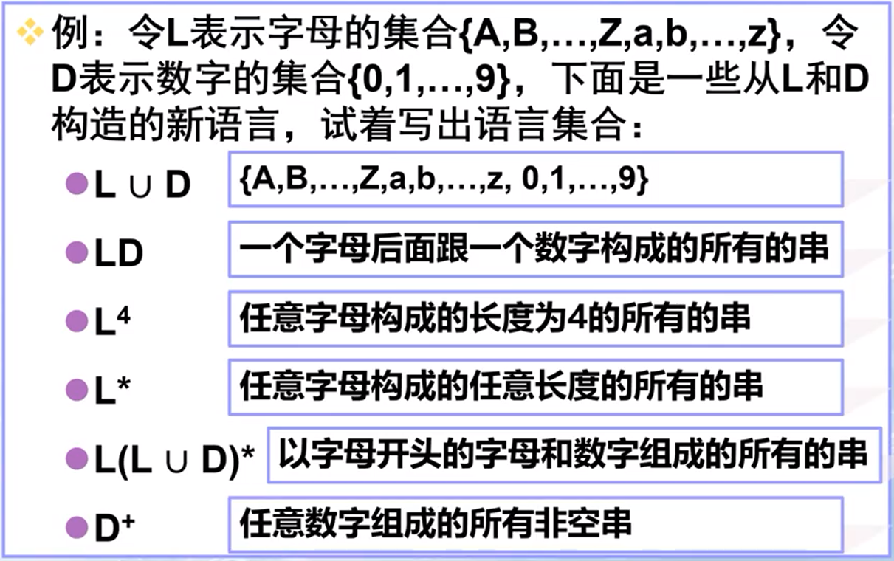

## 正则表达式

### 正则表达式和正则集

**正则表达式**（Regular Expression, RE）是一种用来描述**正则语言**的更紧凑的数学表示方法。

一个字集合是**正则集**当且仅当它能用**正则式**表示。

一个正则表达式能表示的正则集称为它能描述的**语言**。

编程语言的词法基本上都可以用正则表达式描述。

---

正则式和正则集的递归定义：

对于给定的字母表 $\Sigma$：

1. $\varepsilon$ 和 $\phi$ 都是 $\Sigma$ 上的正则式，它们所表示的正则集为 $\{\varepsilon\}$ 和 $\phi$。
2. 任何 $a \in \Sigma$，$a$ 是 $\Sigma$ 上的正则式，它所表示的正则集为 $\{a\}$。

3. 假定 $e_1$ 和 $e_2$ 都是 $\Sigma$ 上的正则式，它们所表示的正则集为 $L(e_1)$ 和 $L(e_2)$，

   - $(e_1|e_2)$ 为正则式，表示的正则集为 $L(e_1) \cup L(e_2)$
   - $(e_1.e_2)$ 为正则式，表示的正则集为 $L(e_1)L(e_2)$
   - $(e_1)^*$ 为正则式，表示的正则集为 $(L(e_1))^*$

   仅由**有限次**使用上述三步骤而定义的表达式才是 $\Sigma$ 上的**正则式**，仅由这些正则式表示的字集才是 $\Sigma$ 上的**正则集**。

### 正则运算的优先级

- 闭包运算优先级最高
- 连接运算次之
- 选择运算优先级最低
- 括号可以改变优先级顺序
- 元字符：$\varepsilon$、$\phi$、$|$、$($、$)$、$*$