# 上下文无关文法与语法分析

## 基本概念

### 语法分析

程序设计语言的语法通常是用**上下文无关文法（context-free grammar）**的文法规则（grammar rule）进行描述的。

上下文无关文法与正则表达式最大的区别在于能够表达**递归（recursive）**。

例如：一般来说，if 语句的结构应允许其中嵌套其他的 if 语句，而在正则表达式中却不能这样做。

### 语法分析的任务

**语法分析（Syntax Analysis）的任务**：根据扫描程序产生的记号来确定程序的语法结构。

语法分析阶段的**输出**是**分析树或者语法树**，因为需要表示递归结构。

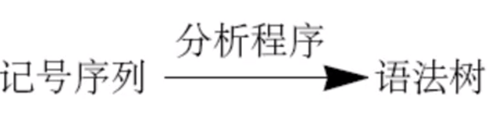

### 语法分析程序

记号序列通常不是显式的输入参数，而是**当需要下一个记号时，分析程序就调用 `getToken` 去获取一个记号**。

编译器的分析步骤可表示为对分析程序的一个调用，如下所示：`syntaxTree = parse();`。

在单遍编译中，分析程序合并编译器中所有的其他阶段，因此也就不需要构造显式的语法树了。

### 文法

**文法**：描述语言的语法结构的形式规则。

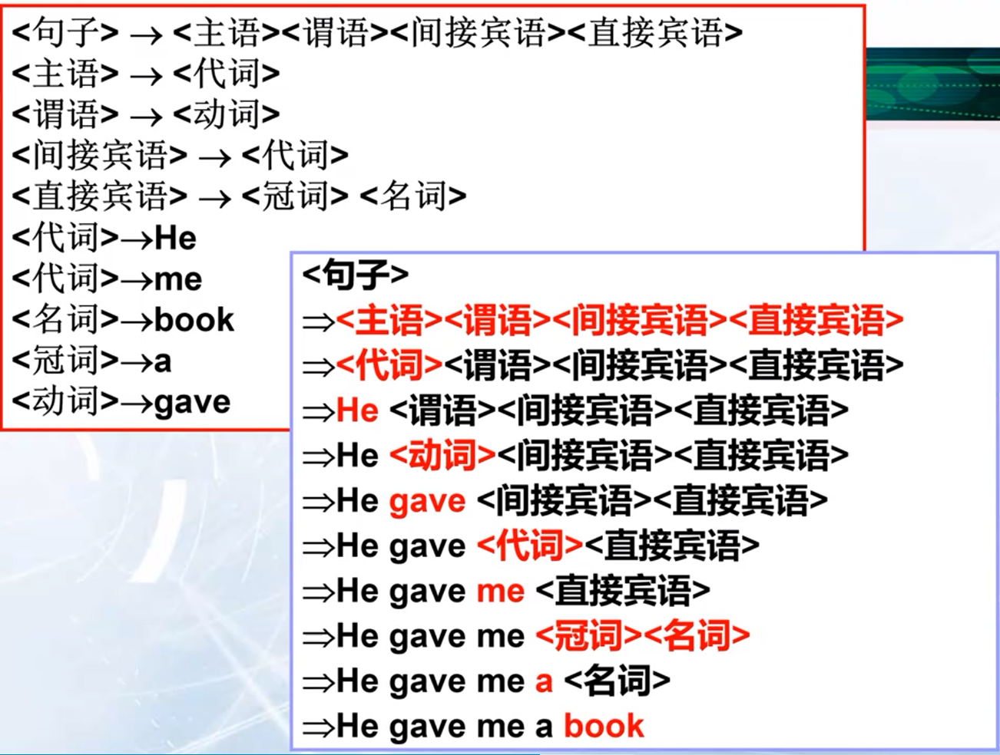

### 上下文无关文法

上下文无关文法说明程序设计语言的语法结构。

**除了涉及到了递归规则之外，其他的说明与使用正则表达式的词法结构的说明十分类似。**

例如：带有加法、减法和乘法的**简单整型算术表达式**可由下面的文法给出：

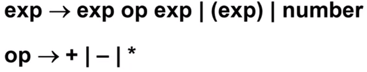

---

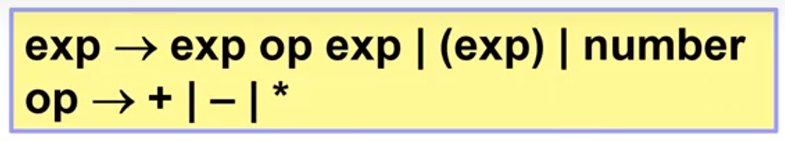

文法规则定义了在箭头左边名字的结构。

第 1 个规则定义了表达式 exp，它由一个算符和两个表达式，或一个加上括号的表达式，或一个常数组成。

第 2 个规则定义了算符 op，它由 `+`、`-` 或 `*` 构成。

- **箭头**表示由什么可以组成的意思。
- 支持**选择**运算，用 `|`表示。
- 支持**连接**运算。

**思考**：与正则表达式比较一下，少了什么？
$$
number = digit \ digit^* \\

digit= 0|1|2|3|4|5|6|7|8|9
$$

---

关于 `(4 - 2) * 3` 是否是符合上述文法的表达式的**推导**过程：

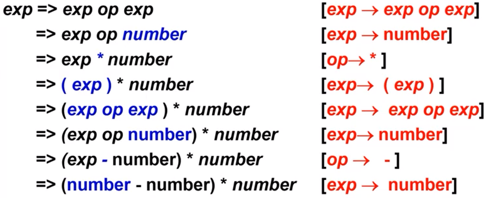

## 上下文无关文法

**定义**：一个上下文无关文法 G 是一个四元式 $G=(V_T, V_N, S, P)$，其中

*   $V_T$：终结符集合（非空）。
*   $V_N$：非终结符集合（非空），且 $V_T \cap V_N = \varnothing$。
*   $S$：文法的开始符号，$S \in V_N$。
*   $P$：产生式集合（有限），每个产生式形式为 $P \rightarrow \alpha, \quad P \in V_N, \quad \alpha \in (V_T \cup V_N)^*$。
*   开始符号 S 至少必须在某个产生式的左部出现一次。

**产生式**：用于表示文法规则，说明非终结符的构成。比如：

**终结符**：字母表中的符号（即是**词法扫描产生的单词记号**）常称为终结符。它们会终结语法推导。终结符是**一个语言不可再分的基本符号**。

**非终结符**：用来表示一类**语法范畴**。比如“算术表达式”、“赋值语句”，它们在语法推导中总是被替换。**通常会出现在产生式的左侧**。

**开始符号**：一般是文法规则中第一条产生式左侧的**非终结符**，**这个符号表示的串集合就是这个文法生成的语言**。

### 推导

一个上下文无关文法如何定义一个语言呢？

通过**反复使用文法规则进行推导**来判别有效的单词记号串。

**推导（derivation）**是指在文法规则的右边选择一个序列来替换左侧的非终结符。推导**以一个非终结符开始并以终结符串结束**。在推导的每一个步骤中，使用来自文法规则的选择生成一个替换。通常用符号“**⇒**”表示。

通常，用 $\alpha_1 \stackrel{+}{\Rightarrow} \alpha_n$ 表示：从 $\alpha_1$ 出发，经过一步或若干步，可以推出 $\alpha_n$。

用 $\alpha_1 \stackrel{*}{\Rightarrow} \alpha_n$ 表示：从 $\alpha_1$ 出发，经过0步或若干步，可以推出 $\alpha_n$。

**定义**：假定 $G$ 是一个文法，$S$ 是它的**开始符号**。如果 $S \stackrel{*}{\Rightarrow} \alpha$，则称 $\alpha$ 是一个**句型**。仅含终结符号的句型是一个**句子**。文法 $G$ 所产生的句子的全体是一个**语言**，将它记为 $L(G)$。

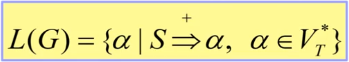

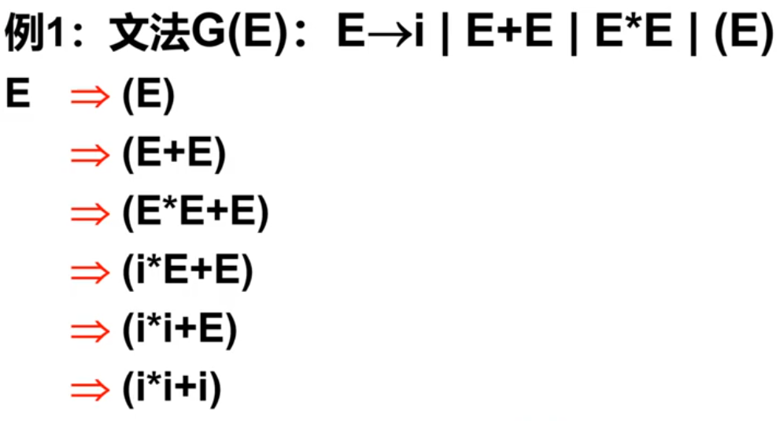

所以 `(i*i+i)` 是文法可以识别的**句子**。

`E`，`(E)`，`(E*E+E)`……`(i*i+i)` 是**句型**。

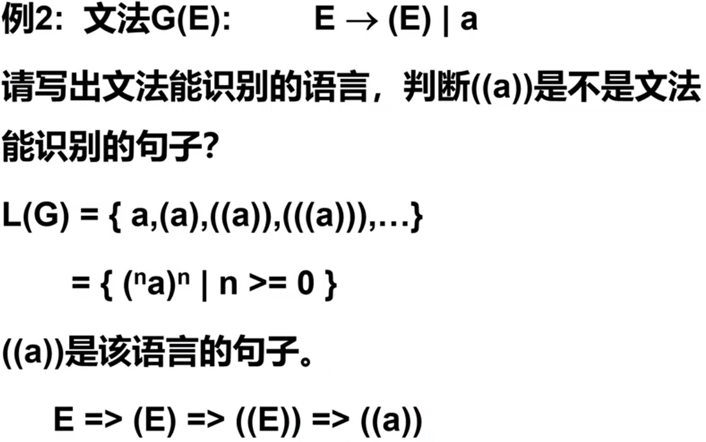

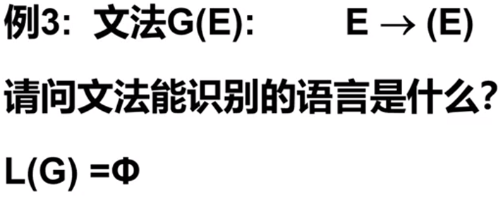

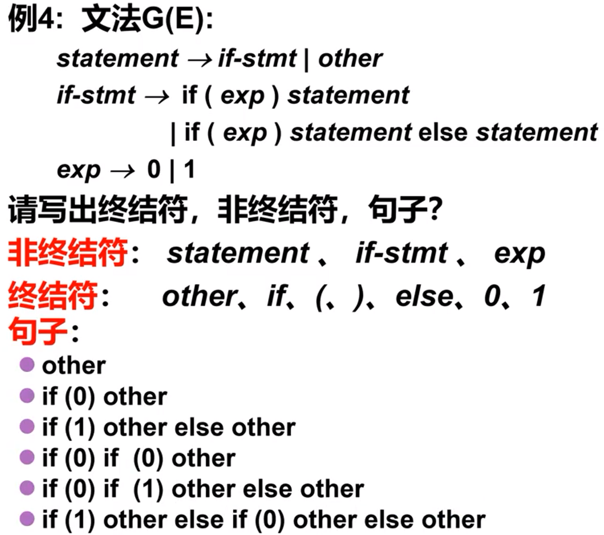

### 递归

在上下文无关文法里面，通常使用**递归**来实现重复运算。

- 这两个文法产生的语言都是 $\{a^n | n \ge 1\}$。
- 和正则表达式 $a+$ 产生的语言一样。
- A ⇒ Aa ⇒ Ada ⇒ Aaaa ⇒ aaaa。

思考：如果要用上下文文法产生 $a^*$ 怎么办？
$$
A \rightarrow Aa | \varepsilon
$$

- **左递归**：左侧非终结符出现在右侧第一个位置。
  $$
  A \rightarrow Aa | a
  $$

- **右递归**：左侧非终结符出现在右侧最后一个位置。
  $$
  A \rightarrow aA | a
  $$

- **考虑更一般的情况**：$A \rightarrow A \alpha | \beta$，$\alpha$ 和 $\beta$ 表示字母表上的任意串，其中 $\beta$ 不能以 A 开头。

  **思考**：这个文法表示的语言为？$\beta \alpha^*$。

  若换为右递归来写，还是表示一样的语言吗？非也，$A \rightarrow \alpha A | \beta$ 表示 $\alpha \beta^*$。

---

**思考**：怎么用文法表示和 $\alpha \beta^* \gamma$ 一样的语言。

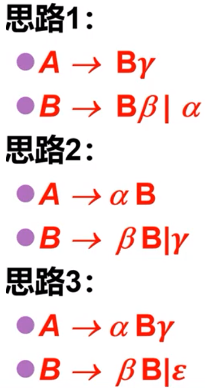

### 练习

请用文法表示和 $a(ab)^*cb$ 一样的语言？

---

### 示例

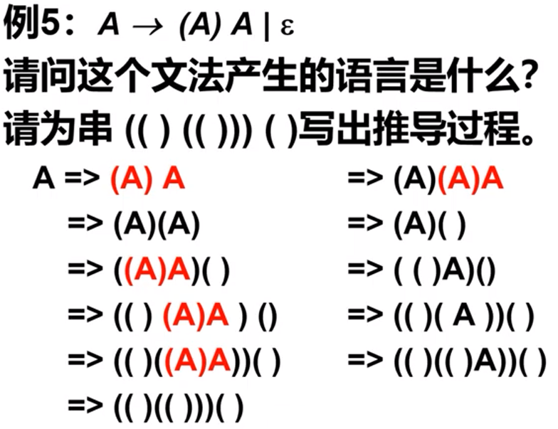

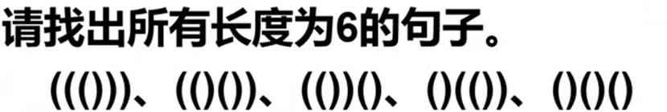

---

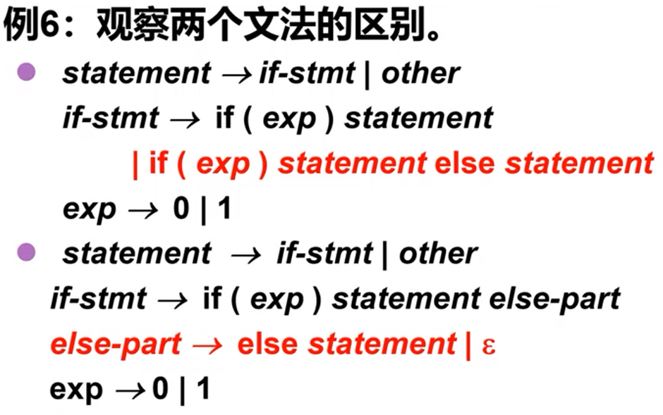

$\varepsilon$ 产生式用来表示可选，通常能推导出空串的非终结符其产生式都含有 $\varepsilon$。

---

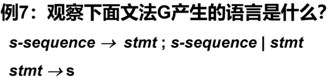

该文法产生的语言和 $(s;)^*s$ 一样。
$$
L(G) = \{s, s;s, s;s;s, \dots\}
$$
如果想表示 `;` 为结束符呢？

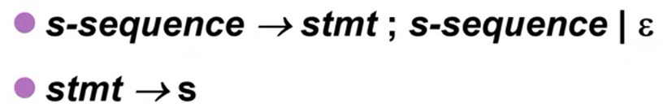

---

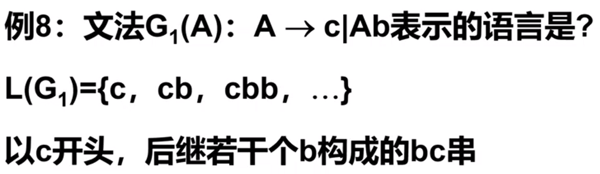

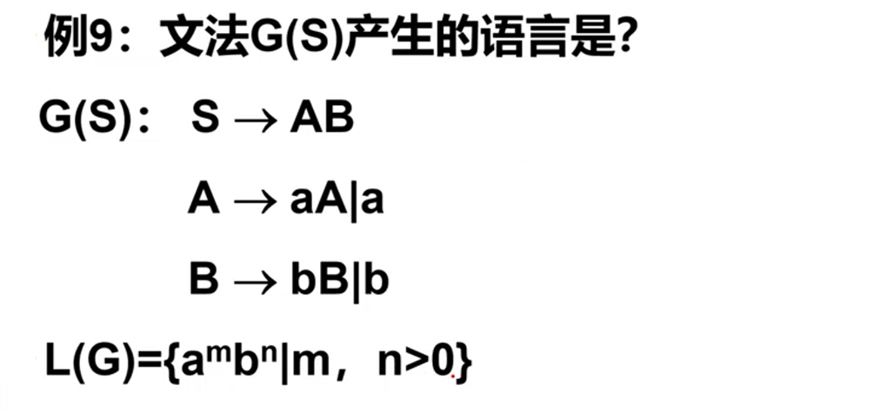

---

 

---

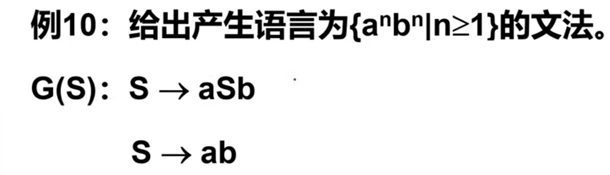

---

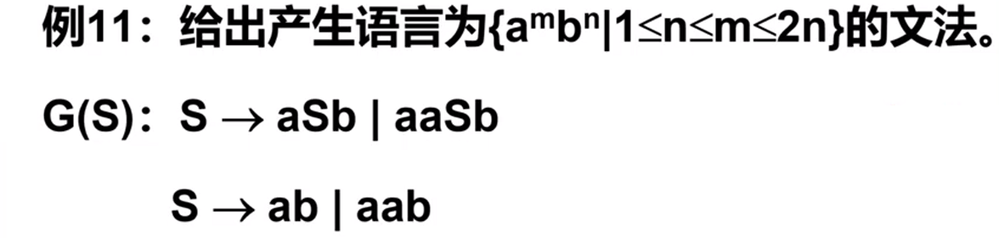

### 练习

产生式如下：
$$
S \rightarrow Ab^2c \\
A \rightarrow aAb | ab
$$

## 分析树与推导

对于给定的串，**推导过程并不是唯一的**。

以串 `(number-number)*number` 为例，请尝试给出 2 种不同的推导过程。