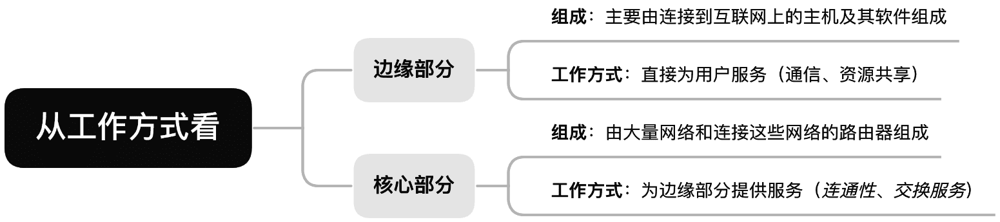

# 计算机网络体系结构

## 计算机网络的概念

**知识总览**：

### 计算机网络的定义

计算机网络（Computer Networking）是一个将众多分散的、自治的计算机系统，通过通信设备（路由器、5G 基站等）与线路连接起来，由功能完善的软件实现资源共享和信息传递的系统。

### 计算机网络、互连网、互联网的区别

1. **计算机网络（Computer Networking）**
2. **互连网（internet）**
3. **互联网（或因特网，Internet）**

以下提到的“网”指的是哪个网？

1. “我们家宽带欠费，断**网**了”
2. “好兄弟，要不要一起去上**网**”
3. “想把手机投屏到电视上，需要将手机、电视连接到同一**网络**”
4. “银行工作人员需要登录银行**内网**才能给客户办理业务”

### 一个最简单的计算机网络

**计算机网络（简称网络）**：由若干结点（node；结点可以是计算机、集线器、交换机、路由器等。）和连接这些结点的链路（link；链路可以是有线链路、无线链路。）组成。

因此可以使用**集线器（Hub）**：

**集线器（Hub）**：

- 可以把**多个结点连接起来，组成一个计算机网络**。
- 普通民用领域已很少用集线器。
- “集线器“工作在物理层。

> [!TIP]
>
> 集线器不能避免<u>数据冲突</u>；例如两台电脑同时发出数据，在集线器处发生数据冲突，最终导致数据传输失败，导致网络卡顿。

通常现在搭建一个计算机网络，不会使用集线器，而是采用**交换机（Switch）**：

**交换机（Switch）**：

- 可以把**多个结点连接起来，组成一个计算机网络**。
- 家庭、公司、学校通常用交换机组建内部网络。
- “交换机”工作在数据链路层。

> [!TIP]
>
> 交换机（Switch）不会出现数据冲突的问题。

### 互连网（internet）

为了将多个计算机网络互通，使用到**路由器（Router）**：

**路由器（Router）**：

- 可以**把两个或多个计算机网络互相连接起来**，形成规模。
- 更大的计算机网络，也可称为“互连网”。
- 路由器工作在网络层。

### 例子：某银行的内部网络（互连网）

### 例子：家庭内部网络

> [!TIP]
>
> 一般指的“路由器”和“家用路由器”有一些区别。
> $$
> 家用路由器 = 路由器 + 交换机 + 其他功能
> $$

**思考：怎样才能使用“电视投屏”的功能？**

手机和电视连接到<u>同一个网络</u>。

### 互联网（或因特网，Internet）

**ISP（Internet Service Provider）**，即互联网服务提供商（如中国电信、中国移动、中国联通等）。

互联网（或因特网，Internet）是各大 ISP 和国际机构组建的，覆盖全球范围的互连网（internet）。

**互联网**必须使用 TCP/IP 协议通信，**互连网**可使用任意协议通信。

### 如何理解“TCP/IP”协议？

秦始皇统一六国后，车同轨、书同文、统一度量衡。

---

**知识回顾**：

## 计算机网络的组成、功能

**知识总览**：

### 计算机网络的组成：从组成部分来看

#### 硬件、软件、协议

> [!TIP]
>
> 除了上述这些硬件之外，每个网络内部可能使用：集线器、交换机、路由器、调制解调器、无线基站、网线、光纤等各种设备或线路。

#### 拓展：网络适配器

有线网络适配器：

无线网络适配器：

### 计算机网络的组成：从工作方式看

#### 计算机网络的组成

> [!tip]
>
> **交换服务**就是动态地去选择数据在网络中传输的路径，以保证各条路径都不会负担太重。

### 计算机网络的组成：从逻辑功能看

#### 资源子网、通信子网

### 计算机网络的功能

#### 计算机网络的功能：数据通信

 #### 计算机网络的功能：资源共享

#### 计算机网络的功能：分布式处理

#### 计算机网络的功能：提高可靠性

#### 计算机网络的功能：负载均衡

上述例子中的服务器 A 专门负责对战匹配。

---

**知识回顾**：

