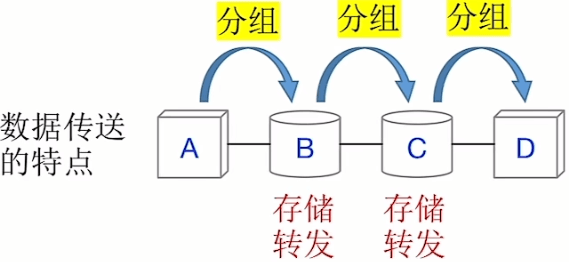
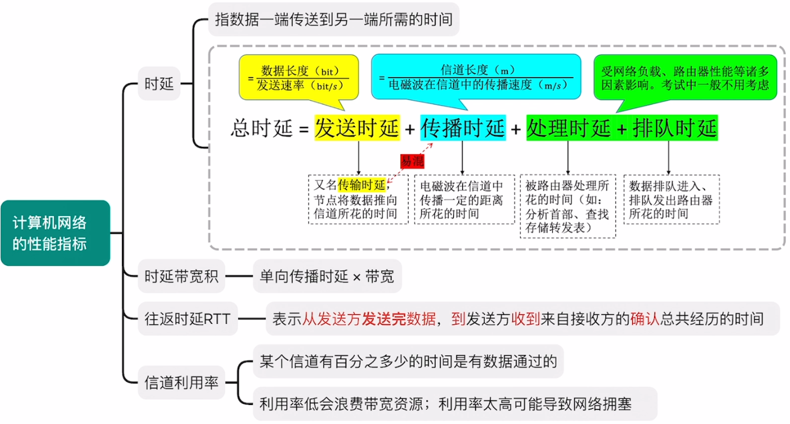
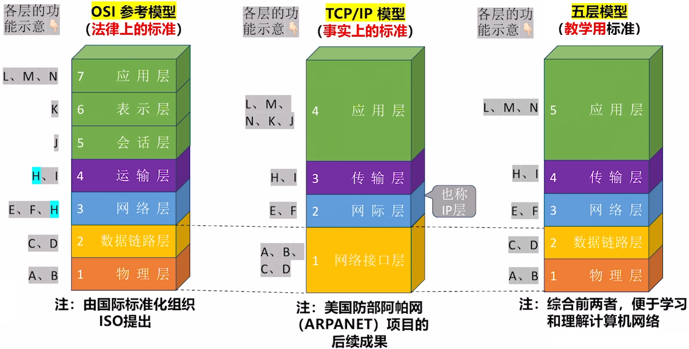

# 计算机网络体系结构

## 计算机网络的概念

**知识总览**：

### 计算机网络的定义

计算机网络（Computer Networking）是一个将众多分散的、自治的计算机系统，通过通信设备（路由器、5G 基站等）与线路连接起来，由功能完善的软件实现资源共享和信息传递的系统。

### 计算机网络、互连网、互联网的区别

1. **计算机网络（Computer Networking）**
2. **互连网（internet）**
3. **互联网（或因特网，Internet）**

以下提到的“网”指的是哪个网？

1. “我们家宽带欠费，断**网**了”
2. “好兄弟，要不要一起去上**网**”
3. “想把手机投屏到电视上，需要将手机、电视连接到同一**网络**”
4. “银行工作人员需要登录银行**内网**才能给客户办理业务”

### 一个最简单的计算机网络

**计算机网络（简称网络）**：由若干结点（node，结点可以是计算机、集线器、交换机、路由器等）和连接这些结点的链路（link，链路可以是有线链路、无线链路）组成。

因此可以使用**集线器（Hub）**：

**集线器（Hub）**：

- 可以把**多个结点连接起来，组成一个计算机网络**。
- 普通民用领域已很少用集线器。
- “集线器“工作在物理层。

> [!TIP]
>
> 集线器不能避免<u>数据冲突</u>；例如两台电脑同时发出数据，在集线器处发生数据冲突，最终导致数据传输失败，导致网络卡顿。

通常现在搭建一个计算机网络，不会使用集线器，而是采用**交换机（Switch）**：

**交换机（Switch）**：

- 可以把**多个结点连接起来，组成一个计算机网络**。
- 家庭、公司、学校通常用交换机组建内部网络。
- “交换机”工作在数据链路层。

> [!TIP]
>
> 交换机（Switch）不会出现数据冲突的问题。

### 互连网（internet）

为了将多个计算机网络互通，使用到**路由器（Router）**：

**路由器（Router）**：

- 可以**把两个或多个计算机网络互相连接起来**，形成规模。
- 更大的计算机网络，也可称为“互连网”。
- 路由器工作在网络层。

### 例子：某银行的内部网络（互连网）

### 例子：家庭内部网络

> [!TIP]
>
> 一般指的“路由器”和“家用路由器”有一些区别。
> $$
> 家用路由器 = 路由器 + 交换机 + 其他功能
> $$

**思考：怎样才能使用“电视投屏”的功能？**

手机和电视连接到<u>同一个网络</u>。

### 互联网（或因特网，Internet）

**ISP（Internet Service Provider）**，即互联网服务提供商（如中国电信、中国移动、中国联通等）。

互联网（或因特网，Internet）是各大 ISP 和国际机构组建的，覆盖全球范围的互连网（internet）。

**互联网**必须使用 TCP/IP 协议通信，**互连网**可使用任意协议通信。

### 如何理解“TCP/IP”协议？

秦始皇统一六国后，车同轨、书同文、统一度量衡。

---

**知识回顾**：

## 计算机网络的组成、功能

**知识总览**：

### 计算机网络的组成：从组成部分来看

#### 硬件、软件、协议

> [!TIP]
>
> 除了上述这些硬件之外，每个网络内部可能使用：集线器、交换机、路由器、调制解调器、无线基站、网线、光纤等各种设备或线路。

#### 拓展：网络适配器

有线网络适配器：

无线网络适配器：

### 计算机网络的组成：从工作方式看

#### 计算机网络的组成

> [!tip]
>
> **交换服务**（Switching Service）就是动态地去选择数据在网络中传输的路径，以保证各条路径都不会负担太重。

### 计算机网络的组成：从逻辑功能看

#### 资源子网、通信子网

### 计算机网络的功能

#### 计算机网络的功能：数据通信

 #### 计算机网络的功能：资源共享

#### 计算机网络的功能：分布式处理

#### 计算机网络的功能：提高可靠性

网络中的各台计算机互为替代机。

#### 计算机网络的功能：负载均衡

上述例子中的服务器 A 专门负责对战匹配。

---

**知识回顾**：

## 电报交换、报文交换、分组交换

**知识总览**：

### Intro

#### 计算机网络发展初期面临的问题

#### 人类历史上的通信网络

### 电话网络（采用“电路交换”技术）

#### 早期的电话交换机

电路交换（Circuit Switching）：通过物理线路的连接，动态地分配传输线路资源。

#### 电路交换的过程

1. 建立连接（尝试占用通信资源）
2. 通信（一直占用通信资源）
3. 释放连接（归还通信资源）

> [!tip]
>
> 长途电话之所以更贵就是因为要占用更多的通信资源。

#### 如果计算机网络采用“电路交换”技术？

显然，采用“电路交换”技术会存在问题。

#### “电路交换”的优缺点

电路交换的优点：

通信前，从主叫端到被叫端建立一条专用的物理通路；在通信的全部时间内，两个用户始终占用端到端的线路资源。数据直送，<u>传输速率高</u>。（电路交换技术更适用于低频次、大量地传输数据。）

电路交换的缺点：

- 建立/释放连接，需要额外的时间开销。（计算机之间数据往往是“突发式”传输，即往往会高频次、少量地传输数据。）
- 线路被通信双方独占，利用率低。
- **线路**分配的**灵活性差**。
- 交换节点**不支持“差错控制”**。（无法发现传输过程中发生的数据错误）

### 电报网络（采用“报文交换”技术）

存储转发的思想：把传送的数据单元先存储进中间节点，再根据目的地址转发至下一节点。

#### 如果计算机网络采用“报文交换”技术？

#### “报文交换”的优缺点

报文交换的优点：

- 通信前无需建立连接。
- 数据以“报文”为单位被交换节点间“存储转发”，通信线路可以灵活分配。
- 在通信时间内，两个用户无需独占一整条物理线路。相比于电路交换，线路利用率高。
- 交换节点**支持“差错控制”**。（通过检验技术）

报文交换的缺点：

- 报文**不定长**，不便于<u>存储转发管理</u>。
- 长报文的<u>存储转发时间开销大</u>、<u>缓存开销大</u>。
- 长报文**容易出错**，重传代价高。

### "分组交换"技术

#### 现代计算机网络采用“分组交换”技术

#### “分组交换”的优缺点

分组交换的优点：

- 通信前无需建立连接。
- 数据以“**分组**”为单位被交换节点间“**存储转发**”，通信线路可以灵活分配。
- 在通信时间内，两个用户无需独占一整条物理线路。相比于电路交换，线路利用率更高。
- 交换节点支持“差错控制”。（通过校验技术）

**相比于报文交换**，分组交换改进了如下问题：

- 分组**定长**，方便存储转发管理。
- 分组的<u>存储转发时间开销小</u>、<u>缓存开销小</u>。
- 分组**不易出错**，重传代价低。

分组交换的缺点：

- 相比于报文交换，<u>控制信息占比增加</u>。
- 相比于电路交换，依旧存在**存储转发时延**。
- 报文被拆分为多个分组，传输过程中可能会出现**失序**、**丢失**等问题，增加<u>处理的复杂度</u>。

### “虚电路交换”技术

1. 建立连接 （虚拟电路）
2. 通信（分组按序、按已建立好的既定线路发送，通信双方不独占线路）
3. 释放连接

## 电路交换、报文交换、分组交换（性能分析）

### 三种交换方式的性能对比

### 电路交换性能分析

**假设**：

每一跳传播时延为 1ms，电路交换机建立、释放下一跳连接耗时为 1ms，接受方处理连接请求需要 2ms，数据传输速率为 0.5kb/ms，报文大小为 4kb。

> [!tip]
>
> 虽然连接释放的首个响应在时间上可紧随数据传输结束，但在图中为便于区分，该信号线被略作分离显示。

### 报文交换性能分析

**假设**：

每一跳传播时延为 1ms，数据传输速率为 0.5kb/ms，报文大小为 4kb，报文存储转发时延为 2ms。

> [!tip]
>
> **中间节点**一定要接受完**整个报文**后，才能解析并转发。

上述例子中的传输时间为 31ms。

### 分组交换性能分析

**假设**：
每一跳传播时延为 1ms，数据传输速率为 0.5kb/ms，报文大小为 4kb， 分组大小为 1kb，分组存储转发时延为 0.5ms。

> [!tip]
>
> 类似的，**中间节点**一定要接受完**整个分组**后，才能解析并转发。

---

**知识回顾**：

| 特性                     | 电路交换                       | 报文交换 | 分组交换                |
| ------------------------ | ------------------------------ | -------- | ----------------------- |
| 完成传输所需时间         | 😎最少（排除建立/释放连接耗时） | 😭最多    | 😊较少                   |
| 存储转发时延             | 😎无                            | 😭较高    | 😊较低                   |
| 通信前是否需要建立连接？ | 😭是                            | 😎否      | 😎否                     |
| 缓存开销                 | 😎无                            | 😭高      | 😊低                     |
| 是否支持差错控制？       | 😭不支持                        | 😎支持    | 😎支持                   |
| 报文数据有序到达？       | 😎是                            | 😎是      | 😭否                     |
| 是否需要额外的控制信息？ | 😎否                            | 😊是      | 😭是（控制信息占比最大） |
| 线路分配灵活性           | 😭不灵活                        | 😎灵活    | 😎非常灵活               |
| 线路利用率               | 😭低                            | 😎高      | 😎非常高                 |

## 计算机网络的分类

**知识总览**：

### 按分布范围分类

#### 广域网（WAN, Wide Area Network）

- **范围**：几十至几千公里
- 跨省/跨国/跨洲

#### 城域网（MAN, Metropolitan Area Network）

- **范围**：几千米至几十千米
- 一个或几个相邻城市
- **通信技术**：常采用“以太网技术”，因此常并入局域网范畴探讨。

#### 局域网（LAN, Local Area Network）

- **范围**：几十米至几千米
- 学校/企业/工作单位/家庭
- **通信技术**：以太网技术

> [!tip]
>
> 如今局域网技术几乎均采用“以太网技术”实现，因此“以太网”几乎成了“局域网”的代名词。

#### 举例：广域网（WAN）、局域网（LAN）

> [!tip]
>
> **局域网**通过**路由器**接入**广域网**。

#### 个域网（PAN, Personal Area Network）

- **范围**：几十米以内
- 家庭/个人
- 通常是通过<u>无线技术</u>将个人设备连接起来的网络，因此也常称为无线个域网（WPAN, Wireless Personal Area Network）。

#### 例子：个域网（PAN）

### 按传播技术分类

- 广播式网络：当一台计算机发送**数据分组**时，广播范围内所有计算机都会收到该分组，并通过检查分组的目的地址决定是否接收该分组。
- 点对点网络：数据只会从发送方“点对点”发到接收方，精准送达。（例如路由器的数据分组。）

### 按拓扑结构分类

总线形结构：数据“广播式”传输；存在“总线争用”问题。（典型代表就是使用**集线器**连接的设备。）

环形结构：数据“广播式”传输；通过“令牌”解决总线争用问题，令牌顺环形依次传递，拿到令牌者可使用总线。（典型代表就是**令牌环网**，流行于 2000 年以前局域网技术。）

星形结构：由**中央设备**实现数据的“点对点”传输；不存在“总线争用”问题。（典型代表就是**以太网交换机**连接的设备。）

网状结构：数据通过各**中间节点**逐一存储转发；属于“点到点”传输。（典型代表就是众多**路由器**构建的**广域网**。）

### 按使用者分类

- **公用网**：向**公众开放**的网络；如办宽带、交手机话费即可使用的互联网。
- **专用网**：仅供某个组织**内部使用**的网络；如政府、军队、电力、银行的内部网络。

### 按传输介质分类

- **有线网络**：如网线、光纤等。
- **无线网络**：如 5G、Wi-Fi、卫星等。

---

**知识回顾**：

## 计算机网络性能指标

**知识总览**：

### 速率

信道（Channel）：表示向某一方向传送信息的通道（信道 ≠ 通信线路）。一条通信线路在逻辑上往往对应一条发送信道和一条接收信道。

速率（Speed）：指连接到网络上的节点在信道上传输数据的速率，也称数据率或比特率、<u>数据传输速率</u>。

速率单位：bit/s，或 b/s，或 bps。

> [!tip]
>
> 有时也用 B/s（字节/秒），其中 1B = 8b（B = Byte，b = bit）。 

> [!tip]
>
> 因为“计算机网络”沿用国际单位制（SI），以 10 为底；而“计算机系统”早期基于二进制设计，以 2 为底——导致相同字母（如 K、M、G、T）在不同场景下代表不同数值。

### 带宽

带宽（bandwidth）：某信道所能传送的最高数据率。

在某个 ISP 宽带服务中，有：

---

**结论**：节点间通信实际能达到的<u>最高速率</u>，由带宽、节点性能共同限制。

### 带宽（另一含义）

在通信原理中，带宽（bandwidth）表示某信道允许通过的<u>信号频带范围</u>，单位：Hz。（读作“赫/赫兹”，可加上数量前缀 K、M、G、T。）

### 吞吐量

吞吐量（Throughput）：指<u>单位时间</u>内通过某个网络（或信道、接口）的<u>实际数据量</u>。吞吐量受带宽限制、受复杂的网络负载情况影响。

---

**知识回顾**：

### 时延

时延（Delay）：指数据（一个报文或分组，甚至比特）从网络（或链路）的一端传送到另一端所需的时间。有时也称为延迟或迟延。

> [!tip]
>
> 每经过一次<u>信道</u>，就会产生<u>发送时延以及传播时延</u>；每经过一次<u>路由器</u>，就会产生<u>处理时延以及排队时延</u>。

---

### 时延带宽积

**时延带宽积的含义**：一条链路中，已从发送端发出但尚未到达接收端的<u>最大</u>比特数。
$$
时延带宽积 = 传播时延 \times 带宽
$$

---

$$
传输文件总时间 = 0.01ms + 0.08ms + 0.01ms + (0.08ms \times 1000) = 80.10ms
$$

### 往返时延（RTT）

往返时延 RTT（Round-Trip Time）：表示从发送方发送完数据，至到发送方收到来自接收方的**确认**总共经历的时间。

### 信道利用率

**信道利用率**：某个信道有百分之多少的时间是有数据通过的。
$$
信道利用率 = \frac{有数据通过的时间}{有数据通过的时间 + 没有数据通过的时间}
$$

- 信道利用率不能太低，浪费资源。（有些高速路段车辆很少，车道利用率极低，浪费资源。）
- 信道利用率也不能太高，容易导致网络拥塞。（节假日高速路，车道利用率极高，堵车。）

---

---

**知识回顾**：

## 计算机网络分层结构

**知识总览**：

### “分层”的设计思想

**分层设计的思想**：将庞大而复杂的问题，转化为若干较小的局部问题。

快递网络是一个非常复杂的系统。快递网络需要完成很多功能：

- 货物打包
- 取件、派件
- 冷链存储
- 包裹“路由”（选择合适的包裹运输路线）
- 运输包裹

### 快递网络的四层体系结构

将复杂的快递网络在逻辑上划分为多个层次，并将各种“功能”安排在合适的层次中。

不同类型的节点，实现的功能层次可能不一样。

### 计算机网络要实现的功能

计算机网络是一个非常复杂的系统，要完成诸多功能，如：

- **差错控制**：确保数据在传输过程中不出错。
- **流量控制**：发送端的发送速率必须使接收端来得及接收，不要太快。
- **分段和重装**：发送端将要发送的数据块划分为更小的单位，并在接收端将其还原。
- **复用和分用**：发送端几个高层会话复用一条低层的连接，在接收端再进行分用。
- **连接建立和释放**：交换数据前先建立一条逻辑连接，数据传送结束后释放连接。

### 计算机网络的分层结构

将复杂的计算机网络在逻辑上划分为多个层次，并将各种“功能”安排在合适的层次中。

不同类型的节点，实现的功能层次可能不一样。

### 快递网络的五层体系结构

分层结构的设计并不唯一，可以根据实际需求增加或减少层次。

同一个功能可以在多个层次中重复出现。

### 三种常见的计算机网络体系结构

### 网络体系结构的概念

网络的体系结构（Network Architecture）是计算机网络的各层及其协议（实现各个功能）的集合，就是这个计算机网络及其构件所应完成的功能的精确定义（不涉及实现）。

实现（implementation）是遵循这种体系结构的前提下，用何种硬件或软件完成这些功能的问题。

体系结构是**抽象**的，而实现则是**具体**的。

### 各层之间的关系

- 实体（entity）：在计算机网络的分层结构中，第 n 层中的活动元素（软件 + 硬件）通常称为第 n 层实体。不同机器上的同一层称为对等层，同一层的实体称为对等实体。
- 协议：即网络协议（Network Protocol），是控制对等实体之间进行通信的规则的集合，是<u>水平的</u>。

- 接口：即同一节点内相邻两层的实体交换信息的逻辑接口，又称为服务访问点（Service Access Point, SAP）。
- 服务：服务是指下层为紧邻的上层提供的功能调用，它是<u>垂直的</u>。

### 数据传输过程（水平）

**为什么要分层？为什么要制定协议？**

计算机网络功能复杂 → 采用分层结构，将诸多功能合理地划分在不同层次 → 对等层之间制定协议，以实现功能。

### 数据的传输过程（垂直视角）

### PDU、SDU、PCI 的概念

- **协议数据单元（Protocol Data Unit, PDU）**：对等层次之间传送的数据单位。第 n 层的 PDU 记为 n-PDU。
- **服务数据单元（Service Data Unit, SDU）**：为完成上一层实体所要求的功能而传送的数据。第 n 层的 SDU 记为 n-SDU。
- **协议控制信息（Protocol Control Information, PCI）**：控制协议操作的信息。第 n 层的 PCI 记为 n-PCI。
- 三者的关系为 **n-SDU + n-PCI = n-PDU = (n-1)-SDU**。

### 协议的三要素

协议：即网络协议（Network Protocol），是控制对等实体之间进行通信的规则的集合，<u>是水平的</u>。

协议由语法、语义和同步三部分组成（协议的三要素）：

1. 语法（Syntax），数据与控制信息的格式。例如，协议控制信息（首部）部分占几个字节、每个字节是什么含义；协议的数据部分最多有多少字节。
2. 语义（Semantics），即需要发出何种控制信息、完成何种动作及做出何种应答。例如，协议中需要明确规定：发送方发完数据后，接收方是否需要“应答”，以及应答的种类有哪些（如传输成功、传输失败）。
3.  同步或时序（Synchronization 或 Timing），执行各种操作的条件、时序关系等，即事件实现顺序的详细说明。例如，发送方发完数据后，接收方需要立即应答。如果发送方在 10 秒内未收到“传输成功”应答，则发送方会再次发送数据。

---

**知识回顾**：

## OSI 参考模型

**知识总览**：

### 术语声明

### 常见网络设备的功能层次

### 物理层

物理层任务：实现<u>相邻节点</u>之间比特（0 或 1）的传输。

1. 需要定义电路接口参数（例如形状、尺寸、引脚数等）。
2. 需要定义传输信号的含义、电气特征（例如 5V 表示 1，1V 表示 0；每比特电信号持续时间 0.1ms）。

> [!tip]
>
> 在数据传输过程中，信号可能受到外界噪声干扰而发生失真。 
>
> 例如，一个原本表示“1”的高电平信号，可能因环境噪声影响而被误判为低电平，导致接收端错误地将其识别为“0”。 
>
> 因此，以比特为单位的数据传输存在出错的可能性。

### 链路层

链路层任务：确保<u>相邻节点</u>之间的链路逻辑上无差错。

1. **差错控制**：检查 + 纠错；或检查 + 丢弃 + 重传。
2. **流量控制**：协调两个节点的速率。

> [!tip]
>
> 发送速率过快可能导致丢帧。例如，当节点 A 发送 10 帧，而节点 B 的处理能力仅为 5 帧时，B 会通过流量控制协议要求 A 降低发送速度。

### 网络层

网络层任务：把“分组”从源节点转发到目的节点。

1. **路由选择**：构造并维护路由表，决定分组到达目的节点的最佳路径。
2. **分组转发**：将“分组”从合适的端口转发出去。
3. **拥塞控制**：发现网络拥塞，并采取措施缓解拥塞。
4. **网际互联**：实现异构网络互联。
5. 其他功能（<u>以“分组”为单位</u>）：*差错控制*、*流量控制*、*连接建立与是否*（<u>确保分组有序，不重复到达</u>）、可*靠传输管理*（<u>接收方需返回分组确认信息</u>）。

### 传输层

传输层任务：实现<u>端到端</u>通信（即实现<u>进程到进程</u>的通信，“端”指“**端口**”）。

1. **复用和分用**：发送端几个高层实体复用一条低层的连接，在接收端再进行分用。
2. 其他功能（<u>以“报文段”为单位</u>）：*差错控制*、*流量控制*、*连接的建立与释放*（确保报文段有序、不重复到达）、*可靠传输管理*（接收方需返回报文段确认消息）。

### 5~7 层

- 会话层任务：管理进程间会话。

  **主要功能**：<u>会话管理</u>（采用节点检查机制，当通信失效时，从检查点继续恢复通信）。

- 表示层任务：解决不同主机上信息表示不一致的问题。

  **主要功能**：<u>数据格式转换</u>（如编码转换、压缩/解压、加密/解密）。

- 应用层任务：实现特定的网络应用。

  功能繁多，根据应用需求设计。

### 各层数据传输单位

---

**知识回顾**：

## TCP/IP 模型

**知识总览**：

### 回顾

#### OSI 参考模型 5~7 层

并不是所有网络应用都需要<u>数据格式转换</u>、<u>会话管理功能</u>。

**TCP/IP 的理念**：如果某些应用需要<u>数据格式转换</u>、<u>会话管理</u>功能，就交个应用层的特定协议来实现。

应用层任务：实现特定的网络应用（功能复杂且多样）。

#### OSI 参考模型 1~2 层

网络硬件种类繁多、日新月异，不应该有过多限制。

网络接口层任务：实现相邻节点间数据传输（为网络层传输“分组”），但<u>*具体如何传输不作规定*</u>。

这使得 TCP/IP 网络体系结构具有更强的灵活性、适应性。

### OSI 参考模型 vs. TCP/IP 模型

在 OSI 参考模型中，局部正确性并不足以保证全局正确性；但若全局正确性得以保证，则局部正确性自然成立。因此，传输层只需以报文段为单位，确保所传输的数据无差错、有序且可靠，即可满足整体的正确性要求。

### 网络层

TCP/IP 网络层功能：路由选择、分组转发、拥塞控制、网际互联。（*去除了差错管理、流量控制、连接管理、可靠传输管理*）

TCP/IP 网络层只保证“<u>尽最大能力交付</u>”，数据传输是不可靠的。

### 传输层

TCP/IP 传输层功能：**复用和分用**、差错控制、流量控制、连接建立与释放、可靠传输管理。

在 TCP/IP 模型中，由传输层负责保证数据传输的正确性、可靠性。

在 OSI 模型中，由于网络层还需承担差错控制、流量控制等功能，导致网络核心设备（如路由器）功能复杂、负载高、成本昂贵。

在 TCP/IP 模型中，网络核心部分功能简单、负载低。

实际上，数据传输的正确性与可靠性由传输层负责，这意味着相关处理压力被转移至“网络边缘设备（即主机）”。

### TCP/IP 各层功能

