# 物理层

**物理层任务**：实现<u>相邻节点</u>之间比特（0 或 1）的传输。

## 通信基础——基本概念

**知识总览**：

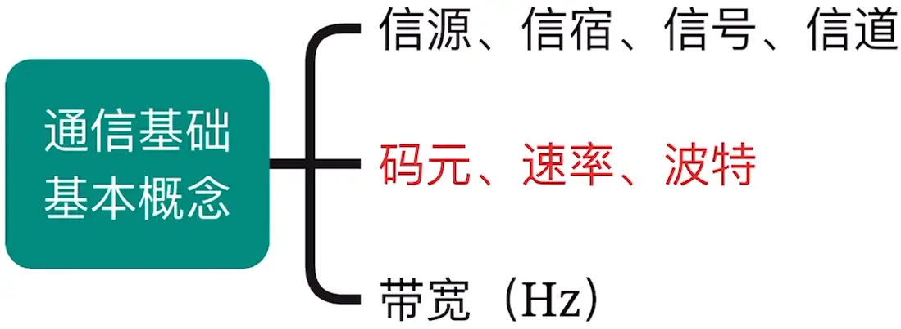

### 信源、信宿、信号、信道

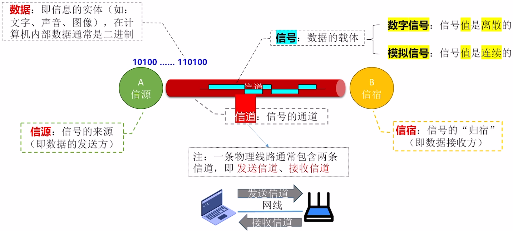

### 数字信号、模拟信号

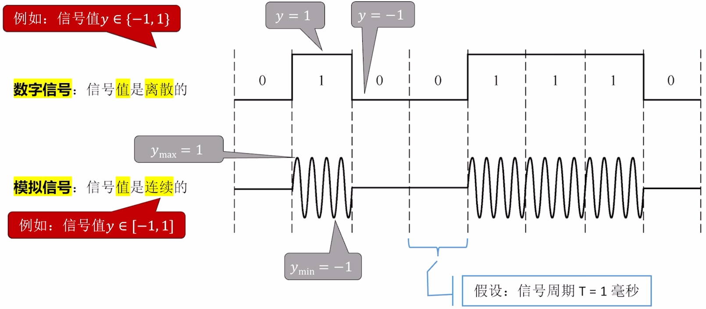

可以作为**信号的物理量**有：电压、电磁波等。

### 从数学函数的角度理解信号值

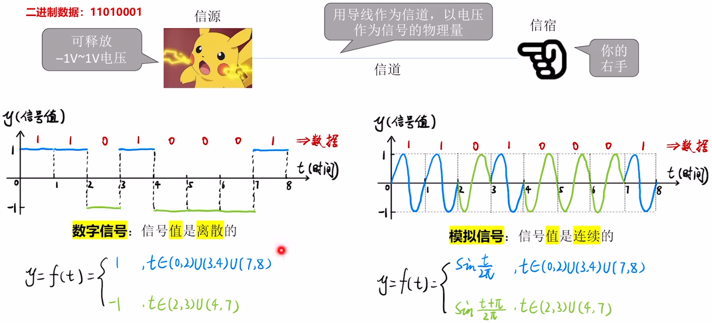

### 码元的概念



每一个信号就是一个“码元（symbol）”，可以把“信号周期”称为“码元宽度”。

若一个信号周期内出现 4 种信号，那么每个信号就可以对应一个 4 进制数（2bit），如：

- 2V → 00
- 1V → 01
- -1V → 10
- -2V → 11

当一个码元有更多种状态时，有：

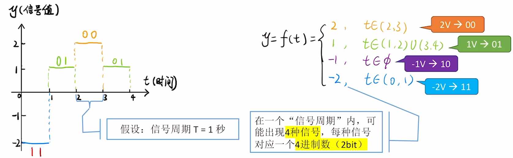

- **优点**：每个“信号周期”可以传输更多信息；换句话说，每个码元可以携带更多的信息。
- **代价**：需要加强信号功率，并且对信道的要求更高。（因为状态越多，它们之间的“距离”就越近，越容易被噪声干扰）

若一个码元（即一个信号）可能有 4 种状态，那么可以称其为 4 进制码元（一个码元携带 2bit 数据）。

类似地，若一个码元（即一个信号）可能有 8 种状态，那么可以称其为 8 进制码元（一个码元携带 3bit 数据）。

### 用模拟信号设计 4 进制码元

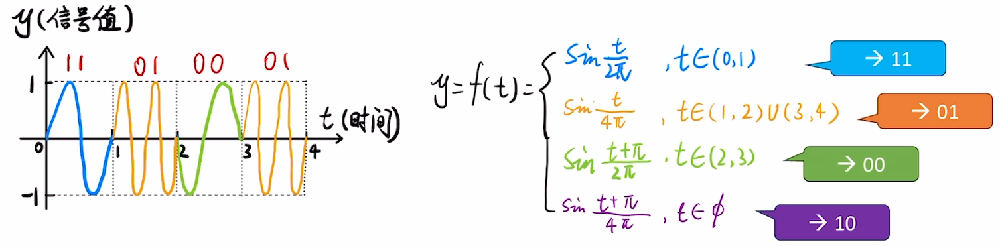

通过 4 种不同的关系来设计 4 进制码元。

### 码元与比特的关系

**一个码元可以携带多少比特数据？**

若一个“周期”内可能出现 K 种信号，则：

$$
1 \text{码元} = \log_2 K \text{bit}
$$

> [!tip]
>
> 本质上，这表示区分 K 种不同信号所需的最小比特数。

### 速率

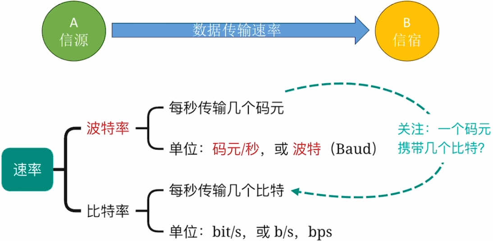

> [!tip]
>
> 若一个码元携带 n 比特的数据量，则波特率 M Baud 对应的比特率为 Mn b/s。

---

**知识回顾**：

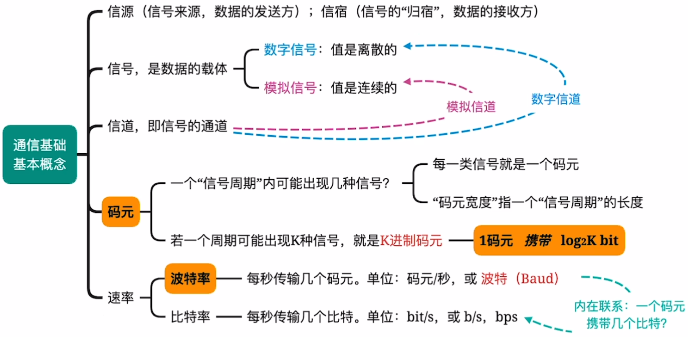

## 信道的极限容量

**知识总览**：

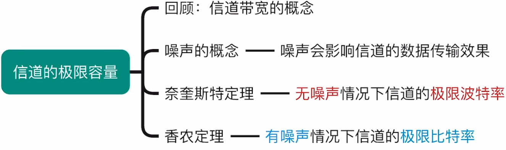

### 回顾：带宽

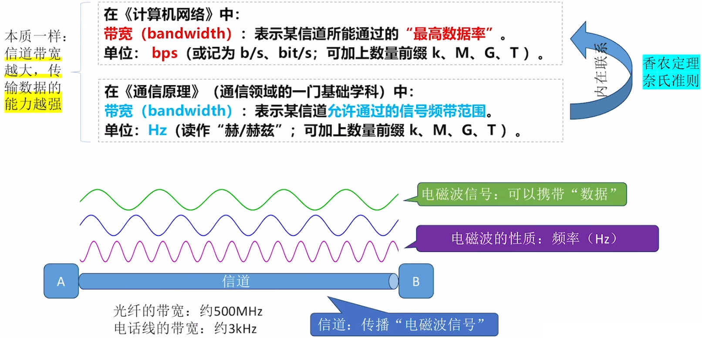

### 噪声（Noise）

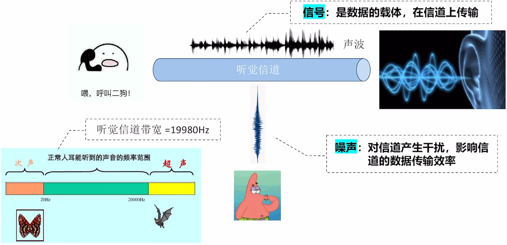

### 奈奎斯特定理（奈氏准则）

**奈奎斯特（_Nyquist_）定理**：对于一个<u>理想低通信道</u>（**没有噪声**、带宽有限的信道），其极限波特率为 2W。（单位：波特，即码元/秒）

> [!tip]
>
> W 是信道的频率带宽（单位：Hz）。

则其极限比特率为 $2W\log_2 K\, \text{b/s}$。

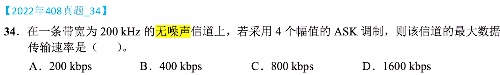

4 个幅值，即 4 种信号，也即 4 种码元。

因此每个码元携带 $\log_2 4 = 2 \text{bit} $ 的数据。

该信道的最大数据传输速率为 $2 \times 200 \text{k} \times \log_2 4 = 800 \text{kbps}$。

### 香农定理

**香农（Shannon）定理**：对于一个有噪声、带宽有限的信道，其**极限比特率**为 $W \log_2(1 + \dfrac{S}{N})$（单位：b/s）。

其中 W 是信道的频率带宽（单位：Hz），$\dfrac{S}{N}$ 是信噪比。

#### 信噪比

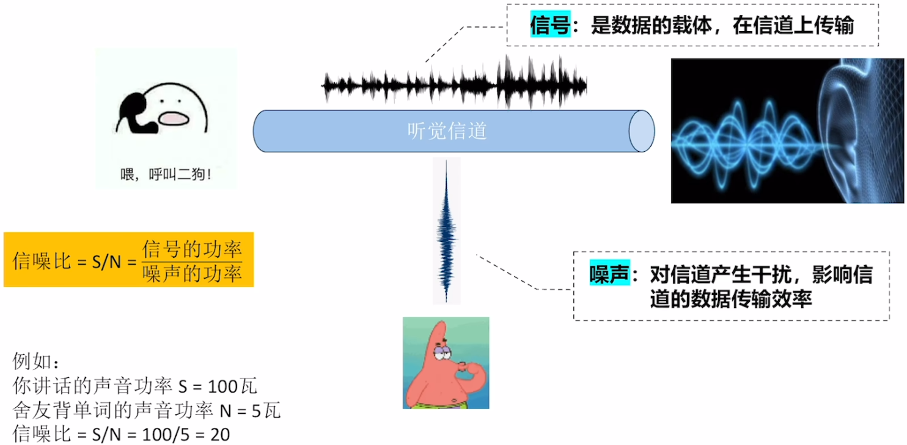

由信噪比公式可知，<u>信噪比越高，噪声对于数据传输的影响越小</u>。而提高信噪比，可以通过提高信号的功率或降低噪声的功率。

上述信噪比无单位。

#### 信噪比（另一记法）

以“db（分贝）”为单位来表示**信噪比**，则有：

$$
信噪比 = 10 \log_{10} \dfrac{S}{N}
$$

单位为：db（分贝）。

在通信领域，信号功率往往比噪声功率大得多，如：

网线信号功率 > 10W，电场、磁场噪声干扰极小。

采用无单位记法，信噪比为 $\dfrac{S}{N} = 10000000000000000000$。

将上述记法转换为以分贝为单位，信噪比为：

$$
10 \log_{10} \frac{S}{N} = 10 \log_{10} 10000000000000000000 = 190 \text{db}
$$

---

而在香农定理中，采用的信噪比为无单位记法。

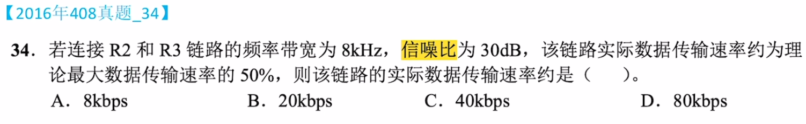

将 30db 转换为无单位记法，有：

$$
\frac{S}{N} = 10^3 = 1000
$$

因此根据香农定理，**理论极限比特率**为：

$$
\begin{align*}
C
&= W \log_2 \left(1 + \frac{S}{N}\right) \\
&= 8 \text{k} \log_2 (1 + 1000) \\
&\approx 80 \text{kbps}
\end{align*}
$$

即理论最大传输速率为 80kbps，因此实际传输速率为 40kbps。

### 奈奎斯特定理 vs. 香农定理

**奈奎斯特（_Nyquist_）定理**：对于一个<u>理想低通信道</u>（**没有噪声**、带宽有限的信道），其极限波特率为 2W。（单位：波特，即码元/秒）

奈奎斯特定理说明：

- 波特率太高，会导致“码间串扰”，即接收方无法识别码元。
- 带宽越大，信道传输码元的能力越强。
- 奈奎斯特定理并未对一个码元最多可以携带多少比特做出解释。

**香农（Shannon）定理**：对于 一个有噪声、带宽有限的信道，其**极限比特率**为 $W \log_2(1 + \dfrac{S}{N})$（单位：b/s）。

香农定理说明：

- 提升信道带宽、加强信号功率、降低噪声功率，都可以提升信道的极限比特率。
- 结合奈奎斯特定理可知，在带宽、信噪比均确定的信道上，一个码元可以携带的比特数是有上限的。

---

**知识回顾**：

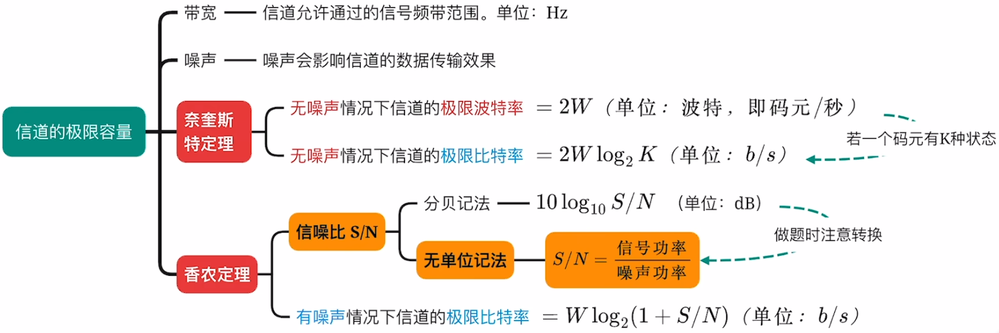

## 编码和调制

**知识总览**：

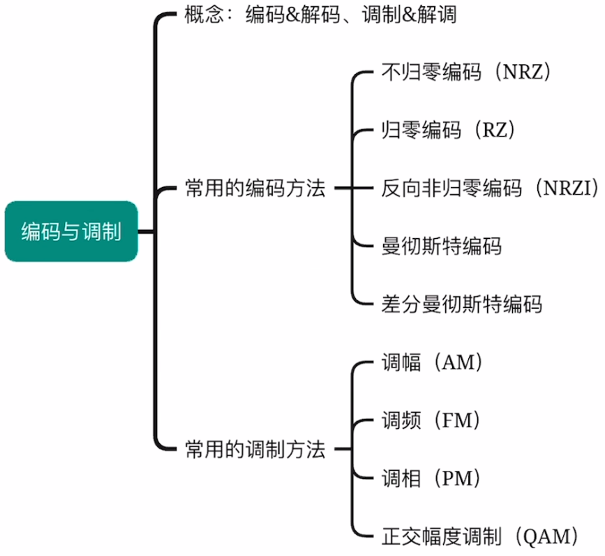

### 编码 & 解码、调制 & 解调

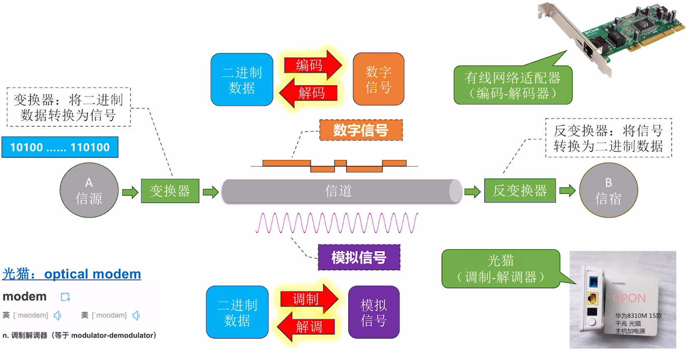

> [!tip]
>
> - 编码：Encoding
> - 解码：Decoding
> - 调制：Modulation
> - 解调：Demodulation

### 常见的编码方法

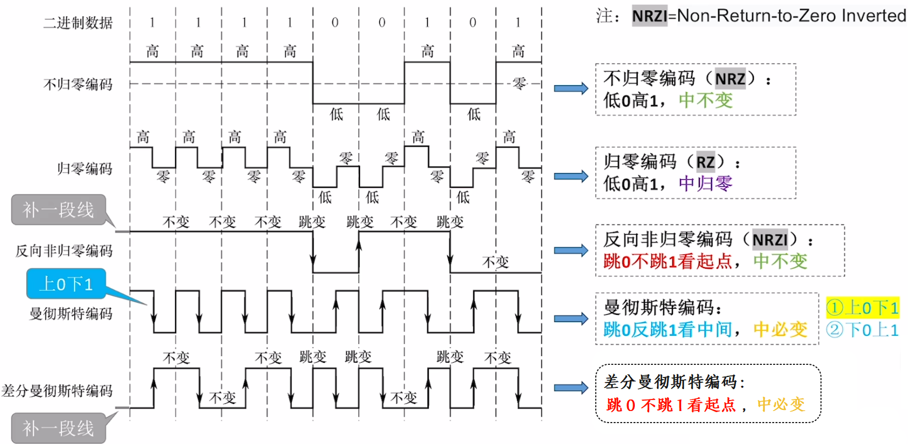

#### 曼彻斯特编码

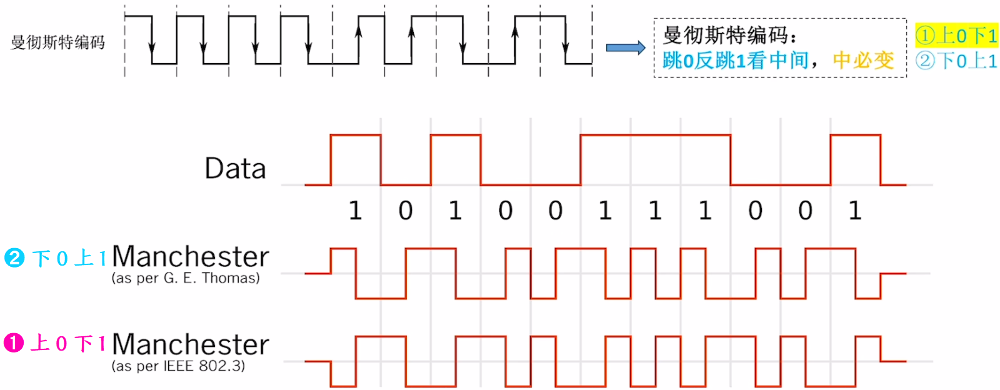

> [!tip]
>
> Manchester 编码是在**每个比特周期的中间**发生电平跳变，而不是在**信号周期的边缘**跳变。

### 各种编码的特点

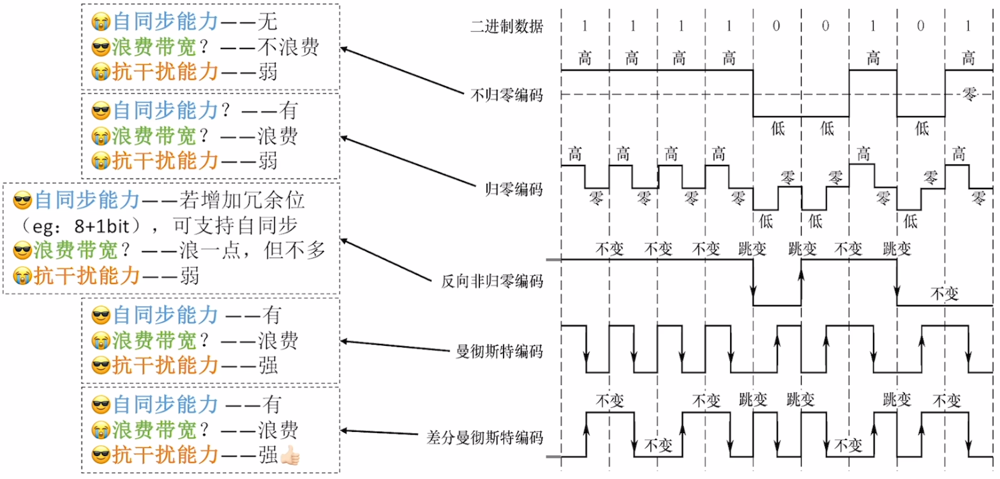

> [!tip]
>
> 自同步能力：信源和信宿可以根据信号完成“节奏同步”，无需时钟信号。

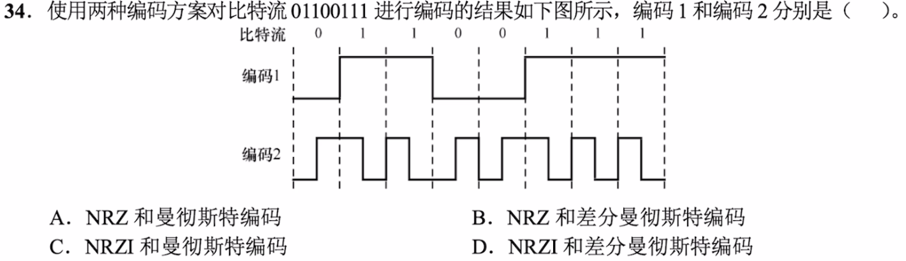

易知，选择选项 A。

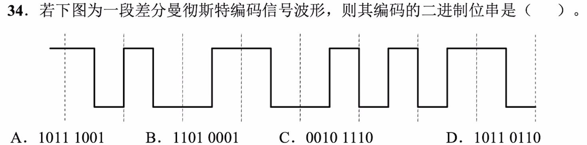

差分曼彻斯特编码的特点是**跳 0 不跳 1 看起点，中必变**。

由此可知，该题选择 A。

### 常见的调制方法

**基带信号**：来自信源的数字信号，需调制后才可以在某些信道上传输。

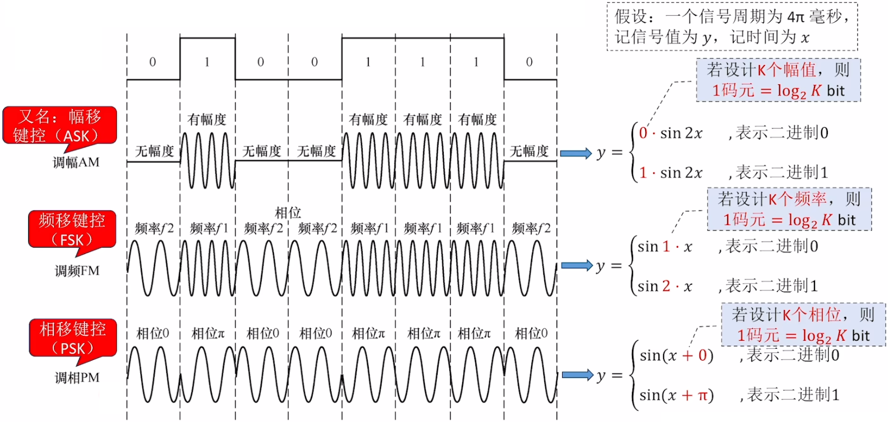

> [!tip]
>
> - **调幅**：Amplitude Modulation
> - **调频**：Frequency Modulation
> - **调相**：Phase Modulation

### 正交幅度调制（QAM）

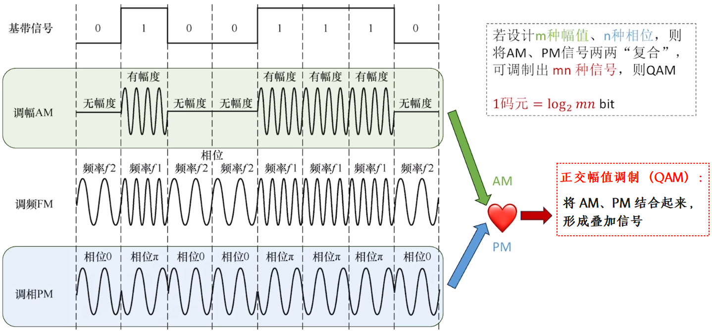

### 常用的 QAM 调制方案

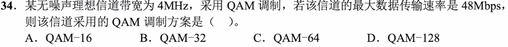

常用的 QAM 调制方案：

- **QAM-16**：调制 16 种信号，1 码元携带 $\log_2 16 = 4 \text{bit}$ 数据。
- **QAM-32**：调制 32 种信号，1 码元携带 $\log_2 32 = 5 \text{bit}$ 数据。
- **QAM-64**：调制 64 种信号，1 码元携带 $\log_2 64 = 6 \text{bit}$ 数据。
- **QAM-128**：调制 128 种信号，1 码元携带 $\log_2 128 = 7 \text{bit}$ 数据。

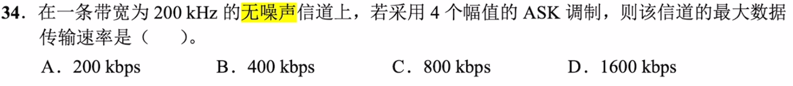

因为**无噪声**，所以采用奈奎斯特定理，其极限波特率为 2W（单位：波特，即码元/秒）。

每个码元携带 $\log_2 4 = 2 \text{bit} $ 数据。

因此该信道最大数据传输速率为 $2 \times 200 \text{k} \times \log_2 4 = 800 \text{kbps}$。

---

**知识回顾**：

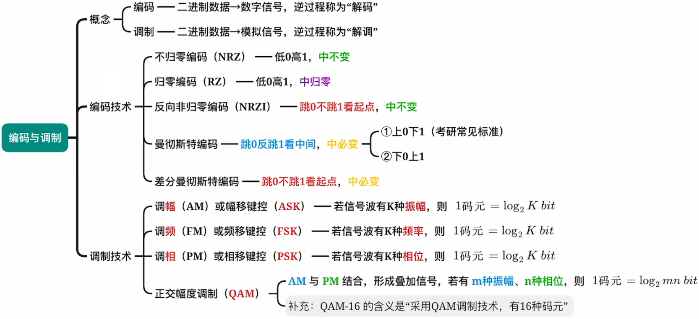

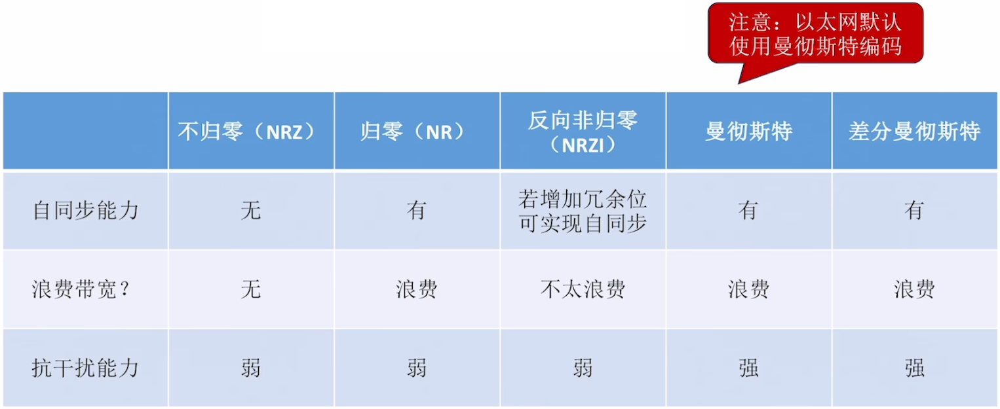

## 传输介质

**知识总览**：

### 双绞线

> [!tip]
>
> - 双绞线（Twisted Pair, TP）
> - 屏蔽（Shielded）
> - 非屏蔽（Unshielded）

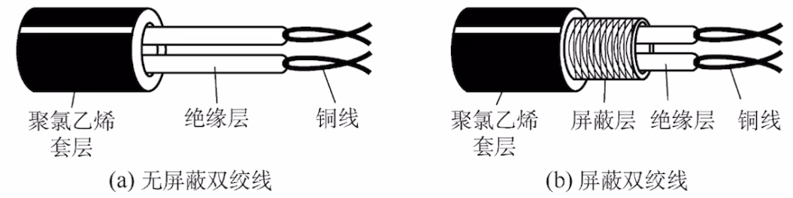

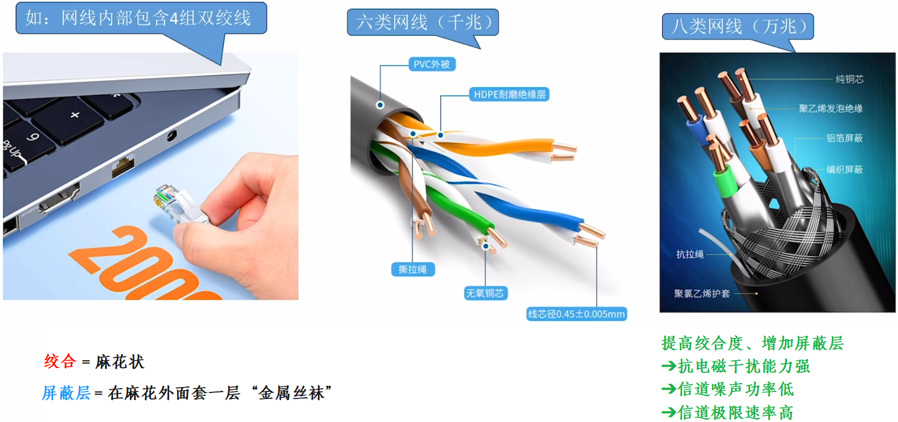

### 同轴电缆

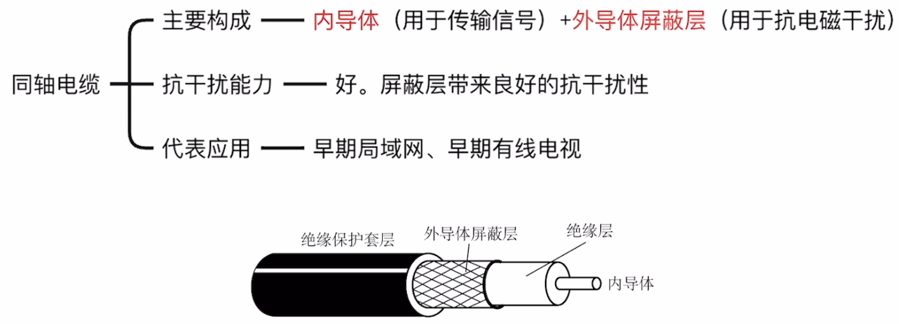

内导体越粗、电阻越低，传输过程中信号衰减越少、传输距离越长。

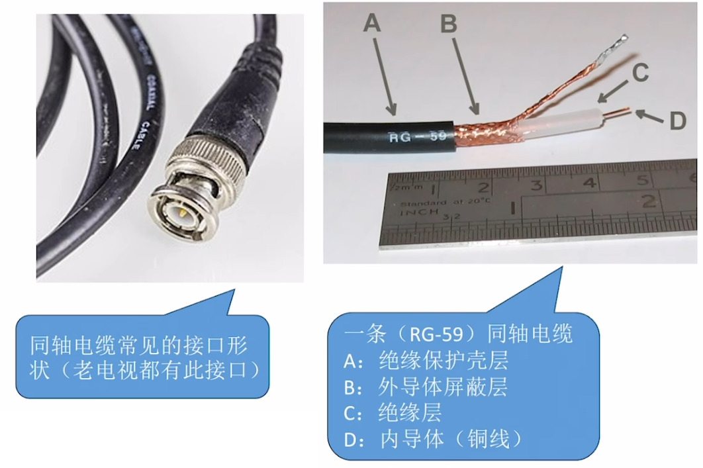

### 光纤

**知识总览**：

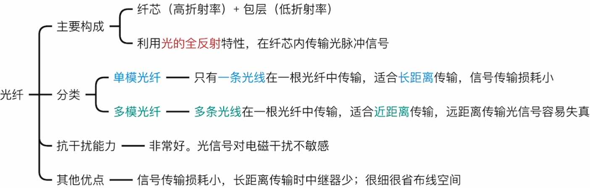

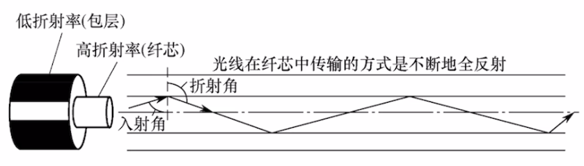

#### 多模光纤、单模光纤

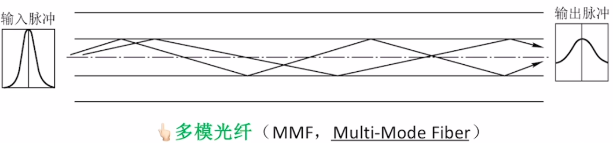

**特点**：纤芯更粗，可以同时传输多条光线，信号传输损耗更高；适合较近距离传输。

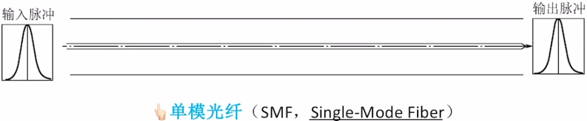

**特点**：纤芯更细，直径小于一个波长，只能传输一条光线，信号传输损耗低；适合远距离传输。

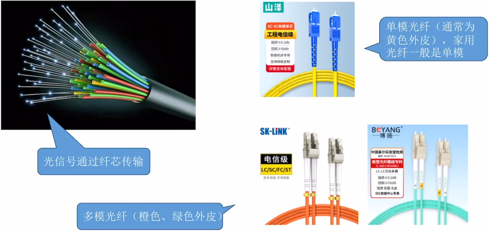

### 以太网对有线传输介质的命名规则

- 10Base5：10Mbps，同轴电缆，最远传输距离 500m。
- 10Base2：10Mbps，同轴电缆，最远传输距离 200m（实际上是 185）。
- 10BaseF\*：10Mbps，光纤。\* 可以是其他信息，如 10BaseFL、10BaseFB、10BaseFP。
- 10BaseT\*：10Mbps，双绞线。\* 可以是其他信息，如 10BaseT1S、10BaseT1L。

其他示例：

- 1000BaseT1：1000Mbps，双绞线。
- 2.5GBaseT：2.5Gbps，双绞线。

### 无线传输介质

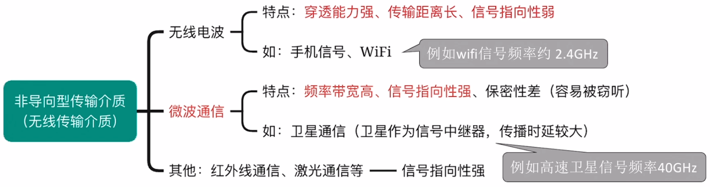

本质上都是使用电磁波，电磁波的公式为：

$$
C = \lambda F
$$

其中，$C$ 为光速，$\lambda$ 为波长，$F$ 为频率。

- 电磁波频率、波长呈反比关系。

- 频率越高，数据传输能力越强。

- 波长越短，“信号指向性”越强，信号越趋于直线传播。

  

- 波长越长，“绕射性”越好，也就是信号“穿墙”能力越强。

长波更适合长距离、非直线通信。

短波更适合短距离、高速通信，若用于长距离通信需要建立中继站；短波信号指向性强，要求信号接收器“对准”信号源。

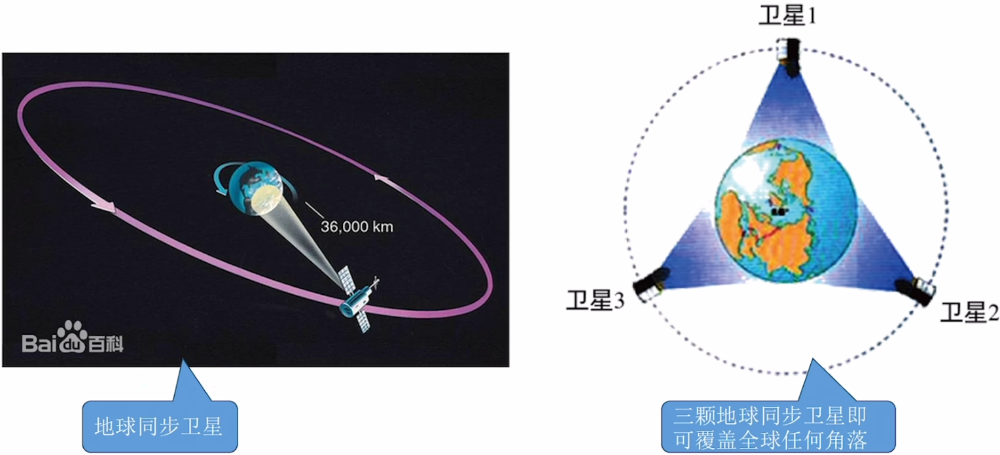

**特点**：<u>传播时延较大</u>，可用近地卫星群解决。

### 物理层接口的特性

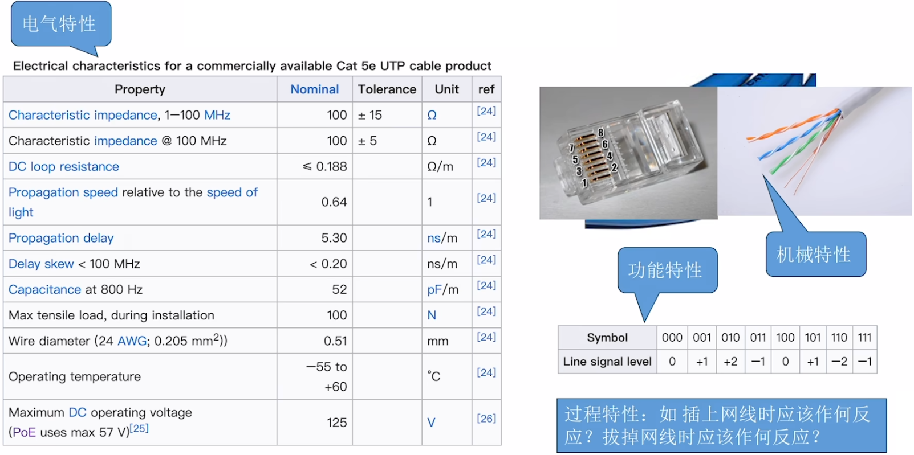

---

**知识回顾**：

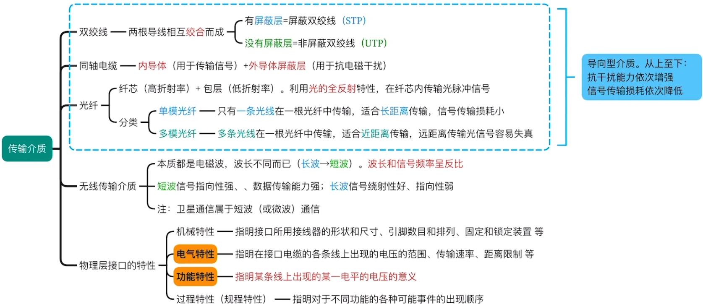

## 物理层设备

**知识总览**：

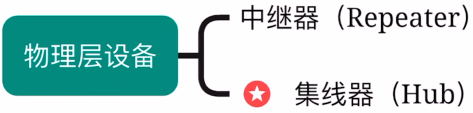

### 中继器（Repeater）

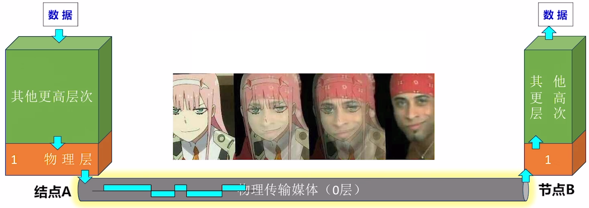

若传输距离太长，数字信号会失真。

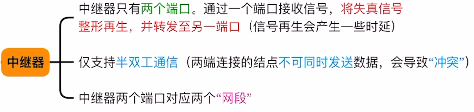

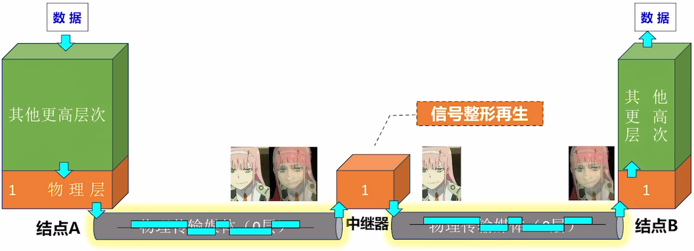

举例，物理层“电气特性”规定：0.5~1.5V 是低电平，4.5~5.5V 是高电平，不符合此标准的信号视为无效。中继器在接收到信号后，会将低电平整形为 1V，将高电平整形为 5V，然后再输出。

### 集线器（Hub）

**知识总览**：

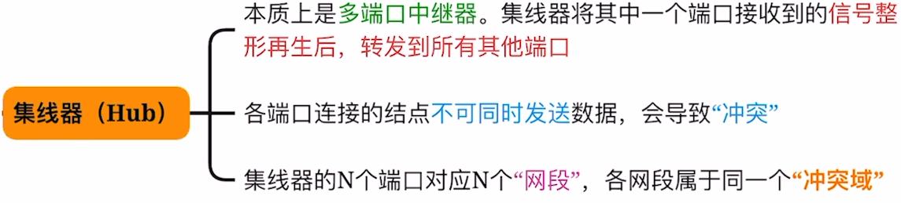

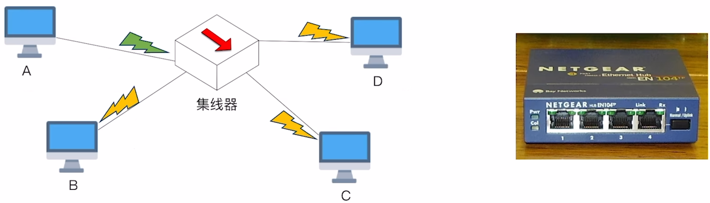

#### 冲突域

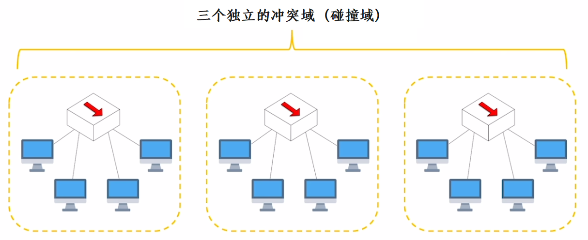

**冲突域（碰撞域）**：如果两台<u>主机</u>同时发送数据会导致“冲突”，则这两台主机处于同一个“冲突域”。

处于同一冲突域的主机在发送数据前需要进行“信道争用”。

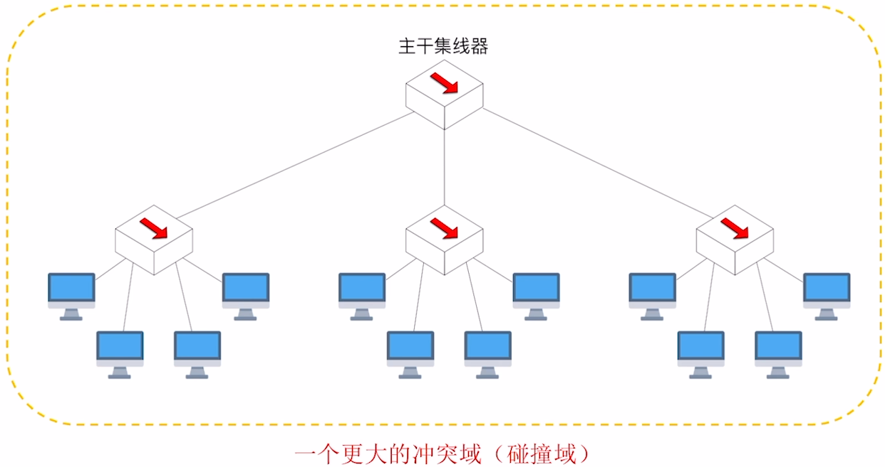

**集线器**这种设备无法“隔离”冲突域。

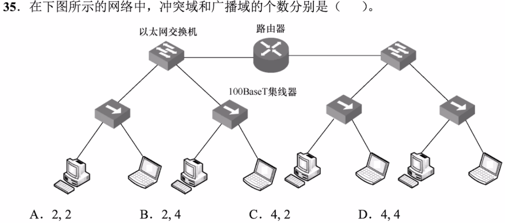

> [!tip]
>
> - **100BaseT 集线器**表示可以连接符合以太网“100BaseT”标准的网段。
> - 以太网交换机可以“隔离”冲突域。

### 集线器、中继器的一些特性

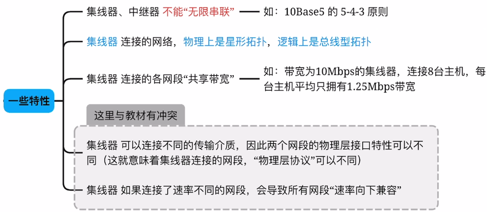

5-4-3 原则：使用集线器（或中继器）连接 10Base5 网段时，最多只能串联 5 个网段，使用 4 台集线器（或中继器），只有 3 个网段可以挂接计算机。

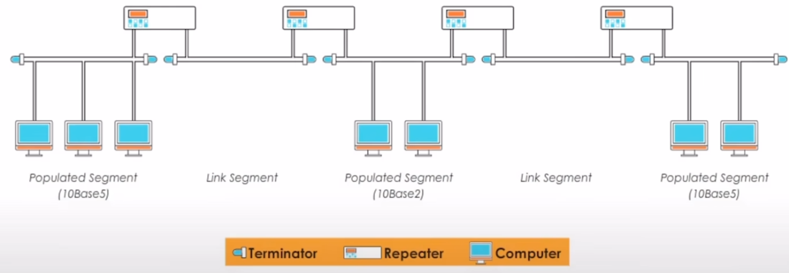

> [!tip]
>
> 上图中一根同轴电缆连接多台计算机的方式为*<u>总线型拓扑</u>*。



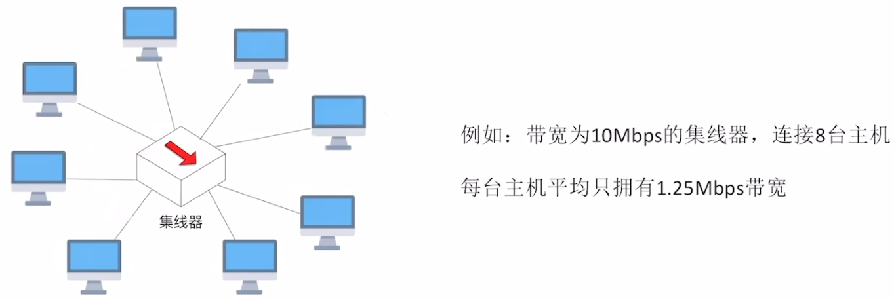

---

**知识回顾**：

