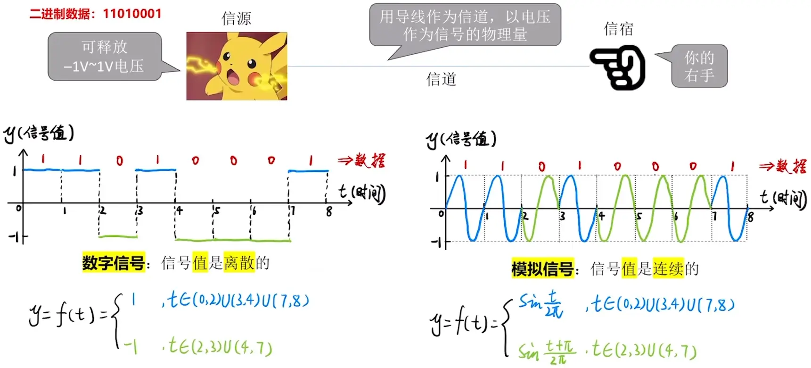

# 物理层

**物理层任务**：实现<u>相邻节点</u>之间比特（0 或 1）的传输。

## 通信基础——基本概念

**知识总览**：

### 信源、信宿、信号、信道

### 数字信号、模拟信号

可以作为**信号的物理量**有：电压、电磁波等。

### 从数学函数的角度理解信号值

### 码元的概念

每一个信号就是一个“码元”，可以把“码元宽度”。

若一个信号周期内出现 4 种信号，那么每个信号就可以对应一个 4 进制数（2bit），如：

- 2V → 00
- 1V → 01
- -1V → 10
- -2V → 11