# 网络层

<u>**网络层**</u>为<u>传输层</u>提供服务，将传输层的数据封装成**“IP 数据报”**。网络中的路由器根据 IP 数据报首部中的*<u>源 IP 地址</u>*、<u>*目的 IP 地址*</u>进行“分组转发”。因此，网络层实现了**“主机到主机”**的传输。

<u>数据链路层</u>为<u>网络层</u>提供服务，将网络层的 **IP 数据报（分组）**封装成***<u>帧</u>***，传输给下一个**相邻结点**。

IP 地址，用 32bit 表示，有 <u>01101110</u> <u>10111111</u> <u>10110101</u> <u>00110001</u>。

常以 **8bit** 为一族，记为十进制数。（显然每个部分的合法范围为 <u>0~255</u>）

## 网络层的功能

**知识总览**：

> [!tip]
>
> - 接入网络的每台主机至少拥有一个 IP 地址
> - 通常，路由器的每个接口都需要分配一个 IP 地址（最新技术标准已经取消了这个强制要求）

### IPv4 分组

### 各种协议之间的服务关系

**IP 协议**（Internet Protocal，网际协议）是<u>互联网的核心</u>。

**ARP 协议**用于查询同一网络中的 <主机 IP 地址, MAC 地址> 之间的映射关系。

**ICMP 协议**用于网络层实体时间相互通知“异常事件”。

**IGMP 协议**用于实现 IP 组播。

### IP 数据报（IP 分组）的格式

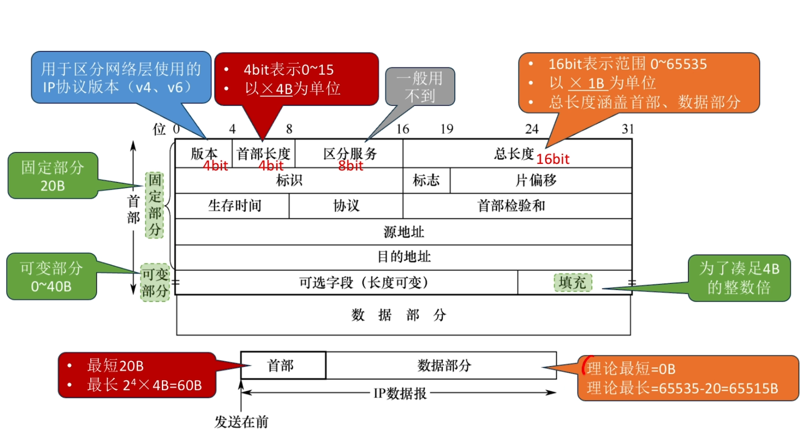

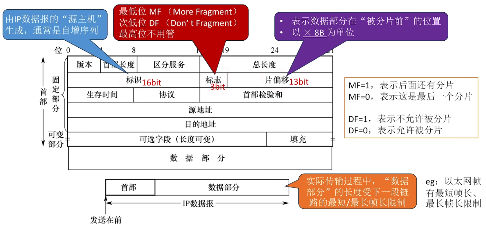

TTL 的初始值通常由**源主机**设置。

每经过一个路由器，路由器就将 TTL 减 1，如果 TTL 减到 0，就直接丢弃分组，并向源主机发送 ICMP 报文。

> [!tip]
>
> ICMP 报文用于通知一个节点发生了某种“异常”。

---

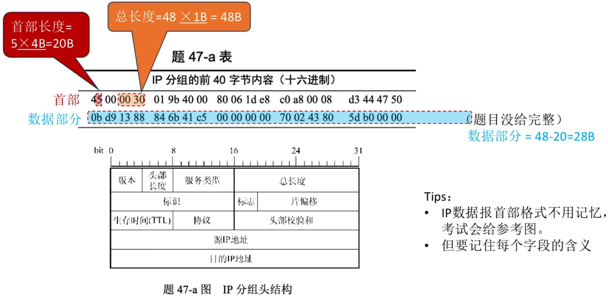

### IP 数据报的“分片”问题

**重要概念**：一个链路层数据帧能承载的最大数据量称为<u>最大传送单元（MTU）</u>。如以太网的 MTU = 1500B。

若一个 IP 数据报的总长度超出了下一段链路的 MTU，就需要分片。

> [!tip]
>
> 每个分片都是一个可以被单独转发的 IP 数据报，都包含首部。

- IP 数据报的“分片”可能在源主机、或任何一个路由器中发生。
- 只有目的主机才会对分片进行“重组”。
- 各分片有可能乱序到达目的主机。
- 由于首部的“片偏移”字段是以 <u>×8B</u> 为单位，因此，**除了<u>最后一个分片</u>外，其他每个分片的数据部分必须是 8B 的整数倍**。

### IP 数据报的生存时间“TTL”（可达示例）

### IP 数据报的生存时间“TTL”（不可达示例）

---

**知识回顾**：

## IP 地址（最初的分类方案）
### IP 数据报（IP 分组）的格式

### 最初的 IP 地址分类方案

**时代背景**：IPv4 协议是 1981 年发明的，当时只有政府、学校、军队等大机构会使用互联网。完全没有预料到互联网用户会迎来爆炸性增长。因此 IPv4 协议中，地址位数仅设计了 32bit（$2^{32} \approx 42$ 亿）。

> [!tip]
>
> IP 地址资源由 ICANN（互联网名字和数字分配机构）进行分配（有偿租用）。

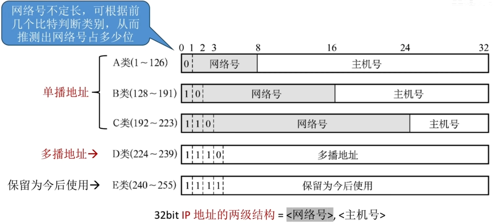

- 在那个年代，要求**每台主机每个路由器接口被分配的 IP 地址都是全球唯一的**。
- **路由器和路由器连接的接口可以不分配 IP 地址**，但**路由器和其他节点连接的接口必须分配 IP 地址**
- 从属于**<u>同一个网络</u>的所有主机、路由器接口的 IP 地址“网络号”都相同**
- 当一台新主机接入网络时，需要给它分配一个IP地址、并配置“默认网关”

### 一些特殊用途的 IP 地址

| 网络号 |          主机号          | 作为分组源地址？ | 作为分组目的地址？ |                      代表的含义                      |
| :----: | :----------------------: | :--------------: | :----------------: | :--------------------------------------------------: |
|   Y    |           全 0           |        ×         |         ×          |      表示整个网络本身（只能用于路由表、转发表）      |
|   Y    |           全 1           |        ×         |         ✓          |           向网络号为 Y 的网络广播 IP 分组            |
|   0    |            Y             |        ✓         |         ×          |            表示本网络中主机号为 Y 的主机             |
|  全 0  |           全 0           |        ✓         |         ×          |       本网络上的本主机（会在 DHCP 协议中使用）       |
|  全 1  |           全 1           |        ×         |         ✓          |                 向本网络广播 IP 分组                 |
|  127   | 非全 0 或非全 1 的任何数 |        ✓         |         ✓          | 环回自检地址。表示一台主机本身，用于本地软件环回测试 |

> [!tip]
>
> 以上这些特殊地址不可指派给网络中的任何一台主机或路由器“私用”。

**重要结论**：前 2 行说明，若一个网络中，主机号占 N bit，那么在这个网络中，最多支持 2^N^ - 2 台主机 & 路由器。

## 子网划分 & 子网掩码

**知识总览**：

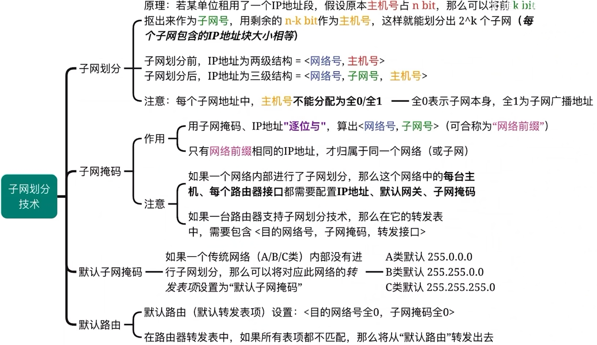

### 暂未使用子网划分技术

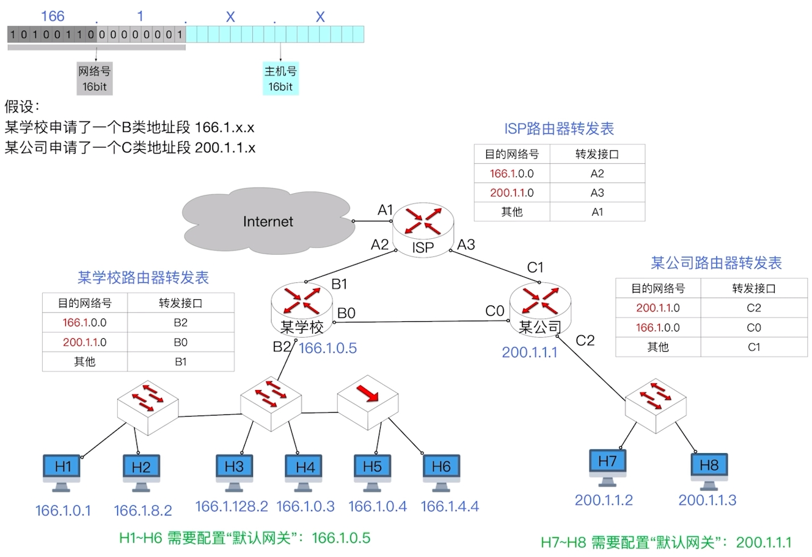

### 学校网络使用了子网划分技术（划分为两个子网道计算机）

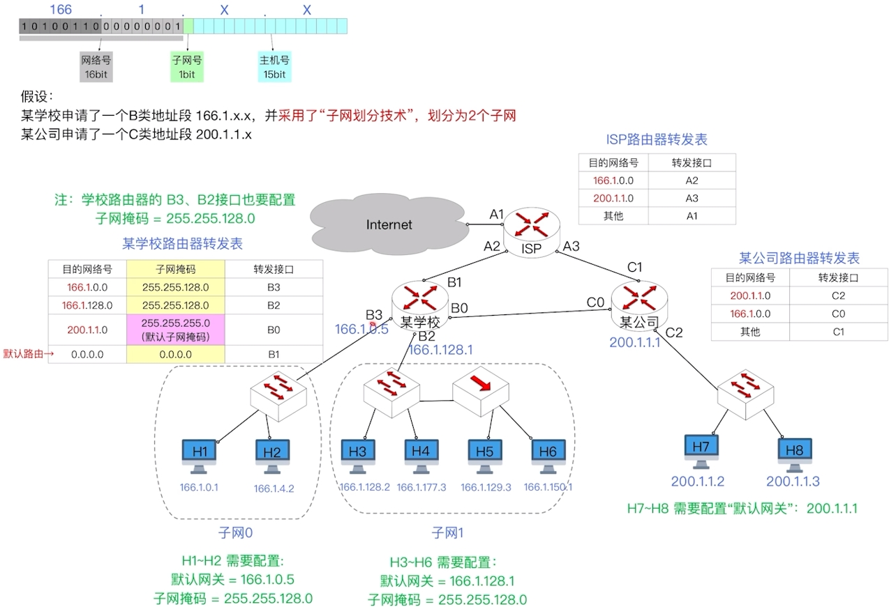

### 学校网络使用了子网划分技术（划分为 4 个子网）

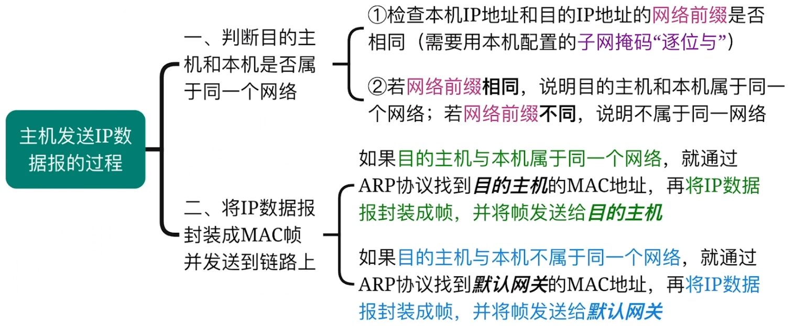

### 子网掩码的 CIDR 记法

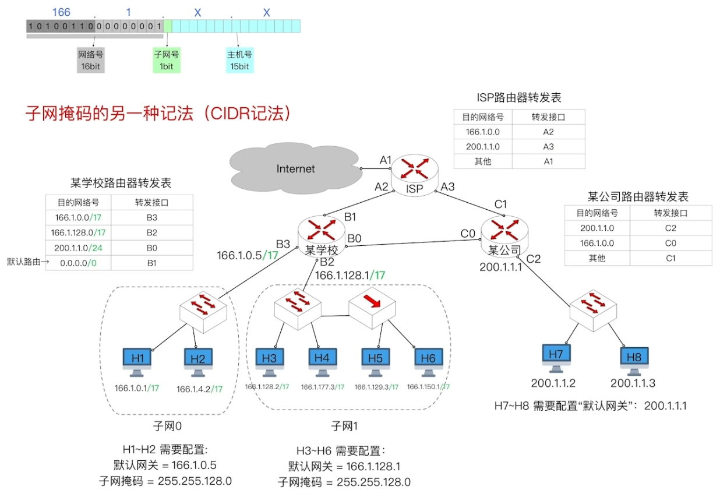

## 无分类编制 CIDR

**知识总览**：

**时代背景**：1993 年推出**无分类编址 CIDR**，当时互联网在民用领域大放异彩，由于每台主机都至少要消耗一个全球唯一的 IP 地址。***<u>IP 地址资源告急。</u>***

### 传统的 IP 地址划分方案有什么缺陷？

- 一个 A 类地址块包含 2^24^ = 16,777,216 个 IP 地址
- 一个 B 类地址块包含 2^16^ = 65536 个 IP 地址
- 一个 C 类地址块包含 2^8^ = 256 个 IP 地址

例如某单位有 2000 台主机想要联网，就不得不申请一个 B 类地址块。

IP 地址资源分配不灵活，利用率低，有限的 IP 地址资源将很快耗尽。

### 无分类编址 CIDR

例如某单位有 2000 台主机想要联网，IP 地址管理机构可以给它分配一个 21bit 网络前缀的 CIDR 地址块。

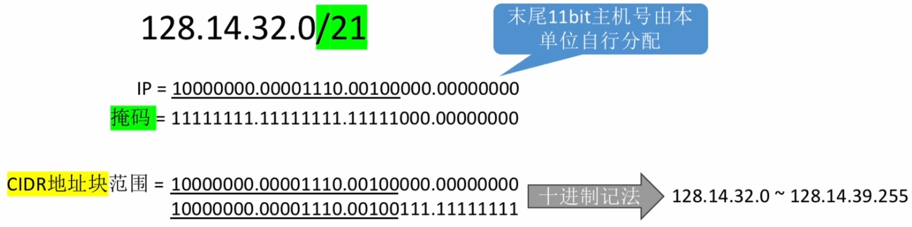

### 定长子网划分、变长子网划分

一个单位获得 CIDR 地址块后，可以把它划分为多个子网。

定长子网划分：在一个 CIDR 地址块中，把主机号前 k bit 抠出来作为定长子网号（与传统的子网划分技术同理），这样即可划分出 2^k^ 个子网（每个子网包含的 IP 地址块大小相等）。

变长网划分（子网划分更加灵活）：在一个 CIDR 地址块中，划分子网时，子网号长度不固定（每个子网包含的 IP 地址块大小不同）。

#### 传统的“定长子网划分”方案有什么缺陷？

假设某学校申请了一个 IP 地址块：166.1.X.X。

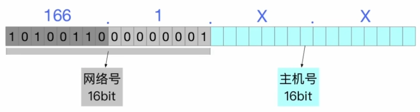

定长子网划分：在申请一个 IP 地址块后，将 n bit 主机号的前 k bit 抠出来作为子网号，这样即可划分出 2^k^ 个定长子网（每个子网包含的 IP 地址块大小相等，都包含 2^n-k^ 个 IP 地址）。

**缺点**：每个子网<u>*均一样大*</u>，不够灵活，IP 地址利用率低，浪费有限的 IP 地址资源。

### 无分类编址 CIDR、变长子网划分的应用

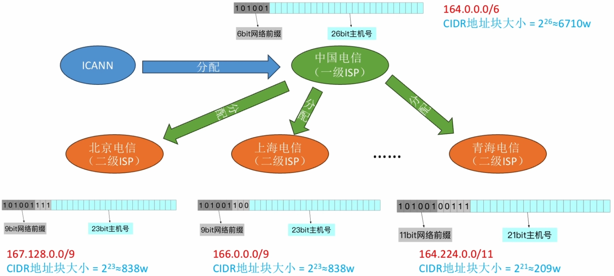

子网划分更加灵活，且方便地址资源的分层级管理。

---

东海帝皇开了一家公司，叫“哈基米电信”，希望成为村里的 ISP。“哈基米电信”花重金向上一级 IP 地址管理机构租用了一个 CIDR 地址块 128.14.32.128/27（<u>10000000.00001110.00100000.100</u>00000）。

1. 请问哈基米电信拥有多少个 IP 地址资源？

   2^5^ = 32。

2. 村里的年轻人诗歌剧想开网吧，于是向哈基米购买宽带服务。整个网吧有 12 台电脑，每台电脑需要分配一个 IP 地址，且所有电脑属于同一个子网。

   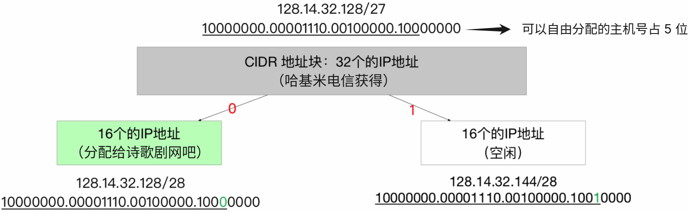

3. 特别周家里很有钱，有 5 口人，人手一台电脑，每台电脑需要分配一个 IP 地址，所有电脑要组成一个子网。

   

4. 黄金船家里只有一台电脑，需要从哈基米电信的路由器拉一条“路由器直连主机”的点对点链路。

   

   

   点对点链路是一个最小的子网，至少需要保留 <u>2 bit</u> 作为主机号。

   因为主机号全 1、全 0 不能分配给节点，因此仅 1 bit 主机号是不够用的。

请为哈基米电信设计一个地址分配方案，并配置哈基米电信的路由器转发表，确保诗歌剧的网吧、特别周家、黄金船家可以接入 Internet。

|     目的网络     | 转发接口 |
| :--------------: | :------: |
| 128.14.32.128/28 |    F1    |
| 128.14.32.144/29 |    F2    |
| 128.14.32.152/30 |    F3    |
|    0.0.0.0/0     |    F0    |

CIDR 地址块的子网划分技巧：可以利用类似于“从根到叶构造二叉哈夫曼树”的技巧。

- 原始 CIDR 地址块作为根节点（假设可以自由分配的主机号占 h bit）。
- 每个分支节点必须同时拥有左右孩子，左 0、右 1（反过来也行）。
- 每个叶子结点对应一个子网，根据根节点到达叶子结点的路径来分析子网对应的 IP 地址块范围。
- 整棵树的高度不能超过 h - 1（因为即便最小的子网也至少要保留 2bit 主机号）。

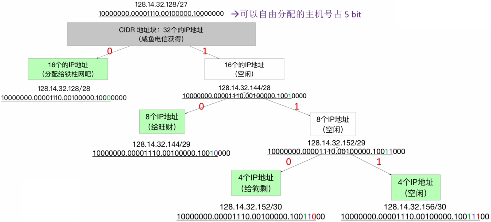

---

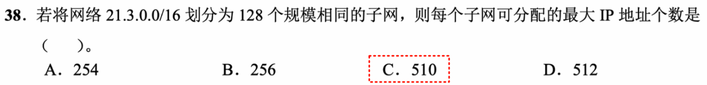

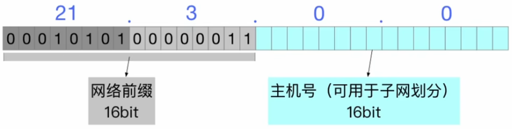

2^7^ = 128，因此需要使用 7 bit 作为定长子网号。

每个子网中，主机号占 16 - 7 = 9bit。

可分配的 IP 地址个数为 2^9^ - 2 = 510。（主机号全 0、全 1 不能分配给某个节点私用）

---

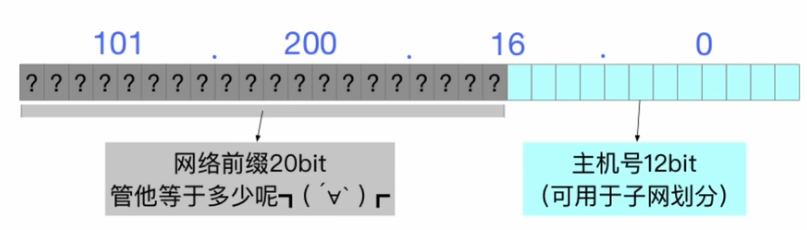

- 要划分 5 个子网，意味着构造的二叉哈夫曼树包含 5 个叶节点。
- 要让 1 个子网尽可能的小，就要让一个叶子节点尽可能的深。
- 最深的叶子与根节点的距离为 4，意味着最小的子网，需要从原 CIDR 地址块中，拿出 4bit 作为子网号，剩下 12 - 4 = 8bit 作为<u>*该子网的主机号*</u>。
- 最小子网可分配的 IP 地址数为 **2^8^ - 2 = 254**。

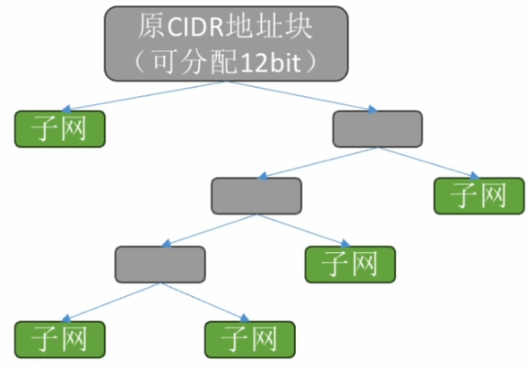

---

**知识回顾**：

## 路由聚合

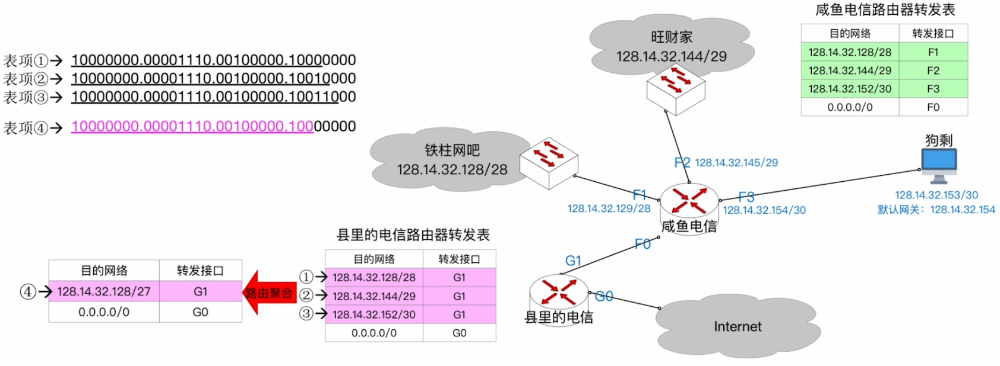

对于一个路由转发表，如果几条路由表项的转发接口相同，部分网络前缀也相同，那么可以将这几条路由表项聚合为一条。这种地址的聚合称为<u>路由聚合</u>，也称<u>构成超网</u>。

- 路由聚合可以**减少路由表的大小**。
- 路由聚合可能**会引入额外的无效地址**。如 128.14.32.156/30。
- 表更小，查询更快。
- 上图中“咸鱼电信路由器转发表”中，前三个表项转发接口不同，不可进行路由聚合。

### 最长前缀匹配原则

**假设**：县里的电信路由器收到一个来自互联网的 IP 数据包，目的 IP 地址为 128.14.32.131 = 10000000.00001110.00100000.10000011。

根据最长前缀匹配原则，命中表项 ②，从 **G3 接口**转发出去。

---

**假设**：县里的电信服务器收到一个来自互联网的 IP 数据包，目的 IP 地址为 128.14.32.153。

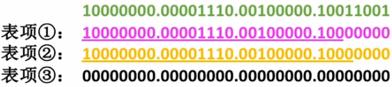

根据最长前缀匹配原则，表项 ① 匹配的前缀最长，从 **G1 接口**转发出去。

---

采用 CIDR 技术后，过程类似。

采用 CIDR 技术后，由于“<u>路由聚合</u>”，一个 IP 地址在转发表中可能会匹配多个表项，此时应使用**<u>最长前缀匹配原则</u>**。

**路由聚合**：对于一个路由转发表，若几条路由表项的**转发接口相同**，**部分网络前缀也相同**，那么可以<u>*将这几条路由表项聚合为一条*</u>。

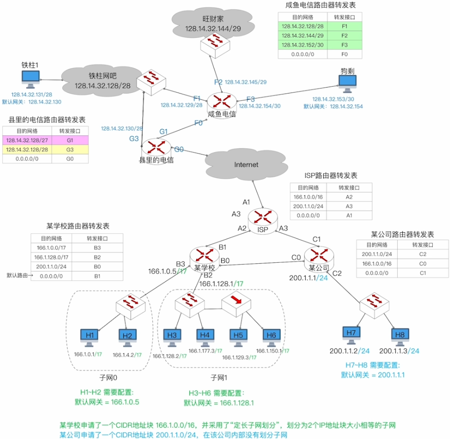

