# 网络层


<u>**网络层**</u>为<u>传输层</u>提供服务，将传输层的数据封装成**“IP 数据报”**。网络中的路由器根据 IP 数据报首部中的*<u>源 IP 地址</u>*、<u>*目的 IP 地址*</u>进行“分组转发”。因此，网络层实现了**“主机到主机”**的传输。

<u>数据链路层</u>为<u>网络层</u>提供服务，将网络层的 **IP 数据报（分组）**封装成***<u>帧</u>***，传输给下一个**相邻结点**。


IP 地址，用 32bit 表示，有 <u>01101110</u> <u>10111111</u> <u>10110101</u> <u>00110001</u>。

常以 **8bit** 为一族，记为十进制数。（显然每个部分的合法范围为 <u>0~255</u>）

## 网络层的功能

**知识总览**：


> [!tip]
>
> - 接入网络的每台主机至少拥有一个 IP 地址
> - 通常，路由器的每个接口都需要分配一个 IP 地址（最新技术标准已经取消了这个强制要求）

### IPv4 分组

### 各种协议之间的服务关系


**IP 协议**（Internet Protocal，网际协议）是<u>互联网的核心</u>。

**ARP 协议**用于查询同一网络中的 <主机 IP 地址, MAC 地址> 之间的映射关系。

**ICMP 协议**用于网络层实体时间相互通知“异常事件”。

**IGMP 协议**用于实现 IP 组播。

### IP 数据报（IP 分组）的格式


TTL 的初始值通常由**源主机**设置。

每经过一个路由器，路由器就将 TTL 减 1，如果 TTL 减到 0，就直接丢弃分组，并向源主机发送 ICMP 报文。

> [!tip]
>
> ICMP 报文用于通知一个节点发生了某种“异常”。

---


### IP 数据报的“分片”问题


**重要概念**：一个链路层数据帧能承载的最大数据量称为<u>最大传送单元（MTU）</u>。如以太网的 MTU = 1500B。

若一个 IP 数据报的总长度超出了下一段链路的 MTU，就需要分片。


> [!tip]
>
> 每个分片都是一个可以被单独转发的 IP 数据报，都包含首部。

- IP 数据报的<span style="color:#EA2264; font-weight:bold">“分片”</span>可能在<span style="color:#EA2264; font-weight:bold">源主机、或任何一个路由器</span>中发生。
- 只有<span style="color:#33A1E0; font-weight:bold">目的主机</span>才会对分片进行<span style="color:#33A1E0; font-weight:bold">“重组”</span>。
- 各分片有可能乱序到达目的主机。
- 由于首部的“片偏移”字段是以 <u>×8B</u> 为单位，因此，**除了<u>最后一个分片</u>外，其他每个分片的数据部分必须是 8B 的整数倍**。

### IP 数据报的生存时间“TTL”（可达示例）


### IP 数据报的生存时间“TTL”（不可达示例）


---

**知识回顾**：


## IP 地址（最初的分类方案）
### IP 数据报（IP 分组）的格式


### 最初的 IP 地址分类方案


**时代背景**：IPv4 协议是 1981 年发明的，当时只有政府、学校、军队等大机构会使用互联网。完全没有预料到互联网用户会迎来爆炸性增长。因此 IPv4 协议中，地址位数仅设计了 32bit（$2^{32} \approx 42$ 亿）。

> [!tip]
>
> IP 地址资源由 ICANN（互联网名字和数字分配机构）进行分配（有偿租用）。


- 在那个年代，要求**每台主机每个路由器接口被分配的 IP 地址都是全球唯一的**。
- **路由器和路由器连接的接口可以不分配 IP 地址**，但**路由器和其他节点连接的接口必须分配 IP 地址**
- 从属于**<u>同一个网络</u>的所有主机、路由器接口的 IP 地址“网络号”都相同**
- 当一台新主机接入网络时，需要给它分配一个IP地址、并配置“默认网关”


### 一些特殊用途的 IP 地址

| 网络号 |          主机号          | 作为分组源地址？ | 作为分组目的地址？ |                      代表的含义                      |
| :----: | :----------------------: | :--------------: | :----------------: | :--------------------------------------------------: |
|   Y    |           全 0           |        ×         |         ×          |      表示整个网络本身（只能用于路由表、转发表）      |
|   Y    |           全 1           |        ×         |         ✓          |           向网络号为 Y 的网络广播 IP 分组            |
|   0    |            Y             |        ✓         |         ×          |            表示本网络中主机号为 Y 的主机             |
|  全 0  |           全 0           |        ✓         |         ×          |       本网络上的本主机（会在 DHCP 协议中使用）       |
|  全 1  |           全 1           |        ×         |         ✓          |                 向本网络广播 IP 分组                 |
|  127   | 非全 0 或非全 1 的任何数 |        ✓         |         ✓          | 环回自检地址。表示一台主机本身，用于本地软件环回测试 |

> [!tip]
>
> <span style="color:#ED3F27">以上这些特殊地址不可指派给网络中的任何一台主机或路由器“私用”。</span>

**重要结论**：前 2 行说明，若一个网络中，<span style="color:#006A67; font-weight:bold">主机号占 N bit</span>，那么在这个网络中，<span style="color:#006A67; font-weight:bold">最多支持 2^N^ - 2 台</span>主机 & 路由器。

## 子网划分 & 子网掩码

**知识总览**：


### 暂未使用子网划分技术


### 学校网络使用了子网划分技术（划分为两个子网道计算机）


### 学校网络使用了子网划分技术（划分为 4 个子网）


### 子网掩码的 CIDR 记法


## 无分类编制 CIDR

**知识总览**：


**时代背景**：1993 年推出**无分类编址 CIDR**，当时互联网在民用领域大放异彩，由于每台主机都至少要消耗一个全球唯一的 IP 地址。***<u>IP 地址资源告急。</u>***

### 传统的 IP 地址划分方案有什么缺陷？


- 一个 A 类地址块包含 2^24^ = 16,777,216 个 IP 地址
- 一个 B 类地址块包含 2^16^ = 65536 个 IP 地址
- 一个 C 类地址块包含 2^8^ = 256 个 IP 地址

例如某单位有 2000 台主机想要联网，就不得不申请一个 B 类地址块。

<span style="color:#6F00FF; font-weight:bold">IP 地址资源分配不灵活，利用率低，有限的 IP 地址资源将很快耗尽。</span>

### 无分类编址 CIDR


例如某单位有 2000 台主机想要联网，IP 地址管理机构可以给它分配一个 <span style="color:#E9A319">21bit 网络前缀</span>的 <span style="color:#5EABD6">CIDR 地址块</span>。


### 定长子网划分、变长子网划分

一个单位获得 CIDR 地址块后，可以把它划分为多个子网。

<span style="color:#9B177E; font-weight:bold">定长子网划分</span>：在一个 CIDR 地址块中，把主机号前 k bit 抠出来作为定长子网号（与传统的子网划分技术同理），这样即可划分出 2^k^ 个子网（每个子网包含的 IP 地址块大小相等）。

<span style="color:#06923E; font-weight:bold">变长网划分</span>（子网划分更加灵活）：在一个 CIDR 地址块中，划分子网时，<span style="color:#C83F12">子网号长度不固定</span>（每个子网包含的 IP 地址块大小不同）。

#### 传统的“定长子网划分”方案有什么缺陷？

假设某学校申请了一个 IP 地址块：166.1.X.X。


<span style="color:#B22222; font-weight:bold">定长子网划分</span>：在申请一个 IP 地址块后，将 <span style="color:#FF7D29">n bit 主机号</span>的<span style="color:#0ABAB5">前 k bit</span> 抠出来作为<span style="color:#B22222">子网号</span>，这样即可划分出 <span style="color:#0ABAB5">2^k^ 个定长子网</span>（每个子网包含的 IP 地址块大小相等，都<span style="color:#B22222">包含 2^n-k^ 个 IP 地址</span>）。

**缺点**：每个子网<u>*均一样大*</u>，不够灵活，IP 地址利用率低，浪费有限的 IP 地址资源。

### 无分类编址 CIDR、变长子网划分的应用


子网划分更加灵活，且方便地址资源的分层级管理。

---

东海帝皇开了一家公司，叫“哈基米电信”，希望成为村里的 ISP。“哈基米电信”花重金向上一级 IP 地址管理机构租用了一个 CIDR 地址块 <span style="color:#B33791">128.14.32.128/27</span>（<span style="color:#B33791"><u>10000000.00001110.00100000.100</u>00000</span>）。

1. 请问哈基米电信拥有多少个 IP 地址资源？

   2^5^ = 32。

2. 村里的年轻人诗歌剧想开网吧，于是向哈基米购买宽带服务。整个网吧有 12 台电脑，每台电脑需要分配一个 IP 地址，且所有电脑属于同一个子网。

   

3. 特别周家里很有钱，有 5 口人，人手一台电脑，每台电脑需要分配一个 IP 地址，所有电脑要组成一个子网。

   

4. 黄金船家里只有一台电脑，需要从哈基米电信的路由器拉一条<span style="color:#FF3F33">“路由器直连主机”的点对点链路</span>。

   

   

   <span style="color:#CD5656">点对点链路是一个最小的子网，至少需要保留 <span style="font-weight:bold"><u>2 bit</u></span> 作为主机号。</span>

   <span style="color:#F564A9">因为主机号全 1、全 0 不能分配给节点，因此仅 1 bit 主机号是不够用的。</span>

请为哈基米电信设计一个地址分配方案，并配置哈基米电信的路由器转发表，确保诗歌剧的网吧、特别周家、黄金船家可以接入 Internet。

|     目的网络     | 转发接口 |
| :--------------: | :------: |
| 128.14.32.128/28 |    F1    |
| 128.14.32.144/29 |    F2    |
| 128.14.32.152/30 |    F3    |
|    0.0.0.0/0     |    F0    |

<span style="color:#7D0A0A; font-weight:bold">CIDR 地址块的子网划分技巧</span>：可以利用类似于<span style="color:#7D0A0A">“从根到叶构造二叉哈夫曼树”</span>的技巧。

- <span style="color:#00879E">原始 CIDR 地址块</span>作为<span style="color:#00879E">根节点</span>（假设可以自由分配的<span style="color:#E07A5F">主机号占 h bit</span>）。
- 每个<span style="color:#2D336B">分支节点必须同时拥有左右孩子</span>，<span style="color:#E52020">左 0、右 1</span>（反过来也行）。
- 每个<span style="color:#DD88CF">叶子结点</span>对应一个<span style="color:#DD88CF">子网</span>，根据<span style="color:#E52020">根节点到达叶子结点的路径</span>来分析<span style="color:#DD88CF">子网</span>对应的 <span style="color:#DD88CF">IP 地址块范围</span>。
- <span style="color:#5B913B">整棵树的高度不能超过 h - 1</span>（因为即便最小的子网也至少要保留 2bit 主机号）。


---


2^7^ = 128，因此需要使用 7 bit 作为定长子网号。

每个子网中，主机号占 16 - 7 = 9bit。

可分配的 IP 地址个数为 2^9^ - 2 = 510。（主机号全 0、全 1 不能分配给某个节点私用）

---


- 要划分 5 个子网，意味着构造的二叉哈夫曼树包含 5 个叶节点。
- 要让 1 个子网尽可能的小，就要让一个叶子节点尽可能的深。
- 最深的叶子与根节点的距离为 4，意味着最小的子网，需要从原 CIDR 地址块中，拿出 4bit 作为子网号，剩下 12 - 4 = 8bit 作为<u>*该子网的主机号*</u>。
- 最小子网可分配的 IP 地址数为 **2^8^ - 2 = 254**。


---

**知识回顾**：


## 路由聚合


对于一个路由转发表，如果几条路由表项的<span style="color:#16C47F; font-weight:bold">转发接口相同</span>，<span style="color:#DF6D2D; font-weight:bold">部分网络前缀也相同</span>，那么可以<span style="color:#001A6E">将这几条路由表项聚合为一条</span>。这种地址的聚合称为<span style="color:#001A6E"><u>路由聚合</u></span>，也称<span style="color:#001A6E"><u>构成超网</u></span>。

- 路由聚合可以**减少路由表的大小**。
- 路由聚合可能**会引入额外的无效地址**。如 128.14.32.156/30。
- 表更小，查询更快。
- 上图中“咸鱼电信路由器转发表”中，前三个表项转发接口不同，不可进行路由聚合。

### 最长前缀匹配原则


**假设**：县里的电信路由器收到一个来自互联网的 IP 数据包，目的 IP 地址为 128.14.32.131 = 10000000.00001110.00100000.10000011。


根据最长前缀匹配原则，命中表项 ②，从 **G3 接口**转发出去。

---

**假设**：县里的电信服务器收到一个来自互联网的 IP 数据包，目的 IP 地址为 128.14.32.153。


根据最长前缀匹配原则，表项 ① 匹配的前缀最长，从 **G1 接口**转发出去。

---


采用 CIDR 技术后，过程类似。


采用 CIDR 技术后，由于“<u>路由聚合</u>”，一个 IP 地址在转发表中可能会匹配多个表项，此时应使用**<u>最长前缀匹配原则</u>**。

**路由聚合**：对于一个路由转发表，若几条路由表项的**转发接口相同**，**部分网络前缀也相同**，那么可以<u>*将这几条路由表项聚合为一条*</u>。


## 网络地址转换 NAT

**知识总览**：

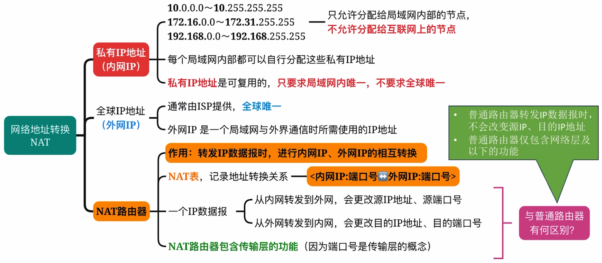

### 传输层“端口号”的概念

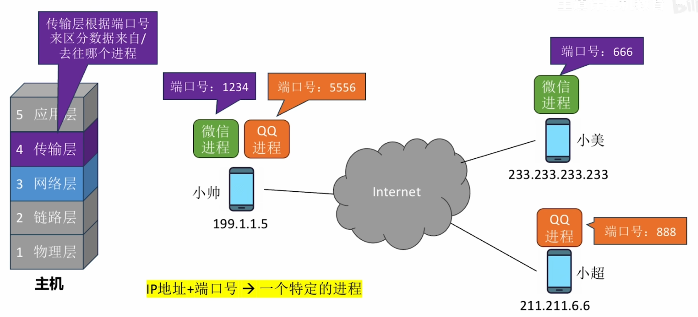

<span style="color:#FF0000">网络层</span>实现了“<u>主机到主机</u>”的通信。网络层在 IP 数据报的首部，指明 <span style="color:#FF0000">源 IP 地址、目的 IP 地址</span>。

<span style="color:#3B9797">传输层</span>实现了“<u>端到端</u>”（<u>进程到进程</u>）的通信。传输层在 TCP（或 UDP）报文段的首部，指明<span style="color:#3B9797">源端口、目的端口</span>。

### 数据的传输过程（垂直视角）


### 如何缓解 IP 地址不够用的问题？

IP 地址 32bit，2^32^ ≈ 42 亿，如果每台主机都要消耗一个全球唯一的 IP 地址，显然不够用。


## 地址解析协议 ARP

### 各种协议之间的服务关系

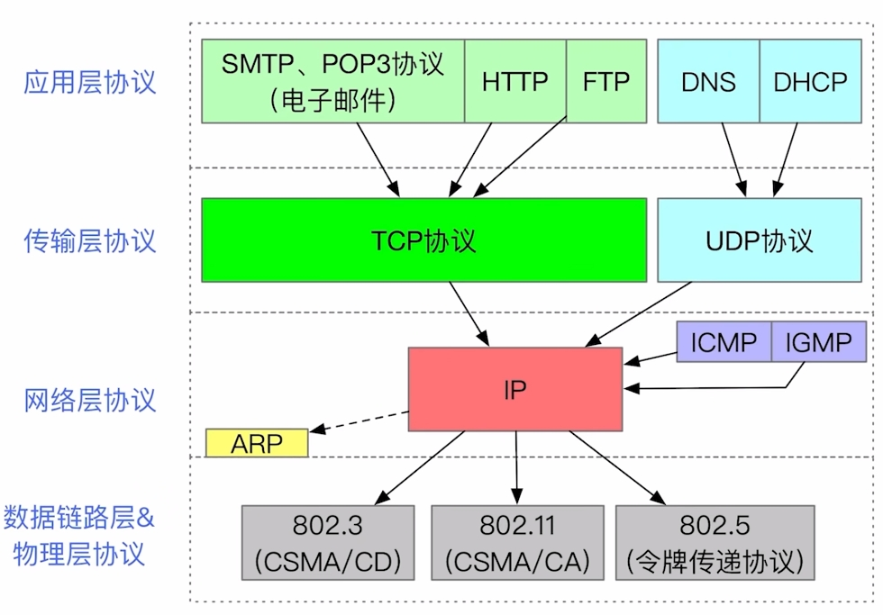

<span style="color:#3B9797">IP 协议（Internet Protocol，网际协议）是互联网的核心。</span>

<span style="color:#E9762B">ABP 协议</span>用于查询同一网络的 <IP 地址, MAC 地址> 之间的映射关系。

ICMP 协议用于网络层实体之间相互通知“异常事件”。

IGMP 协议用于 IP 组播。

### 回顾：以太网 MAC 帧


### 拓展：ARP 分组的格式

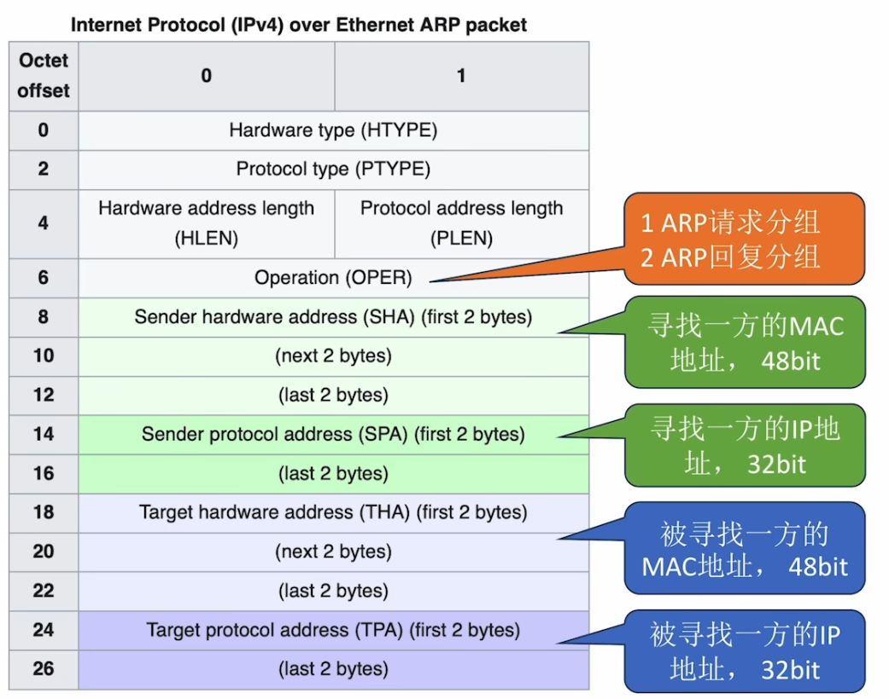

## 动态主机配置协议 DHCP

**知识总览**：

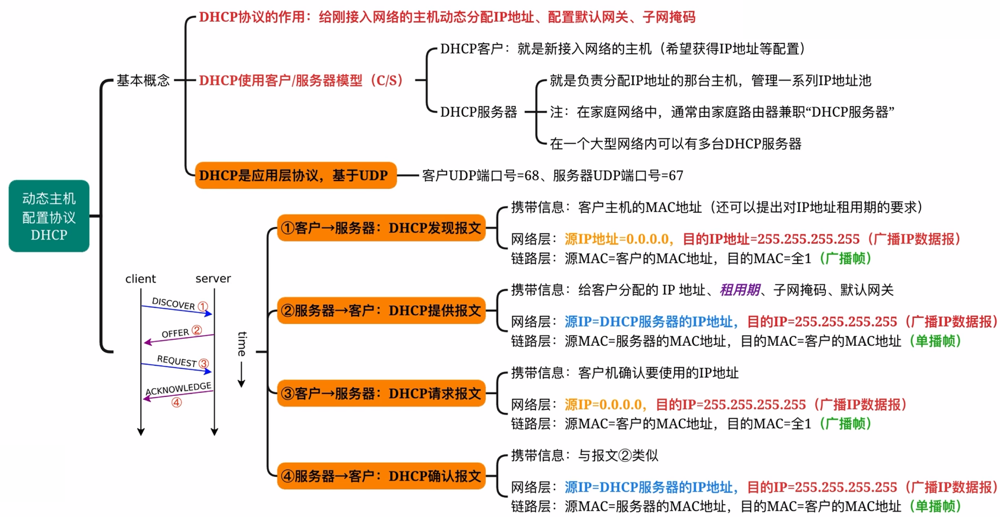

### 各种协议之间的关系


<span style="color:#F96E5B; font-weight:bold">动态主机配置协议</span>（Dynamic Host Configuration Protocol, <span style="color:#5A7ACD">DHCP</span>）常用于给主机动态分配 IP 地址、配置子网掩码、默认网关等网络相关的参数。

<span style="color:#16476A">DHCP 是应用层协议，使用 UDP 提高的服务。</span>

### DHCP 报文在协议栈中的位置

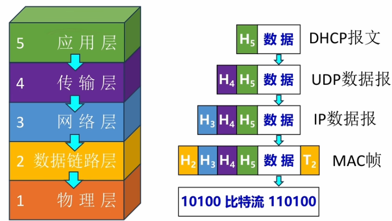

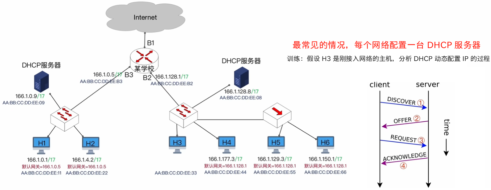

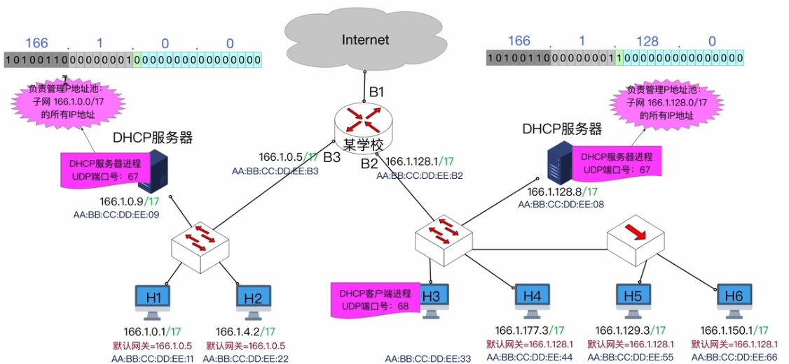


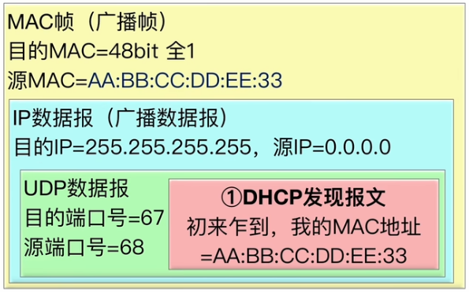


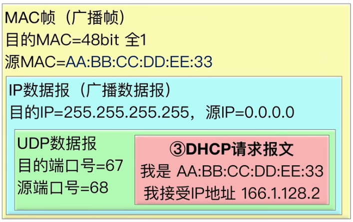

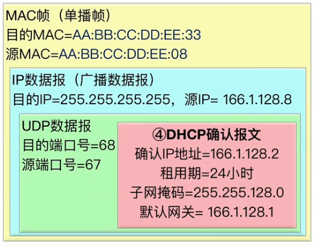


## ICMP 网际控制报文协议。

网际控制报文协议（Internet Control Message Protocol）。

**知识总览**：


### 各种协议之间的关系


<span style="color:#4B9DA9">ICMP 协议属于网络层。</span>

<span style="color:#4B9DA9">IP 协议为 ICMP 协议提供服务。</span>

ICMP 协议用于主机、路由器之间相互通知网络中发生的“异常事件”。

### ICMP 报文、IP 数据包之间的关系

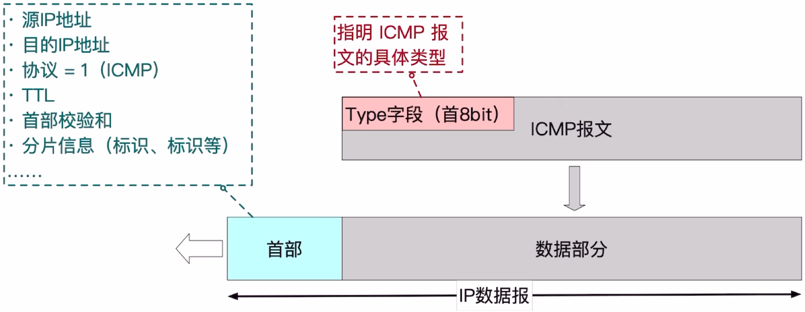

### ICMP 差错报告报文：终点不可达


- 当主机 A（源地址：128.14.32.131）向目的地址 166.1.128.3 发送 IP 数据报时，该数据包经过多跳路由转发到达某学校局域网的边缘路由器。路由器在本地网络中无法找到目的主机（目的 IP 地址不可达），于是生成一个 ICMP 终点不可达（Destination Unreachable）差错报文。该 ICMP 报文包含原始 IP 数据报的首部及部分数据，并明确指示目的网络不可达的原因。随后，路由器将此 ICMP 报文封装为新的 IP 数据报（源地址为路由器接口地址，目的地址为主机 A 的地址），通过反向路径逐渐转发回主机 A。主机 A 收到并解析该 ICMP 报文后，即可获知数据传输失败的具体原因。
- 当主机 A 想主机 B 的 6666 端口发送 TCP/UDP 数据报时，该数据包经路由转发成功抵达主机 B。主机 B 的网络层接收 IP 数据报后，将其载荷（TCP/UDP 段）上交给传输层。然而，传输层发现本地不存在监听 6666 端口的进程，导致数据报无法完成向上层应用的交付。此时，主机 B 会生成一个 ICMP 终点不可达（Destination Unreachable）差错报文，其中类型字段 3（终点不可达），代码字段为 3（端口不可达）。该 ICMP 报文包含原始 IP 数据报的首部及前 8 字节载荷，封装成新的 IP 数据包后沿反向路径返回主机 A。主机 A 收到后即可获知目标端口不存在对应进程，从而进行相应的错误处理。

### ICMP 差错报告报文：时间超过


- 当主机 A 向主机 B 发送 IP 数据报时，需要设置初始 TTL（Time To Live）值。假设初始 TTL 值为 2，该数据包在传输过程中每经过一台路由器，TTL 值递减 1。当数据包到达第二台路由器时，TTL 值减至 0，根据 IP 协议规定，路由器将丢弃该数据包，并向源主机 A 发送 ICMP 超时（Time Exceeded）差错报文。该 ICMP 报文的类型字段为 11（超时），代码字段为 0（TTL exceed in transit），其中包含原始 IP 数据包的首部及前 8 字节载荷。此 ICMP 报文被封装为新的 IP 数据报，沿反向路径逐跳转发回主机 A。主机 A 收到后解析该报文，即可获知数据包因 TTL 过期而被丢弃，从而诊断网络路径过长或路由环路等问题。
- 当主机 A 向主机 B 发送一个大型 IP 数据报时，若其长度超过传输路径中某链路的 MTU（最大传输单元），该数据包将在路由器处被分片传输。假设原始数据被划分为 3 个分片，其中分片 1 和分片 3 成功到达目的主机 B，而分片 2 在传输过程中丢失。根据 IP 协议规范，目的主机 B 会为重组操作启动重组计时器（通常为 30~60 秒）。若计时器超时仍未收齐所有分片，B 将丢弃已接收的分片，并向源主机 A 发送 ICMP 超时（Time Exceeded）差错报文。该 ICMP 报文的类型字段为 11，代码字段为 1（表示分片充足超时），其中包含原始 IP 数据报首部及前 8 字节载荷。主机 A 收到此 ICMP 报文后，通过解析其类型和内容，可明确获知因分片丢失导致的数据报重组失败，进而调整后续传输策略（如减少发送数据报大小或启用 MTU 发现机制）。

### ICMP 差错报告报文：参数问题


当主机 A 向主机 B 发送 IP 数据报时，路由器在转发过程中会验证 IP 首部检验和以检测传输差错。若路由器检测到首部校验和错误或首部字段存在非法参数（如无效版本号、错误首部长度等），将立即丢弃该数据报，并向源主机 A 发送 ICMP 参数问题（Parameter Problem）差错报文。该 ICMP 报文的字段类型为 12，代码字段为 0（首部校验和错误）或 1（非法参数），其中包含指向出错字段的指针及原始 IP 首部信息。主机 A 接收到此 ICMP 报文后，通过解析类型、代码和指针字段，可精确定位数据报首部的错误位置及类型，从而进行相应的错误处理或重传机制。

### ICMP 差错报告报文：改变路由（重定向）


当主机 A 向主机 C 发送 IP 数据报时，初始路径为：A → 默认网关 R1（128.14.32.130）→ R2（128.14.32.129）→ C。路由器 R1 在转发过程中检测到：主机 A 与 R2 位于同一子网，且 R2 是到达主机 C 的最优下一条。根据 ICMP 重定向机制，R1 会向主机 A 发送 ICMP 重定向报文（类型 5，代码 1 表示主机重定向），该报文包含原始 IP 数据报首部、目标地址 C 以及建议的下一跳地址 R2（128.14.32.129）。主机 A 接收到此报文后，更新本地路由缓存，将主机 C 的下一跳直接指向 R2。后续发往 C 的数据报将绕过默认网关 R1，直接通过 R2 转发，从而优化传输路径，减少网络跳数，提升传输效率。

### ICMP 差错报告报文：*源点抑制


在特定时段（如教学高峰期），校园网络可能面临高流量压力，大量 IP 数据报汇聚至边缘路由器。当路由器的处理能力或缓冲区资源达到饱和状态时，将触发尾部丢弃（Tail Drop）机制，丢弃新到达的数据报。若主机 A 发往主机 B 的数据报在此拥塞场景下被丢弃，路由器可以依据 RFC 792 规范生成 ICMP 源点抑制报文（Type 4, Code 0），该报文包含原始 IP 数据报首部信息，指示源主机 A 降低数据发送速率。主机 A 接收后，应相应减少向该网络注入的流量，以缓解拥塞状况。

然而，现代互联网架构中，ICMP 源点抑制机制已被弃用。根据 RFC 6633 标准，网络层不再承担拥塞控制职责，而是有传输层的 TCP 协议通过端到端拥塞控制机制（如慢启动、拥塞避免、快速重传等算法）动态调整发送窗口，实现更精确、公平的流量调节。这种分层设计使拥塞控制更适应复杂网络环境，避免了网络层逐跳控制带来的拓展性问题。

### ICMP 询问报文：回送请求、回送回答


当主机 A 需要检测与主机 B 之间的网络连通性时，会构造一个 ICMP Echo Request（回送请求）报文。该报文被封装在 IP 数据报中，源 IP 地址设置为主机 A 的地址，目的 IP 地址设置为主机 B 的地址。此 IP 数据报通过网络中的路由器进行逐跳转发，最终到达主机 B。

主机 B 接收到该数据报后，解析出内部的 ICMP 报文类型为 Echo Request，识别请求来源为主机 A，随即生成对应的 ICMP Echo Reply（回送应答）报文。该应答报文同样被封装为 IP 数据报，源地址为主机 B，目的地址为主机 A，并通过路由路径返回至主机 A。

当主机 A 成功接收到此 Echo Reply 报文时，即可确认 A 与 B 之间的双向网络路径畅通，数据传输正常。

### ICMP 的典型应用——Ping


<span style="color:#FA6868">Ping</span> 基于<span style="color:#018790">回送请求报文</span>、<span style="color:#018790">回送回答报文</span>实现功能。

### ICMP 询问报文：时间戳请求、时间戳回答


ICMP 时间戳请求（Timestamp Request）与时间戳回答（Timestamp Reply）的交互机制与回送请求/应答类似，但功能目的不同。当主机 A 需要获取主机 B 的时钟信息时，会向 B 发送一个时间戳请求报文。该报文中包含 A 发送请求时的原始时间戳（Originate Timestamp）。

主机 B 接收到请求后，会立即构造时间戳回答报文，其中包含 3 个关键时间信息：

1. **接收时间戳**（Receive Timestamp）：B 收到请求报文的确切时间
2. **发送时间戳**（Transmit Timestamp）：B 发送回答报文的确切时间
3. **原始时间戳**（Originate Timestamp）：从请求报文中复制的 A 的发送时间

通过分析这三个时间戳，主机 A 不仅可以验证网络连通性，还能计算网络延迟并同步时钟信息，为网络时间同步和性能监测提供数据支持。

### 不必反馈 ICMP 差错报文的情况


1. 当主机 A 向主机 B 发送 IP 数据报，若 B 主机在处理过程中检测到该数据报存在错误（如目的不可达、超时等），B 主机会生成相应的 ICMP 差错报文，并将其封装在新的 IP 数据报中返回给 A 主机。然而，为避免网络中出现差错报告的无限循环，ICMP 协议明确规定：**对于 ICMP 差错报文本身，不应再生成新的 ICMP 差错报文**。因此，若 B 主机返回的 ICMP 差错报文在传输过程中再次出错，A 主机不会对此错误产生二次 ICMP 报告。
2. 当主机 A 向主机 B 发送一个大型 IP 数据报时，该数据报在网络传输过程中可能被分片为多个片段。若其中多个分片在传输过程中出现错误，根据 ICMP 协议规范，主机 B 只需向主机 A 返回**单个** ICMP 差错报文，而非为每个出错的分片分别生成差错报告。这一设计有效避免了网络中因重复差错报告而导致的拥塞问题。

3. 根据 ICMP 协议规范，当检测到 IP 数据报传输错误时，差错反馈机制遵循以下原则：对于**单播传输**的数据报，接收方必须向源主机返回相应的 ICMP 差错报文；而对于**广播或多播传输**的数据报，则禁止生成 ICMP 差错报文。这一设计有效防止了在广播/多播场景下因大量差错报告而引发的网络风暴问题。

4. 根据 ICMP 协议规范，当检测到源地址为特殊保留地址的 IP 数据报存在传输异常时，网络设备**禁止生成 ICMP 差错报文**。这些特殊地址包括：

   - **回环地址**（127.0.0.0 / 8 网段）：用于本机内部通信
   - **未指定地址**（0.0.0.0）：表示无效或未配置的源地址

   此设计原则有效避免了向无效或本机地址发送差错报告所导致的资源浪费和潜在安全风险，同时防止了差错报文的无限循环传播。

### ICMP 的典型应用——Traceroute（Tracert）

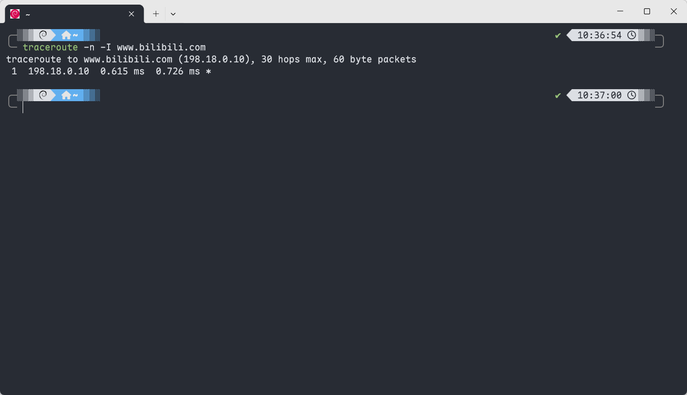

<span style="color:#AA2B1D">Traceroute</span>（Tracert） 基于<span style="color:#00B7B5">时间超过报文</span>实现功能。

> [!tip]
>
> www.bilibili.com 实际上是一个**逻辑地址**，它背后绑定了**多个物理服务器 IP**。因此网站服务器的 IP 地址会出现变化。

Traceroute（路由追踪）是一种网络诊断工具，用于探测数据包从源主机到目标主机所经过的完整网络路径。其核心原理是通过发送一系列 TTL（生存时间）值递增的探测数据包，利用路由器在 TTL 超时时返回 ICMP 超时消息的机制，逐步揭示路径上每个中间节点（hop）。

## IPv6 地址

### 从 IPv4 到 IPv6


**IPv4**：

- 2^32^ ≈ 42 亿个地址
- 一人一个 IP 地址都不够分
- <span style="color:#E9B63B">1994 年诞生</span>的 <span style="color:#E9B63B">NAT</span> 只能缓解 IP 地址耗尽

**IPv6**：

- 2^128^ ≈ 3.4 × 10^38^ 个地址
- 平均每人可得 4.3 × 10^28^ 个地址
- <span style="color:#C66E52; font-weight:bold">IPv6 可以彻底解决 IP 地址不够用的问题</span>


### IPv6 地址的“冒号十六进制记法”
IPv4 地址的<u>点分十进制记法</u>：总共 32bit 地址，8bit 为一段，记录为十进制，段间以小数点分隔：`11000000 10101000 00000001 00000001 -> 192.168.1.1`。

IPv6 地址的<span style="color:#FE5D26"><u>冒号十六进制记法</u></span>：总共 128bit 地址，<span style="color:#FE5D26">16bit 为一段，记录为十六进制，软件以冒号分隔</span>：

```bash
0010000000000001 0000110110111000 1000010110100011 0000000000000000
0000000000000000 1000101000101110 0000001101110000 0111001100110100
->
2001:0db8:85a3:0000:0000:8a2e:0370:7334
```

### IPv6 地址的压缩记法

**未使用压缩记法的 IPv6 地址**：2001:<span style="color:#73C7C7">0</span>db8:85a3:<span style="color:#73C7C7">000</span>0:<span style="color:#73C7C7">000</span>0:8a2e:<span style="color:#73C7C7">0</span>370:7334。

1. **去除每个分段的前导零**（每个 16 位段内的前导零可以省略）：2001:db8:85a3:0:8a2e:370:7334。

2. **用双冒号“::”替代连续出现的多个 0**：2001:db8:85a3::8a2e:370:7334。

   > [!tip]
   >
   > 一个地址中只呢出现一次双冒号，否则会产生歧义。

---


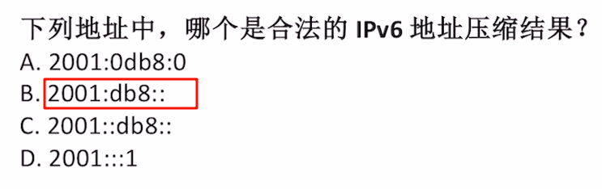

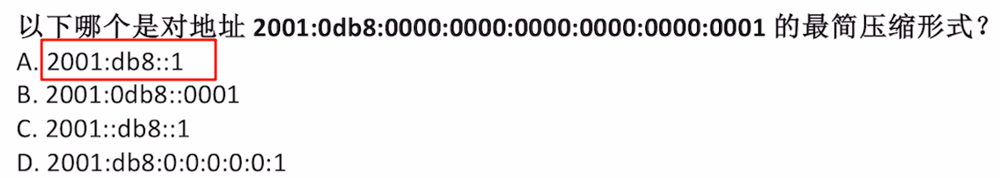

### 回顾：IPv4 地址资源的分配

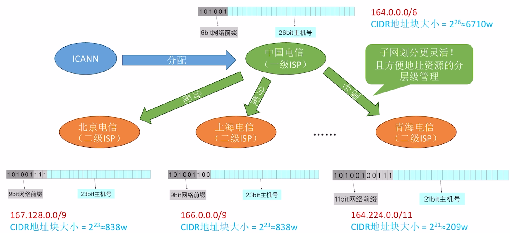

### IPv6 地址的分配

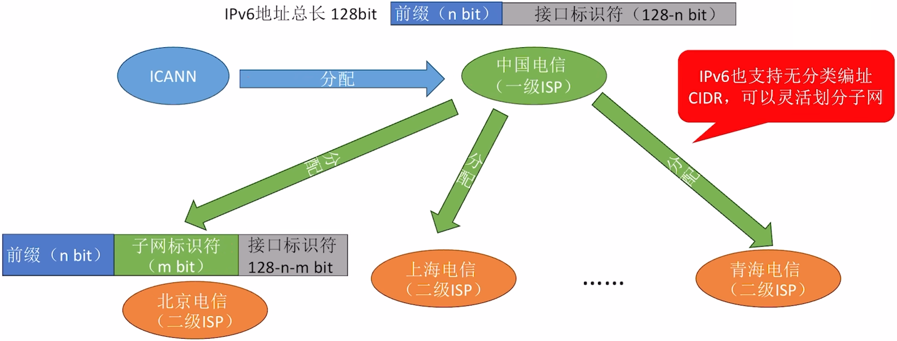

**优点**：IPv6 因为地址空间很大，所以可以划分为更多的层次。


由于 IPv6 局域网的接口标识符位数很长，因此：

- <span style="color:#FF8383; font-weight:bold">IPv6 支持即插即用（IP 地址自动配置）</span>：一台主机接入网络后，只需向路由器确认本网络前缀，就可以给自己分配 IP 地址（通常以主机自身的 MAC 地址作为接口标识符）。
- <span style="color:#FF8383; font-weight:bold">IPv6 可以不使用DHCP。</span>当然，在一些 IP 地址安全性要求高的地方，<span style="color:#7EACB5; font-weight:bold">也支持使用 DHCP 统一管理 IPv6 地址</span>。

### IPv6 地址的分类

|     地址类型     |                          二进制前缀                          |
| :--------------: | :----------------------------------------------------------: |
|    未指明地址    | 00...0（128 位），可记为 ::/128（<span style="color:#DD5746">表示“无地址”，类似 IPv4 的 0.0.0.0</span>） |
|     环回地址     | 00...01（128 位），可记为 ::1/128（<span style="color:#DD5746">表示 IPv4 的 127.0.0.1，自己和自己通信</span>） |
|     多播地址     | 11111111（8 位），可记为 FF00::/8（<span style="color:#DD5746">发送到一组主机，类似于 QQ 群号</span>） |
| 本地链路单播地址 | 1111111010（10 位），可记为 FE80::/10（<span style="color:#DD5746">局域网内通信，不会被路由器转发</span>） |
|   全球单播地址   |               除上述四种外的其他所有 IPv6 地址               |

IPv6 数据报的<span style="color:#5E1675">目的地址</span>有以下三种基本类型：

1. **单播（unicast）**：就是传统的点对点通信。
2. <span style="color:#5272F2; font-weight:bold">多播（multicast）</span>：一点对多点的通信，数据报<span style="color:#5272F2">发送到一组计算机中的每一台</span>。（应用：网络会议）
3. <span style="color:#FDAF75; font-weight:bold">任播（anycast）</span>：这是 IPv6 增加的一种类型。任播的终点是一组计算机，但数据报只交付其中的一台计算机，<span style="color:#FDAF75">通常是距离最近的一台计算机</span>。（应用：多个 DNS 服务器共享一个任播地址）

> [!tip]
>
> <span style="color:#FDAF75">任播</span>地址没有固定的前缀，通常由地址管理机构预先统一分配。

---


---

**知识总览**：


## 路由算法

