# 传输层

## 传输层提供的服务

**知识总览**：

### 传输层在协议栈中的位置

### 传输层“端口号”的概念

IP 地址 + 端口号 → 指向网络中一台主机上的一个特定的进程

网络层实现了“<u>主机到主机</u>”的通信。网络层在 IP 数据报的首部，指明源 IP 地址、目的 IP 地址。

传输层实现了“<u>端到端</u>”（<u>进程到进程</u>）的通信。传输层在 TCP（或 UDP）报文段的首部，指明源端口、目的端口。

### 进程、端口号、传输层协议之间的关系

假设：进程 1、5 正在用 TCP 通信；2、6 正在用 TCP 通信；3、7 正在用 UDP 通信；4、8 正在用 UDP 通信。

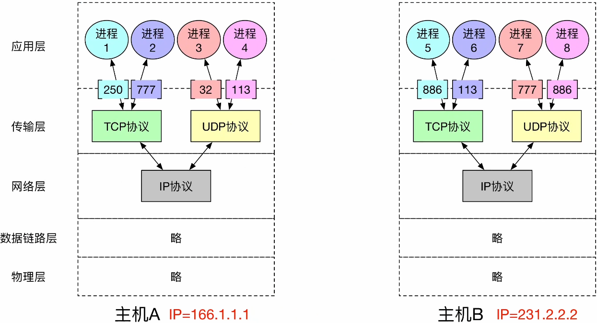

**注意**：

- 两台主机的端口号是相互独立的。
- TCP、UDP 的端口号也是相互独立的。
- 当两个进程之间想要通信时，需要指明：
  1. 使用哪种传输层协议。
  2. 本进程绑定的端口号。
  3. 对方的 IP 地址和端口号。

套接字（Socket）= `(IP 地址 : 端口号)`。（分为 TCP 套接字、UDP 套接字）

### 熟知端口号

|    应用程序    | FTP  | TELNET | SMTP | DNS  | TFTP | HTTP | SNMP |
| :------------: | :--: | :----: | :--: | :--: | :--: | :--: | :--: |
| **熟知端口号** |  21  |   23   |  25  |  53  |  69  |  80  | 161  |

0~1023 为熟知端口号，开发的时候一般不使用。

其他端口号在实际开发时并没有特别严格的限制，只要在本机没有被使用的端口号都可以使用。

端口号分类只是一种“建议标准”，而非“强制标准”。

### 有连接的传输 vs. 无连接的传输

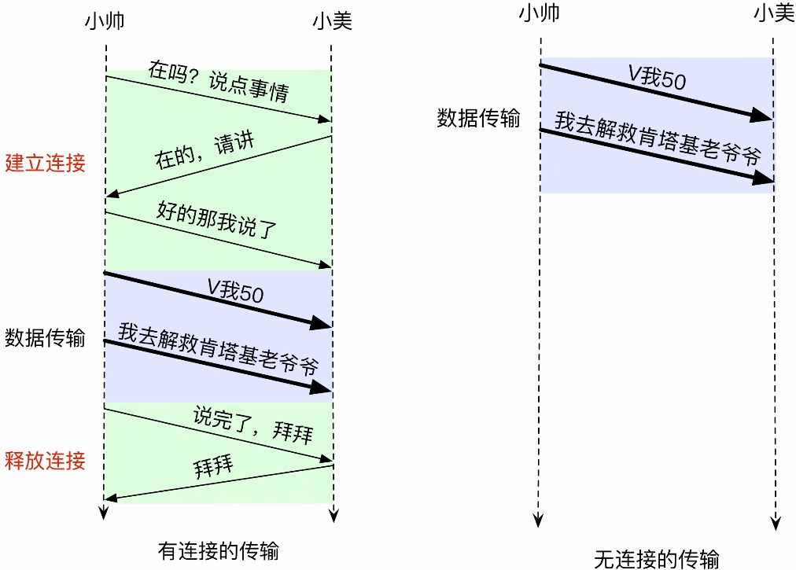

- 有连接：传输前先打招呼，先确认对方已经准备好接收数据。传输结束时，也要告知对方已结束。
- 无连接：不打招呼，直接把数据传给对方。

### 可靠的传输 vs. 不可靠的传输

- 可靠的：接收方使用“确认机制”让发送方知道哪些数据已被正确接收。
- 不可靠的：接收方无论收没收到数据、数据是否正确，都不给发送方反馈。

## UDP 数据报

### UPD 协议、UDP 数据报、UDP 首部

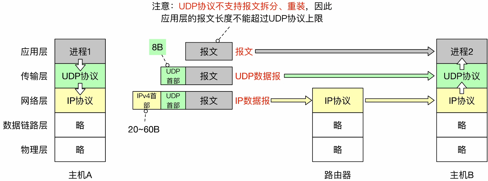

- UDP 首部很小，只占 8B。
- UDP 每次传输一个完整的报文，不支持报文自动拆分、重装。
- UDP 是无连接的、不可靠的（可靠性可交给应用层处理），也不支持拥塞控制。
- UDP 支持一对一（封装成单播 IP 数据报）、一对多传输（封装成广播/多播 IP 数据报）。

### TCP 协议、TCP 报文段、TCP 首部

- TCP 首部更大，占 20~60B。
- TCP 支持报文自动拆分、重装，因此可以传输长报文。
- TCP 是有连接的、可靠的、支持拥塞控制。
- TCP 仅支持一对一传输（因为通信双方的传输层必须先建立连接）。

### UDP 数据报格式

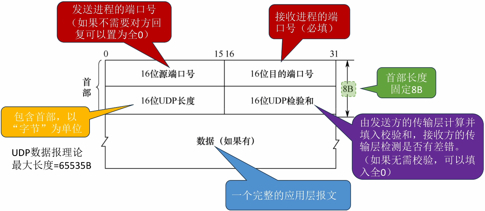

> [!tip]
>
> IP 数据报首部固定占用 20 字节，其数据部分最大长度为 **65535 - 20 = 65515 字节**，因此封转在 IP 数据报数据段内的 UDP 数据报，实际最大长度即为 65515 字节。

### UDP 数据报示例

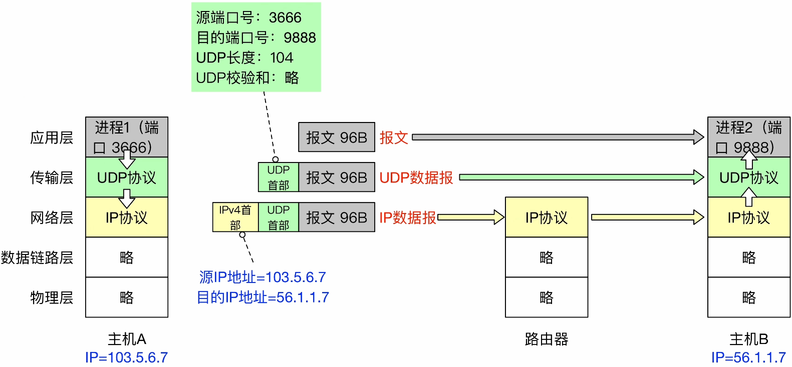

---

**知识回顾**：

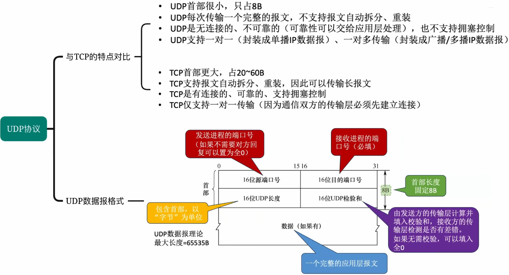

## UDP 检验

### 一种新的差错检验方法

### UDP 检验（发送方的传输层）

1. 传输层的 UDP 协议在计算检验和之前，先添加伪首部。
2. 把伪首部、首部、数据部分以 16bit 为一组，进行二进制加法（最高位产生的仅为需要<u>回卷</u>）。
3. 将最终的加法结果逐位取反，就得到 16bit 检验和，将其填入 UDP 首部。
4. 去掉伪首部，并将 UDP 数据报交给网络层，封装成 IP 数据报。

### UDP 检验（接收方的传输层）

1. 网络层向传输层递交 UDP 数据报。
2. 传输层在 UDP 数据报前，添加伪首部。
3. 把伪首部、UDP 首部、数据部分以 16bit 为一组，进行二进制加法（最高位产生的进位需要<u>回卷</u>）。
4. 若加法结果为全 1，说明无比特错误，于是接收该 UDP 数据报，并根据目的端口号，向应用层递交报文；若加法结果不为全 1，说明有差错，于是丢弃该 UDP 数据报。

---

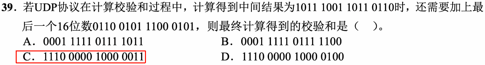

---

**知识回顾**：

### IP 数据报（IP 分组）的格式

IP 数据报在传输过程中仅校验首部完整性（不校验数据部分），其校验逻辑与 UDP 检验和一致：

将 IP 数据报首部按 16 位分组，执行二进制求和（需处理进位回卷，即溢出位循环加到和的最低位），对求和结果逐位取反后，即 IP 数据报的首部检验和。需注意的是，该过程**不涉及伪首部**，仅针对 IP 首部本身进行校验。

## TCP 报文段（TCP 段）

TCP Segment（TCP 报文段，另译“TCP 段”）。

### TCP 协议的三大阶段

TCP 协议的三大阶段：

- 建立连接（三次握手）
- 数据传输
- 释放连接（四次挥手）

### 建立一次 TCP 连接可以传输多个报文

**假设**：建立 TCP 连接时，双方协商 MSS 为 1000B（Maximum Segment Size，最大段长）。

- 每次建立 TCP 连接，可以传输多个报文（双向）。
- TCP 是面向字节流的（而 UDP 是面向报文的）。无论传输多少个报文，在 TCP 协议看来都是一连串字节流。

> [!tip]
>
> TCP 并不会强制要求每个 TCP 段都满载数据，只要别超过 MSS 就行。

### TCP 段格式

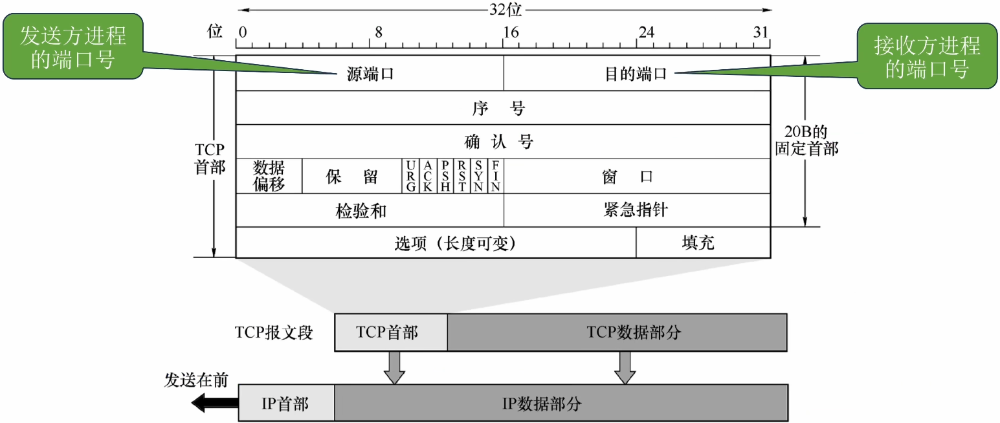

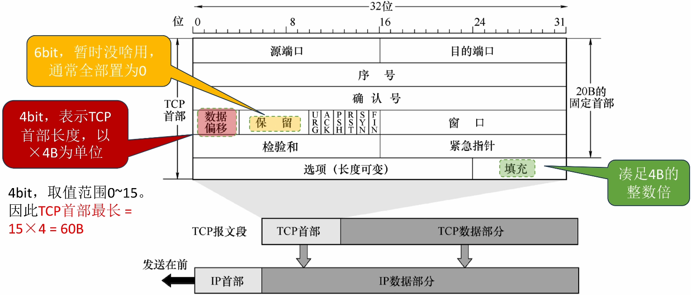

> [!tip]
>
> - “数据偏移”（Data Offset）这个翻译具有迷惑性，容易误解。
> - 在 TCP 首部中，并不会专门记录 TCP 数据部分长度（会根据 IP 首部、TCP 首部计算出来）。

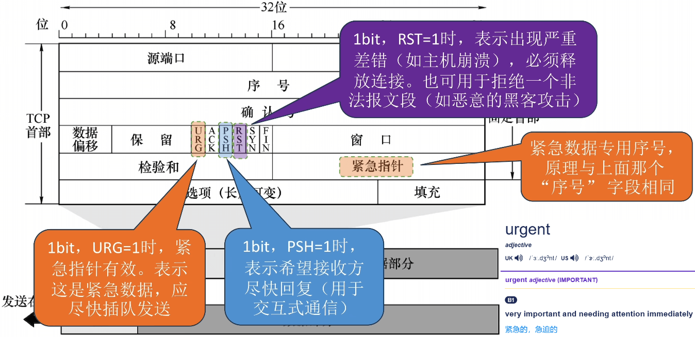

- **URG**：紧急位（Urgent）
- **PSH**：推送位（Push）
- **RST**：复位位（Reset）

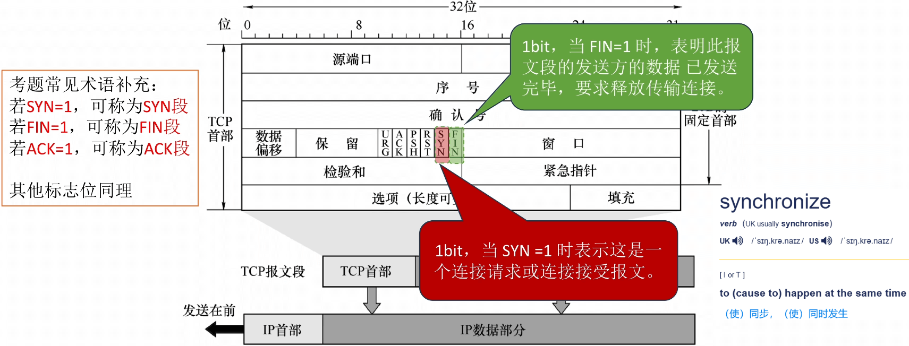

- **SYN**：同步位
- **FIN**：终止位（Finish）

> [!tip]
>
> - 只要<u>握手 ①</u>、<u>握手 ②</u> 的 SYN = 1，其他所有 TCP 报文段都是 SYN = 0。
> - 只有<u>挥手 ①</u>、<u>挥手 ③</u> 的 FIN = 1，其他所有 TCP 报文段都是 FIN = 0。

> [!tip]
>
> - 这个字段是实现“<u>流量控制</u>”的关键。
> - “<u>窗口</u>”一般记为 rwnd 或 rcvwnd。

- 建立 TCP 连接时，在<u>握手 ①</u>、<u>握手 ②</u>选项中协商 MSS（Maximum Segment Size，最大段长）。
- MSS 的值标售在接下来的数据传输中，一个 TCP 报文段最多携带多少数据（首部不算在内）。
- 通常 MSS 不会设置太大，以免在 IP 层被分片。

## TCP 连接管理

**知识总览**：

### 建立连接（三次握手）

**SYN、ACK、seq、ack**：

- 在 TCP 全过程中，只有握手 ①、握手 ② 的 SYN = 1。
- 在 TCP 全过程中，只有握手 ① 的 ACK = 0。
- 握手 ①、握手 ② 不能携带数据（只有 TCP 首部），但是要消耗一个序号。

- 握手 ① 和握手 ② 不携带数据，握手 ③ 可以携带数据。
- 握手 ① 和握手 ② 固定消耗 1 个序号。
- 握手 ③ 若不携带数据，就不消耗序号。

---

---

**客户端、服务器进程 TCP 状态变化**：

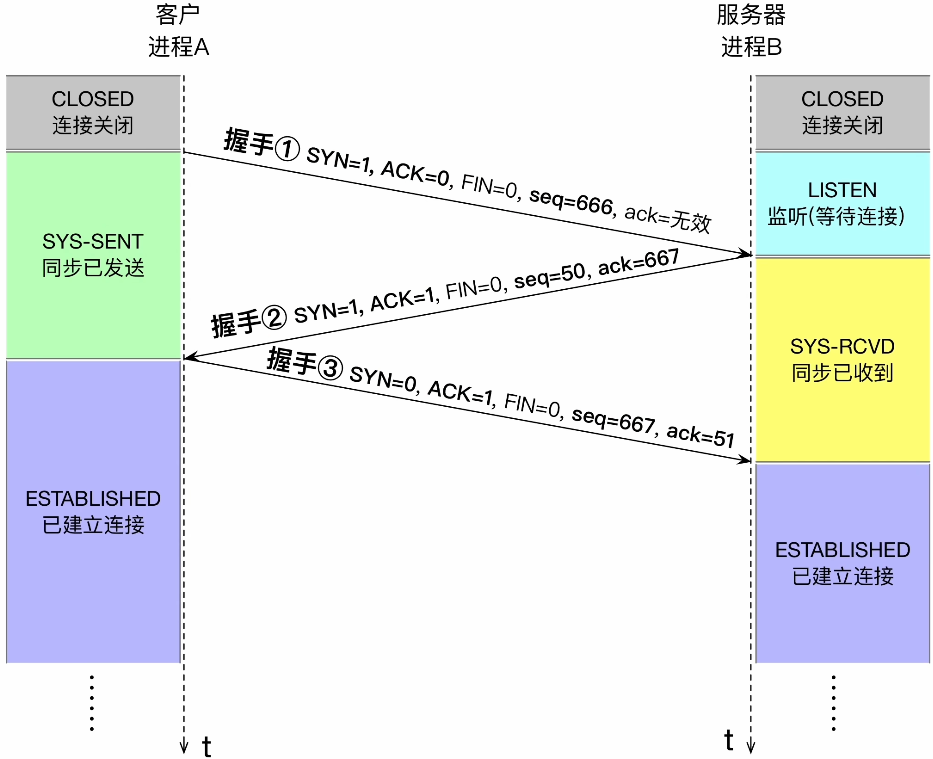

发出/收到某个握手报文段前后，TCP 状态如何变化？

### 建立连接阶段耗时分析

从发出握手 ①，到客户端进程可以发送数据，至少需要多久？——1 RTT。

从发出握手 ①，到服务器进程可以发送数据，至少需要多久？——1.5 RTT。

### 释放连接（四次挥手）

**FIN、ACK、seq、ack**：

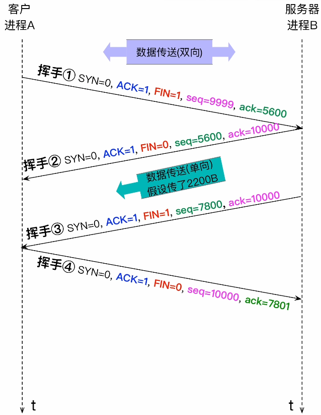

- 在 TCP 全过程中，只有挥手 ①、挥手 ③ 的 FIN = 1。
- 挥手 ①、挥手 ③ 即使不懈怠数据，也要消耗一个序号。
- 挥手 ② <u>可以</u>携带数据。
- 挥手 ④ <u>不可以</u>携带数据。

**客户端、服务器进程 TCP 状态变化**：

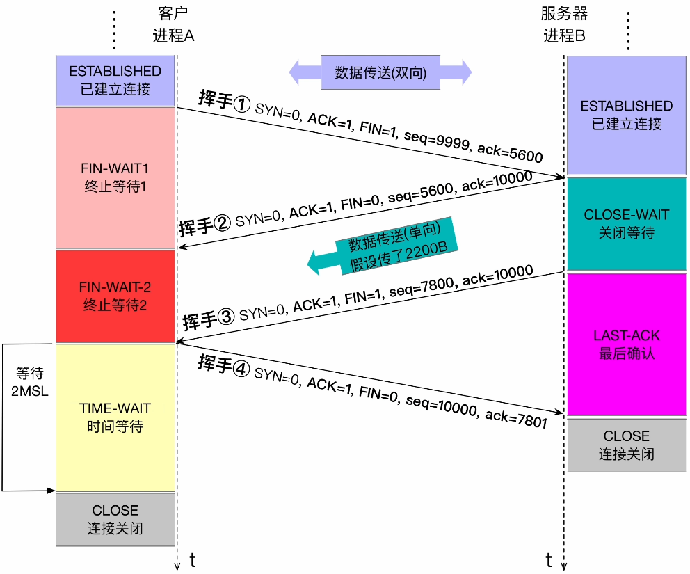

发出/收到某个挥手报文段前后，TCP 状态如何变化？

> [!tip]
>
> 也可以是服务器先发出挥手。

---

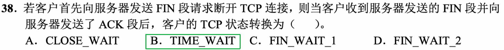

### 释放连接阶段耗时分析

> [!tip]
>
> - 客户进程收到挥手 ③ 后，立即进入 TIME-WAIT 状态，并启动“TIME-WAIT 计时器”，倒计时 2 MSL 后才能进入 CLOSE 状态。（若等待期间重复挥手 ③，就重置计时器）
> - MSL（Maximum Segment Lifetime，最长报文段寿命），是由 TCP 协议规定的一个固定时间长度。

- 从客户发出挥手 ①，到客户进程进入 CLOSE 状态，至少需要多久？—— 1 RTT + 2 MSL。
- 从客户发出握手 ①，到服务器进程进入 CLOSE 状态，至少需要多久？—— 1.5 RTT。

> [!tip]
>
> 若服务器进程收到挥手 ① 时，已经没有待传送数据，那么可以连续发出挥手 ②、挥手 ③。

---

---

**知识总览**：

## TCP 可靠传输 & 流量控制

**知识总览**：

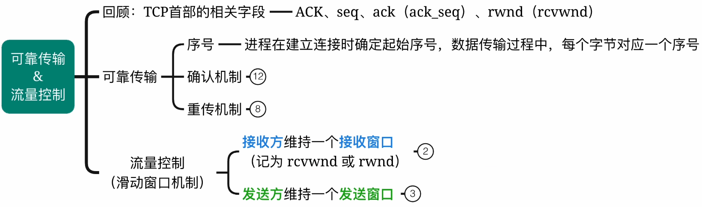

### 回顾：TCP 首部的相关字段

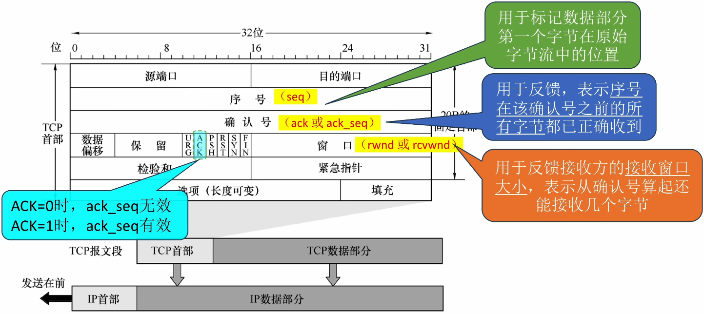

> [!tip]
>
> 只有<u>握手 ①</u> 的 ACK = 0，其他所有 TCP 报文段都是 ACK = 1。

### 重点：确认号、接收窗口大小

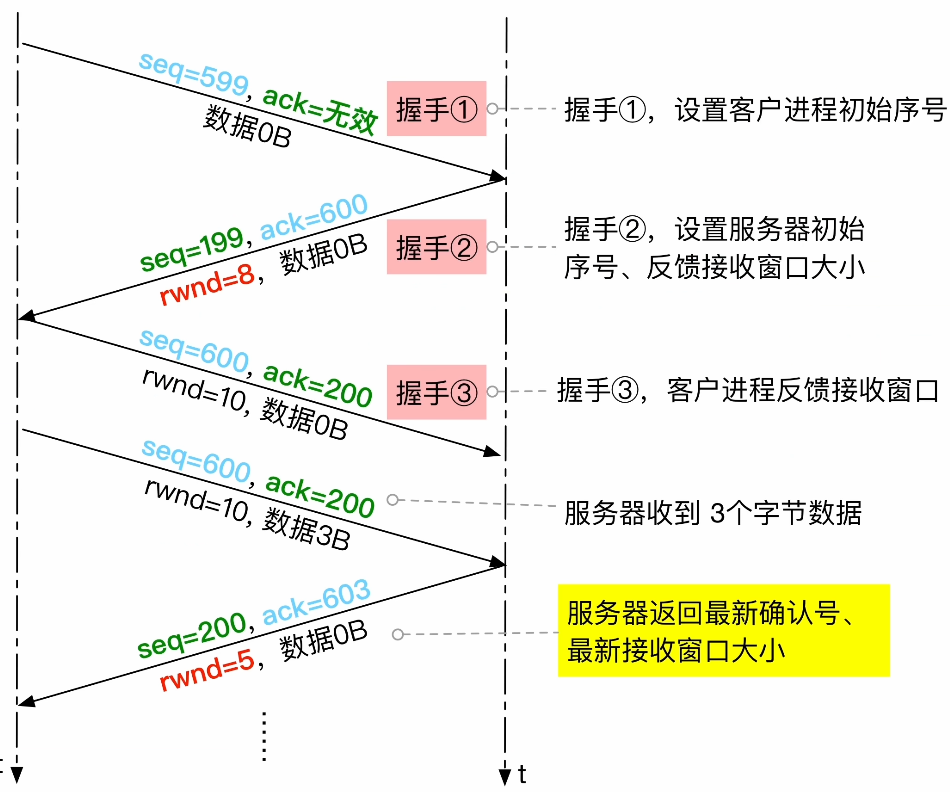

### TCP 传输的底层原理

### 一个端口可以建立多个 TCP 连接

### 重点：累积确认

### 重点：捎带确认

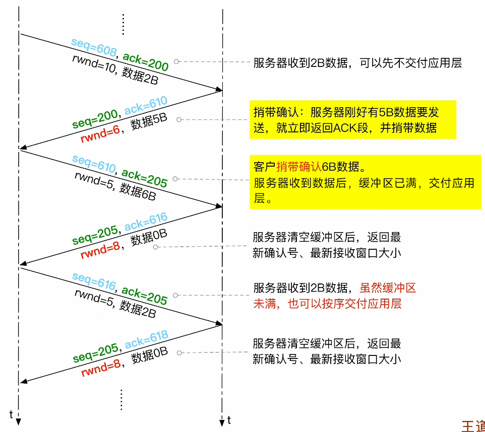

### 重点：超时重传

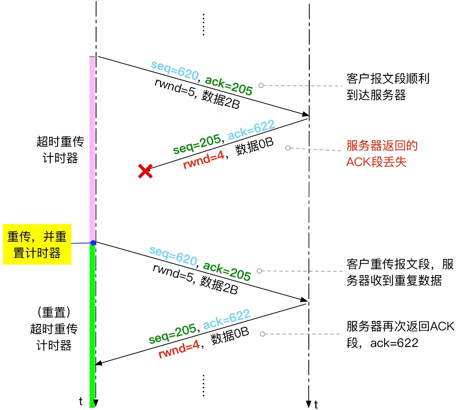

### 重点：快重传机制、立即确认机制

> [!tip]
>
> 第一个 ACK 不属于冗余 ACK，后三个 ACK 才是冗余 ACK。

---

---

**知识回顾**：

> [!tip]
>
> 应该理解为连续收到 1 + 3 个确认号相同的 ACK（后三个属于冗余 ACK）。

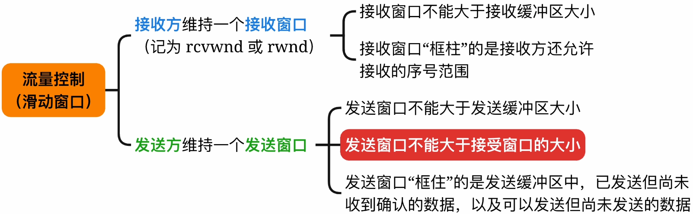

## TCP 拥塞控制

**知识总览**：

### TCP 拥塞控制、TCP 流量控制的区别与联系

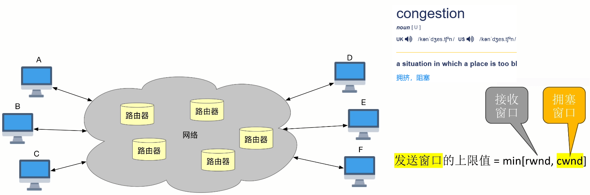

- **流量控制**：控制<u>端到端</u>的数据发送量，是“<u>局部的</u>”。
- 拥塞控制：控制<u>整个网络</u>中每台主机的数据发送量，降低路由器负载，是“<u>全局的</u>”。

**如何判断网络拥塞？**

- 发出的每个报文段，都能顺利地收到 ACK 确认——不拥塞。
- 发出的报文段未能按时收到 ACK，引发超时重传——严重拥塞。
- 收到冗余 ACK，引发快重传——有点拥塞。

**若检测到网络拥塞怎么办？**

- 迅速减少发送的数据量。
- 严重拥塞就迅速缩小<u>拥塞窗口</u>。
- 有点拥塞就适当缩小<u>拥塞窗口</u>。

### 慢开始、拥塞避免

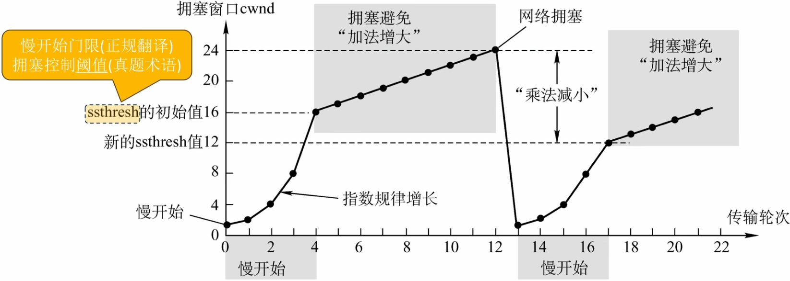

- 慢开始算法：cwnd 值从 1 开始，每收到一个 ACK，就让 cwnd + 1。（当 cwnd < ssthresh 时适用）
- 拥塞避免算法：在一个 RTT 内，即使收到多个 ACK，也只能让 cwnd + 1。（当 cwnd ≥ ssthresh 时适用）

> [!tip]
>
> 一般地：
>
> 1. 常与“流量控制”综合考察，此时仅需考虑接收窗口大小。
> 2. 通常仅涉及单向传输（TCP 连接双方只有一方发送数据）。
> 3. 通常默认每个 TCP 报文段都以最大段长 MSS 满载数据。
> 4. 拥塞窗口的大小常以“MSS 的倍数”作为单位。
> 5. 接收方收到一个报文段，会“立即确认”（会导致冗余 ACK，快重传），而非“推迟确认”。
>
> 为聚焦拥塞控制，<u>接下来的讨论中，假设接收方的接收窗口足够大</u>，这样发送窗口大小就只受拥塞窗口限制。

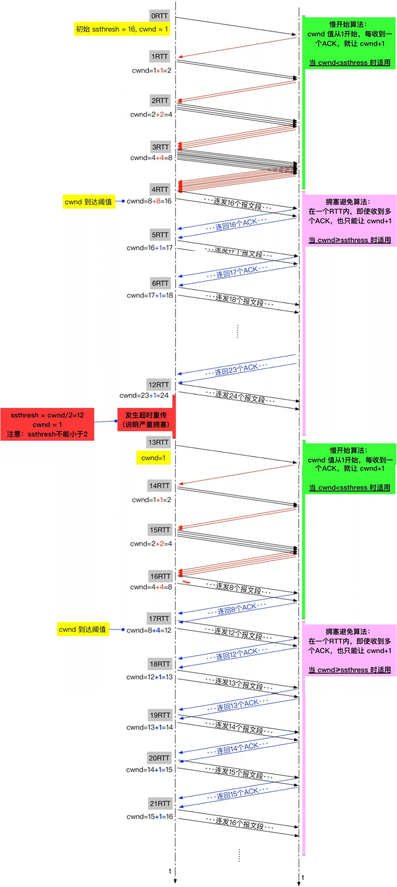

---

---

### 快重传、快恢复

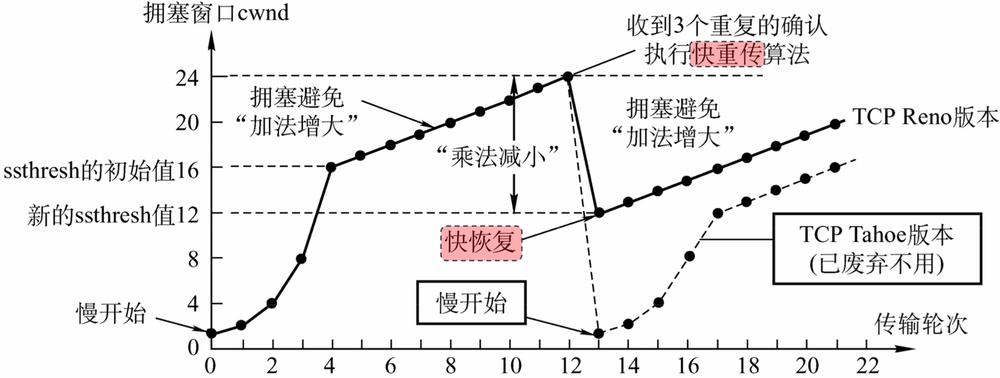

- 快重传：当发送方收到三个确认号相同的冗余 ACK 时，立即重传对应报文段。
- 快恢复算法：一旦发送快重传，就将阈值、cwnd 都设置为当前 cwnd 的一般，然后切换到“拥塞避免算法”。

