# 应用层

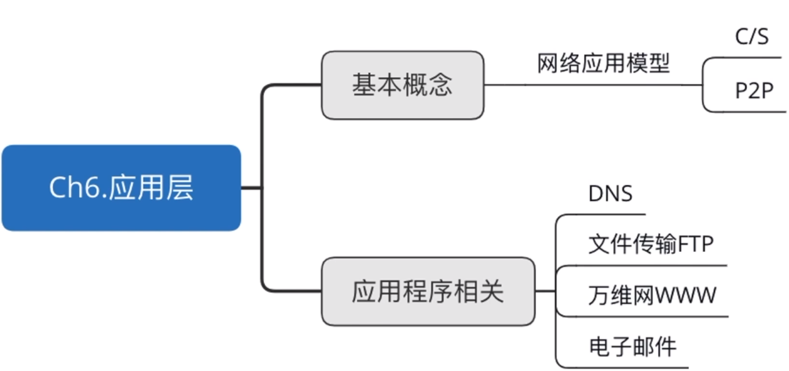

## 各种协议之间的服务关系

- **DNS**：将域名（网址）转换为 IP 地址
- **FTP**：用于文件传输
- **HTTP**：常用于浏览网页
- **SMTP、POP3**：用于电子邮件（Email）

## 网络应用模型

### 应用层概述

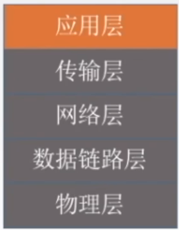

应用层对应用程序的通信提供服务。

**应用层协议定义**：

- 应用进程交换的报文类型，请求还是响应？
- 各种报文类型的语法，如报文中的各个字段及其详细描述。
- 字段的语义，即包含在字段中的信息的含义。
- 进程何时、如何发送报文，以及对报文进行响应的规则。

应用层的功能：

- 文件传输、访问和管理
- 电子邮件
- 虚拟终端
- 查询服务和远程作业登录

应用层的重要协议：

- FTP
- SMTP、POP3
- HTTP
- DNS

### 网络应用模型

- 客户/服务器模型（Client/Server）
- P2P 模型（Peer-to-Peer）

### 客户/服务器（C/S）模型

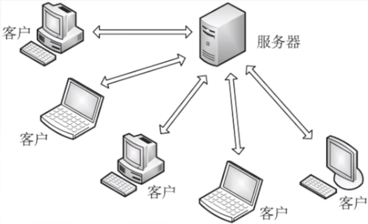

- 服务器：**提供计算服务**的设备。
  1. 永久提供服务。
  2. 永久性访问地址/域名。
- 客户机：**请求计算服务**的主机。
  1. 与服务器通信，使用服务器提供的服务。
  2. 间歇性接入网络。
  3. 可能使用动态 IP 地址。
  4. 不与其他客户机直接通信。
- **应用**：Web、文件传输 FTP、远程登录、电子邮件。

### P2P 模型

- 不存在永远在线的服务器。

- 每个主机既可以**提供服务**，也可以**请求服务**。

- 任意端系统/节点之间可以**直接通讯**。
- 节点间歇性接入网络。
- 节点可能改变 IP 地址。
- 可扩展性好。
- 网络健壮性强。

### 客户/服务器模型实例：百度网盘

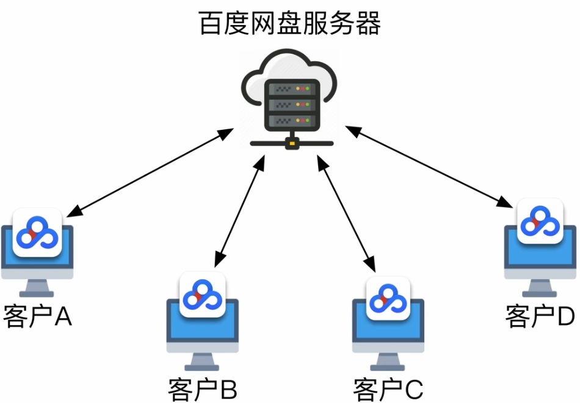

> [!tip]
>
> “服务器”本质上也是一台主机。（可以理解为性能强悍的电脑）

**C/S 模型特点**：

- 客户、服务器地位不平等
- 客户之间不直接通信
- 如果服务器损坏，影响全局
- 服务器负载较大

### P2P 模型实例：BT 种子下载

**P2P 模型特点**：

- 主机之间地位平等
- 主机之间直接通信
- 单个节点损坏不影响全局
- 各节点可以分摊负载

## 域名解析系统 DNS

### DNS 系统

### 域名

- **根**
- **顶级域名**
  - **国家顶级域名**：cn（中国）、uk（英国）、us（美国）等。
  - **通用顶级域名**：com（商业机构）、net（网络服务机构）、travel（旅游业）、edu（教育机构，主要美国专用）、mil（军事机构，美国专用）。
  - **基础结构域名**：arpa（用于反向 DNS 解析，IP → 域名映射）。
- **二级域名**
  - **类别域名**：ac（科研机构）、com（商业机构）、edu（教育机构）、gov（政府机构）、mil（军事机构）、net（网络服务机构）、org（非盈利组织）。
  - **我国行政区域域名**：对应各省 / 自治区 / 直辖市，例如 bj（北京）、js（江苏）。
- **三级域名**
- **四级域名**

### 域名服务器

- **根域名服务器**
- **顶级域名服务器**：管理该顶级域名服务器注册的所有二级域名。
- **权限域名服务器**：负责一个区的域名服务器。
- **本地域名服务器**：当一个主机发出 DNS 查询请求时，这个查询请求报文就发给本地域名服务器。

### 域名解析过程

> [!tip]
>
> 为了提升 DNS 查询效率，可通过高速缓存存储两类信息：一是近期查询过的域名，二是该域名映射信息的获取来源记录。
>
> 为让高速缓存保持动态更新并内容准确，需为缓存项设置 TTL（生存时间）计时器，自动清理超出有效时长的条目。
>
> 这类高速缓存并非本地域名服务器独有，主机自身也会配备——主机开机时，会从本地域名服务器同步缓存数据，存入自身的本地缓存中。

### 域名服务器

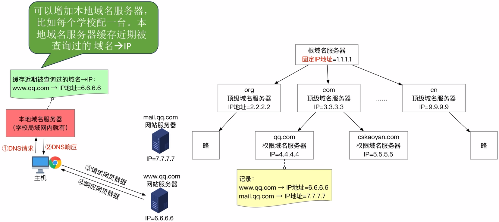

### 域名服务器原理类比

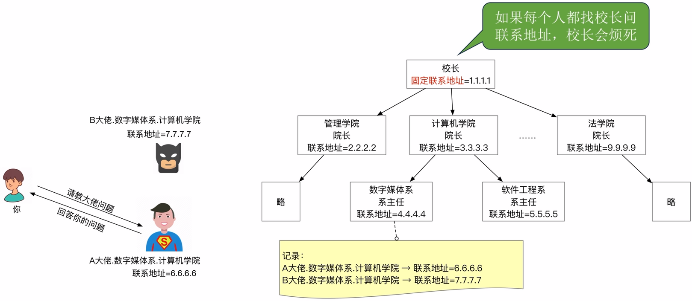

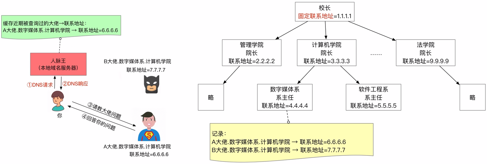

### 域名解析过程类比 （递归查询）

### 域名解析过程类比（迭代查询）

## 文件传输协议 FTP

- 文件传输协议 FTP（File Transfer Protocol）
- 简单文件传输协议 TFTP（Trivial File Transfer Protocol）

### 文件传输协议

**文件传输协议 FTP（File Transfer Protocol）**提供不同种类主机系统（硬、软件体系等均可不同）之间的文件传输能力。

### FTP 服务器和用户端

FTP 是基于客户/服务器（C/S）的协议。

用户通过一个客户机程序连接至在远程计算机上运行的服务器程序。

依照 FTP 协议提供服务，进行文件传送的计算机就是 **FTP 服务器**。

连接 FTP 服务器，遵循 FTP 协议与服务器传送文件的电脑就是 **FTP 客户端**。

FTP 客户端软件：

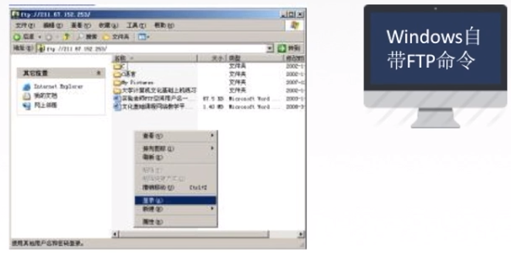

### FTP 工作原理

1. **登录方式**

   - **匿名登录**

     互联网中存在大量“匿名 FTP 服务器”，核心作用是向公众开放文件传输服务，**无需用户预先注册或获取服务器授权**。

     用户只需使用专用用户名“anonymous”（密码通常可填任意邮箱，如 test@example.com）登录，即可访问服务器上公开的文件资源，常见于开源软件镜像站、公开文档库等场景。

   - **授权登录**

     针对需要权限管控的场景（如个人服务器、企业文档库），FTP 服务器会要求用户使用**预先注册的专属账号 + 密码**登录，仅授权用户可访问对应权限的文件（比如部分用户仅能下载、部分用户可上传/修改），安全性与权限管理更严格，适用于私密文件传输、项目资源管理等场景。

2. **传输协议特性**

   FTP 基于 **TCP 协议**实现数据传输，依托 TCP 的可靠连接机制（重传、拥塞控制等），可保障文件传输的稳定性与完整性，避免数据丢失或损坏。

3. **服务器进程架构**

   FTP 服务器采用“主进程 + 从属进程”的架构，支持多客户端同时访问：

   - **1 个主进程**：持续监听客户端的连接请求，是服务器的核心控制节点。
   - **n 个从属进程**：主进程接收到客户端请求后，会创建对应的从属进程，专门处理该客户端的命令交互、文件传输等操作，避免单进程阻塞，保障多用户访问的效率。

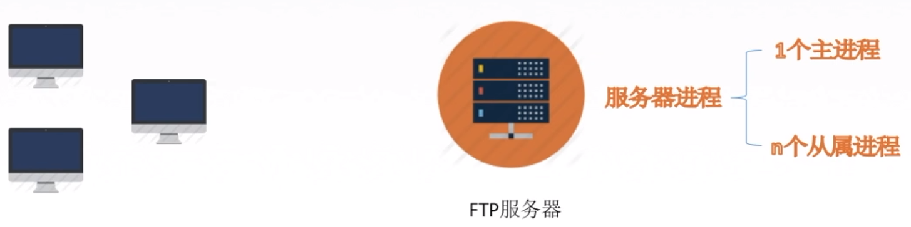

- **控制**连接始终保持。
- **数据**连接保持一会。

是否使用 TCP 20 端口建立**数据连接**与传输模式有关。

- 主动方式使用 TCP 20 端口。
- 被动方式由服务器和客户端自行协商决定（端口 > 1024）。

FTP 传输模式：

- **文本模式**：ASCII 模式，以文本序列传输数据。
- **二进制模式**：Binary 模式，以二进制序列传输数据。

## 电子邮件

### 电子邮件系统概述

### 电子邮件的信息格式

### 组成结构

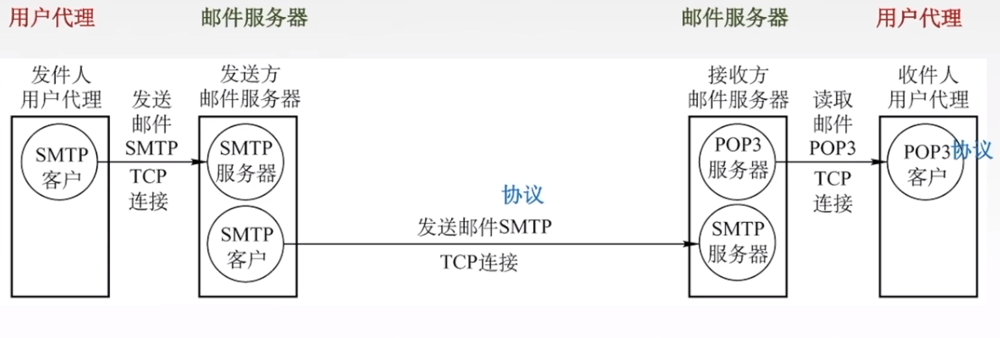

### 简单邮件传输协议 SMTP

SMTP 规定了在两个相互通信的 **SMTP 进程**之间应如何交换信息。

负责发送邮件的 SMTP 进程是 **SMTP 客户**，负责接收邮件的进程是 **SMTP 服务器**。

SMTP 规定了 14 条命令（几个字母）和 21 种应答信息（三位数字代码 + 简单文字说明）。

SMTP 建立在 TCP 连接之上，采用客户端 - 服务器（C/S）架构，传统非加密传输使用 25 号端口，现代主流的加密传输则常用 465 号端口（SMTPS）或 587 号端口（STARTTLS）。

**SMTP 通信三个阶段**：

1. 连接建立

   

2. 邮件发送

   

3. 连接释放

   邮件发完，SMTP 客户发送 QUIT 命令，SMTP 服务器返回“221”，表示同意释放 TCP 连接。

### 通用因特网邮件扩充 MIME

**SMTP 的缺点**：

1. SMTP 不能传送可执行文件或者其他二进制对象。
2. SMTP 仅限于传送 7 位 ASCII 码，不能传送其他非英语国家的文字。
3. SMTP 服务器会拒绝超过一定长度的邮件。

使用通用因特网邮件扩充 MIME 来解决上述缺点。

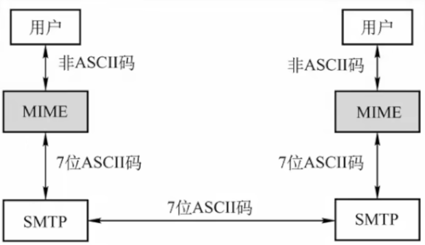

使电子邮件系统可以支持声音、图像、视频、多种国家语言等。

**使得传输内容丰富多彩。**

### 邮局协议 POP3

POP3（邮局协议第 3 版）建立在 TCP 连接之上，采用客户端 - 服务器（C/S）架构：传统非加密传输使用 110 号端口（目前多数邮箱服务商已限制该端口的客户端访问），主流加密传输则采用 995 号端口（POP3S，基于 SSL/TLS 加密，是当前客户端收发邮件的常用端口）。

### 互联网消息访问协议 IMAP

IMAP 协议比 POP 协议复杂。当用户 PC 上的 IMAP 客户程序打开 IMAP 服务器的邮箱时，用户可以看到邮箱的首部，若用户需要打开某个邮件，该邮件才上传到用户的计算机上。

IMAP 可以让用户在不同地方使用不同的计算机随时上网阅读处理邮件，还允许只读取邮件中的某一个部分（先看正文，有 Wi-Fi 时再下载附件）。

### 基于万维网的电子邮件

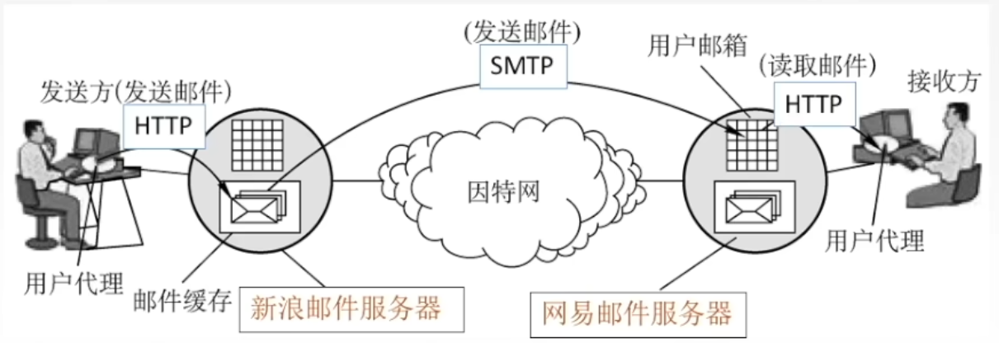

---

**知识回顾**：

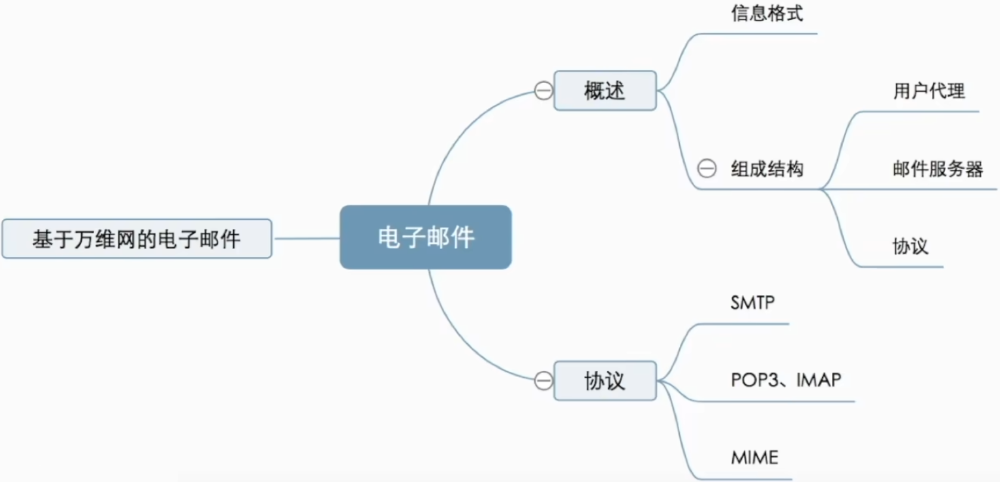

## 万维网 WWW

### 一个网页的构成

### HTML 文件的内容

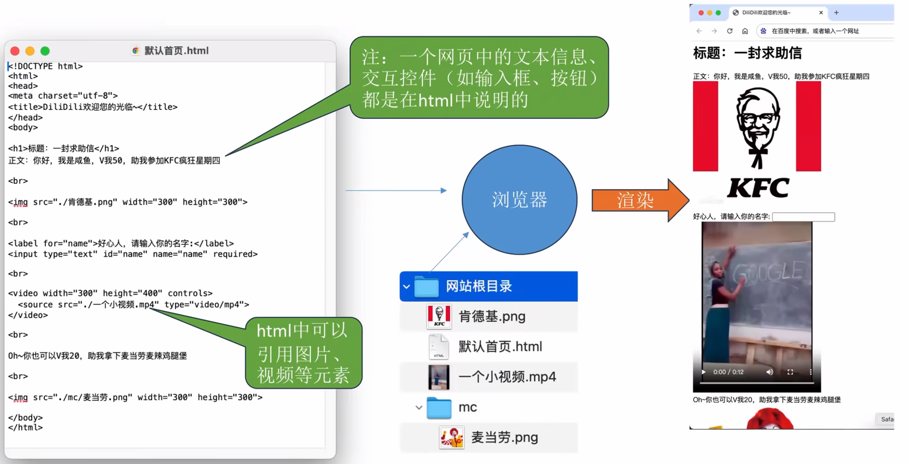

### 访问网站背后的原理

**浏览器访问一个网页的过程**：

1. 用户输入网址（域名）
2. 浏览器通过 DNS 服务器查询域名对应的 IP 地址（浏览器会将查询结果“<u>域名 → IP 地址</u>”缓存在本地）
3. 浏览器与 Web 服务器（通过其 IP 地址），基于 HTTP 协议的默认端口（80 端口）建立 TCP 连接。
4. 浏览器在<u>握手 ③</u> 中携带 HTTP 请求报文（指明要访问哪个 HTTP 网页）。
5. 服务器返回 HTTP 响应报文（携带 HTML 文件）。
6. 若 HTML 引用了其他 n 个元素，还需要 n 组 HTTP 请求 & 响应（持续、非持续工作方式有所区别）。

### HTTP 协议的工作方式

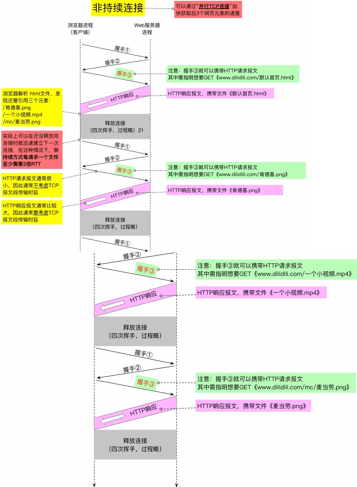

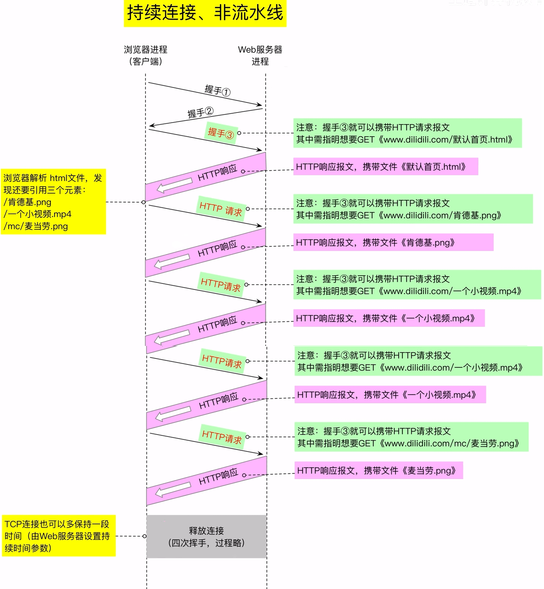

---

**知识回顾**：

## 超文本传输协议 HTTP

### HTTP 报文格式

> [!tip]
>
> - 方法（Method）≈ 函数（Function）
>
> - 字段（Field）≈ 参数（Parameter）

### HTTP 报文格式实例

### Cookie 的作用

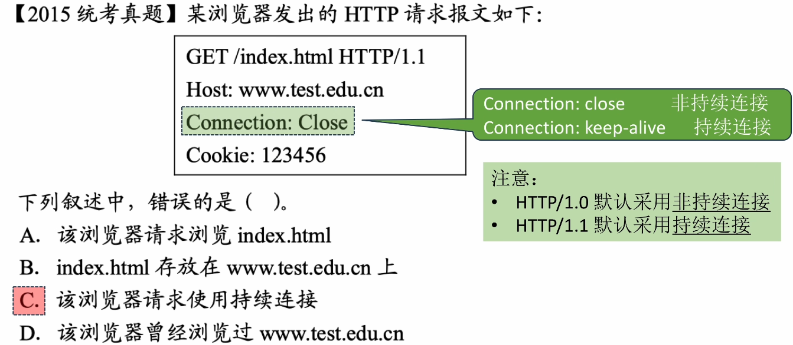

---

**知识总览**：

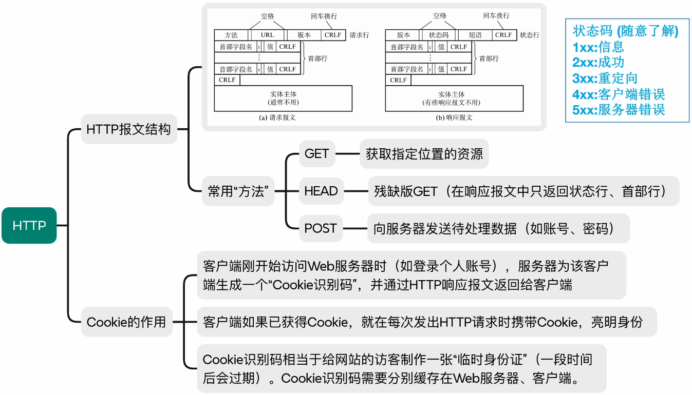
