# 多态

## 多态的引入

在之前实现的英雄模型中，假如实现某个接口可以传入一个英雄，在该接口可以对英雄的力量、敏捷和智力进行加强，接口参数如何设计？

因为接口需要传入一个英雄对象，而每个英雄都属于不同类的实例化对象，所以我们对接口的参数不做特殊处理，那么有多少个英雄我们就需要设计多少个这样的函数，而每个函数中执行的逻辑相同仅仅是处理的对象不一样而已，如此代码的重用度就高了。

C++ 提供了这样一种机制：**基类指针可以指向派生类对象**，完美解决这个问题。我们只需要将该接口的参数设计为一个所以英雄共同基类 `Hero` 的指针，然后传参时传递英雄对象的指针即可。

以上解决方法利用了 C++ 的多态。

- **多态**：一个函数有多种形态

- **多态的分类**：**静态联编** 和**动态联编**

通常来说联编就是将模块或者函数并在一起生成可执行代码的处理过程，同时对每个模块或者函数调用分配内存地址，并且对外访问也分配正确的内存地址，它是计算机程序彼此关联的过程。按照联编所进行的阶段不同，可以分为两种不同的联编方法：**静态联编**和**动态联编**。

## 静态联编

### 静态联编的概念

静态联编是指联编工作在**编译阶段完成**的，这种联编过程是在程序运行之前完成的，又被称为**早期联编**。

要实现静态联编，在编译阶段就必须确定程序中的操作调用（如函数调用）与执行该操作代码间的关系，确定这种关系、称为束定，在编译时的束定称为**静态束定**。静态联编对函数的选择是基于指向对象或者引用的类型。其优点是效率高，但灵活性差。

### 静态联编的体现

- 隐藏
- 函数的重载
- 运算符重载
- 泛型编程

## 运算符重载

### 运算符重载概述

运算符重载，就是对已有的运算符重新进行定义，<u>赋予</u>其另一种功能，以适应不同的数据类型。（**运算符重载不能改变本来寓意，不能改变基础类型寓意**）

**运算符重载（Operator Overloading）只是一种“语法上的方便”，也就是它只是另一种函数调用的方式。**

在 C++ 中，可以定义一个处理类的新运算符。这种定义与函数的定义类似，只是<u>函数的名字由关键字 `operator` 及其紧跟的运算符组成</u>（函数名为 `operator运算符`）。差别仅此，与其他函数一样也是一个函数，当编译器遇到适当的模式，就会调用该函数。

可重载运算符：

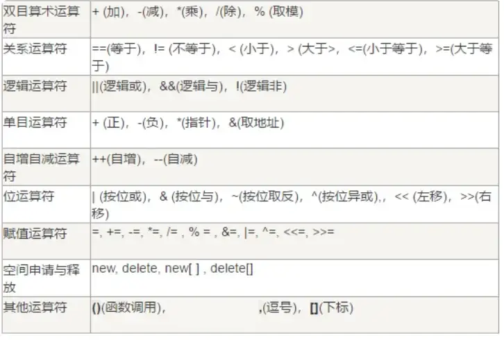

不可重载的运算符：

- 成员访问运算符：`.`
- 成员指针访问运算符：`->`
- 域运算符：`::`
- 长度运算符：`sizeof`
- 条件运算符：`:?`
- 预处理符号：`#`

### 运算符重载实例

`+` 号：

```cpp
#include <cstring>
#include <iostream>

using namespace std;

int func() {
  int x = 10;
  return x;
}

class Test {
 public:
  int data;
  char *ptr;

  Test() : data(0), ptr(new char[10]) { cout << "Test()" << endl; }
  Test(const Test &t) {
    cout << "Test(const Test &t)" << endl;
    data = t.data;
    if (strlen(t.ptr)) {
      ptr = new char[strlen(t.ptr)];
      strcpy(ptr, t.ptr);
    } else {
      ptr = new char[10];
    }
  }

  Test(int data, const char *src) {
    this->data = data;
    if (src && strlen(src)) {
      this->ptr = new char[strlen(src) + 1];
      strcpy(this->ptr, src);
    }
  }

  ~Test() {
    if (ptr) delete[] ptr;
  }

  // 运算符重载，实现字符串拼接
  // 该运算符重载运算符由左操作数调用，右操作数当做实参
  // 触发：t1.operator+()
  Test operator+(Test &t) {
    cout << "Test operator+(Test &t)" << endl;
    // 保存最后执行的结果
    Test val;
    val.data = this->data + t.data;
    val.ptr = new char[strlen(this->ptr) + strlen(t.ptr) + 1];
    memset(val.ptr, 0, strlen(this->ptr) + strlen(t.ptr) + 1);
    strcat(val.ptr, this->ptr);
    strcat(val.ptr, t.ptr);
    return val;
  }
};

int main() {
  Test t1(10, "Hello ");

  Test t2 = t1;
  cout << t2.data << endl;
  cout << t2.ptr << endl;

  Test t3(10, "World!");

  cout << "****************" << endl;

  Test t4 = t1 + t3;
  // 执行 Test t4 = t1 + t3
  // 会触发 Test operator+(Test &t)
  // 返回一个构造好的对象
  // 调用拷贝构造函数 Test t4 = val 触发拷贝构造函数的调用
  cout << t4.data << endl;
  cout << t4.ptr << endl;

  return 0;
}
```

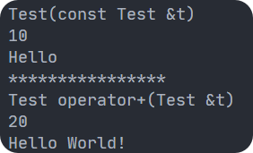

按照分析，上述输出应该会有 `Test(const Test &t)` 输出，可是却没有，由此分析：

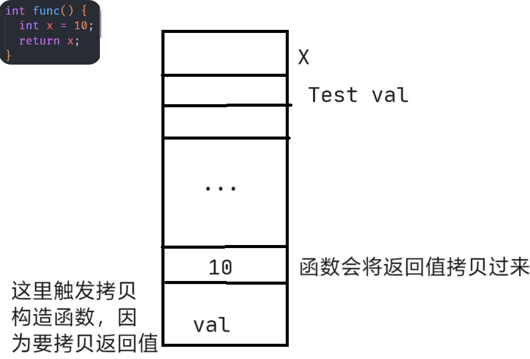

可以看到，程序会将返回值拷贝到一块地方。因此，类似的，`Test operator+(Test &t)` 函数 ，会将对象 `Test` 拷贝到一块地方，此时触发一次拷贝构造函数。然后执行 `Test t4 = t2 + t3` 时，会再拷贝一次。因此，就会调用两次拷贝构造函数。

**为什么一次拷贝构造函数调用的输出语句都没使用呢？**智能的编译器不构造临时变量，提高了程序的运行效率。

而被优化后的语句变为：

```cpp
Test t4;
t4 = t2 + t3;
```

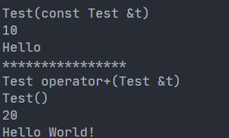

可以看到调用了默认构造函数。代码如下：

```cpp
  // 运算符重载，实现字符串拼接
  // 该运算符重载运算符由左操作数调用，右操作数当做实参
  // 触发：t1.operator+()
  Test operator+(const Test &t) {
    cout << "Test operator+(Test &t)" << endl;
    // 保存最后执行的结果
    Test val;
    val.data = this->data + t.data;
    val.ptr = new char[strlen(this->ptr) + strlen(t.ptr) + 1];
    memset(val.ptr, 0, strlen(this->ptr) + strlen(t.ptr) + 1);
    strcpy(val.ptr, this->ptr);
    strcat(val.ptr, t.ptr);
    return val;
  }
```

`>` 号：

```cpp
  // > 号运算符的重载
  // 比较字符串版本
  bool operator>(const Test &t) {
    cout << "bool operator>(const Test &t)" << endl;
    if (strcmp(this->ptr, t.ptr) > 0) {
      return true;
    } else {
      return false;
    }
  }
```

`[]` 号：

```cpp
  char operator[](const int index) {
    cout << "char operator[](const Test &t)" << endl;
    if (index < 0 || index >= strlen(ptr)) return '\0';
    return this->ptr[index];
  }
```

`=` 号：

```cpp
  Test &operator=(const Test &t) {
    // t1 = t2
    // t3 = t1 = t2
    // 所以返回 *this，使用 Test &返回减少临时对象的产生
    delete[] this->ptr;
    this->ptr = new char[strlen(t.ptr) + 1];
    this->data = t.data;
    strcpy(this->ptr, t.ptr);
    return *this;
  }
```

C++ 编译器会帮我们实现四个函数：默认构造函数、拷贝构造函数、析构函数、重载赋值运算符，但都是**浅拷贝**。使用 `Test &` 返回，可以减少临时变量的产生（因为它只是个别名）。

`++` 号：

```cpp
  // 前置 ++
  // ++t1
  Test &operator++() {
    cout << "Test &operator++()" << endl;
    ++this->data;
    return *this;
  }

  // 后置++
  // t1++
  // 通过传 int 来区分前置 ++ 和后置 ++
  Test operator++(int) {
    cout << "Test operator++(int)" << endl;
    // 临时变量保存 ++ 之前的状态
    Test temp = *this;
    ++data;
    return temp;
  }
```

从上面可以看出前置 `++` 比后置 `++` 效率更高。

输出运算符的重载：

```cpp
  // <<
  // cout << t1
  // 左操作数 cout 不是 Test 对象，无法直接通过它调用
  // 将左操作数和右操作数当作实参来传递
  // cout: ostream
  friend ostream &operator<<(ostream &os, const Test &t) {
    os << t.data << endl;
    os << t.ptr << endl;
    // 返回 os 以便于链式
    return os;
  }
```

### 拓展：引用和对象作为返回值的差别

参数中有相应对象，就可以尝试引用；如果是新的变量，就只能返回对象。

不管返回值是 `Test`，还是 `Test &`，在 `return` 后面的总是一个对象。

如果调用的是一个普通的对象，就会导致临时变量的产生，因此会有拷贝构造函数和析构函数的调用。

返回对象的引用，而引用是一个对象的别名，不会产生临时变量，减少相关函数的调用，就会提高效率。

引用是存在变量的别名，局部变量随着函数调用结束而被销毁（因为函数被回收了），因此引用失效了。因此，下面这些是错的：

```cpp
Test &func() {
  Test t;
  return t;
}
```

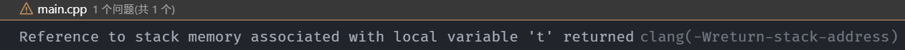

下面这个正确：

```cpp
Test &func(Test &t) {
  // 传入的参数还在
  // 因此引用有效
  return t;
}
```

**总结**：不能返回一个该函数栈（就是这个函数实现的时候产生的）的引用。

## 友元函数

### 友元函数

友元函数可以直接访问类的私有成员的非成员函数。它是定义在类外的普通函数或其他类的成员函数，它<u>不属于任何类</u>，但需要在类的定义中加以声明，声明式只需友元的名称加上关键字 `friend`，其格式如下：

```cpp
friend 类型 函数名(形式参数);
```

友元函数的使用：

- 友元函数的声明可以放在类的私有部分，也可以放在类的公共部分，它们是没有区别的，都说明是该类的一个友元函数
- 一个函数可以是多个类的友元函数，只需要在<u>各个类中分别声明</u>
- 友元函数的调用与一般函数的调用方式和原理一致
- 友元函数<u>没用 `this` 指针</u>（所以参数列表中要有对象）
- 两个类要共享数据的时候可以使用友元函数，比如，类 A 中的函数需要访问类 B 中的成员，那么类 A 中该函数要是类 B 的友元函数
- 运算符重载的某些场合需要使用友元函数，例如 `<<` 的重载

```cpp
#include <iostream>

using namespace std;

// 先声明 class B
// 才可以在 class A 中使用
class B;

class A {
 public:
  int y;

 private:
  int x;

  // 将普通函数 func 声明为该类的友元函数
  // 此时便可以访问该类中的私有成员变量
  friend void func(A &, B &);
};

class B {
 public:
  int y;

 private:
  int x;

  friend void func(A &, B &);
};

// 可以同时访问两个类
void func(A &t1, B &t2) {
  t1.y = 100;
  t2.x = 100;
}

int main() {
  A a;
  B b;
  func(a, b);
  return 0;
}
```

实例：

```cpp
class CCar;  // 提前声明 CCar 类，以便后面的 CDriver 类使用
class CDriver {
 public:
  void ModifyCar(CCar* pCar);  // 改装汽车
};
class CCar {
 private:
  int price;
  friend int MostExpensiveCar(CCar cars[], int total);  // 声明友元
  friend void CDriver::ModifyCar(CCar* pCar);           // 声明友元
};
void CDriver::ModifyCar(CCar* pCar) {
  pCar->price += 1000;  // 汽车改装后价值增加
}

int MostExpensiveCar(CCar cars[], int total) {
  // 求最贵汽车的价格
  int tmpMax = -1;
  for (int i = 0; i < total; ++i) {
    if (cars[i].price > tmpMax) {
      tmpMax = cars[i].price;
    }
  }
  return tmpMax;
}

int main() {
  return 0;
}

```

为了访问私有成员变量，所以要去声明友元。（比作这个函数是这个类的朋友，因此可以访问它的私有成员变量）

### 用 `friend` 修饰输出运算符的重载

如果重载双目操作符（即为类的成员函数），就只要设置一个参数为右侧运算量，而左侧运算量就是对象本身。而 `>>` 或 `<<` 左侧运算量是 `cin` 或 `cout` 而不是对象本身，所以不满足后面一点，只能申明为友元函数了。

```cpp
ostream &operator<<(ostream &output) {
  output << this->x << endl;
  return output;
}
```

此时使用它就变为 `data << cout;`，不符合习惯。因此：

```cpp
#include <iostream>
using namespace std;
class Test {
 public:
  int x;

  friend ostream &operator<<(ostream &os, const Test &t) ；
};

ostream &operator<<(ostream &os, const Test &t) {
  os << t.x;
  return os;
}

int main() {
  Test t;
  // 因为 << 是 Test 的成员函数
  // 所以如果不声明友元
  // 只能由 Test 来调用
  cout << t << endl;
  return 0;
}
```

**拓展**：

在 C++ 中，当重载一个二元运算符（如 `<<`）时，函数的参数通常按照它们在原始表达式中的位置来对应左操作数和右操作数。对于插入运算符 `<<` 来说，其语法形式是：

```cpp
ostream &operator<<(ostream &os, const T &t);
```

因此对于双目运算符 `>`，有：

```cpp
class Test {
 public:
  int x;
  friend bool operator>(const Test &, const Test &);
};

bool operator>(const Test &t1, const Test &t2) { return t1.x > t2.x; }

```

**总结**：这些双目重载函数都可以声明为友元函数。

### 友元类

```cpp
#include <iostream>

using namespace std;

class B;
class A {
 public:
  void func1(B &t);
  void func2(B &t);
};

class B {
 private:
  int x;
  // friend void A::func1(B &t);
  // friend void A::func2(B &t);
  // 将类 A 声明为友元类
  friend class A;
};

void A::func1(B &t) { cout << t.x << endl; }
void A::func2(B &t) { cout << t.x << endl; }

int main() {
  B b;
  A a;
  a.func1(b);
  a.func2(b);
  return 0;
}
```

**注意事项**：

- 友元关系<u>不能被继承</u>：

  ```cpp
  class B {
   private:
    int x;

    friend void func();
  };

  class C : public B {
    // class A 不是 class C 的友元类
    // void func() 也不是 class C 的友元函数
    // 因为友元关系不能继承
    // 联想：你父亲的朋友不一定是你的朋友
  };

  void func() {}
  ```

- 友元关系是<u>单向的，不具备交换性</u>；若类 B 是类 A 的友元函数，类 A 不一定是类 B 的友元，要看在类中是否有相应的声明（即 A 把 B 当朋友，但 B 不一定把 A 当朋友）

- 友元关系具有<u>非传递性</u>；若类 B 是类 A 的友元，类 C 是 B 的友元，类 C 不一定是类 A 的友元，同样要看类中是否有相应的声明

> **注意**：
>
> 友元的作用是提高程序的运行效率（即减少了类型检查和安全性检查等都需要时间开销），但它破坏了类的封装性和隐藏性，使得非成员函数可以访问类的私有成员，不建议使用。

## 动态多态

**动态多态（动态绑定）**：即运行时的多态，在程序执行期间（非编译期）判断所引用对象的实际类型，根据其实际类型调用相应的方法。

**有的工程师认为真正的多态是动态多态。**

动态多态满足三个条件：

- 有继承关系
- 有虚函数
- 有基类指针指向派生类对象或者基类的引用变量引用了派生类对象

## 重载、重写（覆盖）、隐藏

- **重载（Overload）**：重载只发生在同一个作用域中，比如一个类中的多个成员函数名相同，但是形参数据类型或者个数或者顺序不相同，那么就称这些函数是重载
- **重写（Override）**：也叫覆盖，重写发生在不同的作用域中（发生在基类和派生类中），而且派生类中的成员函数的名字和基类中的虚函数的名字相同，并且返回值相同，**形参列表相同**
- **隐藏**：发生在不同的作用域中（发生在基类和派生类中），派生类中的成员函数的名字、返回值、形参列表与基类完全相同，派生类中的成员函数的名字和基类中的成员函数的名字相同，但是形参列表不同或者返回值不同，这也叫做隐藏，此时基类中的那个函数不论是普通函数还是虚函数（有形参列表和返回值不同的前提）都会被派生类中的函数隐藏

## 虚函数

### 虚函数的基本使用

C++ 中的虚函数的作用主要是实现了多态的机制。基类定义虚函数，子类可以重写该函数；一个类的**构造函数**不可以是虚函数。

虚函数的定义：

```cpp
virtual 函数类型 函数名(形参列表)
```

```cpp
#include <iostream>

using namespace std;

class Hero {
 public:
  virtual void huicheng() { cout << "Hero::huicheng()" << endl; }

  void func() { cout << "Hero::func()" << endl; }
};

class Libai : public Hero {
 public:
  // 隐藏基类中的 func2 函数
  void func() { cout << "Libai::func()" << endl; }
  // 对基类中虚函数的重写（override）
  void huicheng() { cout << "Libai::huicheng()" << endl; }
};

class Caocao : public Hero {
 public:
  void func() { cout << "Caocao::func()" << endl; }
  void huicheng() { cout << "Caocao::huicheng()" << endl; }
};

class Houyi : public Hero {};

// 使用基类没有重写的 huicheng() 函数
void goback(Hero &h) {
  h.huicheng();
  h.func();
}

int main() {
  Libai libai;
  Caocao caocao;
  Houyi houyi;

  // libai 回城
  // 因为是虚函数，所以打印的是派生类对象
  goback(libai);
  goback(caocao);
  goback(houyi);

  return 0;
}
````

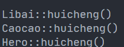

如果没有 `virtual` 关键字：

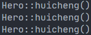

毕竟是基类指针。

虚函数的使用使得使用基类的引用或者指针（指向派生类的）时，可以使用派生类中重写的函数。如上述代码中，有一个接口 `goback()`，使用它的时候就会调用对象的 `huicheng()` 函数。可以看到，在 `Libai`、`Caocao` 两个类中，对基类的 `huicheng()` 函数进行了重写，使得调用的时候，调用的是重写的函数。

接口使用的是基类的指针，使得代码不冗余。（因为给每一个派生类安排一个接口浪费）

对于基类指针，它可以指向派生类，并且可以访问派生类从基类继承的成员变量和成员函数。

而 `func()` 函数调用的永远是基类中的。

**总结**：基类中的函数如果是虚函数，通过基类指针（或引用）指向派生类对像中重写的虚函数。

**虚函数的实现原理**：虚函数指针和虚函数表。

### 虚函数指针

虚函数指针（Virtual Function Pointer, vptr），从本质上来说就只是一个指向函数的指针，与普通的指针并无区别。它指向用户所定义的虚函数，具体是在**子类里的实现**，在子类中调用虚函数的时候，实际上是通过该虚函数指针从而找到接口。

**只有拥有虚函数的类才会拥有虚函数指针，每一个虚函数也都会对应一个虚函数指针。**

### 虚函数表

存放虚函数指针的数组是虚函数表（Virtual Function Table, vtbl）。

每个包含了虚函数的类都包含一个虚表。当一个类（`A`）继承另一个类（`B`），类 `A` 会继承类 `B` 的函数。所以如果一个基类包含了虚函数，那么其派生类也可以调用这些虚函数，换句话说，一个类继承了包含虚函数的基类，那么这个类也拥有自己的虚表。

```c++
class A {
 public:
  virtual void vfunc1() {}
  virtual void vfunc2() {}
  void func1() {}
  void func2() {}
 private:
  int m_data1, m_data2;
};
```

如下图所示：

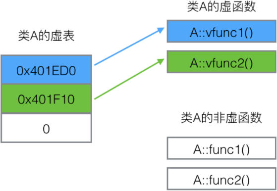

```c++
#include <iostream>

using namespace std;

class A {
 public:
  virtual void func1() {}
  virtual void func2() {}
  void func3() {}
  virtual void func4() {}
};

class B : public A {};

int main() {
  A a;
  cout << sizeof(a) << endl;
  return 0;
}
```

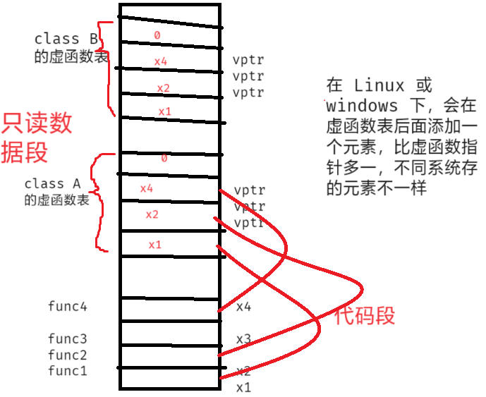

```c++
class A {
 public:
  virtual void func1() {}
  virtual void func2() {}
  void func3() {}
  virtual void func4() {}
};

class B : public A {
 public:
  virtual void func() {}  // class B 自己的虚函数
};
```

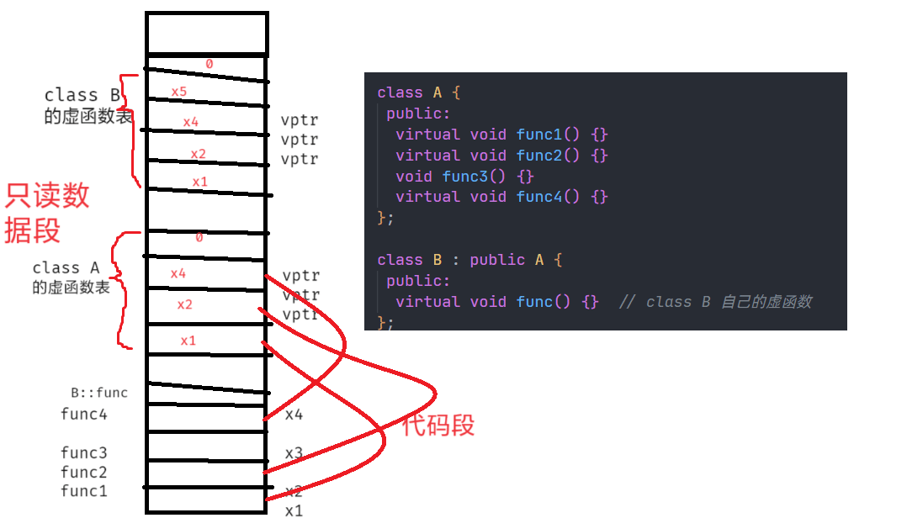

```c++
class A {
 public:
  virtual void func1() {}
  virtual void func2() {}
  void func3() {}
  virtual void func4() {}
};

class B : public A {
 public:
  virtual void func() {}  // class B 自己的虚函数
  // 在派生类中，不管加不加 virtual，编译器都会认为它是虚函数
  virtual void func1() {}  // 虚函数的重写（覆盖）
};
```

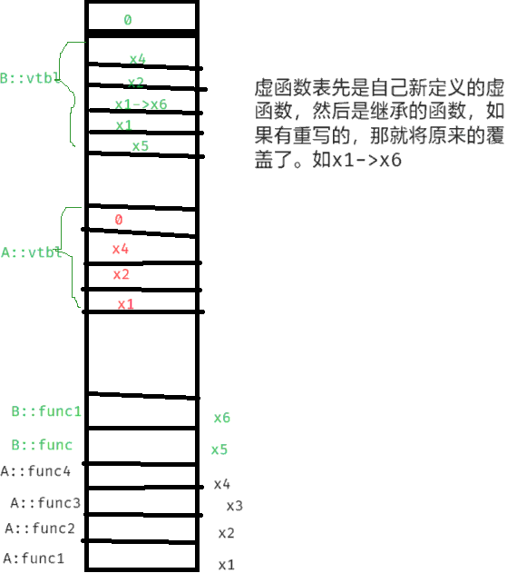

### 虚表指针（虚函数表指针）

虚表是属于类的，而不是某个具体的对象，一个类只需一个虚表即可。同一个类的所有对象都**使用同一个虚表**。

为了指定对象的虚表，**对象内部**包含一个虚表的指针，来指向自己所使用的虚表。为了让每个包含虚表的类的对象都拥有一个虚表指针，编译器在类中添加一个指针 `*_vptr`，用来指向虚表。这样，当类的对象在创建时便拥有了这个指针，且这个指针的值会自动被设置为指向类的虚表。

**虚表指针存在于每一个被实例化的对象中，前提是该对象中有虚函数，它总是被存放在该对象的地址<u>首位</u>，这种做法的目的是为了保证运行的快速性。**

```c++
#include <iostream>

using namespace std;

class A {
 public:
  virtual void func1() {}
  virtual void func2() {}
  void func3() {}
  virtual void func4() {}
};

int main() {
  A a;
  cout << sizeof(a) << endl;
  return 0;
}
```


可以看到输出 8，因为对象有存储虚表指针（64 位机器）。

虚函数表属于类，对于每个对象是共享的。

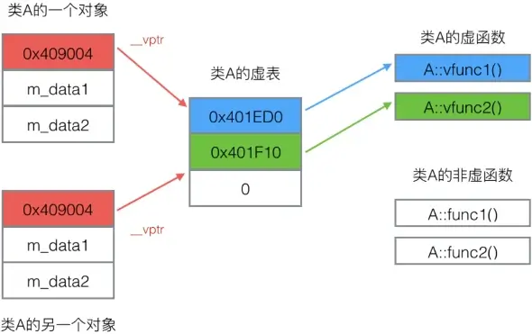

```cpp
class A {
 public:
  virtual void vfunc1();
  virtual void vfunc2();
  void func1();
  void func2();

 private:
  int m_data1, m_data2;
};

class B : public A {
 public:
  void vfunc1();  // 重写了 vfunc1
  void func1();

 private:
  int m_data3;
};

class C : public B {
 public:
  virtual void vfunc2();  // 重写了 vfunc2
  void func2();

 private:
  int m_data1, m_data4;
};
```

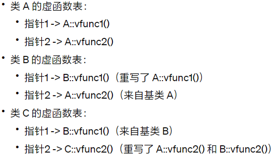

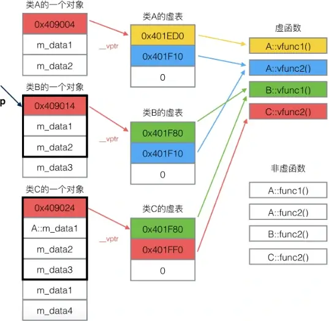

```c++
#include <iostream>
using namespace std;
class A {
 public:
  virtual void vfunc1() { cout << "A::virtual void vfunc1()" << endl; }
  virtual void vfunc2() { cout << "A::virtual void vfunc2()" << endl; }
  void func1() { cout << "A::void func1()" << endl; }
  void func2() { cout << "A::void func2()" << endl; }
};

class B : public A {
 public:
  void vfunc1() { cout << "B::virtual void vfunc1()" << endl; }
  void func1() { cout << "B::void func1()" << endl; }
};

int main() {
  B b;
  b.vfunc1();  // B::vfunc1
  b.vfunc2();  // A::vfunc2
  b.func1();   // B::func1
  b.func2();   // A::func2

  A *p;
  p = &b;
  p->vfunc1();  // B::vfunc1
  p->vfunc2();  // A::vfunc2
  p->func1();   // A::func1
  p->func2();   // A::func2

  return 0;
}
```

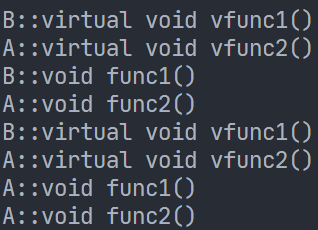

如果有基类指针指向派生类对象，并且通过基类指针调用某些函数时，编译器先检查被调用的 `f` 函数是否为虚函数，如果 `f` 不是虚函数，采用静态编译，**直接调用基类中的函数 `f`**，不论派生类是否隐藏了基类中的 `f` 函数。

如果函数 `f` 是虚函数，**编译时不知道该函数的调用到底该调用哪个 `f` 函数**。在程序运行的时候，**指针变量指向了派生类对象**，通过该指针能够访问被指向（被引用）的派生类对象中的虚函数表指针，在虚函数表中去查找调用**该函数的虚函数指针**。（动态绑定）

如果派生类重写（Override）了基类的虚函数 `f`，派生类的虚函数表保存的是派生类中的 `f` 函数的指针，因此通过基类指针调用 `f` 函数，最终调用到的是派生类中的函数 `f`。

如果派生类没有重写（覆盖）基类中的虚函数 `f`，派生类的虚函数表中保存的是基类中的 `f` 函数的指针，因此，通过基类指针调用 `f` 函数，最终调用到的是基类中的函数 `f`。

> **注意**：类 `B` 的非虚函数无法用基类指针调用。

之所以要 `virtual` 关键字，是因为如果单纯的覆盖的话，是**静态联编**，直接使用基类指针访问的<u>还是基类</u>的函数。而加上 `virtual` 之后，使用动态联编，会访问相应的虚函数表，调用正常的**虚函数**。

> **注意**：
>
> 建议重写时，使用 `Override` 关键字显示说明：
>
> ```cpp
> virtual void func() override {}
> ```

### 设计思路

- 如果基类的某个行为，在所有的派生类中的表现都一样，说明在所有派生类中都没有必要对基类中的行为进行重新实现，那么基类中的该行为/方法/函数可以设计成普通的成员函数，那么所有的派生类对象在调用的时候都是调用基类的函数
- 可是如果将基类中的该函数设计为虚函数，所有的派生类对象都会调用基类中的函数（因为在所有的派生类中都没有重写该函数）
- 但是该函数如果是非虚函数，采用的静态联编，程序编译完后就能够确定函数的具体调用；如果设计为虚函数，采用的动态联编，该函数的调用需要在程序运行的过程中才能够被确定，**后者的执行效率低于前者**
- 不可以图方便将基类中的所有成员函数设计为虚函数，开发出来的程序效率较低

### 虚表指针、虚函数的访问

```c++
#include <cstdio>
#include <iostream>

using namespace std;

typedef void (*Func)();

class Base {
 public:
  virtual void f() { cout << "f" << endl; }
  virtual void g() { cout << "g" << endl; }
  virtual void h() { cout << "h" << endl; }
};

int main() {
  // 虚表指针是对象中的第一个元素
  // 虚表指针的地址就是对象的地址
  Base b;
  // 虚表的首地址，虚函数指针的值，_vfptr
  printf("%p\n", (long long *)(*(long long *)(&b)));
  printf("%p\n", (long long *)(*(long long *)(&b)) + 0);  // 虚表的第 0 个元素
  printf("%p\n", (long long *)(*(long long *)(&b)) + 1);  // 虚表的第 1 个元素
  printf("%p\n", (long long *)(*(long long *)(&b)) + 2);  // 虚表的第 2 个元素

  // (int*)(&b) == &_vfptr 是虚函数表指针的地址
  // *(int*)(&b) == *(&_vfptr) == 虚表指针的值
  // 虚表指针值为虚表指针指向那个虚表指针的首地址

  printf("%p\n", *((long long *)(*(long long *)(&b)) + 0));  // f 函数的指针
  printf("%p\n", *((long long *)(*(long long *)(&b)) + 1));  // g 函数的指针
  printf("%p\n", *((long long *)(*(long long *)(&b)) + 2));  // h 函数的指针

  Func p;

  p = (Func) * ((long long *)(*(long long *)(&b)) + 0);
  p();
  p = (Func) * ((long long *)(*(long long *)(&b)) + 1);
  p();
  p = (Func) * ((long long *)(*(long long *)(&b)) + 2);
  p();

  return 0;
}
```

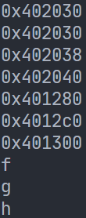

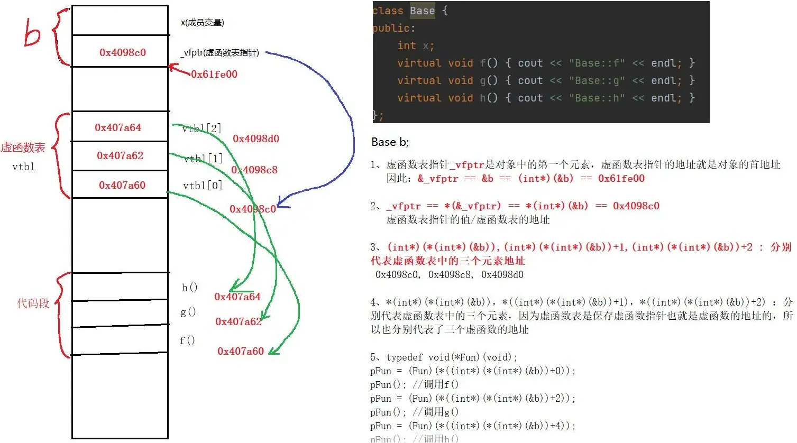

## 纯虚函数和抽象基类

### 纯虚函数

基类不确定函数的实现方法，只能确定函数的功能。但是函数的调用必须用到该函数。这种情况下，C++ 提供了一种机制，成为纯虚函数，属于虚函数的一种，体现了面向对象的多态性。

定义纯虚函数是为了实现一个接口，起到一个规范作用，规范这个类的程序员必须实现这个函数。

虚函数的语法如下：

```c++
virtual 返回值类型 函数名 (函数参数) = 0;
```

纯虚函数没有函数体，只有函数声明，在虚函数声明的结尾加上 `= 0`，表明此函数为纯虚函数。

> **注意**：最后的 `= 0` 并不表示函数的返回值为 0，它只起形式的作用，告诉编译系统“这是纯虚函数”。

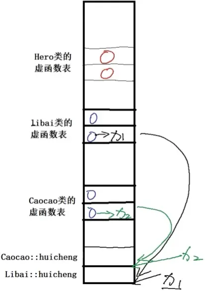

```cpp
#include <iostream>

using namespace std;

class Hero {
 public:
  virtual void back() = 0;  // 纯虚函数
};

class LiBai : public Hero {
 public:
  void back() { cout << "LiBai::back()" << endl; }  // 重写
};

class CaoCao : public Hero {
 public:
  void back() { cout << "CaoCao::back()" << endl; }  // 重写
};

int main() {
  LiBai h1;
  CaoCao h2;
  Hero *p;

  p = &h1;
  p->back();

  p = &h2;
  p->back();

  return 0;
}
```

纯虚函数在派生类中要重新声明，不能仅仅继承了就不声明。

### 抽象基类

**包含纯虚函数的类称为抽象类**（Abstract Class）。

之所以说它抽象，是因为它无法实例化，也就是无法创建对象。原因很明显，纯虚函数没有函数体，不是完整的函数，无法调用，也无法为其分配内存空间。抽象类通常是作为基类，让派生类去实现纯虚函数。**派生类必须实现纯虚函数才能被实例化。**如果派生类不实现继承自基类的虚函数，则派生类依旧为抽象基类。

如果我们希望将派生类当做普通类，那必须实现；但是如果想将派生类当作抽象类，也可以不实现。

当某个类只需要描述某一类事物的特征时，可以将这个类设计为抽象类。

抽象类实例：设计一个 `Shape` 类可以计算各种形状的面积。

```c++
#include <cmath>
#include <iostream>

using namespace std;

class Shape {
 public:
  virtual double getPermiter() const = 0;
  virtual double getArea() const = 0;
};

class Trangle : public Shape {
 public:
  Trangle(double a = 10, double b = 10, double c = 10) : _a(a), _b(b), _c(c) {}

  double getPermiter() const { return _a + _b + _c; }
  double getArea() const {
    double p = 0.5 * (_a + _b + _c);
    return sqrt(p * (p - _a) * (p - _b) * (p - _c));
  }

 private:
  double _a;
  double _b;
  double _c;

  double _permiter;
  double _area;
};

class Circle : public Shape {
 public:
  Circle() : _r(10) {}
  double getPermiter() const;
  double getArea() const;

 private:
  double _r;
  static double pi;
};

double Circle::pi = 3.1415926;
double Circle::getPermiter() const { return 2 * pi * _r; }
double Circle::getArea() const { return pi * _r * _r; }

int main() {
  Trangle trangle;
  cout << trangle.getPermiter() << endl;
  cout << trangle.getArea() << endl;

  Circle circle;
  cout << circle.getPermiter() << endl;
  cout << circle.getArea() << endl;

  // 用数组来保存一个三角形和一个圆
  Shape *shapes[2] = {&trangle, &circle};

  // 打印这两个的周长和面积
  for (int i = 0; i < 2; ++i) {
    cout << shapes[i]->getArea() << endl;
    cout << shapes[i]->getPermiter() << endl;
  }

  return 0;
}
```

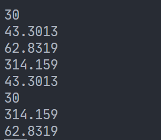

### 虚析构函数

```c++
#include <iostream>

using namespace std;

class A {
 public:
  A() { cout << "A::A()" << endl; }
  virtual ~A() { cout << "A::~A()" << endl; }
};

class B : public A {
 public:
  B() { cout << "B::B()" << endl; }
  ~B() { cout << "B::~B()" << endl; }
};

int main() {
  // 基类指针指向派生类对象
  // 构造一个派生类对象
  A *p = new B();
  // 通过基类指针，释放一个派生类对象
  delete p;
  return 0;
}
```

可以看到，析构函数被定义为虚函数；有：

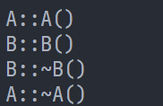

将 `virtual` 去掉，则会：

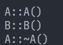

可以看到没有调用到派生类的析构函数，可能会造成**内存泄露**。

因此一个基类的析构函数最好定义为**虚函数**。

> **注意**：
>
> 当基类指针指向派生类对象时，编译器只知道指针的类型是**基类**，而不知道指针所指向的**真实类型**。如果基类的析构函数不是虚函数，编译器就会被绑定在基类的析构函数上，而不是派生类的析构函数。
