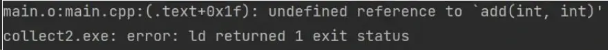
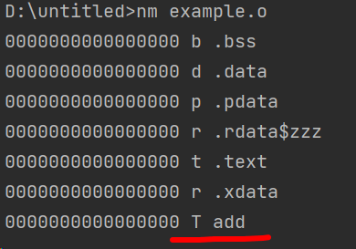
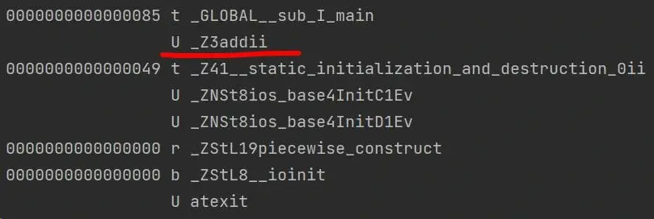
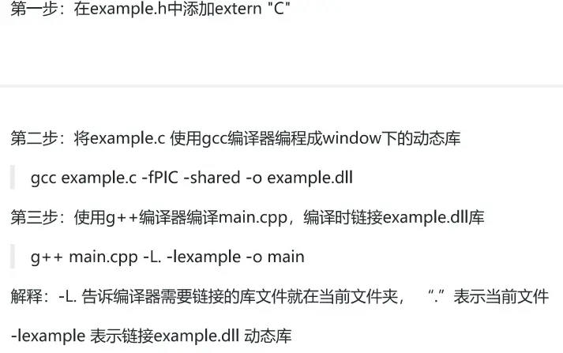
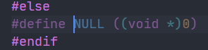
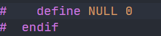

# 对 C 的拓展

## `const` 详解

### `const` 修饰普通变量

**被修饰的对象是只读的**。

- `const int a;` 中 `a` 的值是**只读**的 `int const a;`

- `const int *p;` 该语句表示指向整形常量的指针，它指向的值不能修改

- `int const *p;` 该语句与上一句相同，表示指向整形常量的指针，它指向的值不能修改

- ` int* const p;` 该语句表示指向整形的常量指针，它不能再指向别的变量，但指向（变量）的值可以修改

- `const int* const p = &a;` 该语句表示指向整形变量的常量指针，它不能指向别的常量，指向的值不可以修改

- ` int const* const p = &a;` 表示指向整形常量的常量指针；它既不能再指向别的常量，指向的值也不能修改

### `const` 修改成员变量

`const` 修饰类的成员变量，表示成员常量，同时它只能在初始化列表中赋值。

```c++
class A {
 public:
  const int n_value;        // 成员变量不能被修改
  A(int x) : n_value(x) {}  // 只能在初始化列表中赋值
};
```

### `const` 修饰类的成员函数

使用 `const` 修饰类的成员函数，该函数为类的**常成员函数，它不改变对象的成员变量。**

```c++
class B {
 public:
  int x;

 public:
  // error C3490: 由于正在通过常量对象访问“x”，因此无法对其进行修改
  void f() const { this->x++; }
};
```

> **注意**：普通的全局函数不能用 `const` 修饰。

下面这个是错误示例：

```c++
// “f”: 非成员函数上不允许修饰符
void f() const {}
```

`const` 的最大作用是增强代码的可读性，因为另一个程序员只能看到头文件；调试的时候可以减轻工作。

### `const` 修饰对象

- `const` 修饰的对象为常量对象，其中的任何成员都不能被修改

- `const` 修饰的对象只能访问<u>类中的 `const` 函数</u>

- `const` 修饰的对象可以访问 `public` 成员变量，但是不能够修改

```cpp
#include <iostream>

using namespace std;

class C {
 public:
  int y;
  int getX() const { return x; }
  C() : x(100), y(1000) {}

 private:
  int x;
};

int main() {
  const C c;
  cout << c.y << endl;
  cout << c.getX() << endl;
  return 0;
}
```

### `const` 修饰引用

```cpp
#include <iostream>
using namespace std;
// error C3892: “t”: 不能给常量赋值
void func(const int& t) { ++t; }
int main() {
  int x = 0;
  func(x);
  cout << x << endl;
  return 0;
}
```

## `extern "C"`

### `extern "C"` 的含义

`extern` 是 C/C++ 语言中表明函数和全局变量作用范围（可见性）的关键字，该关键字告诉编译器，**其声明的函数和变量可以在本模块或其他模块使用。**

通常，在模块的头文件中对本模块提供给其他模块引用的函数和全局变量以关键字 `extern` 声明。

> **注意**：
>
> 模块 B 中调用模块 A 中函数时，在编译阶段，模块 B 虽然找不到该函数，但是并不会报错；它会在**链接阶段**中从模块 A 编译生成的目标代码中找到此函数。

`extern "C"` 包含双重含义，从字面上即可得到；首先，被它修饰的目标是 `extern` 的；其次，被它修饰的目标是 C 的。

### `extern "C"` 的作用

有三个文件：

```c++
#pragma once

extern int add(int x, int y);
```

```cpp
#include "../include/example.h"

int add(int x, int y) { return x + y; }
```

```cpp
#include <iostream>

#include "../include/example.h"

using namespace std;

int main(int argc, char** argv) {
  cout << add(2, 3) << endl;
  return 0;
}
```

使用：

```bash
gcc -c example.c

g++ -c main.cpp

g++ main.o example.o
```

我们发现：



也即就是它找不到 `add` 函数。

查看 `example.o` 和 `main.o` 的符号表：



上图中的 `add` 是 `gcc` 对函数 `add` 编译完后生成的符号。



上图的 `_Z3addii` 是编译 `g++` 函数 `add` 编译完生成的符号。

通过查看 `example.o` 和 `main.o` 中的符号表我们发现 `g++` 编译器和 `gcc` 编译器在对同一函数编译时生成的符号表不一样，所以导致使用 `g++` 编译时会找不到 `add` 函数的声明（因为在编译的链接阶段，编译器首先会在 `main.o` 中查找 `_Z3addi`，如果没有找到会去 `example.o` 中查找，但是在 `example.o` 中函数 `add` 被生成的符号时 `add`，所以编译器就报错了）。

解决方案有两个：

第一个：

```cpp
extern "C" {
#include "header.h"
}
```

第二个：

`g++` 编译器会生成一个变量 `__cplusplus`，使用 `gcc` 编译器去编译没有这个变量，便不会编译这两行代码，而 `g++` 编译器会编译。

```cpp
#ifdef __cplusplus
extern "C" {
#endif
int add(int x, int y);
#ifdef __cplusplus
}
#endif
```

此时便可以进行编译。

### `extern "C"` 的实际运用


“程序员 A”将自已实现的 `f1` 和 `f2` 函数的源代码编程生成库文件（`.dll` 是 Windows 下动态库文件的后缀，`.so` 文件为 Linux 下动态库文件的后缀）。

“程序员 B”编写自己的程序，在程序中调用 `f1` 和 `f2` 两个函数，最后编译时链接"程序员 A"提供的 `a.dll` 或者 `liba.so` 文件，如上图所示，“程序员 B“在编译项目时是会编译失败的。

1. 在 `example.h` 中添加 `extern "C"`

2. 将 `example.c` 使用 gcc 编译器编译 Windows 下的动态库

   ```bash
   gcc example.c -fPIC -shared -o example.dll
   ```

3. 使用 g++ 编译器编译 `main.cpp`，编译时链接 `example.dll` 库

   ```bash
   g++ main.cpp -L. -lexample -o main
   ```

   > **注意**：
   >
   > - `-L.` 告知编译器需要链接的库文件就在当前文件夹，`.` 表示当前文件
   > - `-lexample` 表示链接 `example.dll` 动态库



## `nullptr`

在 C 语言中，`NULL` 为：



在 C++ 中，`NULL` 为：



在运行下列代码时，会产生歧义：

```cpp
void func(int *p) { cout << "void func(int *p)" << endl; }

void func(int p) { cout << "void func(int p)" << endl; }

int main(int argc, char **argv) {
  func(NULL);
  return 0;
}
```

而在 C++ 中，`nullptr` 为 `(void *)0`，因此有：

```cpp
int main(int argc, char **argv) {
  func(nullptr);
  return 0;
}
```

C++ 中为了避免“野指针”（即指针在首次使用之前没有进行初始化）的出现，我们声明一个指针后最好马上对其进行初始化操作。如果暂时不明确该指针指向哪个变量，则需要赋予 `NULL` 值。除了 `NULL` 之外，C++11 新标准中又引入了 `nullptr` 来声明一个“空指针”，这样，我们就有下面三种方法来获取一个“空指针”：

```cpp
int main() {
  int *p1 = 0;
  int *p2 = NULL;
  int *p3 = nullptr;
  return 0;
}
```
