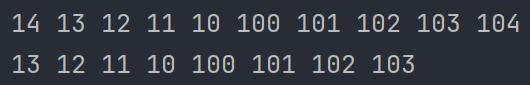

# 基本链表容器

```cpp
#include <iostream>
#include <exception>

using namespace std;

/**
 * @brief 链表类
 */
template<typename T>
class List {
 public:
  /**
   * @brief 缺省构造函数
   */
  List() : m_head(nullptr), m_tail(nullptr) {}
  /**
   * @brief 拷贝构造函数
   * @param other
   */
  List(const List &other) : m_head(nullptr), m_tail(nullptr) {
    for (Node *node = other.m_head; node; node = node->next) {
      // 从头节点取数据
      // 压到新链表的尾部
      pushBack(node->m_data);
    }
  }
  /**
   * @brief 析构函数
   */
  ~List() {
    clear();
  }
  /**
   * @brief 链表判空
   */
  bool empty() {
    return m_head == nullptr && m_tail == nullptr;
  }
  /**
   * @brief 添加头节点
   * @param data
   */
  void pushFront(const T &data) {
    // 先创造一个新节点，它的 prev 为空，以原来的尾节点为 next
    // 将 m_head 指向这个新节点
    m_head = new Node(nullptr, data, m_head);
    if (m_head->m_next) {
      // m_head 的下一个节点如果存在
      // 它的下一个节点的前节点为 m_head
      m_head->m_next->m_prev = m_head;
    } else {
      // m_head 没有下一个节点
      // 链表只有一个节点，代表尾指针也指向头指针指向的节点
      m_tail = m_head;
    }
  }
  /**
   * @brief 删除头节点
   */
  void popFront() {
    // 如果当前链表为空链表则直接跳出函数
    if (empty()) {
      return;
    }
    // 将新的节点备份
    Node *temp = m_head->m_next;
    // 删出旧的节点
    delete m_head;
    if (temp) {
      // 如果头节点存在下一个节点，也即是链表不止一个元素
      // 将新链表的头节点的前指针置为空
      temp->m_prev = nullptr;
    } else {
      // 否则，删除完后，链表一个节点都没有了
      // 尾节点也为空
      m_tail = nullptr;
    }
    // 赋值个头节点新的值
    m_head = temp;
  }
  /**
   * @brief 返回头节点的数据
   * @return 头节点的数据
   */
  T &front() {
    if (empty()) {
      // 抛出异常
      throw underflow_error("Null Node");
    }
    return m_head->m_data;
  }
  /**
   * @brief 常函数，常链表才可调用
   * @return
   */
  T const &front() const {
    // 将类内的非 const 版本的 front() 函数转化为 const 版本的使用
    return const_cast<List *>(this)->front();
  }
  /**
   * @brief 添加尾节点的数据
   * @param data
   */
  void pushBack(T const &data) {
    m_tail = new Node(m_tail, data, nullptr);
    if (m_tail->m_prev) {
      m_tail->m_prev->m_next = m_tail;
    } else {
      m_head = nullptr;
    }
  }
  /**
   * @brief 删除尾节点的数据
   */
  void popBack() {
    if (empty()) {
      return;
    }
    Node *temp = m_tail->m_prev;
    delete m_tail;
    if (temp) {
      temp->m_next = nullptr;
    } else {
      m_head = nullptr;
    }
    m_tail = temp;
  }
  /**
   * @brief 获取尾节点数据
   * @return 尾节点
   */
  T &back() {
    if (empty()) {
      throw underflow_error("Null Node");
    }

    return m_tail->m_data;
  }
  /**
   * @brief 常函数，常链表可访问
   * @return 尾节点
   */
  T const &back() const {
    // 将之前的改成常属性
    return const_cast<List *>(this)->back();
  }
  /**
   * @brief 清空链表
   */
  void clear() {
    // 链表不为空
    while (!empty()) {
      // 直接调用之前实现的删除头节点的函数
      popFront();
    }
  }
  /**
   * @brief 获取链表大小
   * @return 链表节点个数
   */
  size_t size() const {
    size_t count = 0;  // 计数器
    // 从头节点开始
    // 判断这个节点是否存在
    // 指向下一个节点
    // 计数器增加
    for (Node *node = m_head; node; node = node->m_next) {
      ++count;
    }
    // 返回计数器
    return count;
  }
 private:
  /**
   * @brief 节点类
   */
  class Node {
   public:
    Node(Node *prev, const T &data, Node *next) : m_prev(prev), m_data(data), m_next(next) {}
    Node *m_prev;  // 前指针
    T m_data;      // 节点数据
    Node *m_next;  // 后指针
  };

  Node *m_head;  // 链表头
  Node *m_tail;  // 链表尾
  friend ostream &operator<<(ostream &os, List<int> &list);
};

// 以上代码为模拟容器
// 以下代码为普通用户

ostream &operator<<(ostream &os, List<int> &list) {
  for (List<int>::Node *node = list.m_head; node; node = node->m_next) {
    os << node->m_data << ' ';
  }
  return os;
}

int main() {
  List<int> list;
  for (int i = 0; i < 5; ++i) {
    list.pushFront(10 + i);
  }
  for (int i = 0; i < 5; ++i) {
    list.pushBack(100 + i);
  }
  cout << list << endl;
  list.popFront();
  list.popBack();
  cout << list << endl;
  return 0;
}
```


