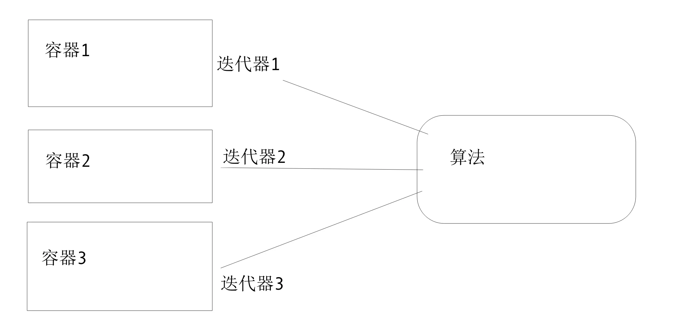

# STL 概述

长久以来，软件界一直希望建立一种可重复利用的东西，以及得以制造出“可重复运用的东西”的方法，让程序员的心血不止于随时间的迁移，人事异动而烟消云散，从函数（functions）、类别（classes）、函数库（function libraries）、类别库（class libraries）、各种组件，从模块化设计到面向对象（object oriented），为的就是复用性的提升。

复用性必须建立在某种标准之上，但是在许多环境下，就连软件开发最基本的数据结构（data structures）和算法（algorithm）都未能有一套标准。大量程序员被迫从事大量重复的工作，竟然是为了完成前人已经完成而自己手上并未拥有的程序代码，这不仅是人力资源的浪费，也是挫折与痛苦的来源。

为了建立数据结构和算法的一套标准，并且降低它们之间的耦合关系，以提升各自的独立性、弹性、交互操作性（相互合作性，interoperability），诞生了 STL。

## STL 的基本概念

标准模板库（Standard Template Library, STL），是惠普实验室开发的一系列软件的统称。现在主要出现在 C++ 中，但是在引入 C++ 之前该技术已经存在很长时间了。STL 从广义上分为：容器（Container）、算法（Algorithm）、迭代器（Iterator），容器和算法之间通过迭代器进行无缝连接。STL 几乎所有的代码都采用了模板类或者模板函数，相比传统的由函数和类组成的库来说提供了更好的代码重用机会。

## STL 的六大组件

容器、算法、迭代器、仿函数、适配器（配接器）、空间配置器。

1. **容器**：存放数据
2. **算法**：操作数据
3. **迭代器**：算法通过迭代器操作容器数据
4. **仿函数**：为算法提供更多策略
5. **适配器**：为算法提供更多参数的接口
6. **空间适配器**：为算法和容器提供动态分配、管理空间

STL 的一个重要特性是将数据与操作分离。数据由容器类别加以管理，操作则由特定的算法完成。

算法可分为质变算法和非质变算法。

- **质变算法**：运算过程中会更改区间内元素的内容，例如拷贝、替换、删除等等
- **非质变算法**：运算过程中不会更改区间内元素的内容，例如查找、计数、遍历、寻找极值

