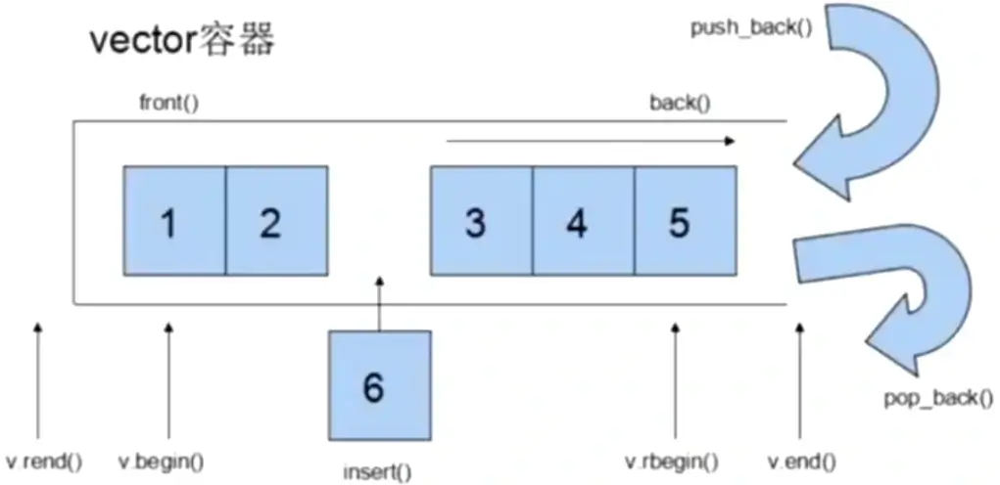

# `vector` 容器

## `vector` 容器的概述

`vector` 的数据安排以及操作方式都与数组非常相似，两者唯一的差别在于**对空间的运用的灵活性**。

数组是**静态空间**，一旦配置了以后就不能改变，要更换其他大小的空间，可以，但是一切琐碎需要自己手动操作。首先配置一块新的空间，然后将旧空间的数据搬往新空间，再释放原来的空间。

`vector` 是动态空间，随着元素的加入，它的内部机制会自动扩充空间以容纳新元素。因此 `vector` 的运用对于内存的合理利用与运用的灵活性有很大的帮助。`vector` 的实现技术，关键在于其对大小的控制以及重新配置时的数据移动效率，一旦 `vector` 旧空间满了，如果客户每新增一个新元素，`vector` 内部只拓充一个元素的空间，实为不智，因为这种方式的成本很高，因此加入未雨绸缪机制。



- **`v.begin()`**：获取容器的起始迭代器（指向第 0 个元素）
- **`v.end()`**：获取元素的结束迭代器（指向最后一个元素的**下一个位置**）
- **`v.front()`**：获取头元素
- **`v.back()`**：获取尾元素

## `vector` 的数据结构

`vector` 采用动态分配的连续内存空间来存储元素。它通过两个迭代器 `begin` 和 `end` 分别指向当前有效元素的起始位置和末尾的下一个位置，并通过另一个迭代器 `capacity_end` 指向分配的内存空间的末尾。为了降低空间配置时的速度成本，`vector` 实际配置的大小可能比客户端需求大一些，以备将来可能的扩充，这边是**容量**的概念。换句花说，`vector` 的容量永远大于或等于其大小，一旦容量等于大小，便是满载。下次再有新增元素，整个 `vector` 容器便会另觅居所。

> **注意**：动态增加大小，并不是在原空间之后续接新空间（因为无法保证之后尚有可以使用的空间），而是一块更大的内存空间。然后将原数据拷贝与新空间，并释放原空间。因此，对 `vector` 的任何操作，一旦引起空间的重新配置，指向原 `vector` 的所有迭代器就都失效了。

## `vector` 常用 API 操作

### `vector` 构造函数

```cpp
vector<T> v;                 // 采用模板类实现，默认构造函数
vector(v.begin(), v.end());  // 将 v[begin(), end()] 区间中的元素拷贝给本身
vector(n, elem);             // 构造函数将 n 个 elem 拷贝给本身
vector(const vector &vec);   // 拷贝构造函数
```

### `vector` 常用赋值操作

```cpp
assign(beg, end);  // 将 [beg, end) 区间中的数据赋值给本身
assign(n, elem);   // 将 n 个 elem 拷贝赋值给本身
vector& operator=(const vector &vec);  // 重载等号操作符
swap(vec);  // 将 vec 与本身的元素互换
```

### `vector` 大小操作

```cpp
size();                 // 返回容器中元素的个数
empty();                // 判断容器是否为空
resize(int num);        // 重新指定容器的长度为 num，若容器变长，则以默认值填充新位置，如果容器变短，则末尾超出容器长度的元素被删除
resize(int num, elem);  // 重新指定容器的长度为 num，若容器变长，则以 elem 值填充新位置，如果容器变短，则末尾超出容器长度的元素被删除 
capacity();             // 容器的容量
reserve(int len);       // 容器预留 len 个元素长度，预留位置不初始化，元素不可访问
```

### `vector` 数据存取操作

```cpp
at(int idx);
operator[];
front();
back();
```

### `vector` 插入和删除操作

```cpp
insert(const_iterator pos, int count, elem);  // 迭代器指向位置 pos，插入 count 个元素 elem
push_back(elem);                              // 尾部插入元素 elem
pop_back();                                   // 删除最后一个元素
erase(const_iterator start, const_iterator end);  // 删除迭代器从 start 到 end 之间的元素
erase(const_iteratro pos);  // 删除迭代器指向的元素
clear();  // 删除容器中的所有元素
```

### `swap` 收缩内存空间

```cpp
#include <iostream>
#include <vector>

using namespace std;

int main() {
  vector<int> v1;
  v1.reserve(1000);
  v1.push_back(10);
  v1.push_back(20);
  v1.push_back(30);
  v1.push_back(40);
  cout << "容量：" << v1.capacity() << "，大小：" << v1.size() << endl;
  vector<int>(v1).swap(v1);
  cout << "容量：" << v1.capacity() << "，大小：" << v1.size() << endl;
  return 0;
}
```

- **`vector<int>(v1)`**：
  - 创建一个临时的 `vector` 对象，使用 `v1` 的内容（即 4 个元素）进行初始化
  - 临时 `vector` 的容量会精确匹配其大小（即 4）
- **`.swap(v1)`**：
  - 调用 `swap` 函数，交换临时 `vector` 和 `v1` 的内容
  - 交换后，`v1` 的容量变为 4，而临时 `vector` 的容量变为 1000
  - 临时 `vector` 在语句结束后被销毁，释放其占用的内存

> **注意**：临时 `vector` 在构造时会根据传入的范围或内容**精确分配所需的内存**，而不会额外预留多余的空间。

在 `vector` 的大小操作、数据存取操作、插入和删除操作之后，我们可以补充 **`vector` 的排序操作**。排序是 `vector` 常用的操作之一，通常使用标准库中的 `std::sort` 函数来实现。

### **`vector` 排序操作**

#### 默认升序排序
   - 使用 `std::sort` 对 `vector` 进行升序排序
   - **语法**：
     
     ```cpp
     std::sort(v.begin(), v.end());
     ```
   - **示例**：
     ```cpp
     #include <algorithm>
     #include <vector>
     #include <iostream>
     
     using namespace std;
     
     int main() {
         vector<int> v = {10, 30, 20, 40, 5};
     
         // 输出原始顺序
         for (auto elem : v) {
             cout << elem << ' ';
         }
         cout << '\n';
     
         // 升序排序
         sort(v.begin(), v.end());
     
         // 输出排序结果
         for (auto elem : v) {
             cout << elem << ' ';
         }
         cout << '\n';
     
         return 0;
     }
     ```

   - **输出**：
     
     ```
     10 30 20 40 5 
     5 10 20 30 40 
     ```

#### 降序排序
   - 使用 `std::sort` 和 `std::greater` 对 `vector` 进行降序排序
   - **语法**：
     ```cpp
     std::sort(v.begin(), v.end(), std::greater<T>());
     ```
   - **示例**：
     ```cpp
     #include <algorithm>
     #include <vector>
     #include <iostream>
     #include <functional> // 包含 greater
     
     using namespace std;
     
     int main() {
         vector<int> v = {10, 30, 20, 40, 5};
     
         // 输出原始顺序
         for (auto elem : v) {
             cout << elem << ' ';
         }
         cout << '\n';
     
         // 降序排序
         sort(v.begin(), v.end(), greater<int>());
     
         // 输出排序结果
         for (auto elem : v) {
             cout << elem << ' ';
         }
         cout << '\n';
     
         return 0;
     }
     ```

   - **输出**：
     ```bash
     10 30 20 40 5 
     40 30 20 10 5 
     ```

#### 自定义排序规则
   - 使用自定义的比较函数或 Lambda 表达式对 `vector` 进行排序
   - **语法**：
     ```cpp
     std::sort(v.begin(), v.end(), [](const T& a, const T& b) { return 自定义规则; });
     ```
   - **示例**：
     ```cpp
     #include <algorithm>
     #include <vector>
     #include <iostream>
     
     using namespace std;
     
     int main() {
         vector<int> v = {10, 30, 20, 40, 5};
     
         // 输出原始顺序
         for (auto elem : v) {
             cout << elem << ' ';
         }
         cout << '\n';
     
         // 自定义排序规则：按绝对值升序排序
         sort(v.begin(), v.end(), [](int a, int b) {
             return abs(a) < abs(b);
         });
     
         // 输出排序结果
         for (auto elem : v) {
             cout << elem << ' ';
         }
         cout << '\n';
     
         return 0;
     }
     ```

   - **输出**：
     ```bash
     10 30 20 40 5 
     5 10 20 30 40 
     ```


