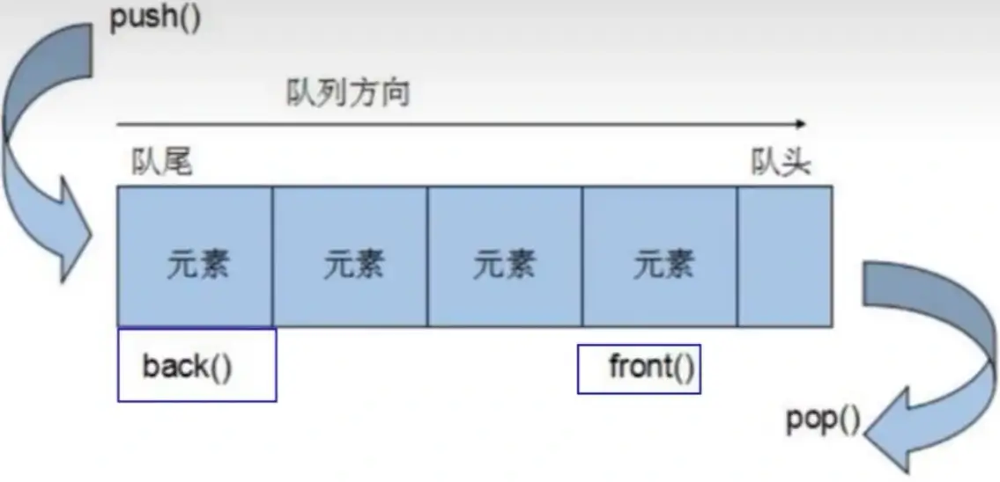

# `queue` 容器

## `queue` 容器基本概念

`queue` 是一种先进先出（First In First Out, FIFO）的数据结构，它有两个出口，`queue` 容器允许从一端新增元素，从另一端移除元素。



`queue` 所有元素的进出都必须符合“先进先出”的条件，只有 `queue` 的第一个元素和最后一个元素才可被外界取用。`queue` 不提供遍历功能，也不提供迭代器。

## `queue` 常用 API

```cpp
queue<T> queT;            // queue 采用模板类实现
queue(const queue &que);  // 拷贝构造函数
push(elem);               // 往队尾添加元素
pop();                    // 从队头移除第一个元素
back();                   // 返回最后一个元素
front();                  // 返回第一个元素
queue& operator=(const queue &que);  // 重载等号运算符
empty();  // 判断队列是否为空
size();   // 返回队列的大小
```

