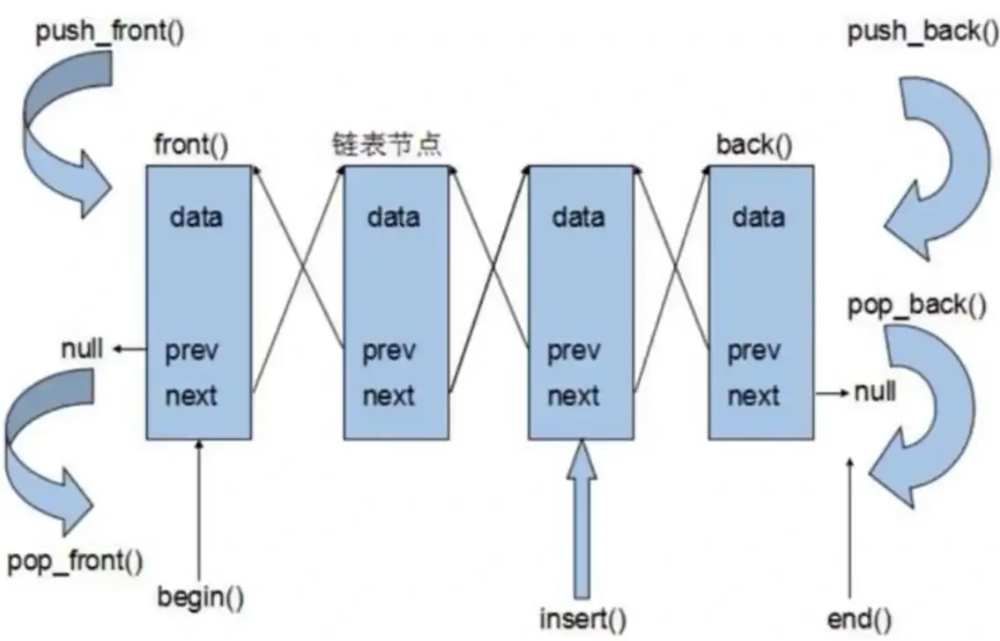

# `list` 容器

## `list` 容器基本概念

链表是一种物理存储单元上非连续、非顺序的存储结构，数据元素的逻辑顺序是通过链表中的指针链接次序实现的。链表由一系列结点（链表中每一个元素称为结点）组成，结点可以在运行时动态生成。每个结点包括两个部分：

1. 存储数据元素的数据域
2. 存储下一个结点地址的指针域

相较于 `vector` 的连续线性空间，`list` 就显得负责许多，它的好处是每次插入或者删除一个元素，就是配置亦或是释放一个元素的空间。因此，`list` 对于空间的运用有绝对的精准，**一点也不浪费**。而且，对于任何位置的元素插入或元素的移除，`list` 永远是常数时间。`list` 和 `vector` 是两个最常被使用的容器。`list` 容器是一个双向链表。



采用动态存储分配，不会造成内存浪费和溢出。链表执行插入和删除十分方便，修改指针即可，无需移动大量元素。虽然链表灵活，但是其空间和时间额外耗费较大。

## `list` 常用 API

### `list` 构造函数

```c++
list<T> lstT;           // 默认构造函数
list(beg, end);         // 构造函数将 [beg, end) 区间中的元素拷贝给本身
list(n, elem);          // 构造函数将 n 个 elem 拷贝给本身
list(const list& lst);  // 拷贝构造函数
```

### `list` 数据元素插入和删除操作

```c++
push_back(elem);        // 在容器尾部加入一个元素
pop_back();             // 删除容器中最后一个元素
push_front(elem);       // 在容器开头插入一个元素
pop_front();            // 从容器开头移除第一个元素
insert(pos, elem);      // 在 pos 位置插入 elem 元素的拷贝，返回新元素的位置
insert(pos, n, elem);   // 在 pos 位置插入 n 个 elem 元素，无返回值
insert(pos, beg, end);  // 在 pos 位置插入 [beg, end) 区间的数据，无返回值
clear();                // 移除容器所有数据
erase(beg, end);        // 删除 [beg, end) 区间的数据
erase(pos);             // 删除 pos 位置的数据，返回下一个数据的位置  
remove(elem);           // 删除容器中所有与 elem 值匹配的元素
```

### `list` 大小操作

```c++
size();             // 返回容器中元素的个数
empty();            // 判断容器是否为空
resize(num);        // 重新指定容器的长度为 num，若容器变长，则以默认值填充新位置，如果容器变短，则末尾超出容器长度的元素被删除
resize(num, elem);  // 重新指定容器的长度为 num，若容器变长，则以 elem 值填充新位置，如果容器变短，则末尾超出容器长度的元素被删除
```

### `list` 赋值操作

```cpp
assign(beg, end);  // 将 [beg, end) 区间的数据拷贝给本身
assign(n, elem);   // 将 n 个 elem 拷贝给本身
list& operator=(const list& lst);  // 重载等号运算符
swap(lst);  // 将 lst 与本身的元素互换
```

### `list` 数据存取

```c++
front();  // 返回第一个元素
back();   // 返回最后一个元素
```

### `list` 反转与排序

```cpp
reverse();
sort();     // list 排序
```

