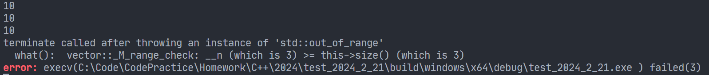
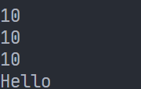

# 异常处理

## 异常的基本概念

异常是程序在执行期间产生的问题。C++ 异常是指在程序运行时发生的特殊情况，比如操作容器时下标越界等问题。

C++ 异常处理涉及到三个关键字：`try`、`catch`、`throw`。

- `throw`：当问题出现时，程序会抛出一个异常；通过使用 `throw` 关键字来完成的
- `catch`：在您想要处理问题的地方，通过异常处理程序捕获异常；`catch` 关键字用于捕获异常
- `try`：尝试执行语句块，它后面通常跟着一个或多个 `catch` 块

如果有一个块抛出一个异常，捕获异常的方法会使用 `try` 和 `catch` 关键字。`try` 块中放置可能抛出异常的代码，`try` 块中的代码被称为保护代码。

没有使用 `try`、`catch` 时，有：

```cpp
#include <iostream>
#include <vector>

using namespace std;

int main() {
  vector<int> arr(3, 10);
  for (int i = 0; i < 3; ++i) {
    cout << arr.at(i) << endl;
  }
  arr.at(3) = 100;

  return 0;
}
```



```cpp
#include <iostream>
#include <vector>

using namespace std;

int main() {
  try {
    vector<int> arr(3, 10);
    for (int i = 0; i < 3; ++i) {
      cout << arr.at(i) << endl;
    }
    arr.at(3) = 100;
  } catch (...) {
    cout << "Hello" << endl;
  }
  return 0;
}
```



## 抛出异常

```cpp
#include <iostream>
using namespace std;

int func(int a, int b) {
  if (b) {
    return a / b;
  } else {
    // 如果除数为 0，则打印调试语句
    cout << "division 0" << endl;
    // 抛出异常
    throw "error, hello world";
  }
}

int main() {
  // 保护性语句
  try {
    int ret = func(10, 0);
    // 如果异常，则下面这条语句不执行
    cout << "end..." << endl;
  } catch (...) {
    // 捕获异常
    cout << "err!" << endl;
  }
  return 0;
}
```


精确指定捕获的类型：

```cpp
int main() {
  // 保护性语句
  try {
    int ret = func(10, 0);
    // 如果异常，则下面这条语句不执行
    cout << "end..." << endl;
  } catch (const char *msg) {  // 捕获准确的异常，存在 msg 中
    // 捕获异常
    cout << "err!" << endl;
    cout << msg << endl;
  }
  return 0;
}
```


## 捕获异常

```cpp
#include <cstring>
#include <iostream>

using namespace std;

bool func2(const char *str) {
  if (!str) {
    throw "NULL pointor";
  }

  int len = strlen(str);
  // 协议：##name=zhangsan;age=18#
  if (!(str[0] == '#' && str[1] == '#')) {
    // 帧头错误
    throw "frame header error";
  }
  if (!(str[len - 1] == '#' && str[len - 2] == '#')) {
    // 帧尾错误
    throw "frame tail error";
  }

  return true;
}

int main() {
  try {
    func2("##Hello World!");
  } catch (const char *msg) {
    // 可以判断是哪个错误
    cout << msg << endl;
  }
  return 0;
}
```

## C++ 标准的异常

C++ 提供了一系列标准的异常，定义在 `<exception>` 中，我们可以在程序中使用这些标准的异常。它们是以父子类层次结构组织起来的，如下所示：


```cpp
#include <iostream>
#include <vector>

using namespace std;

int main() {
  try {
    vector<int> arr(3, 10);
    for (int i = 0; i < 3; ++i) {
      cout << arr.at(i) << endl;
    }
    arr.at(3) = 100;
  } catch (out_of_range &err) {
    cout << err.what() << endl;
  }
}
```

## 定义新的异常

```cpp
#include <cstring>
#include <exception>


class FHeaderErr : public std::exception {
 public:
  const char *what() const throw() { return "frame header error"; }
};

class FTailErr : public std::exception {
 public:
  const char *what() const throw() { return "frame tail error"; }
};

bool func(const char *str) {
  if (!str) {
    throw "NULL pointor";
  }

  int len = strlen(str);
  if (!(str[0] == '#' && str[1] == '#')) {
    FHeaderErr err;
    throw(err);
  }
  if (!(str[len - 1] == '#' && str[len - 2] == '#')) {
    FTailErr err;
    throw(err);
  }

  return true;
}
```
