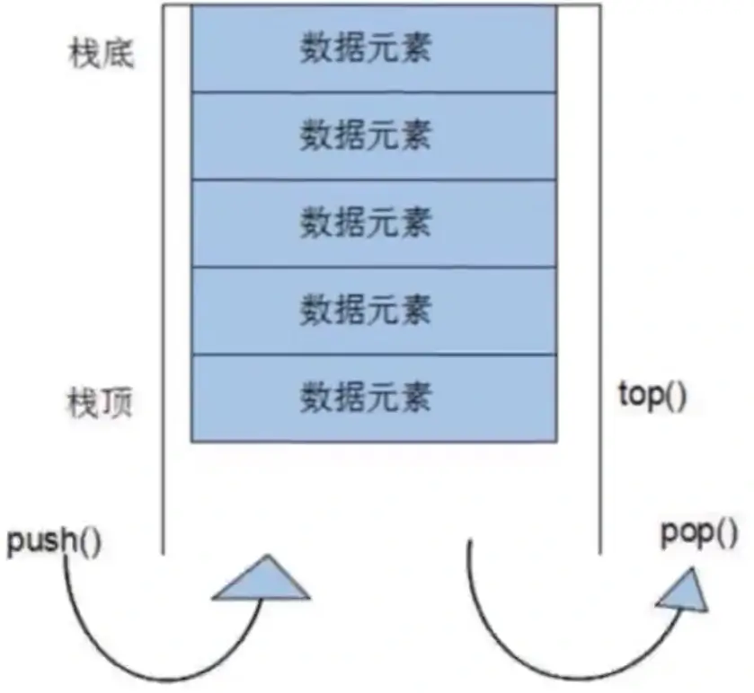

# `stack` 容器

## `stack` 容器基本概念

`stack` 是一种先进后出（First In Last Out, FILO）的数据结构，它只有一个出口，形式如图所示。`stack` 容器允许新增元素，移除元素，取得栈顶元素，但是除了最顶端外，没有任何其他方法可以存取 `stack` 的其他元素。换言之，`stack` **不允许有遍历行为**。有元素推入栈的操作称为 `push`，将元素推出 `stack` 的操作称为 `pop`。



`stack` 所有元素的进出都必须符合“先进后出“的条件，只有 `stack` 顶端的元素，才有机会被外界取用。`stack` 不提供遍历功能，也不提供迭代器。

## `stack` 常用 API

### `stack` 构造函数

```cpp
stack<T> stkT;            // stack 采用模板类实现
stack(const stack &stk);  // 拷贝构造函数
```

### `stack` 赋值操作

```cpp
stack& operator=(const stack &stk);  // 重载符号操作符
```

### `stack` 数据存取操作

```cpp
push(elem);  // 向栈顶添加元素
pop();       // 从栈顶移除第一个元素
top();       // 返回栈顶元素
```

### `stack` 大小操作

```cpp
empty();  // 判断堆栈是否为空
size();   // 返回堆栈的大小
```

