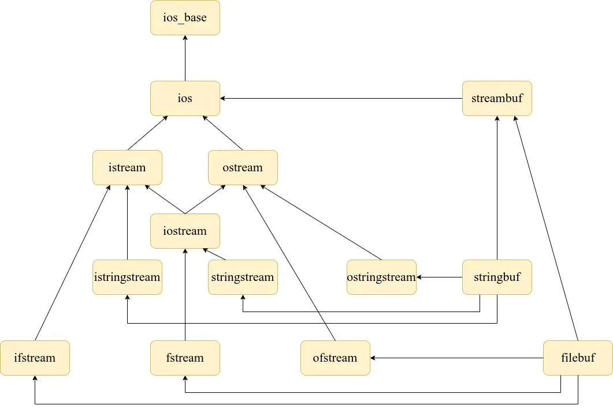
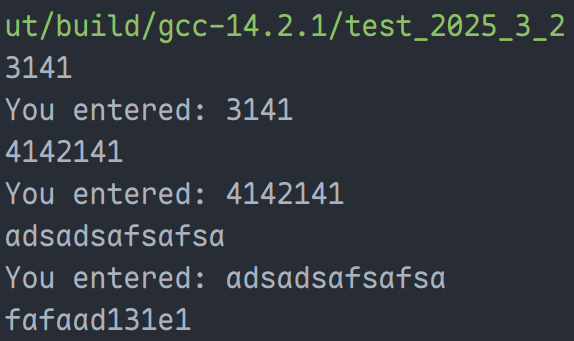
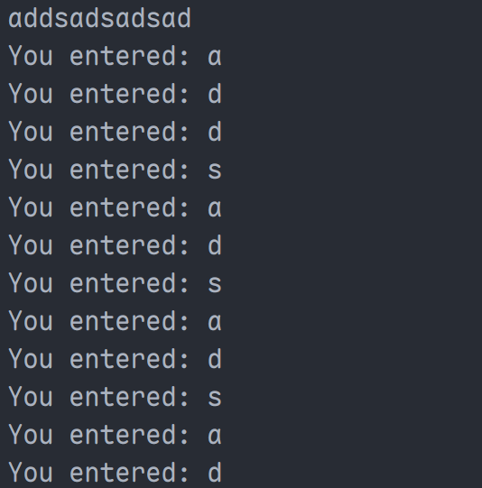
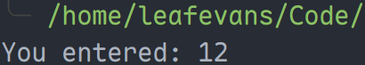
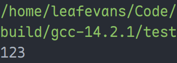
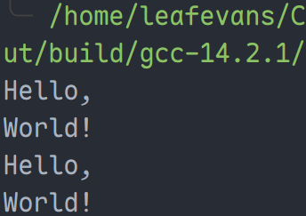

# IO 库

## IO 库介绍

IO（即 Input Output），指的是输入、输出功能。数据在内存、磁盘、输入输出设备之间的移动就是 IO 功能实现的。



C++ 定义了 `ios` 这个基类来定义输入输出的最基本操作，IO 库的所有类都继承自该类。

`istream`、`ostream` 直接继承自 `ios` 类。

1. `ostream` 类定义了从内存到输出设备（比如显示器）的功能，如 `cout` 即为 `ostream` 的对象
2. `istream` 类定义了从输入设备（比如键盘）到内存的功能，如 `cin` 即为 `istream` 的对象
3. `iostream` 定义了 `ostream` 和 `istream` 类的对象，即 `cout` 和 `cin`。因此仅简单引用 `iostream` 头文件，即可方便地使用两个对象

> **注意**：输入、输出是相对于内存而言的，例如输入到内存，为 `istream`。

`ifstream`、`ofstream` 类分别继承自 `istream` 类和 `ostream` 类。

1. `ifstream` 定义了从磁盘到内存的功能，因为 `istream` 重载了 `<<` 运算符，因此 `ifstream` 对象也可以使用 `<<` 运算符将文件数据写入内存。除 `=` 的所有重载运算符都是可以被继承的
2. `ofstream` 定义了从内存到磁盘的功能。与 `ifstream` 同理，可以使用 `>>` 操作数据流
3. `fstream` 文件引入了 `ifstream` 和 `ofstream`，因此只需要引入 `fstream` 头文件即可使用文件流功能

> **注意**：该输入、输出同样相对于内存而言。

磁盘与输入输出设备无法直接进行交互，必须通过内存。

IO 库还额外定义了字符串的输入输出类，`istringstream`、`ostringstream` 分别继承自 `istream` 类和 `ostream` 类。

1. `istringstream` 定义了从指定字符串到特定内存的功能，与 `ifstream` 同理，也可以用 `<<` 运算符操作数据
2. `ostringstream` 定义了从特定内存到指定字符串的功能，可以用 `>>` 操作数据
3. `sstream` 头文件定义了 `istringstream` 和 `ostringstream`，所以只需要引入 `sstream` 头文件，可以使用字符串与内存直接交互数据的功能

## IO 库的注意事项

1. IO 流对象无法使用拷贝构造函数与赋值运算符，因其通常封装了系统资源（如文件描述、缓冲区等）：

   - **唯一性要求**：一个文件只应由一个流对象独占管理，避免多个对象操作同一个底层资源
   - **状态一致性**：如果允许复制，各副本的内部状态（如读写位置、错误标志）便得难以同步
   
   因此使用流对象一般无法值传递，一般使用引用进行传递。

2. IO 流对象状态：

   ```cpp
   #include <iostream>
   #include <limits>
   
   int main() {
     int i = 10;
     while (std::cin >> i, !std::cin.eof()) {
       if (std::cin.bad()) {
         throw std::runtime_error("IO stream corrupted.");
       }
       if (std::cin.fail()) {
         std::cin.clear();
         std::cin.ignore(std::numeric_limits<std::streamsize>::max(), '\n');
         std::cout << "Invalid input. Please try again." << std::endl;
         continue;
       }
       std::cout << "You entered: " << i << std::endl;
     }
     std::cout << "End of input." << std::endl;
     return 0;
   }
   ```

   - IO 操作非常容易出错，一些错误可以修复，另一部分则发生于系统深处，超过了应用程序可以修正的范围。比如使用 `cin` 向 `int` 类型的变量输入一个字符串，会使 `cin` 这个对象出现错误。

     

     因此使用 IO 流对象时都应该判断 IO 流对象的状态。例如，使用 `while (cin >> val)` 或 `if (cin >> val)` 时，最好搭配 `iostate` 来使用。

   - 需要知晓对象出错的原因，因为不同的错误需要不同的处理方法。

     IO 库定义了 `iostate` 类型，可以完整地表示 IO 对象当前的状态。在不同平台中，`iostate` 实现方法略有不同。在 MSVC 中直接使用 `int` 来代表 `iostate` 类型，将不同位置 1 来表示不同状态，可以与位操作符一起使用来一次检测或设置多个标志位。

     可以使用 `rdstate` 函数来获得 IO 对象当前用 `iostate` 表示的状态。
     
   - `iostate` 类型有以下状态：
     
     1. `badbit` 状态：系统级错误，一旦表示 `badbit` 的位被置 1，流对象无法使用
     2. `failbit` 状态：代表可恢复错误，比如想读取一个数字却读取了一个字符，此错误可恢复。当 `badbit` 位被置 1 时，`failbit` 位也会被置为 1
     3. `eofbit` 状态：当到达文件结束位置时，`eofbit` 和 `failbit` 位均会被置 1
     4. `goodbit` 状态：表示流对象没有任何错误
     
     只要 `badbit`、`failbit`、`eofbit` 有一位被置为 1，则检测流状态的条件就会失败。
     
   - 标准库定义了一组成员函数来查询这些标志位的状态：
     
     1. `good()` 函数在所有位均未被置 1 的情况下返回 `true`
     2. `bad()`、`fail()`、`eof()` 函数在对应位被置 1 的情况下返回 `true`，因为 `badbit` 或 `eofbit` 被置 1 时，`failbit` 会被置为 1，因此用 `fail()` 函数可以准确判断流对象是否出现错误
     3. 实际上，将流对象当作条件使用的代码等价于 `!fail()`
     
   - 流对象的管理：
   
     1. `rdstate()` 函数：返回一个 `iostate` 值，对应当前流状态。
   
     2. `setstate(flag)` 函数：将流对象设置为指定状态。
   
     3. `clear()` 函数：一个重载函数。
   
        - `clear()`，将所有位置置 0，即 `goodbit` 状态
        - `clear(flag)`，将对应的条件状态标志位复位
   
     4. `ignore()` 函数：提取输入字符并丢弃。
   
        ```cpp
        template<> std::istream &std::istream::ignore(std::streamsize __n, int __delim)
        ```
   
        读取前 `n` 个字符或在读取前 `n` 个字符的进程中遇到 `delim` 字符就停止，丢弃已读取的字符。

## 内存与输入输出设备的交互（`iostream`）

1. `getline`：按行接受数据，因为存储于 `string` 对象中，因此**不容易出现格式错误**（故不使用 `fail` 进行处理），但仍可能出现系统错误，因此在企业级代码中，还是应当对 `bad` 的情况进行处理。

   ```cpp
   #include <iostream>
   #include <string>
   
   int main() {
     std::string str;
     while (std::getline(std::cin, str), !std::cin.eof()) {
       if (std::cin.bad()) {
         throw std::runtime_error("IO stream corrupted.");
       }
       std::cout << "You entered: " << str << std::endl;
     }
     std::cout << "End of input." << std::endl;
     return 0;
   }
   ```

   

2. `get`：与 `getline` 类似，不同的是 `get` 以字符格式接收，在企业级代码中仍需对 `bad` 的情况进行处理。

   ```cpp
   #include <iostream>
   #include <string>
   
   int main() {
     char ch;
     while (std::cin >> ch, !std::cin.eof()) {
       if (std::cin.bad()) {
         throw std::runtime_error("IO stream corrupted.");
       }
       std::cout << "You entered: " << ch << std::endl;
     }
     std::cout << "End of input." << std::endl;
     return 0;
   }
   ```

   

## 内存与磁盘交互（`fstream`）

IO 库没有默认提供提供 `ifstream` 和 `ofstream` 的对象，需要**自行定义**。

`fstream` 对象创建方式有三种：

1. 使用默认构造函数进行定义；例如 `ifstream ifs`。

2. 可以创建流对象时打开指定文件；例如 `ifstream ifs(str)`；其中 `str` 可以是 `string` 对象，也可以是 C 风格的字符串指针；文件的 `mode` 取决于流对象的类型。

   ```cpp
   #include <fstream>
   #include <iostream>
   
   int main() {
     std::fstream fs("test.txt");
     std::ifstream ifs("test.txt");
     std::ofstream ofs("test.txt");
     return 0;
   }
   ```
   
3. 可以在打开文件时制定 `mode`；例如 `ifstream ifs(str, mode)`。

   ```cpp
   #include <fstream>
   #include <iostream>
   
   int main() {
     std::fstream fs("test.txt", std::ios::in | std::ios::out);
     return 0;
   }
   ```

`fs.open(str)` 函数，打开名为 `str` 的文件，并将文件与 `fs` 绑定，`str` 可以是 `string` 对象或 C 风格字符串。（类似的，有 `fs.open(str, mode)`）

`fs.close()` 函数，关闭文件。

> **注意**：文件存储在操作系统内核区，无法自动回收，只能手动回收。因此必须使用 `fs.close()` 函数来关闭文件。

`fs.is_open()` 函数，返回一个 `bool` 值，指出与 `fs` 相关联的文件是否成功打开且尚未关闭。下述为常见用法：

```cpp
#include <fstream>

int main() {
  std::fstream fs;
  fs.open("test.txt", std::ios::out | std::ios::in);
  if (fs.is_open()) {
    fs.close();
  }
  return 0;
}
```

```cpp
#include <fstream>
#include <iostream>
#include <limits>
#include <string>

int main() {
  std::string file_name;
  std::string file_content;

  while (std::cin >> file_name, !std::cin.eof()) {
    if (std::cin.bad()) {
      throw std::runtime_error("IO stream corrupted.");
    }

    std::ifstream ifs(file_name);
    if (ifs.is_open()) {
      while (std::getline(ifs, file_content)) {
        std::cout << file_content << std::endl;
      }
      if (ifs.bad()) {
        throw std::runtime_error("IO stream corrupted.");
      }
      ifs.close();
    } else {
      ifs.clear();
      ifs.ignore(std::numeric_limits<std::streamsize>::max(), '\n');
      std::cout << "File not found. Please try again." << std::endl;
      continue;
    }
  }
  std::cout << "File processing completed." << std::endl;
  return 0;
}
```

文件模式（`mode`）有：

1. `in`：以读的方式打开
2. `out`：以写的方式打开
3. `app`：在进行写入操作时定位到文件末尾
4. `ate`：打开文件后立即定位到文件末尾
5. `trunc`：截断文件（即将文件已有的全部删除，重新写入）
6. `binary`：以二进制方式打开文件

值得强调的点：

- 与 `ifstream` 关联的文件默认 `in` 模式打开
- 与 `ofstream` 关联的文件默认 `out` 模式打开
- 与 `fstream` 关联的文件默认 `in` 和 `out` 模式打开
- 默认情况下，即使没有指定 `trunc`，以 `out` 模式打开的文件也会被截断。为了保持以 `out` 模式打开的文件的内容，必须同时制定 `app` 模式或 `in` 模式
- 只可以对 `ifstream` 或 `fstream` 对象设定 `in` 的模式
- 只可以对 `ofstream` 或 `fstream` 对象设定 `out` 的模式
- 只有当 `out` 模式被设置时，才可设置 `trunc` 模式
- `ate` 和 `binary` 模式可以应用与任何类型的文件流对象，且可以与任何其他文件模式组合使用

## 内存中对字符串的操作（`sstream`）

`string` 流可以向 `string` 对象写入数据，也可以从 `string` 对象读取数据。与文件操作类似，但数据交互变成了内存之间。

`string` 流对象**默认包含一个 `string` 成员变量**（当然，也可以指定）：

```cpp
#include <iostream>
#include <sstream>

int main() {
  std::istringstream iss;
  std::ostringstream oss;
  std::stringstream ss;
  return 0;
}
```

1. `istringstream` 从 `string` 对象中读取数据
2. `ostringstream` 向 `string` 对象中写入数据
3. `stringstream` 既可以从 `string` 对象读取数据，也可以向 `string` 对象写入数据

`string` 流对象继承自 `iostream` 对象，除了继承得到的操作，`string` 流对象还有自己的成员来管理流相关的 `string`。

1. 对于 `string` 流，IO 库不存在 `cout`、`cin` 这样的自定流对象。流对象需要自行定义：
   - **`sstream ss`**：`sstream` 代表一个 `string` 流对象的类型，其未绑定
   - **`sstream ss(str)`**：`ss` 是一个绑定了 `str` 的拷贝的 `string` 流对象，`str` 是一个 `string` 对象
2. `ss.str()`：返回 `ss` 所保存的 `string` 的拷贝
3. `ss.str(str)`：将 `str` 拷贝到 `ss` 中，返回 `void`

`string` 流对象的作用：

1. 对数据类型进行转化，也就是 `string` 和其他类型的转化，此为 `string` 流对象最基本的功能。

   - `string` 转换为 `int` 等类型：

     ```cpp
     #include <iostream>
     #include <limits>
     #include <sstream>
     
     int main() {
       std::string str("12");
       std::stringstream ss(str);
       int i = 0;
       ss >> i;
       if (ss.bad()) {
         throw std::runtime_error("String stream corrupted.");
       }
       if (ss.fail()) {
         ss.clear();
         ss.ignore(std::numeric_limits<std::streamsize>::max(), '\n');
         std::cout << "Invalid input. Please try again." << std::endl;
       } else {
         std::cout << "You entered: " << i << std::endl;
       }
       return 0;
     }
     ```

     

   - `int` 等类型转换为 `string`：

     ```cpp
     #include <iostream>
     #include <sstream>
     
     int main() {
       int i = 123;
       std::stringstream ss;
       ss << i << std::endl;
       if (ss.bad()) {
         throw std::runtime_error("String stream corrupted.");
       } else {
         std::cout << ss.str();
       }
       return 0;
     }
     ```
     
     

2. 用于对空格分隔的字符串的切分：

   ```cpp
   #include <iostream>
   #include <sstream>
   
   int main() {
     std::string src("Hello, World! Hello, World!");
     std::string dest{};
     std::stringstream ss(src);
     while (ss >> dest) {
       std::cout << dest << std::endl;
     }
     if (ss.bad()) {
       throw std::runtime_error("String stream corrupted.");
     }
     return 0;
   }
   ```

   
