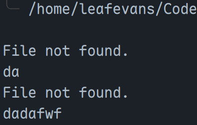
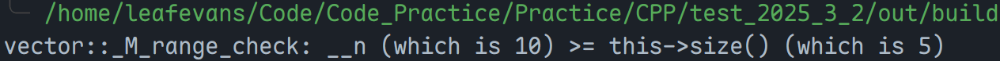
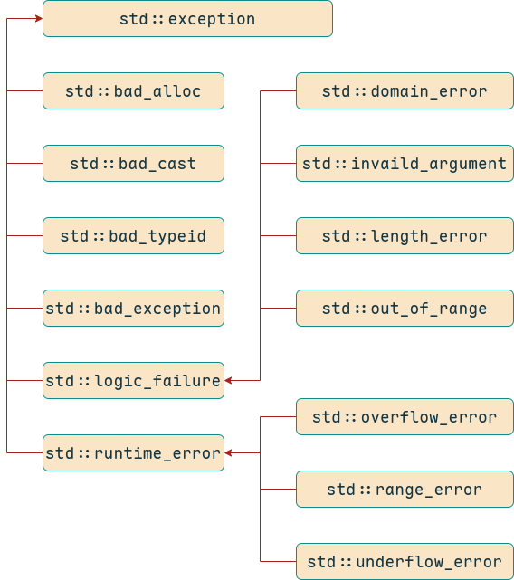

# 异常处理

只需要在开发人员难以控制的、容易出错的地方对异常进行处理即可，需要进行异常处理的地方并不多。举例：

1. 接收传递过来的被除数，难以判断被除数是否为 0，此时异常处理
2. 接受文件名，若文件不存在，可以要求重发一遍，也可以直接报异常，异常就是文件不存在
3. 动态分配内存时，常常出现内存不足的情况（在大型程序中很常见），比如需要动态分配一个未知大小的数组，数组大小等待传入。使用 `new` 操作符会直接抛出 `bad_alloc` 异常
4. 存在一个 `vector`，我们需要一个参数，然后取出参数对应的数组元素，此时容易出现数组的越界问题

## 异常处理的介绍

异常是程序在执行期间产生的问题（编译期出现的错误在写代码时，开发环境有对应提示）。C++ 的异常是指程序运行时发生的特殊情况。

异常提供了一种转换程序控制权的方式。C++ 的异常处理涉及三个关键字：`try`、`catch`、`throw`。

1. **`throw`**：当问题出现时，程序会抛出一个异常，这是通过 `throw` 关键字来完成的
2. **`catch`**：在你想要处理相应的问题时，需要通过异常处理程序捕获异常，`catch` 关键字用于捕获异常
3. **`try`**：`try` 块中的代码标识将被激活的特定异常，其后通常有一个或多个 `catch` 块

如果有一个块抛出一个异常，捕获异常的方法会使用 `try` 和 `catch` 关键字；`try` 中存放可能抛出异常的代码，`try` 中存放的代码被称为保护代码。

```cpp
#include <iostream>
#include <string>

double Divide(double divisior, double dividend) {
  if (dividend == 0) {
    throw std::runtime_error("Dividend cannot be zero.");
  }
  return divisior / dividend;
}

void InputNum(const std::string& str, double& num) {
  std::cout << str << std::endl;
  while (std::cin >> num, !std::cin.eof()) {
    if (std::cin.bad()) {
      throw std::runtime_error("IO stream corrupted.");
    }
    if (std::cin.fail()) {
      std::cin.clear();
      std::cin.ignore(std::numeric_limits<std::streamsize>::max(), '\n');
      std::cout << "Invalid input. Please try again." << std::endl;
      continue;
    }
    break;
  }
}

int main() {
  double divisior{.0};
  double dividend{.0};
  InputNum("Enter the divisior: ", divisior);
  InputNum("Enter the dividend: ", dividend);
  try {
    double result = Divide(divisior, dividend);
    std::cout << "Result of " << divisior << " / " << dividend << " = "
              << result << std::endl;
  } catch (const std::exception& e) {
    std::cerr << e.what() << std::endl;
  }
  return 0;
}
```


```cpp
#include <fstream>
#include <iostream>

void OutputFileContent(const std::string& file_name) {
  std::ifstream ifs(file_name);
  std::string file_line_content;
  if (ifs.is_open()) {
    while (std::getline(ifs, file_line_content)) {
      std::cout << file_line_content << std::endl;
    }
    if (ifs.bad()) {
      throw std::runtime_error("IO stream corrupted.");
    }
    ifs.close();
  } else {
    if (ifs.bad()) {
      throw std::runtime_error("IO stream corrupted.");
    }
    if (ifs.fail()) {
      throw std::runtime_error("File not found.");
    }
  }
}

int main() {
  std::string file_name;
  while (std::cin >> file_name, !std::cin.eof()) {
    if (std::cin.bad()) {
      throw std::runtime_error("IO stream corrupted.");
    }
    try {
      OutputFileContent(file_name);
    } catch (const std::exception& e) {
      std::cerr << e.what() << std::endl;
    } catch (...) {
      std::cerr << "Unknown exception." << std::endl;
    }
  }
  return 0;
}
```



```cpp
#include <fstream>
#include <iostream>

int main() {
  try {
    while (true) {
      int* ptr = new int[100000]{};
    }
  } catch (const std::bad_alloc& e) {
    std::cerr << e.what() << std::endl;
  } catch (...) {
    std::cerr << "Unknown exception." << std::endl;
  }
  return 0;
}
```

```cpp
#include <iostream>
#include <stdexcept>
#include <vector>

int main() {
  std::vector<int> vec{1, 2, 3, 4, 5};
  try {
    vec.at(10);
  } catch (const std::out_of_range& e) {
    std::cerr << e.what() << std::endl;
  } catch (...) {
    std::cerr << "Unknown exception." << std::endl;
  }
  return 0;
}
```



## C++ 的标准异常

C++ 提供了一系列标准异常，定义在头文件 `<exception>` 中，以父子层级结构组织起来，如下图所示：



下表是对上面层次结构中出现的每个异常的说明：

| **异常**                | **描述**                                                     |
| ----------------------- | ------------------------------------------------------------ |
| **`std::exception`**    | 该异常是所以标准 C++ 异常的父类                              |
| `std::bad_alloc`        | 该异常可以通过 `new` 抛出                                    |
| `std::bad_cast`         | 该异常可以通过 `dynamic_cast` 抛出                           |
| `std::bad_exception`    | 处理 C++ 程序中无法预测的异常时非常有用                      |
| `std::bad_typeid`       | 该异常可以通过 `typeid` 抛出                                 |
| **`std::logic_error`**  | 理论上可以通过读取代码来检测到的异常                         |
| `std::domain_error`     | 当使用了一个无效的数学域，会抛出该异常                       |
| `std::invalid_argument` | 使用了无效的参数时，会抛出该异常                             |
| `std::length_error`     | 创建了过长的 `std::string` 时，会抛出该异常                  |
| `std::out_of_range`     | 该异常可以通过方法抛出，例如 `std::vector` 和 `std::bitset<>::operator[])()` |
| **`std::runtime_errr`** | 理论上不可以通过读取代码来检测到的异常                       |
| `std::overflow_error`   | 当发生数学上溢时，会抛出该异常                               |
| `std::range_error`      | 当尝试存储超出范围的值时，会抛出该异常                       |
| `std::underflow_error`  | 当发生数学下溢时，会抛出该异常                               |

常用的有：

- `bad_alloc` 错误，使用 `new` 分配内存失败就会抛出 `bad_alloc` 错误
- `out_of_range` 错误，在使用 `at` 时，容器越界就会抛出这个异常，这是推荐使用 `at()` 而不是 `[]` 的原因
- `runtime_error` 错误，运行时错误，只有在程序运行时才可以检测到的错误。 `logic_error` 可以分析代码、找出错误，`runtime_error` 就不行
- `...` 错误，可以接受任何错误。一般在最后一个 `catch` 块使用 `...`，这样便可以接受所有类型的异常