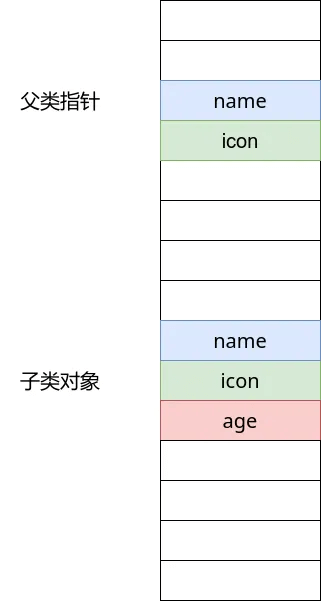
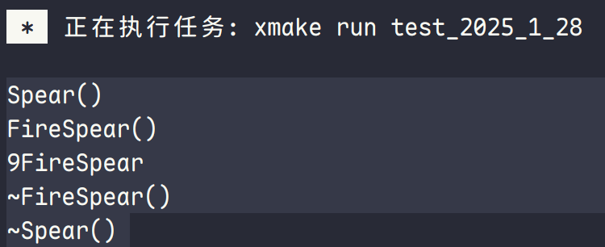
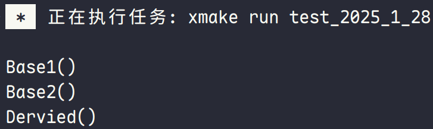
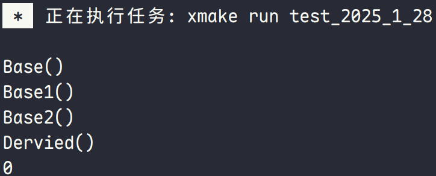

# 类

## 类介绍、构造函数以及析构函数

### 类介绍

面向对象与面向过程的理解：

1. 面向对象与面向过程是一个相对的概念
2. 面向过程是按照计算机的工作原理逻辑来编码的方式，最典型的面向过程的语言为 C 语言，C 语言直接对应汇编，而汇编对应电路
3. 面向对象是按照人类的思维来编码的一种方式，C++ 完全支持面向对象功能，可以按照人类思维来处理问题

**举例**：

要将大象装入冰箱，按照人类的思维自然分为三步，打开冰箱、将大象装进去、关上冰箱。要实现这三步，首先要有人、冰箱这两个对象，人需要拥有给冰箱发指令的能力，冰箱有能接受指令并打开或关闭门的能力。

但是从计算机的角度来讲，计算机只能定义一个叫做人和冰箱的结构体。人有手这个部位，冰箱有门这个部位，然后外部定义一个函数，这个函数让手打开了冰箱门，另外再定义一个关门函数。

从开发者的角度，面向对象显然有利于程序设计。用面向过程的开发方式，程序一旦增大，各种外部函数会非常麻烦。一些用纯 C 写的大型程序，实际上也是模拟了面型对象的方式。

而 C++ 通过在类中定义专属于类的函数，让类有了自己的动作，因此“人的类有了让冰箱开门的能力，冰箱有了让人打开的能力”，不需要额外定义函数。

### 构造函数

类相当于定义了一个新类型，该类型生成在堆上或者栈上的对象时，内存排布与 C 语言相同。但是 C++ 规定，C++ 有在类对象创建时就在对应内存将数据初始化的能力，这就是构造函数。（对于 C 语言来说，其没有初始化的能力，因此类或是结构体的变量就是**内存原本的值**）

构造函数类型：

- **普通构造函数**

- **复制构造函数**：用另一个对象来初始化对象对应的内存

  ```cpp
  CPPTest(const CPPTest& cppTest) : i(cppTest.i), i2(cppTest.i2) {}
  ```

- **移动构造函数**：也是用另一个对象来初始化对象对应的内存

- **默认构造函数**：当类没有任何构造函数时，编译器会自动为该类生成一个默认构造函数。在最普遍的类中，默认构造函数无动作，对象对应的内存没有被初始化

### 析构函数

当类对象被销毁时，就会调用**析构函数**。栈上对象的销毁时机就是**函数栈的销毁时**，堆上对象被销毁的时机就是该内存**被手动释放时**，如果用 `new` 申请这块堆内存，那调用 `delete` 销毁这块内存时就会调用析构函数。

**总结**：当类对象销毁时有一些我们必须手动操作的步骤，析构函数就发挥了作用。所以，几乎所有的类都需要写构造函数，构造函数却未必需要。

## `this` 关键字、常成员函数与常对象

### `this` 关键字

编译器将 `this` 解释为指向函数所作用的对象的指针。C++ 的本质是 C 语言结构体外加类外函数，C++ 最后都要转换为 C 语言来实现，类外的函数就是通过 `this` 指针来指向该类。

> **注意**：`this` 是一个关键字，只是为了便于理解而被当作指针。`this` 有很多功能是普通的指针无法满足的，如每个类的函数的参数**并没有名为 `this` 的指针**，这是编译器所赋予的功能。

### 常成员函数与常对象

在大型程序中，尽量加上 `const` 关键字可以减少很多不必要的错误。

常成员函数就是无法修改成员变量的函数，可以理解为将 `this` 指针指向对象用 `const` 修饰的函数。（因为无法修改 `this` 指针的属性，因此将关键字添加在定义后）

常对象就是用 `const` 修饰的对象，定义好之后就再也不需要修改成员变量的值，在大型开发中很有意义。

**常函数使用事项**：

1. 常函数无法调用普通函数，否则无意义
2. 成员函数能写为常成员函数的**尽量写为常成员函数**，可以减少出错概率
3. 同名的常成员函数和普通函数是**可以重载的**，常量对象优先调用常成员函数，普通对象优先调用普通成员函数

**常对象使用事项**：

1. 常对象**不可调用普通函数**
2. 常函数在大型程序中十分重要，尽量多写一个常量版本的成员函数

## `inline`、`mutable`、`default`、`delete`

### `inline` 关键字

在函数声明或定义中，函数返回类型前加上关键字 `inline` 便可以**指定函数为内联函数**。关键字 `inline` **与函数定义放在一起才可使函数成为内联**，仅将 `inline` 放在函数声明前不起作用。

普通函数在调用时需要给函数分配栈空间以供函数执行，压栈等操作会影响成员运行效率。于是 C++ 提供内联函数将函数体放在需要调用函数的位置，用空间换效率。

> **注意**：
>
> `inline` 关键字只是一种**<u>建议</u>**，开发者**建议编译器**将成员函数当做内联函数，一般适合的情况下，编译器会采纳建议。
>
> 使用 `inline` 关键字是虽然提高效率，但是加大编译后文件大小的方式。**现在随着硬件性能的提高，`inline` 关键字使用愈来愈少**。

### `mutable` 关键字

`mutable` 关键字意为可变的，与 `const` 相对，被 `mutable` 修饰的成员变量，永远处于可变状态。**<u>即使在一个常函数中，该变量也可被改变。</u>**

`mutable` 唯一的作用是统计**一个对象**（使用 `static` 关键字是同一个类）调用函数的次数。（一般地，常量函数只有能修改加了 `mutable` 关键字的成员变量）

```cpp
#include <iostream>

class Test {
 public:
  Test() : output_call_count_(0) {}

  void Output() const {
    ++output_call_count_;
    std::cout << "Output called " << output_call_count_ << " times."
              << std::endl;
  }

  unsigned int output_call_count() const { return output_call_count_; }

 private:
  mutable unsigned int output_call_count_;
};

int main() {
  Test test;
  test.Output();
  test.Output();
  test.Output();
  test.Output();
  test.Output();
  test.Output();
  return 0;
}
```

**使用事项**：

1. `mutable` 关键字是一种不得已的写法，一个程序不得不使用 `mutable` 关键字，可以认为这部分程序是糟糕的设计
2. `mutable` **不能修饰静态成员变量和常成员变量**

**总结**：

`mutable` 关键字是非必要方法，设计时应尽量避免，只有统计函数调用次数时才使用。

### `default` 关键字

`default` 关键字作用：

1. 在编译时，不会生成默认构造函数时便于书写
2. 对**默认复制构造函数、默认赋值运算符以及默认析构函数**使用，表示使用的是编译器自动生成的函数，使代码更明显
3. 现代 C++ 中，推荐将构造函数使用 `default` 标记，使代码更加直观

```cpp
class Test {
 public:
  Test(unsigned int age) : age_(age) {}
  Test() = default;
  Test(const Test& test) = default;
  Test& operator=(const Test& test);
  ~Test() = default;

 private:
  unsigned int age_;
};
```

### `delete` 关键字

C++ 会为程序生成默认构造函数、默认复制构造函数、默认重载赋值运算符。

很多情况下，并不希望这些默认函数的生成。在 C++11 之前，仅能通过将函数声明为私有函数或是将函数只声明不定义两种方式。

于是 C++11 提供了 `delete` 关键字，在函数末尾加上 `= delete` 就可以告诉编译器不要默认生成该函数。

```cpp
class Test {
 public:
  Test(unsigned int age) : age_(age) {}
  Test() = delete;
  Test(const Test& test) = delete;
  Test& operator=(const Test& test);
  ~Test() = default;

 private:
  unsigned int age_;
};
```

> **注意**：一般地，析构函数不使用 `delete` 关键字。

**总结**：在现代 C++ 中还是很有意义的，特别在单例模式中。

## 友元类与友元函数

友元就是可以让另一个类函数访问私有成员变量的简单写法。

```cpp
#include <iostream>
#include <string>

class Test {
  // 声明友元
  friend class Test2;
  friend void Output(const Test& test);

 private:
  std::string name_;
  unsigned int age_;
};

class Test2 {
 public:
  void Output(const Test& test) {
    std::cout << test.name_ << ", " << test.age_ << std::endl;
  }
};

void Output(const Test& test) {
  std::cout << test.name_ << ", " << test.age_ << std::endl;
}
```

**使用事项**：

1. 友元会<u>破坏封装性</u>，一般不推荐使用，所带来的方便性可以通过写接口函数来解决。

   ```cpp
   #include <iostream>
   #include <string>

   class Test {
    public:
     std::string name() const { return name_; }

     unsigned int age() const { return age_; }

    private:
     std::string name_;
     unsigned int age_;
   };

   class Test2 {
    public:
     void Output(const Test& test) {
       std::cout << test.name() << ", " << test.age() << std::endl;
     }
   };

   void Output(const Test& test) {
     std::cout << test.name() << ", " << test.age() << std::endl;
   }
   ```

2. 某些运算符的重载必须使用友元的功能，此为友元的真正用途。

## 重载运算符

很多时候需要让类对象像基础功能的对象一样作基础操作，比如 `+`、`-`、`*`、`\`、`=`、`()`、`[]`、`<<`、`>>` 等。虽然一般的类可以识别这些运算符，类对象也无法对这些运算符做出应对，因此必须对类对象定义处理这些运算符的方式。

C++ 提供了定义这些行为的方式，即 `operator运算符` 来定义运算符的行为，`operator` 是一个关键字，告知编译器需要重载运算符。

**使用事项**：

1. 我们仅能重载 C++ 已有的运算符，因此无法将例如 `**` 的运算符定义为指数运算符
2. C++ 重载运算符不能改变运算符的元数，“元数”这个概念就是指一个运算符对应的对象数量，比如 `+` 必须为 `a + b`，也就是 `+` 必须有两个对象，那么 `+` 为二元运算符，比如 `++` 运算符，必须写为 `a++`，也就是一元运算符
3. 类类型转换运算符：`operator target_type() const;`，其没有参数与返回值
4. 特殊的运算符 `new`、`delete`、`new[]`、`delete[]` 无法重载

```cpp
#include <iostream>
#include <vector>

class Test {
 public:
  Test() = default;

  Test(unsigned int count) : count_(count) {}

  // 前置 ++
  Test& operator++() {
    ++count_;
    return *this;
  }

  // 后置 ++
  Test operator++(int) {
    Test temp = *this;
    ++(*this);
    return temp;
  }

  // 前置 --
  Test& operator--() {
    --count_;
    return *this;
  }

  // 后置 --
  Test operator--(int) {
    Test temp = *this;
    --(*this);
    return temp;
  }

  int operator[](size_t i) { return numbers_.at(i); }

  void operator()() { std::cout << "Hello, world!" << '\n'; }

  friend std::ostream& operator<<(std::ostream& os, const Test& test) {
    return os << test.count_;
  }

  friend std::istream& operator>>(std::istream& is, Test& test) {
    return is >> test.count_;
  }

  Test operator+(const Test& test) const {
    return Test(this->count_ + test.count_);
  }

  Test& operator=(const Test& test) {
    if (this != &test) {
      count_ = test.count_;
      numbers_ = test.numbers_;
    }
    return *this;
  }

  bool operator<(const Test& test) { return count_ < test.count_; }

  unsigned int count() const { return count_; }

  std::vector<int> numbers() const { return numbers_; }

 private:
  unsigned int count_ = 0;
  std::vector<int> numbers_{1, 2, 3, 4, 5, 6};
};

int main() {
  Test test;
  ++test;
  std::cout << test.count() << std::endl;
  --test;
  std::cout << test.count() << std::endl;
  std::cout << test[3] << std::endl;
  test();
  std::cin >> test;
  std::cout << test;
  return 0;
}
```

至于三元运算符 `condition ? expression1 : expression2`，无法重载。

> **注意**：`=` 类会默认进行重载，如果不需要可以使用 `delete` 关键字进行修饰。

## 普通继承及其实现原理

C++ 非继承的类相互没有关系，因此需要大量定义重复且相互无关联的内容。在大型项目中，这个影响更大。所以继承能力应运而生。

C++ 的继承可以理解为在创建子类对象之前先创建父类的成员变量。实际上，C 语言通过该方式模仿出继承功能。

创建父类指针指向子类对象时，以下图为例，通过比较成员变量，发现父类中的前两个变量与指向的子类相同，故可指向子类对象。（不管剩余的其他变量）



> **注意**：父类中使用 `protected` 来定义成员变量，其表示为可被子类访问但无法被外界访问。

**使用事项**：

1. C++ 子类对象的构造过程，先**调用父类的构造函数**，再调用子类的构造函数，即先初始化父类的成员，而后初始化子类的成员
2. 若父类**没有默认的构造函数**，子类的构造函数又未调用父类的构造函数，则无法编译
3. C++ 对象的析构过程，先**调用子类的析构函数**，再**调用父类的析构函数**

```cpp
class Spear {
 public:
  Spear(const std::string& name, const std::string& icon)
      : name_(name), icon_(icon) {}

  ~Spear() = default;

 protected:
  std::string name_;
  std::string icon_;
};

class FireSpear : public Spear {
 public:
  FireSpear(const std::string& name, const std::string& icon, int fire)
      : Spear(name, icon), fire_(fire) {}

  ~FireSpear() = default;

 private:
  int fire_;
};

class IceSpear : public Spear {
 public:
  IceSpear(const std::string& name, const std::string& icon, int ice)
      : Spear(name, icon), ice_(ice) {}

  ~IceSpear() = default;

 private:
  int ice_;
};
```

**总结**：子类在内存上相当于将父类成员变量放在子类成员变量前，构造过程与析构过程是为了这个机制设计的。

## 虚函数及其实现原理、`override` 关键字

虚函数针对面向对象的第三大特点——多态。例如一个射击游戏中，人类只需要一个开枪的函数就可以实现所有枪打出不同的子弹。

当父类指针指向子类对象，且子类重写父类某一函数时，父类指针调用该函数，可以产生以下问题：

1. **该函数为虚函数**：父类指针调用的是**子类**的成员函数
2. **该函数非虚函数**：父类指针调用的是**父类**的成员函数

```cpp
#include <iostream>

class Spear {
 public:
  Spear() { std::cout << "Spear()" << std::endl; }
  virtual ~Spear() { std::cout << "~Spear()" << std::endl; }
  virtual void OpenFire() const { std::cout << "Spear::OpenFire" << std::endl; }
};

class FireSpear : public Spear {
 public:
  FireSpear() { std::cout << "FireSpear()" << std::endl; }
  virtual ~FireSpear() { std::cout << "~FireSpear()" << std::endl; }
  virtual void OpenFire() const override {
    std::cout << "FireSpear::OpenFire" << std::endl;
  }
};

void OpenFire(const Spear* spear_ptr) {
  spear_ptr->OpenFire();
  delete spear_ptr;
}

int main() {
  Spear* spear_ptr = new FireSpear();
  OpenFire(spear_ptr);
  return 0;
}
```


**使用事项**：

1. 子类和父类的虚函数必须完全相同，为了防止出错，C++11 添加了 `override` 关键字

2. **父类的析构函数必须为<u>虚函数</u>**，当父类对象指向子类对象时，容易使独属于子类的内存泄漏，导致严重问题

   > **注意**：
   >
   > 如果基类的析构函数不是虚函数，那么在通过基类指针（或引用）删除派生类对象时，**只会调用基类的析构函数**，而**不会调用派生类的析构函数**。这可能导致派生类中分配的资源（如动态内存、文件句柄、网络连接等）**无法被正确释放**，从而引发资源泄漏或其他问题。

虚函数通过动态绑定实现多态，其中：

- **静态绑定**：程序在编译时已经确定了函数的地址，比如非虚函数是静态绑定
- **动态绑定**：程序在编译时确定的是<u>程序寻找函数地址的方法</u>，只有在程序运行时才可以真正确定程序的地址，例如虚函数就是动态绑定

每一个虚函数的类都会拥有**一个虚函数表**，对象其实就是**指向虚函数表的指针**（子类对象中，**第一个变量是指向虚函数表的指针**）。编译时，编译器只告知了程序会在运行时查找虚函数表的对应函数。每个类都拥有自己的虚函数表，因此当父类指针引用的是子类虚函数表时，自然调用的就是子类的函数。


## 静态成员变量与静态函数

C 语言的静态成员变量在编译器就已经在静态变量区明确了地址，因此生命周期为程序从开始运行到结束，作用范围和普通的成员变量相同。这些对于类的静态成员变量同样适用。

类的静态成员变量因为创建在静态变量区，因此直属于类，即可以**通过类名调用**，当然使用对象调用也可以。

**使用事项**：

静态成员变量必须**在类外初始化**，否则会报未定义的错误，**不可使用构造函数初始化**。因为静态变量在静态变量区，仅有一份，而且静态变量在编译期即被创建。

而**静态成员函数就是为了<u>维持静态成员变量的封装性</u>而设计的**。（其没有隐式的 `this` 指针）

```cpp
#include <iostream>

class Test {
 public:
  static unsigned int count() { return count_; }

  static void set_count(unsigned int count) { count_ = count; }

 private:
  static unsigned int count_;
};

unsigned int Test::count_ = 100;

int main() {
  std::cout << Test::count() << '\n';
  Test::set_count(200);
  std::cout << Test::count() << '\n';
  return 0;
}
```

> **注意**：静态成员函数不能被声明为 `const`，因为 `const` 修饰符的作用依赖于 `this` 指针，而静态成员函数没有 `this` 指针。

## 纯虚函数

父类不需要对象，其唯一作用就是被子类继承。此时，父类中的虚函数无实现的意义，它是被用来重写的，因此纯虚函数的语法诞生了。只要将**<u>一个虚函数</u>**写成纯虚函数，那么该类将被认为是无实际意义的类，无法产生对象。纯虚函数会在编译期自动忽略。

```cpp
class Spear {  // 虚基类
 public:
  Spear() { std::cout << "Spear()" << std::endl; }
  virtual ~Spear() { std::cout << "~Spear()" << std::endl; }
  virtual void OpenFire() const = 0;  // 纯虚函数
};
```

## RTTI

RTTI（Run Time Type Identification，运行时类型检查），程序可以通过基类的指针（或引用）来检查指针（或引用）所指向的对象的**实际派生类**。

C++ 为了支持多态，C++ 的指针或引用可能与它实际指向对象的类型不同，此时需要 RTTI 区别类的实际类型，RTTI 是 C++ 判断指针或引用实际类型的唯一方式。

**RTTI 的使用场景**：

- **异常处理**
- **IO 操作**

RTTI 通过两个运算符实现：

- **`typeid` 运算符**：`typeid` 运算符返回的一个叫做 `type_info` 的结构体，该结构体包含了所指向对象的实际信息，其中 `name` 函数可以返回函数的真实名称，而其其他函数用处较小。

  ```cpp
  int main() {
    Spear* spear_ptr = new FireSpear();
    std::cout << typeid(*spear_ptr).name() << '\n';
    delete spear_ptr;
    return 0;
  }
  ```

  

  - **GCC**：会输出 `9FireSpear`，其中 `9` 表示类型名称的长度
  - **Clang**：输出类似的格式
  - **MSVC**：会输出 `class FireSpear`

- **`dynamic_cast` 运算符**：将父类指针转换为子类指针的运算符。（对于指针来说，转化成功就转化为对应指针，转化失败就变为 `nullptr`）

  ```cpp
  int main() {
    Spear* spear_ptr = new FireSpear();
    FireSpear* fire_spear_ptr = dynamic_cast<FireSpear*>(spear_ptr);
    if (fire_spear_ptr != nullptr) {
      std::cout << "Success!" << std::endl;
    }
    delete spear_ptr;
    return 0;
  }
  ```

  

两者结合使用：

```c++
int main() {
  Spear* spear_ptr = new FireSpear();
  std::string type_name = typeid(*spear_ptr).name();
  if (type_name == "class FireSpear" || type_name == "9FireSpear") {
    FireSpear* fire_spear_ptr = dynamic_cast<FireSpear*>(spear_ptr);
    if (fire_spear_ptr) {
      std::cout << "Success!" << std::endl;
    }
  }
  return 0;
}
```


> **注意**：使用 `typeid` 函数时，父类和子类必须有虚函数（父类有虚函数，子类便会有），否则类型判断会出错。

**总结**：C++ 在运行阶段判断对象实际类型的唯一方式。

## 多继承

一个类同时继承多个类。在内存上表现为该类对象前面依次是第一个继承的类的成员变量，第二个继承的类的成员变量，依次类推。

```c++
#include <iostream>

class Base1 {
 public:
  Base1(int base1_num) : base1_num_(base1_num) {
    std::cout << "Base1()" << std::endl;
  }

 protected:
  int base1_num_;
};

class Base2 {
 public:
  Base2(int base2_num) : base2_num_(base2_num) {
    std::cout << "Base2()" << std::endl;
  }

 protected:
  int base2_num_;
};

class Dervied : public Base1, public Base2 {
 public:
  Dervied(int base1_num, int base2_num, int dervied_num)
      : Base1(base1_num), Base2(base2_num), dervied_num_(dervied_num) {
    std::cout << "Dervied()" << std::endl;
  }

 private:
  int dervied_num_;
};

int main() {
  Dervied dervied(1, 2, 3);
  return 0;
}
```



**使用事项**：

- 多继承需要注意**重复继承**问题
- 多继承会使程序设计便得复杂，一般**不推荐使用**；C++ 主要运用多继承于接口模式，相较于 C++，Java 直接取消多继承的功能，添加了接口

## 虚继承及其实现原理

虚继承是为了避免多重继承时产生的二义性问题。

```cpp
#include <iostream>

class Base {
 public:
  Base(int num) : num_(num) { std::cout << "Base()" << std::endl; }

  int num() const { return num_; }

 protected:
  int num_ = 100;
};

class Base1 : virtual public Base {
 public:
  Base1(int num, int base1_num) : Base(num), base1_num_(base1_num) {
    std::cout << "Base1()" << std::endl;
  }

 protected:
  int base1_num_;
};

class Base2 : virtual public Base {
 public:
  Base2(int num, int base2_num) : Base(num), base2_num_(base2_num) {
    std::cout << "Base2()" << std::endl;
  }

 protected:
  int base2_num_;
};

class Dervied : public Base1, public Base2 {
 public:
  Dervied(int num, int base1_num, int base2_num, int dervied_num)
      : Base(num),
        Base1(num, base1_num),
        Base2(num, base2_num),
        dervied_num_(dervied_num) {
    std::cout << "Dervied()" << std::endl;
  }

 private:
  int dervied_num_;
};

int main() {
  Dervied dervied(0, 1, 2, 3);
  std::cout << dervied.num() << std::endl;
  return 0;
}
```



使用了虚继承的类会有一个虚继承表，表中存放了父类所有成员变量相对于类的偏移地址。在上述代码中，`Base1`、`Base2` 类同时拥有一个虚继承表，当 `Derived` 同时继承两个类时，每继承一个就会使用虚继承表进行比对，发现该变量在虚继承表中偏移地址相同，仅继承一份。

## 移动构造函数与移动赋值运算符

对一个占用内存较大的类进行大量的拷贝操作十分消耗性能，因此 C++11 中加入了“对象移动”的操作。对象移动，指的是将该对象占据的内存空间的访问权限转移给另一个对象，比如一块内存本属于 `A`，在进行“移动语义”后，这块内存属于 `B`。

> **注意**：在进行转移操作后，被转移的对象就不能继续使用，所以对象移动一般是对临时变量进行操作。（因为临时对象将要销毁）

```cpp
#include <cstring>

class Test {
 public:
  Test() = default;

  // 复制构造函数
  Test(const Test& test) {
    if (test.str_) {
      str_ = new char[strlen(test.str_) + 1];
      strcpy(str_, test.str_);
    } else {
      str_ = nullptr;
    }
  }

  // 移动构造函数
  Test(Test&& test) {  // 必须为右值
    if (test.str_) {
      str_ = test.str_;
      // test 必须不是 const，否则无法修改
      test.str_ = nullptr;
    } else {
      str_ = nullptr;
    }
  }

  // 拷贝赋值运算符
  Test& operator=(const Test& test) {
    if (this != &test) {
      delete[] str_;
      str_ = nullptr;

      if (test.str_) {
        str_ = new char[strlen(test.str_) + 1];
        strcpy(str_, test.str_);
      } else {
        str_ = nullptr;
      }
    }

    return *this;
  }

  // 移动赋值运算符
  Test& operator=(Test&& test) {  // 必须为右值
    if (this != &test) {
      delete[] str_;
      str_ = nullptr;

      if (test.str_) {
        str_ = test.str_;
        // test 必须不是 const，否则无法修改
        test.str_ = nullptr;
      } else {
        str_ = nullptr;
      }
    }

    return *this;
  }

 private:
  char* str_ = nullptr;
};
```

右值引用不可以是 `const`，一旦加上便无法修改该右值引用了。

**默认移动构造和默认移动赋值运算符生成的条件**：

- 该类**没有自行定义**任何的拷贝操作（拷贝构造、拷贝赋值运算符）
- 该类的每个**非静态成员变量均可以移动**（指可以进行移动构造、移动赋值，所有基础类型均可移动）
