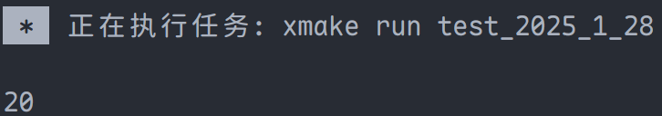
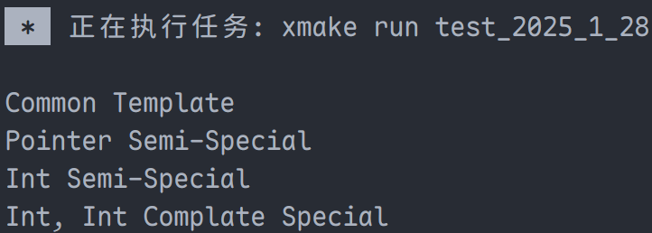

# 模板与泛型编程

## 模板介绍

C++ 的三大模块：面向过程、面向对象、模板与泛型；面向过程为 C 语言，面向对象是类。

模板可以实现一些其他语法难以实现的功能，分为类模板和函数模板，函数模板有分为普通函数模板和成员函数模板。

## 类模板与模板实现原理

### 类模板基础

标准类模板实现方法：

```cpp
#ifndef _SRC_MY_ARRAY_HPP_
#define _SRC_MY_ARRAY_HPP_
#include <cstddef>

template <typename T>
class MyArray {
  using iterator = T*;
  using const_iterator = const T*;

 public:
  MyArray(std::size_t length);

  ~MyArray();

  iterator begin() const;

  const_iterator cbegin() const;

 private:
  T* data_;
};

template <typename T>
MyArray<T>::MyArray(std::size_t length) {
  if (length) {
    data_ = new T[length]();
  } else {
    data_ = nullptr;
  }
}

template <typename T>
MyArray<T>::~MyArray() {
  delete[] data_;
}

// 需要显示指示此为类型（否则无法判断是成员变量还是类型）
// 此为 typename 关键字被引入的原因
template <typename T>
typename MyArray<T>::iterator MyArray<T>::begin() const {
  return data_;
}

template <typename T>
typename MyArray<T>::const_iterator MyArray<T>::cbegin() const {
  return data_;
}

#endif  // _SRC_MY_ARRAY_HPP_
```

### 模板实现原理

模板需要**编译 2 次**，第一次编译时仅检查最简单的语法，如括号是否匹配等。当函数被真正调用时，才会真正生成需要的类以及函数。

上述过程导致了无论是模板类还是模板函数，**声明与实现均要写于同一文件**。因为程序在编译期间需要知晓函数的具体实现过程。若实现和声明分文件编写，则链接时方可知晓函数具体实现过程，导致报错。

于是将声明与实现均写入 `.h` 或 `.hpp` 文件中，称为 header-only 实现。

## `initializer_list` 与 `typename`

### `initializer_list` 用法

`initializer_list` 是初始化列表，可以使用初始化列表初始化各式容器，如 `vector`、数组等。

```cpp
#include <vector>

int main() {
  std::initializer_list<int> vec_init{1, 2, 3, 4, 5};
  std::vector<int> vec{1, 2, 3, 4, 5};
  return 0;
}
```

初始化列表构造函数：

```c++
template <typename T>
struct get_type {
  using type = T;  // 如果 T 不是指针类型，直接返回 T
};

// 模板特化
template <typename T>
struct get_type<T*> {
  using type = T;  // 如果 T 是指针类型，返回指针指向的类型 T
};

// 左值构造函数
template <typename T>
MyArray<T>::MyArray(const std::initializer_list<T>& arr_init) {
  if (arr_init.size()) {
    unsigned int count = 0;
    data_ = new T[arr_init.size()];  // 动态分配数组
    if (std::is_pointer<T>::value) {
      // 如果 T 是指针类型，进行深拷贝
      for (auto elem : arr_init) {
        data_[count++] = new typename get_type<T>::type(*elem);
      }
    } else {
      // 如果 T 不是指针类型，直接复制元素
      for (const auto& elem : arr_init) {
        data_[count++] = elem;
      }
    }
  } else {
    data_ = nullptr;  // 如果初始化列表为空，data_ 设置为 nullptr
  }
}

// 右值构造函数
template <typename T>
MyArray<T>::MyArray(std::initializer_list<T>&& arr_init) {
    if (arr_init.size()) {
        unsigned int count = 0;
        data_ = new T[arr_init.size()];  // 动态分配数组
        for (auto& elem : arr_init) {
            data_[count++] = std::move(elem);  // 移动元素
        }
    } else {
        data_ = nullptr;  // 如果初始化列表为空，data_ 设置为 nullptr
    }
}
```

上述代码使用了萃取技术以及模板特化判断了类型，但是存在内存泄漏的问题。（建议使用智能指针）

**重要代码**：

```cpp
template <typename T>
struct GetType {
  using Type = T;
};

template <typename T>
struct GetType<T*> {
  using Type = T;
};
```

> **注意**：在 C++ 中，可以使用 `std::remove_pointer<T>::type` 来替代 `GetType`，同样可以获取底层类型。（或者使用 `std::remove_pointer_t<T>`）

### `typename` 用法

1. 在定义模板时，表示此为一个特定的类型

2. 在类外表明自定义类型使用

   ```cpp
   // 如下列构造函数
   template <typename T>
   typename MyArray<T>::iterator MyArray<T>::begin() const {
     return data_;
   }
   ```

> **注意**：在 C++ 早期版本中，为了减少关键字数量，使用 `class` 代表模板参数。而后因为第二个用法的原因，引入 `typename` 关键字。

## 函数模板以及成员函数模板

1.  普通函数模板的写法与类模板类似：

```cpp
#include <vector>
#include <iostream>

namespace my_std {
template <typename IterType, typename FuncType>
void ForEach(IterType first, IterType last, FuncType func) {
  for (auto iter = first; iter != last; ++iter) {
    func(*iter);
  }
}
}  // namespace my_std

int main() {
  std::vector<int> vec{1, 2, 3, 4, 5};
  // 使用自动类型推断
  my_std::ForEach(vec.begin(), vec.end(), [](int& elem) -> void { ++elem; });
  for (auto elem : vec) {
    std::cout << elem << ' ';
  }
  std::cout << '\n';
  return 0;
}
```

   
   
2. 成员函数模板：

```cpp
#include <iostream>

namespace my_std {
template <typename T>
class MyVec {
 public:
  template <typename U>
  void OutPut(const U& elem);
};

template <typename T>
template <typename U>
void MyVec<T>::OutPut(const U& elem) {
  std::cout << elem << std::endl;
}
}  // namespace my_std

int main() {
  my_std::MyVec<int> my_vec;
  my_vec.OutPut(20);
  return 0;
}
```

   

## 默认模板参数

**使用事项**：

- 默认模板参数经常使用，比如定义 `vector` 对象时，一般使用默认分配器。

- 模板参数与普通函数的默认参数类似，一旦一个参数拥有默认参数，其之后的参数必须有默认参数。

- 函数模板使用默认模板参数：

  ```c++
  template <typename IterType, typename FuncType = std::function<void(int)>>
  void ForEach(IterType first, IterType last, FuncType func) {
    for (auto iter = first; iter != last; ++iter) {
      func(*iter);
    }
  }
  ```

- 类模板使用模板参数：

  ```cpp
  #include <iostream>

  namespace my_std {
  template <typename T, typename Allocator = std::allocator<T>>
  class MyVec {
   public:
    template <typename U>
    void OutPut(const U& elem);
  };

  template <typename T, typename Allocator>
  template <typename U>
  void MyVec<T, Allocator>::OutPut(const U& elem) {
    std::cout << elem << std::endl;
  }
  ```

## 模板重载、全特化与偏特化

### 模板重载

**函数模板**可以重载（<span style="color:pink">**类模板不能被重载**</span>），通过重载可以应对更加复杂的情况。

如在处理 `char*` 和 `string` 对象时，虽然均可代表字符串，但 `char*` 复制时，直接拷贝内存效率更高，而 `string` 不得不依次调用构造函数。因此在一些追求效率的程序中，对不同类型进行不同的处理很有必要。

```cpp
#include <iostream>

template <typename T>
void Test(const T& parm) {
  std::cout << "void Test(const T& parm)\n";
}

template <typename T>
void Test(T* parm) {
  std::cout << "void Test(T* parm)\n";
}

void Test(double parm) {
  std::cout << "void Test(double parm)\n";
}

int main() {
  Test(100);
  int i = 100;
  Test(&i);
  Test(2.2);
  return 0;
}
```


### 模板特化

函数模板可以通过重载来应对更加精细的情况，类模板不可重载，但可以通过特化来实现类似的功能。

**模板特化分为两种**：全特化与偏特化。

1. **模板的全特化**：模板的实参列表与相对应的模板一一对应
2. **模板的偏特化**：介于普通模板和全特化之间，只存在部分类型明确化，而非将模板唯一化

```c++
#include <iostream>

template <typename T, typename U>
class Test {
 public:
  Test() { std::cout << "Common Template\n"; }
};

// 偏特化
template <typename T, typename U>
class Test<T*, U*> {
 public:
  Test() { std::cout << "Pointer Semi-Special\n"; }
};

template <typename U>
class Test<int, U> {
 public:
  Test() { std::cout << "Int Semi-Special\n"; }
};

// 全特化
template <>
class Test<int, int> {
 public:
  Test() { std::cout << "Int, Int Complate Special\n"; }
};

int main() {
  Test<char, double> test;
  Test<int*, int*> test2;
  Test<int, double> test3;
  Test<int, int> test4;
  return 0;
}
```


