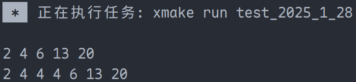

# STL 标准模板库

## STL 与 6 大模块介绍

标准模板库（Standard Template Library, STL），定义于 `std` 命名空间中，定义了 C++ 常用的容器与算法等，极大提高了程序开发效率。

泛型编程是指使用模板进行编程，实现一些其他方式难以实现的功能，而模板是泛型编程的基础。

> **注意**：泛型编程不属于面向对象编程的范畴，**泛型编程与面向对象编程是并列的**。

STL 作为泛型编程典型代表，实现了其他编程方式难以实现的效果，比如将整个模板库分为六个部分，每个部分可单独设计。举例，`vector` 与 `map` 在数据结构方面完全不同，但可使用**迭代器**在不同的数据结构中按照同样的方式运行。此方式无泛型编程难以实现。

**使用事项**：

1. 具备全局观念，不局限于单个容器，重点在于六大组件之间的联系
2. 可为了应对当前业务，临时学习即可

**STL 六大容器介绍**：

1. **容器（container）**：一种数据结构，即存储数据的地方，分为：
   - **顺序式容器**
   - **关联式容器**
   - **无序式容器**
2. **迭代器（iterator）**：提供可以访问任何容器的方法
3. **算法（alogorithm）**：用来操作容器中数据的模板函数
4. **仿函数（functor）**
5. **适配器（adaptor）**
6. **分配器（allocator）**

## 容器

### 顺序容器

顺序容器（sequence container），每个元素都有固定的位置，**位置取决于插入时间和地点，与元素值无关**。

- **`vector`**：将元素置于一个动态数组中，可以随即存取元素。（即使用索引直接存取）

  ```cpp
  #include <iostream>
  #include <vector>

  int main() {
    std::vector<int> vec{1, 2, 3, 4};
    std::cout << vec[1] << std::endl;
    // 推荐使用，会检查下标是否越界，抛出异常
    std::cout << vec.at(1) << std::endl;
    return 0;
  }
  ```

  例如：

  ```cpp
  #include <iostream>
  #include <vector>

  int main() {
    std::vector<int> vec{1, 2, 3, 4};
    try {  // 捕获异常
      std::cout << vec.at(1) << std::endl;
    } catch (const std::out_of_range& exception) {
      std::cerr << exception.what() << std::endl;
    }
    return 0;
  }
  ```

  > **注意**：数组尾部添加或删除元素迅速，但在中部或头部效率低。

- **`deque`**：指“double end queue”的缩写，也即是双端队列；`deque` 的实现相比于 `vector` 复杂很多，但本质为优化过的动态数组。相比于普通的动态数组，在前面添加或删除元素效率高；<span style="color:pink">**可以随机存储元素**</span>，头尾插入或删除元素效率快（略慢于 `vector`），但在中间插入元素效率低（与 `vector` 类似）。

- `list`：本质上为链表，因此具有链表的属性；**<span style="color:pink">无法随机存取元素（即 `list` 无法使用索引存取元素）</span>**；在任何位置插入和删除元素都较为迅速。此外，在任何位置插入及删除元素的时间相同，在元素头部操作慢于 `deque`，在元素尾部操作慢于 `deque` 和 `vector`。

- `string`：将字符串进行封装。

- `forward_list`：单项链表，简而言之就是受限的 `list`；`list` 不支持的功能，它同样不支持；而做各种支持的操作，其效率均会高于 `list`（例如排序算法，`forward_list` 优于 `list`）。

  1. `forward_list` 仅提供前向迭代器（支持 `++iter`，不支持 `--iter`），而不是双向迭代器；因此其不支持反向迭代器
  2. `forward_list` 不提供成员函数 `size()`
  3. `forward_list` 没有指向最末元素的锚点；基于该原因，不提供用以处理最末元素的成员函数 `back()`、`push_back()` 和 `pop_back()`

### 关联容器

关联容器（associated container），<span style="color:purple">元素位置取决于元素的值，和插入顺序无关</span>。

- **`set` / `multiset`**：使用”红黑树“实现，是一种高度平衡的二叉树；<span style="color:red">二叉树的本质决定了 `set` / `multiset`  元素的存取取决与元素本身的值，和插入顺序无关</span>。

  内部元素的值依据元素的值自动排序，与插入顺序无关；`set` 内部相同数值的元素只能出现一次，`multiset` 内部相同数值的元素可以出现多次；容器使用二叉树实现，便于查找。

  ```cpp
  #include <iostream>
  #include <set>

  int main() {
    std::set<int> set{13, 2, 4, 4, 4, 20};
    set.insert(6);
    for (auto elem : set) {
      std::cout << elem << ' ';
    }
    std::cout << '\n';
    std::multiset<int> multiset{13, 2, 4, 4, 4, 20};
    multiset.insert(6);
    for (auto elem : multiset) {
      std::cout << elem << ' ';
    }
    std::cout << '\n';
    return 0;
  }
  ```

  

- **`map` / `multimap`**：使用“红黑树”实现，是一种高度平衡的二叉树。

  内部元素是成对的 `key` / `value`，也就是键值对，内部元素根据其键值自动排序，`map` 内部相同的键值只能出现一次，`multimap` 则可以出现多次。

  ```cpp
  #include <iostream>
  #include <map>
  #include <string>

  int main() {
    std::map<int, std::string> int_string_map;
    int_string_map.insert(std::pair<int, std::string>(10, "Alice"));
    int_string_map.insert(std::pair<int, std::string>(20, "Bob"));
    int_string_map.insert(std::pair<int, std::string>(30, "Cindy"));
    int_string_map.insert(std::pair<int, std::string>(40, "David"));
    int_string_map.insert(std::pair<int, std::string>(50, "Eva"));
    for (auto iter = int_string_map.begin(); iter != int_string_map.end();
         ++iter) {
      std::cout << iter->first << ' ' << iter->second << '\n';
    }
    return 0;
  }
  ```

  

### 无序容器

无序容器（unordered container）包括以下几种：

- **`unordered_map` / `unordered_multimap`** ：基于哈希表实现，因此元素存储顺序是无序的；其使用方式与 `map` / `multimap` 类似，通过键值对（`key` / `value`）进行操作
- **`unordered_set` / `unordered_multiset`** ：同样基于哈希表实现，具备哈希表容器的特性；其使用方式与 `set` / `multiset` 类似，主要用于存储单个值

### 关联容器 vs. 无序容器

1. 关联容器均为有序的，对于那些对顺序有要求的操作，关联容器的效率会高很多
2. 无序容器是真正的无序，在查找数据方面有着优势
3. 在内存消耗方面，无序容器高于关联容器，但可忽略不计

**总结**：若增加、删除元素频繁，使用关联式容器；若修改元素、查找元素频繁，使用无序式容器。

### 使用场景

1. 需要使用存储 `key` / `value` 的容器时，只能使用 `map` / `multimap` / `unordered_map` / `unordered_multimap`。如果增加删除频繁，使用 `map` / `mulitmap`；若修改、查找频繁，使用 `unordered_map` / `unordered_multimap`
2. 处理普通元素：
   1. 当元素需要频繁插入删除时，选择顺序容器：
      - 如果在尾部插入、删除，选择 `vector`
      - 在头部、尾部插入删除，选择 `deque`
      - 在中间插入、删除，选择 `list`
   2. 当元素需要频繁查找时，选择 `set` / `multiset` / `unordered_set` / `unordered_multiset`：
      - 频繁增加、删除时，选择 `set`
      - 频繁查找、修改时，选择 `unordered_set`

## STL 各种容器的操作

### `vector` 各种函数

- **`vector()`**：创建一个空的 `vector`
- **`vector(const std::allocator<T>& al)`**：使用指定的分配器分配内存。`allocator` 是一个内存分配器，`vector` 指定了默认分配器，不需要主动调用，之后设计时直接忽略即可。这个构造函数是使用指定的分配器创建一个空的 `vector` 对象
- **`vector(std::vector<T>&& right, const std::allocator<T>& al)`**：移动构造函数，第二个参数代表指定的分配器
- **`vector(const std::vector<T>& vec, const std::allocator<T>& al)`**：拷贝构造函数，分配器可自己指定。一般地，`vector` 默认的分配器即可
- **`vector(std::initializer_list<T>& initList, const std::allocator<T>& al)`**：使用 `initializer_list` 初始化容器，第二个参数代表指定的分配器
- **`vector(iter firsr, iter last, const std::allocator<T>& al)`**：容器初始化为迭代器 `[first, last)` 的内容（这里使用 `deque`、`list` 的迭代器均可），第三个参数代表指定的迭代器
- **`vector(const size_t count, const std::allocator<T>& al)`**：创建一个 `vector`，元素个数为 `count`，元素均为默认值。若为普通类型，则赋值为 0；若为类，则均使用默认构造函数进行初始化
- **`vector(const size_t count, const T& t)`**：创建一个 `vector`，元素个数为 `count`，且值均为 `t`

#### 增加函数

- **`void push_back(const T& value)`**：向容器尾部增加一个元素 `value`
- **`void push_back(T& value)`**：向容器尾部添加一个元素 `value`，以右值引用的形式
- **`std::vector<T>::iterator insert(std::vector<T>::const_iterator& where, std::initializer_list<T> initList)`**：在 `where` 迭代器指定位置添加 `initList`，<span style="color:red">返回值指向新添加的 `initList`  的第一个元素的迭代器，`insert`  函数有许多重载，但返回值类似</span>
- **`std::vector<T>::iterator insert(std::vector<T>::const_iterator& where, iter first, iter last)`**：将迭代器 `[first, last)` 添加到迭代器 `where` 指定位置
- **`std::vector<T>::iterator insert(std::vector<T>::const_iterator& where, size_t count, const int& value)`**：在 `where` 处插入 `count` 个 `value`
- **`std::vector<T>::iterator insert(std::vector<T>::const_iterator& where, const T& value)`**：在 `where` 处插入 `value`
- **`std::vector<T>::iterator insert(std::vector<T>::const_iterator& where, T&&value)`**：在 `where` 处插入 `value`，使用右值引用形式

#### 删除函数

- **`std::vector<T>::iterator erase(std::vector<T>::const_iterator where)`**：删除容器迭代器指向的元素，<span style="color:blue">返回指向被删元素后的元素的迭代器</span>
- **`iterator erase(iterator first, iterator last)`**：删除容器中 `[first, last)` 中的元素，<span style="color:blue">返回指向被删元素后的元素的迭代器</span>
- **`void pop_back()`**：删除容器中最后一个元素
- **`void clear()`**：删除容器中所有元素

#### 遍历函数

- **`T& at(const size_t pos)`**：返回 `pos` 位置的引用
- **`const T& at(const size_t pos) const`**：`at` 函数的常量版本
- **`T& front()`**：返回首元素的引用
- **`const T& front() const`**：`front` 函数的常量版本
- **`T &back()`**：返回尾元素的引用
- **`const T& back() const`**：`back` 函数的常量版本
- **`std::vector<T>::iterator begin()`**：返回指向容器第一个元素迭代器
- **`std::vector<T>::iterator begin() const`**：`begin` 函数的常量版本
- **`std::vector<T>::iterator cbegin() const`**：可以主动调用的 `begin` 函数的常量版本
- **`std::vector<T>::iterator end()`**：返回指向容器最后一个元素的下一个元素的迭代器。类似地，`end` 函数也有两个常量版本，此处不赘述
- **`std::vector<T>::reverse_iterator::rbegin()`**：反向迭代器，指向最后一个元素（<u>此时使用 `++`，则向前</u>）。类似地，有两个常量版本
- **`reverse_iterator rend()`**：反向迭代器，指向第一个元素之前的元素

#### 判断函数

**`bool empty() const`**：判断容器是否为空。若为空，则返回 `true`；否则返回 `false`。

#### 大小函数

- **`size_t size() const`**：返回当前容器中元素个数
- **`size_t capacity() const`**：返回当前容器不扩张所能容纳的最大元素数量
- **`size_t max_size() const`**：返回当前机器可以存储的元素数量最大值

#### 其他函数

- **`void swap(std::vector<T>& vec)`**：交换两个同类型容器的数据
- **`void assign(int n, const T& x)`**：将容器设置为 `n` 个 `x`
- **`void assign(const_iterator first, const_iterator last)`**：将当前容器的元素设置为 `[first, last)`。其中，`first` 和 `last` 均为迭代器，可以是 `vector`、`deque`、`list` 等类型的迭代器
- **`void assign(const std::initialize_list<T> initList)`**：将容器元素设置为 `initialize_list` 的元素
- **`void resize(size_t newSize)`**：将容器的容量设置为 `newSize`

### `deque` 各种函数

`deque` 的各种函数与 `vector` 类似，仅介绍不同之处：

1. `void push_front(const T& value)`
2. `void push_front(T&& value)`
3. `void pop_front()`

### `list` 各种函数

`list` 与 `deque` 类似，但与 `deque` 唯一的区别是不支持随机索引，<span style="color:red">不支持 `at()` 函数</span>。

### `string` 各种函数

1. **获取封装字符串的函数**：

   - **`const char* data() const`**：返回 `string` 对象内部的字符串指针。

     > **注意**：`c_str()` 函数返回的直接就是 `string` 对象内部的指针，即 **`string` 对象指向的对象发生了变化，返回的对象也会发生改变**。

   - **`const char* data() const`**：返回 `string` 对象内部的函数指针，和 `c_str()` 函数的区别为返回的字符串后面没有 `'\0'`。
   - **`size_t copy(char* const ptr, size_t count, const size_t off) const`**：将 `string` 对象的部分内容复制到 `ptr` 数组中，`ptr` 表示目标字符数组，`count` 表示复制 `string` 对象的字符数量，`off` 表示从当前 `string` 对象复制的起始位置偏移量。

2. **字符串比较函数**：`compare()` 函数重载很多，使用是查看即可，可以将 `string` 对象的任何部分与另一个字符串进行比较。

其余函数与 `vector` 类似，同样支持随机选取，支持容器末尾插入。

### `forward_list` 各种函数

与 `list` 类似，不同的是没有 `size()`、`push_back()`、`back()` 和 `pop_back()` 等函数。

## 迭代器

迭代器是一种设计模式，它提供了一种统一的方法来顺序访问容器中的元素，而无需关心容器的具体实现。迭代器的引入使得我们可以将容器的存储细节与数据访问逻辑分离，从而实现容器与算法的解耦。通过迭代器，我们可以以一致的方式操作各种容器，而不需要考虑不同容器之间的差异。这使得迭代器成为连接容器和算法的桥梁，使得我们可以灵活地使用各种算法来处理不同类型的容器。

## 算法

**Microsoft 官方文档链接**：[<algorithm>](https://learn.microsoft.com/zh-cn/cpp/standard-library/algorithm?view=msvc-170)

## 仿函数（函数对象）

仿函数是一个可调用 `()` 运算符的类对象，将 `operator ()` 重载的类的对象就是仿函数。

**Microsoft 官方文档链接**：[<functional>](https://learn.microsoft.com/zh-cn/cpp/standard-library/functional?view=msvc-170)

## 适配器与分配器

适配器是使一种事物的行为类似另外一种事物的行为的一种机制。适配器对容器进行包装，使其表现出另一种行为。例如，`stack` 实现了栈的功能，默认使用 `deque` 容器来存储数据。

标准库提供了三种顺序容器适配器（无关联容器适配器）：

1. `queue`（队列）
2. `priority_queue`（优先队列）
3. `stack`（栈）

在动态分配内存时，直接使用 `new`、`delete` 容易产生内存碎片化的问题，不同的分配器有不同的分配内存方法。可以大幅度提高程序对堆内存的使用效率，直接使用默认分配器即可。
