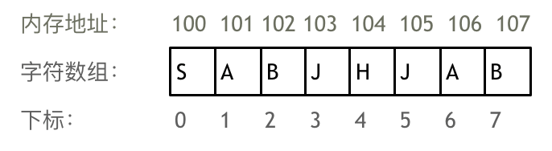
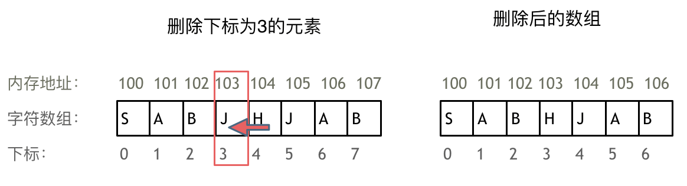
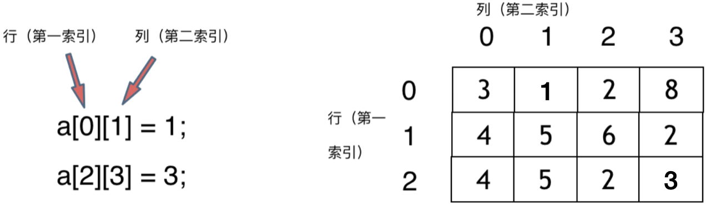
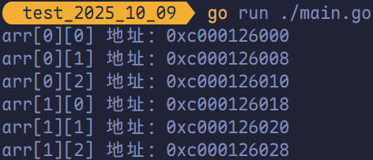
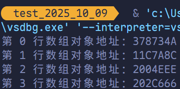
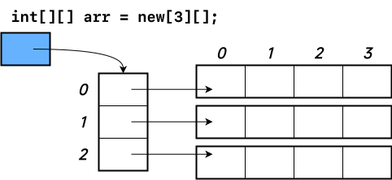
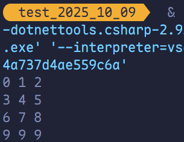

# 数组理论基础

<span style="color:#F25912; font-weight:bold">数组</span>是存放在**连续内存空间**上的<span style="color:#1055C9">相同类型</span>数据的集合。数组可以方便地通过下标索引的方式获取下标对应的数据。

以字符数组为例：



> [!tip]
>
> - 数组下标均从 0 开始。
> - 数组内存空间的地址是连续的。

正因数组在<span style="color:#9B5DE0; font-weight:bold">内存空间的地址是连续的</span>，因此我们在<u>删除</u>或<u>增添元素</u>时，难免需要移动<span style="color:#DD0303">其他元素的地址</span>。

例如删除下标为 3 的元素，需要对下标为 3 的元素后的所有元素进行移动操作，如图所示：



**数组的元素是无法删除的，只能覆盖。**

以二维数组为例：



**二维数组在内存的空间地址是连续的吗？**

不同编程语言的内存管理<span style="color:#134686">截然不同</span>。以 Golang 为例，在 Golang 中，二维数组是**连续分布**的。

```go
package main

import "fmt"

// print2DArrayAddrs 打印 2x3 二维数组中每个元素的地址
func print2DArrayAddrs() {
	arr := [2][3]int{
		{0, 1, 2},
		{3, 4, 5},
	}

	for i := range arr {
		for j := range arr[i] {
			fmt.Printf("arr[%d][%d] 地址：%p\n", i, j, &arr[i][j])
		}
	}
}

func main() {
	print2DArrayAddrs()
}
```



地址以十六进制显示，可以看出二维数组在内存中是**连续线性排列**的。 

例如，`0xc000126000` 与 `0xc000126008` 相差 `0x8`（即 8 个字节）。这是因为该数组的元素类型为 `int`，而在 Go 语言中，`int` 的大小**取决于平台架构**：在 64 位系统上，`int` 通常为 64 位（即 `int64`），占用 8 字节。因此，相邻元素的内存地址正好相差 8 字节，符合连续存储的预期。 

如图：



可以看出 Golang 的二维数组<u>在地址空间上是连续的</u>。

C# 无指针，有两种方式：

第一种是锯齿数组（`int[][]`），明显非连续。

```csharp
using System;

class Program
{
    static void PrintJaggedArrayAddresses()
    {
        int[][] jaggedArray =
        [
            [0, 1, 2],
            [3, 4, 5],
            [6, 7, 8],
            [9, 9, 9],
        ];

        for (int row = 0; row < jaggedArray.Length; row++)
        {
            System.Console.WriteLine(
                $"第 {row} 行数组对象地址：{jaggedArray[row].GetHashCode():X}"
            );
        }
    }

    static void Main(string[] args)
    {
        PrintJaggedArrayAddresses();
    }
}
```



虽然 `GetHashCode()` 不是真实内存地址，但它在 .NET 中通常基于对象引用生成，可视为**堆上对象的唯一标识**。不同行的数组是不同的对象 → 地址**不可能连续**。

因此，C# 的**锯齿数组**在内存中的排列方式可能如下：



第二种是矩形数组（`int[,]`），底层存储连续，但无法直接获取地址：

```csharp
using System;

class Program
{
    static void TestRectArr()
    {
        int[,] arr = new int[,]
        {
            { 0, 1, 2 },
            { 3, 4, 5 },
            { 6, 7, 8 },
            { 9, 9, 9 },
        };

        for (int i = 0; i < arr.GetLength(0); i++)
        {
            for (int j = 0; j < arr.GetLength(1); j++)
            {
                System.Console.Write(arr[i, j] + " ");
            }
            System.Console.WriteLine();
        }
    }

    static void Main(string[] args)
    {
        TestRectArr();
    }
}
```

