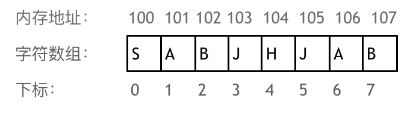
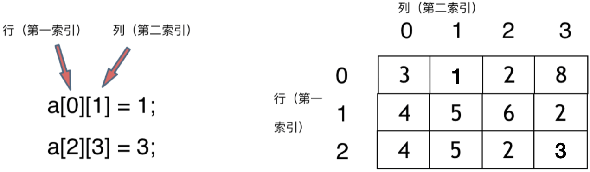
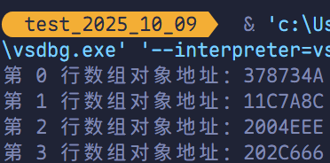
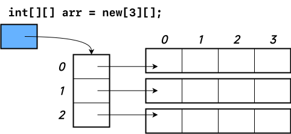

# 数组理论基础

<span style="color:#BF092F; font-weight:bold">数组</span>是存放在<u>**连续**</u>内存空间上的<u>相同类型数据</u>的集合，其可以方便的通过下标索引的方式获取到下标对应的数据。

以字符数组为例：



> [!tip]
>
> - 数组的下标从 0 开始。
> - 数组内存空间的地址是连续的

正是**因为数组在内存空间的地址是连续的，所以我们在删除或者添加元素的时候，就难免要移动其他元素的地址。**

例如删除下标为 3 的元素，需要对下标为 3 的元素后面的所有元素都要做移动操作，如图所示：


数组的元素不能被删除，只能被覆盖。

以二维数组为例：



不同编程语言的内存管理方式各不相同。以 Go 为例，在 Go 中二维数组在内存中是连续分布的。

```go
package main

import "fmt"

func testArr() {
    var arr [2][3]int = [2][3]int{
        {0, 1, 2},
        {3, 4, 5},
    }
    for i := 0; i < 2; i++ {
        for j := 0; j < 3; j++ {
            fmt.Printf("arr[%d][%d] 地址：%p\n", i, j, &arr[i][j])
        }
    }
}

func main() {
    testArr()
}
```


可以看到地址是 16 进制，可以看出二维数组地址是连续排列的。

例如 `0xc000126000` 和 `0xc000126008` 相差 8 字节，因为在 Go 的 64 位平台上，`int` 类型占用 8 个字节，所以相邻数组元素地址相差 8 个字节。


**所以可以看出在 Go 中二维数组在地址空间上是连续的**。

像 C# 这样没有指针的语言，不对程序员暴露元素的地址，寻址操作完全交给虚拟机处理。

所以无法直接看到每个元素的地址。这里以 C# 的锯齿数组为例，进行实验。

```csharp
using System;

public class Program
{
    public static void TestArr()
    {
        int[][] arr = new int[][] {
            new int[] {1, 2, 3},
            new int[] {3, 4, 5},
            new int[] {6, 7, 8},
            new int[] {9, 9, 9}
        };
        for (int i = 0; i < arr.Length; i++)
        {
            Console.WriteLine($"第 {i} 行数组对象地址：{arr[i].GetHashCode():X}");
        }
    }

    static void Main(string[] args)
    {
        TestArr();
    }
}
```



这里的数值是 16 进制，但这不是真正的内存地址，而是经过处理后的哈希码。我们可以看出，二维数组每一行头结点的哈希码没有规律，更谈不上连续。

所以 C# 的二维数组可能是如下排列的方式：


