# 二分查找

## 题目

给定一个 `n` 个元素有序的（升序）整型数组 `nums` 和一个目标值 `target`  ，写一个函数搜索 `nums` 中的 `target`，如果 `target` 存在返回下标，否则返回 `-1`。

你必须编写一个具有 `O(log n)` 时间复杂度的算法。

**示例 1**：

```shell
输入: nums = [-1,0,3,5,9,12], target = 9
输出: 4
解释: 9 出现在 nums 中并且下标为 4
```

**示例 2**：

```shell
输入: nums = [-1,0,3,5,9,12], target = 2
输出: -1
解释: 2 不存在 nums 中因此返回 -1
```

 **提示**：

1. 你可以假设 `nums` 中的所有元素是不重复的。
2. `n` 将在 `[1, 10000]`之间。
3. `nums` 的每个元素都将在 `[-9999, 9999]`之间。

## 思路

题目给定数组**有序且元素唯一**，这确保了目标值若存在，其下标是唯一的。若有重复元素，普通二分查找虽仍有效，但返回的下标可能不唯一。

上述条件为二分搜索法的<u>前提条件</u>，倘若遇到这些条件，应思考是否可以使用<u>二分法</u>。

二分法涉及的边界条件逻辑简单，但有如下易错点：

- `while(left < right)` or `while(left <= right)`
- `right = middle` or `right = middle - 1`

之所以易错，是因为**对区间的定义不明**。因此简单理解，**区间的定义就是不变量**。

而在二分查找中，需要保持不变量，即在 `while` 循环中对边界的每一次处理都要坚持根据区间的定义来操作，此为**循环不变量**原则。

一般而言，写二分法分为两种：

- 左闭右闭：`[left, right]`
- 左闭右开：`[left, right)`

### 左闭右闭

在第一种写法中，定义 `target` 在一个左闭右闭的区间内，即 **`[left, right]`**。

区间的定义决定了二分法代码的写法，**因为定义 `target` 于 `[left, right]` 区间**，因此有如下三点：

- `while(left <= right)` 要使用 `<=`，因为 `left == right` 依旧符合 `[left, right]` 和这个区间的定义，因此有意义。（例如 `[1, 1]` 则代表这个区间内有 1 这个元素）
- `right = middle - 1`，因为 `if (nums[middle] > target)`，所以这个 `middle` 一定在 `[left, right]` 这个区间外，则 `nums[middle]` 必然不是 `target`，则而后查找的左区间结束下标就是 `middle - 1`。
- `right` 初始值为 `nums.size - 1`，使其符合左闭右闭的区间定义。

例如在数组 `[1, 2, 3, 4, 7, 9, 10]` 中查找元素 2，如下图：



Go 代码如下：

```go
func search(nums []int, target int) int {
	left := 0
	right := len(nums) - 1

	for left <= right {
		middle := left + (right-left)>>1
		if nums[middle] > target {
			right = middle - 1
		} else if nums[middle] < target {
			left = middle + 1
		} else {
			return middle
		}
	}

	return -1
}
```

- **时间复杂度**：`O(log n)`
- **空间复杂度**：`O(1)`

### 左闭右开

如果 `target` 是在一个左闭右开的区间里，即 `[left, right)`，那么二分法的处理方式截然不同。

有如下三点：

- `while (left < right)`，使用 `<`，因为 `left == right` 在区间 `[left, right)` 中无意义。
- `right = middle`，因为当前 `nums[middle]` 不等于 `target`，而寻找的区间严格定义为左闭右开，因此 `right` 更新为 `middle`，即下一个查询区间不会去比较 `nums[middle]`。
- `right` 初始值为 `nums.size`，使其符合左闭右开的定义。

例如在数组 `[1, 2, 3, 4, 7, 9, 10]` 中查找元素 2，如下图：



Go 代码如下：

```go
func search(nums []int, target int) int {
	left := 0
	right := len(nums)

	for left < right {
		middle := left + (right-left)>>1
		if nums[middle] > target {
			right = middle
		} else if nums[middle] < target {
			left = middle + 1
		} else {
			return middle
		}
	}

	return -1
}
```

- **时间复杂度**：`O(log n)`
- **空间复杂度**：`O(1)`

## 二分变形

前述二分查找均假设数组无重复元素，因此一旦找到 `target` 即可直接返回。但在实际问题中，数组可能包含重复元素，或需要并非“是否相等”，而是：

- 找到 `target` 第一次出现的位置。
- 找到 `target` 最后一次出现的位置。
- 确认 `target` 应插入的位置。

此时，标准二分需升级为边界查找。

在升序数组中，对目标值 `target`：

- `lower_bound(target)`：返回第一个 `>= target`  的元素下标。
- `upper_bound(target)`：返回第一个 `> target` 的元素下标。

> [!tip]
>
> 例如，在 `nums = [1, 2, 2, 2, 3]`，`target = 2` 中：
>
> - `lower_bound = 1`（第一个 `>= 2` 的位置）
> - `upper_bound = 4`（第一个 `> 2` 的位置）
> - `target` 的完整区间为 `[1, 4)`，共 `4 - 1 = 3` 个元素

### `lower_bound`

要找到第一个 `>= target` 的位置，当 `nums[mid] == target` 时，`mid` 可能就是答案，因此需要保留 `mid`，将有边界收缩至 `mid`。

Go 代码如下：

```go
func lowerBound(nums []int, target int) int {
  left, right := 0, len(nums) // 区间 [left, right)
	for left < right {
		mid := left + (right-left)>>1
		if nums[mid] < target {
			left = mid + 1 // 太小，排除 mid 及左侧
		} else {
			right = mid // nums[mid] >= target，保留 mid
		}
	}
	return left
} 
```

> [!tip]
>
> 最终结果为 `left == right` 时的值。虽然 `mid` 在左闭右开区间中被排除，但 `right = mid` 实际是**将 `mid` 作为潜在答案保留于右边界**，供后续收敛。

### `upper_lower`

要找第一个 `> target` 的位置，当 `nums[mid] == target` 时，`mid` 不符合要求，必须继续向右搜索，因此将左边界移至 `mid + 1`。

Go 代码如下：

```go
func upperBound(nums []int, target int) int {
  left, right := 0, len(nums) // 区间 [left, right)
  for left < right {
    mid := left + (right-left)>>1
    if nums[mid] <= target {
      left = mid + 1 // <= target，排除 mid 及左侧
    } else {
      right = mid // nums[mid] > target，保留 mid
    }
  }
  return left
}
```

- 初始 `right = len(nums)`，符合左闭右开定义。
- 循环中 `mid` 始终满足 `left <= mid < right`，不会越界。

## 总结

二分法的要点主要是对**区间的定义**上，在循环中要始终根据所要查找区间的定义进行边界处理。

区间的定义是**不变量**，那么在循环中就要严格根据查找区间的定义来做边界处理，就是循环不变量规则。