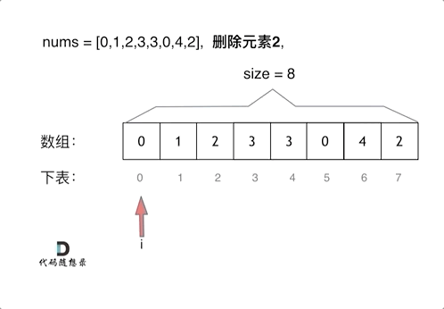

# 移除元素

## 题目

给你一个数组 `nums` 和一个值 `val`，你需要**[原地](https://baike.baidu.com/item/原地算法)**移除所有数值等于 `val` 的元素。元素的顺序可能发生改变。然后返回 `nums` 中与 `val` 不同的元素的数量。

假设 `nums` 中不等于 `val` 的元素数量为 `k`，要通过此题，您需要执行以下操作：

- 更改 `nums` 数组，使 `nums` 的前 `k` 个元素包含不等于 `val` 的元素。`nums` 的其余元素和 `nums` 的大小并不重要。
- 返回 `k`。

**用户评测**：

评测机将使用以下代码测试您的解决方案：

```java
int[] nums = [...]; // 输入数组
int val = ...; // 要移除的值
int[] expectedNums = [...]; // 长度正确的预期答案。
                            // 它以不等于 val 的值排序。

int k = removeElement(nums, val); // 调用你的实现

assert k == expectedNums.length;
sort(nums, 0, k); // 排序 nums 的前 k 个元素
for (int i = 0; i < actualLength; i++) {
    assert nums[i] == expectedNums[i];
}
```

如果所有的断言都通过，你的解决方案将会**通过**。

**示例 1**：

```sh
输入：nums = [3,2,2,3], val = 3
输出：2, nums = [2,2,_,_]
解释：你的函数函数应该返回 k = 2, 并且 nums 中的前两个元素均为 2。
你在返回的 k 个元素之外留下了什么并不重要（因此它们并不计入评测）。
```

**示例 2**：

```sh
输入：nums = [0,1,2,2,3,0,4,2], val = 2
输出：5, nums = [0,1,4,0,3,_,_,_]
解释：你的函数应该返回 k = 5，并且 nums 中的前五个元素为 0,0,1,3,4。
注意这五个元素可以任意顺序返回。
你在返回的 k 个元素之外留下了什么并不重要（因此它们并不计入评测）。
```

 **提示**：

- `0 <= nums.length <= 100`
- `0 <= nums[i] <= 50`
- `0 <= val <= 100`

## 思路

数组元素在**内存地址中是连续的**，不能单独删除数组中的某个元素，**只能覆盖**。

### 暴力解法

使用两层 `for` 循环，第一个 `for` 循环遍历数组元素，第二个 `for` 循环更新数组。

删除过程如下：



Go 代码如下：

```go
func removeElement(nums []int, val int) int {
	n := len(nums)
	for i := 0; i < n; i++ {
		if nums[i] == val {
			for j := i + 1; j < n; j++ {
				nums[j-1] = nums[j]
			}
			i--
			n--
		}
	}
	return n
}
```

- **时间复杂度**：`O(n²)`
- **空间复杂度**：`O(1)`

### 双指针法

**双指针法（快慢指针法）**：通过一个**快指针**和**慢指针**在一个 `for` 循环下完成两个 `for` 循环的工作。

定义快慢指针：

- **快指针**：遍历原数组，寻找**非目标元素**；  
- **慢指针**：指向**新数组的下一个写入位置**。


Go 代码如下：

```go
func removeElement(nums []int, val int) int {
	k := 0
	for _, v := range nums {
		if v != val {
			nums[k] = v
			k++
		}
	}
	return k
}
```

- **时间复杂度**：`O(n)`
- **空间复杂度**：`O(1)`

## 相关题目推荐

- [26.删除排序数组中的重复项](https://leetcode.cn/problems/remove-duplicates-from-sorted-array/)
- [283.移动零](https://leetcode.cn/problems/move-zeroes/)
- [844.比较含退格的字符串](https://leetcode.cn/problems/backspace-string-compare/)
- [977.有序数组的平方](https://leetcode.cn/problems/squares-of-a-sorted-array/)