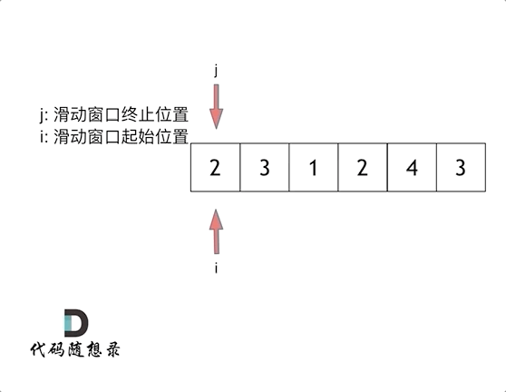

# 长度最小的子数组

## 题目

给定一个含有 `n` 个正整数的数组和一个正整数 `target`。

找出该数组中满足其总和大于等于 `target` 的长度最小的 `[numsl, numsl+1, ..., numsr-1, numsr]`，并返回其长度。如果不存在符合条件的子数组，返回 `0`。

**示例 1**：

```sh
输入：target = 7, nums = [2,3,1,2,4,3]
输出：2
解释：子数组 [4,3] 是该条件下的长度最小的子数组。
```

**示例 2**：

```sh
输入：target = 4, nums = [1,4,4]
输出：1
```

**示例 3**：

```sh
输入：target = 11, nums = [1,1,1,1,1,1,1,1]
输出：0
```

**提示**：

- `1 <= target <= 10⁹`
- `1 <= nums.length <= 10⁵`
- `1 <= nums[i] <= 10⁴`

**进阶**：

- 如果你已经实现 `O(n)` 时间复杂度的解法，请尝试设计一个 `O(n log(n))` 时间复杂度的解法。

## 思路

### 暴力解法

使用两个 `for` 循环，不断地寻找符合条件的子系列，时间复杂度明显是 `O(n^2)`。

```go
func minSubArrayLen(target int, nums []int) int {
	n := len(nums)
	if n == 0 {
		return 0
	}

	minLen := n + 1
	for start := range n {
		currentSum := 0
		for end := start; end < n; end++ {
			currentSum += nums[end]
			if currentSum >= target {
				subLen := end - start + 1
				if subLen < minLen {
					minLen = subLen
				}
			}
		}
	}

	if minLen == n+1 {
		return 0
	}
	return minLen
}
```

- 时间复杂度：`O(n²)`
- 空间复杂度：`O(1)`

### 滑动窗口

滑动窗口，就是不断地调节子序列的**起始位置**和**终止位置**，从而得出想要的结果。

在暴力解法中，一个 `for` 循环滑动窗口的起始位置，一个 `for` 循环为滑动窗口的终止位置，使用两个 `for` 循环完成了一个不断搜索区间的过程。

**如何使用滑动窗口如何用一个 `for` 循环完成这个操作？**

若使用一个 `for` 循环来表示**滑动窗口起始位置**，然后遍历剩下的终止位置，难免会再次陷入暴力解法。

因此只使用一个 `for` 循环，则其索引表示**滑动窗口终止位置**。

**起始位置如何移动？**

以官方示例举例，`s = 7`，有：



最后发现 `[4, 3]` 是最短距离。

本质上也是双指针法的一种，主要确定三点：

- 窗口内是什么？
- 如何移动窗口的起始位置？
- 如何移动窗口的结束位置？

窗口就是满足 `currentSum >= s` 的长度最小的**连续子数组**。

窗口的起始位置如何移动？若当前窗口的值大于等于 `s`，窗口向前移动（也就是缩小）。

窗口的结束位置如何移动？窗口的结束位置就是遍历数组的指针，即 `for` 循环中的索引。

```go
func minSubArrayLen(target int, nums []int) int {
	n := len(nums)
	if n == 0 {
		return 0
	}

	start := 0
	minLen := n + 1
	currentSum := 0
	for end := range n {
		currentSum += nums[end]
		for currentSum >= target {
			subLen := end - start + 1
			if subLen < minLen {
				minLen = subLen
			}
			currentSum -= nums[start]
			start++
		}
	}

	if minLen == n+1 {
		return 0
	}
	return minLen
}
```

- 时间复杂度：`O(n)`
- 空间复杂度：`O(1)`

> [!tip]
>
> 不能简单地因为代码中有两层 `for` 循环就认为时间复杂度是 `O(n^2)`。关键在于**每个元素被操作的总次数**。在滑动窗口算法中，每个元素最多进入窗口一次、离开窗口一次，因此至多被处理两次。整体操作次数为 `2n`，时间复杂度为 `O(2n)=O(n)`。

## 相关题目推荐

- [904.水果成篮](https://leetcode.cn/problems/fruit-into-baskets/)
- [76.最小覆盖子串](https://leetcode.cn/problems/minimum-window-substring/)

