# 区间和

## 题目

https://kamacoder.com/problempage.php?pid=1070

给定一个含有 `n` 个整数的数组 `nums`，以及若干个查询区间 `[a, b]`（其中 `0 <= a <= b < n`），请对每个查询计算数组在该区间内（包含端点）所有元素的总和，并返回对应的区间和。

**输入描述**： 

第一行输入为数组长度 `n`。 

接下来 `n` 行，每行一个整数，依次表示数组 `nums` 的元素。  

随后若干行，每行包含两个整数 `a` 和 `b`（`0 <= a <= b < n`），表示一个查询区间，直到输入结束。

**输出描述**： 

对每个查询区间 `[a, b]`，输出一行，表示该区间内元素的总和。

**示例**：

```sh
输入：
5
1
2
3
4
5
0 1
1 3

输出：
3
9
```

**解释**：  

- 区间 `[0, 1]` 对应元素 `[1, 2]`，总和为 `3`。  
- 区间 `[1, 3]` 对应元素 `[2, 3, 4]`，总和为 `9`。

**提示**：

- `1 <= n <= 10⁵`
- `-10⁴ <= nums[i] <= 10⁴`

## 思路

### 暴力算法

```go
package main

import (
	"bufio"
	"fmt"
	"os"
	"strconv"
)

func main() {
	scanner := bufio.NewScanner(os.Stdin)
	scanner.Scan()
	n, _ := strconv.Atoi(scanner.Text())

	nums := make([]int, n)
	for i := 0; i < n; i++ {
		scanner.Scan()
		nums[i], _ = strconv.Atoi(scanner.Text())
	}

	prefix := make([]int, n+1)
	for i := 0; i < n; i++ {
		prefix[i+1] = prefix[i] + nums[i]
	}

	for {
		var a, b int
		_, err := fmt.Sscanf(scanner.Text(), "%d %d", &a, &b)
		if err != nil {
			return
		}

		sum := prefix[b+1] - prefix[a]
		fmt.Println(sum)
	}
}
```

虽然该方法在一般情况下可行，但在极端场景下效率较低。

例如，当有 `m` 次查询，且每次查询区间均为 `[0, n−1]`  时，总时间复杂度将达到 `O(n * m)` 。若查询次数 `m` 很大，则会导致严重超时。

### 前缀和

例如，若需频繁计算数组 `nums` 上任意区间的和，可预先构建前缀和数组 `prefix`，其中 `prefix[i]` 表示 `nums` 从下标 `0` 到 `i`（含）的元素累加和。



若想统计 `nums` 从下标 `2` 到 `5`（含）的元素累加和，只需 `prefix[5] - prefix[1]` 即可。

因为：

- `prefix[1] = nums[0] + nums[1]`
- `prefix[5] = nums[0] + nums[1] + nums[2] + nums[3] + nums[4] + nums[5]`
- `prefix[5] - prefix[1] = nums[2] + nums[3] + nums[4] + nums[5]`



上述 `prefix[5] - prefix[1]` 就是<span style="color:#CD2C58; font-weight:bold">红色部分的区间和</span>。

而 `prefix` 数组为之前计算好的累加和，因此而后每次对区间和的求解，只需 `O(1)` 的时间复杂度。

> [!tip]
>
> 使用前缀和进行求解时，需要特别注意**求解区间**。
>
> 例如求 `[2, 5]` 的区间和，应为 `prefix[5] - prefix[1]`，而非 `prefix[5] - prefix[2]`。

```go
package main

import (
	"bufio"
	"fmt"
	"os"
	"strconv"
)

func main() {
	scanner := bufio.NewScanner(os.Stdin)
	scanner.Scan()
	n, _ := strconv.Atoi(scanner.Text())

	nums := make([]int, n)
	for i := 0; i < n; i++ {
		scanner.Scan()
		nums[i], _ = strconv.Atoi(scanner.Text())
	}

	prefix := make([]int, n+1)
	for i := 0; i < n; i++ {
		prefix[i+1] = prefix[i] + nums[i]
	}

	for {
		var a, b int
		scanner.Scan()
		_, err := fmt.Sscanf(scanner.Text(), "%d %d", &a, &b)
		if err != nil {
			return
		}

		sum := prefix[b+1] - prefix[a]
		fmt.Println(sum)
	}
}
```

> [!tip]
>
> 前缀和数组通常有两种定义方式： 
>
> - **左闭右闭型**：`prefix[i]` 表示区间 `[0, i]` 的元素和。
> - **左闭右开型**：`prefix[i]` 表示区间 `[0, i)` 的元素和，此时 `prefix` 的长度为 `n + 1`（`n` 为原数组长度）。
>
> 上述代码采用的是**左闭右开型**前缀和。 

