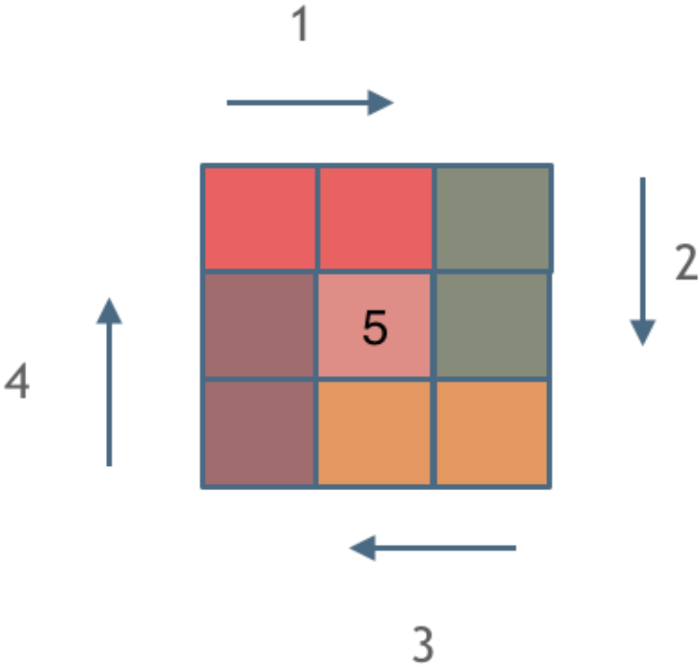

# 螺旋矩阵 II

## 题目

给你一个正整数 `n`，生成一个包含 `1` 到 `n2` 所有元素，且元素按顺时针顺序螺旋排列的 `n x n` 正方形矩阵 `matrix`。

**示例 1**：


```sh
输入：n = 3
输出：[[1,2,3],[8,9,4],[7,6,5]]
```

**示例 2**：

```sh
输入：n = 1
输出：[[1]]
```

**提示**：

- `1 <= n <= 20`

## 思路

坚持**循环不变量**原则。

模拟顺时针画矩阵的过程：

- 填充上行从左到右
- 填充右列从上到下
- 填充下行从右到左
- 填充左列从下到上

画每一条边时，坚持一致的**左闭右开原则**，统一进行绘画。



上图中每种颜色代表一条边，可见拐角处均由下一条边负责处理。

```go
func generateMatrix(n int) [][]int {
	matrix := make([][]int, n)
	for i := range matrix {
		matrix[i] = make([]int, n)
	}

	count := 1
	for layer := 0; layer < n/2; layer++ {
		for j := layer; j < n-layer-1; j++ {
			matrix[layer][j] = count
			count++
		}

		for i := layer; i < n-layer-1; i++ {
			matrix[i][n-layer-1] = count
			count++
		}

		for j := n - layer - 1; j > layer; j-- {
			matrix[n-layer-1][j] = count
			count++
		}

		for i := n - layer - 1; i > layer; i-- {
			matrix[i][layer] = count
			count++
		}
	}

	if n%2 == 1 {
		matrix[n/2][n/2] = count
	}

	return matrix
}
```

## 相关题目推荐

- [54.螺旋矩阵](https://leetcode.cn/problems/spiral-matrix/)
