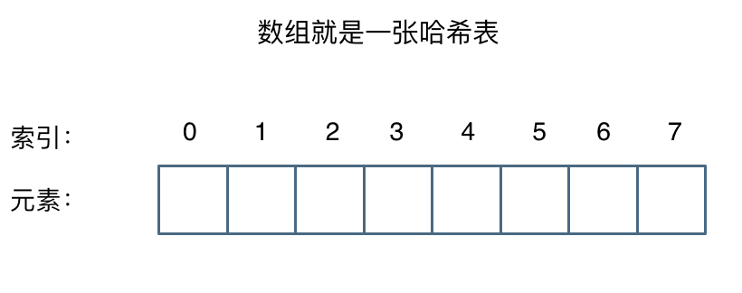
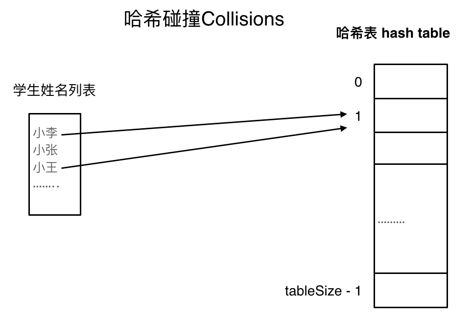

# 哈希表理论基础

## 哈希表

哈希表（Hash Table），又称散列表，是根据**关键码的值**而直接进行访问的数据结构。

举例来说，数组就是一张哈希表。

哈希表中的关键吗就是数组的索引下标，而后通过下标直接访问数组中的元素，例如：

**哈希表的作用是什么呢？**

一般而言哈希表都是用来<u>快速判断一个元素是否在集合中</u>。

例如要查询一个名字是否在这所学校中，若使用枚举，则时间复杂度为 `O(n)`，但是如果使用哈希表的话，只需要 `O(1)` 即可。

因此只需要初始化时，将学校中学生的名字都存入哈希表中，在查询时通过索引即可知道该学生是否在这所学校。

将学生姓名映射到哈希表上就涉及到了 Hash Function，即**哈希函数**。

## 哈希函数

哈希函数，例如把学生姓名直接映射为哈希表上的索引，而后就可以通过查询下标快速了解该学生是否在这所学校。

哈希表如下图所示，通过 `hashCode` 将名字转换为数值，一般而言，哈希函数通过**特定编码方式**，<u>将其他数据格式转换为不同的数值</u>，这样就可以把学生名字映射为哈希表上的索引数字。

若 `hashCode` 得到的数值大于哈希表的大小，也就是大于 `tableSize` 了，怎么做呢？

此时为了保证映射出来的索引数值均落于哈希表上，再进行一次取模操作，这样就可以保证学生名字一定映射到哈希表上。

此时又有，哈希表为一个数组，若<u>学生数量大于哈希表大小</u>时，此时就算哈希函数计算得再均匀，也避免不了有部分学生的名字同时映射到哈希表同一个索引下标的位置。

### 哈希碰撞

如图，小李和小王均映射到了索引下标 1 的位置，这一现象称为**哈希碰撞**。

一般哈希碰撞有两种解决方法，拉链法和线性探测法。

### 拉链法

刚刚小李和小王在索引 1 的位置发生了冲突，将发生冲突的元素均存储在链表中，这样就可以通过索引找到小李和小王。

> [!tip]
>
> 数据规模是 `dataSize`，哈希表大小是 `tableSize`。

其实拉链法就是要<u>选择适当的哈希表大小</u>，这样既不会因为数组空值而浪费大量内存，也不会因为链表太长而在查找上浪费过多时间。

### 线性探测法

使用线性探测法，一定要保证 `tableSize > dataSize`，需要依靠哈希表中的空位来解决碰撞问题。

例如冲突的位置现在有了小李，那么就找下一个空位放置小王的信息。因此要求 `tableSize` 一定要大于 `dataSize`，要不然哈希表上就没有空值的位置来存放冲突的数据。如图：

## 常见的三种哈希结构

使用哈希表来解决问题时，一般会选择：

- Array（数组）
- Set（集合）
- Map（映射）

以 C++ 为例，Set 提供三种数据结构：

| 集合                 | 底层实现 | 是否有序 | 数值是否可以重复 | 能否改变数值 | 查询效率   | 增删效率   |
| -------------------- | -------- | -------- | ---------------- | ------------ | ---------- | ---------- |
| `std::set`           | 红黑树   | 有序     | 否               | 否           | `O(log n)` | `O(log n)` |
| `std::multiset`      | 红黑树   | 有序     | 是               | 否           | `O(log n)` | `O(log n)` |
| `std::unordered_set` | 哈希表   | 无序     | 否               | 否           | `O(1)`     | `O(1)`     |

`std::unordered_set` 底层实现为哈希表，`std::set` 和 `std::multiset` 的底层实现是红黑树，红黑树是一种平衡二叉搜索树，因此 `key` 值是有序的，但 `key` 不可修改，改动 `key` 会导致整棵树错乱，因此只能删除和增加。

| 映射                 | 底层实现 | 是否有序   | 数值是否可以重复 | 能否改变数值 | 查询效率   | 增删效率   |
| -------------------- | -------- | ---------- | ---------------- | ------------ | ---------- | ---------- |
| `std::map`           | 红黑树   | `key` 有序 | `key` 否         | `key` 否     | `O(log n)` | `O(log n)` |
| `std::multimap`      | 红黑树   | `key` 有序 | `key` 是         | `key` 否     | `O(log n)` | `O(log n)` |
| `std::unordered_map` | 哈希表   | `key` 无序 | `key` 否         | `key` 否     | `O(1)`     | `O(1)`     |

`std::unordered_map` 底层实现是哈希表，`std::map` 和 `std::multimap` 的底层实现是红黑树。同理，`std::map` 和 `std::multimap` 的 `key` 是有序的。

当使用集合来解决哈希问题时，优先使用 `unordered_set`，因其查询和增删的效率是最优的；若集合需要有序，那么先使用 `set`，若不仅要求有序，还需要重复数据，那么用 `multiset`。

`map` 是一个键值对的数据结构，`map` 中对 `key` 是有限制的，而对 `value` 是没有限制的，因此 `key` 的存储方式是使用红黑树实现的。

虽然 `std::set` 和 `std::multiset` 的底层实现基于红黑树而非哈希表，它们通过红黑树来索引和存储数据。不过依旧可以使用哈希法（即依靠键来访问值）的方式使用。
