# 两个数组的交集

## 题目

给定两个数组 `nums1` 和 `nums2` ，返回它们的交集。输出结果中的每个元素一定是**唯一**的。我们可以**不考虑输出结果的顺序**。

**示例 1**：

```sh
输入：nums1 = [1,2,2,1], nums2 = [2,2]
输出：[2]
```

**示例 2**：

```sh
输入：nums1 = [4,9,5], nums2 = [9,4,9,8,4]
输出：[9,4]
解释：[4,9] 也是可通过的
```

**提示**：

- `1 <= nums1.length, nums2.length <= 1000`
- `0 <= nums1[i], nums2[i] <= 1000`

## 思路

由题目可知，**输出结构中的每个元素是唯一的，也就是说输出的结果是去重的，同时无序考虑输出结果的顺序**。

此题使用暴力解法的时间复杂度为 `O(n^2)`，因此使用哈希表进行进一步的优化。

> [!tip]
>
> 此题也可以使用数组作为哈希表，但是使用数组的题目，一般而言限制了**数值的大小**。
>
> 而且若哈希值**较少**、**特别分散**、**跨度非常大**，使用数组就会造成空间的极大浪费。



```go
func intersection(nums1 []int, nums2 []int) []int {
	set := make(map[int]struct{})
	for _, v := range nums1 {
		if _, ok := set[v]; !ok {
			set[v] = struct{}{}
		}
	}
	res := make([]int, 0)
	for _, v := range nums2 {
		if _, ok := set[v]; ok {
			res = append(res, v)
			delete(set, v)
		}
	}
	return res
}
```

- 时间复杂度：`O(n)`
- 空间复杂度：`O(n)`

使用数组的话：

```go
func intersection(nums1 []int, nums2 []int) []int {
	count1 := [1001]int{}
	count2 := [1001]int{}
	res := make([]int, 0)
	for _, v := range nums1 {
		count1[v] = 1
	}
	for _, v := range nums2 {
		count2[v] = 1
	}
	for i := range 1001 {
		if count1[i]+count2[i] == 2 {
			res = append(res, i)
		}
	}
	return res
}
```

