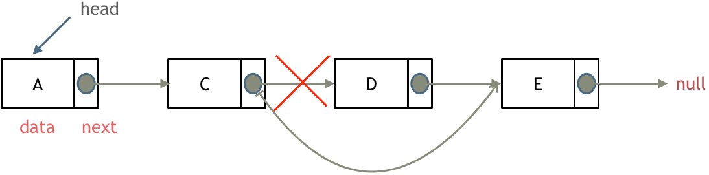

# 链表理论基础

**链表**是一种通过指针串联在一起的线性结构，每一个节点由两部分组成：一个是数据域，一个是指针域（存放指向下一个节点的指针），最后一个节点的指针域指向 `NULL`（空指针）。

链表的入口节点称为链表的头节点（即 `head`）。


## 链表的类型

### 单链表

上述图文说明的就是单链表。

### 双链表

单链表的指针域仅能指向节点的下一个节点。

而双链表中的每一个节点都**有两个指针域**，一个指向下一个节点，一个指向上一个节点。

因此双链表即可向前查询也可向后查询。


### 循环链表

循环链表，顾名思义就是**链表首尾相连**。

循环链表可以解决约瑟夫环问题。


## 链表存储方式

数组**在内存中是连续分布**的，而链表**在内存中非连续分布**。

链表是通过指针域的指针**连接在内存中的各个节点**。

因此链表中的节点在内存中并不是连续分布的，而是散乱分布于内存中的某地址上，分配机制取决于操作系统的内存管理。


上图中，链表的起始节点为 2，终止节点为 7，各个节点分布在内存中不同地址空间上，通过指针串联在一起。

## 链表定义

```go
type ListNode struct {
  Val int
  Next *ListNode
}
```

## 链表操作

### 删除节点

删除 D 节点：



只需将 C 节点的 `next` 指向 E 节点即可。

若为 C++，则需要手动释放这个 D 节点；若为 GC 语言（拥有内存回收机制），就无需手动释放。

### 添加节点


可以看出链表的增添和删除均为 `O(1)` 的操作，不会影响其他节点。

但是需要注意的是，要删除第 5 个节点时，需要从头查找第 4 个节点通过 `next` 指针进行删除操作，查找的时间复杂度为 `O(n)`。

## 性能分析

|      | 插入/删除（时间复杂度） | 查询（时间复杂度） | 适用场景                         |
| ---- | ----------------------- | ------------------ | -------------------------------- |
| 数组 | `O(n)`                  | `O(1)`             | 数据量固定、频繁查询、较少增删   |
| 链表 | `O(1)`                  | `O(n)`             | 数据量不固定、频繁增删、较少查询 |

数组在定义时，长度就是固定的，若想修改数组的长度，需要重新定一个新数组。

链表的长度可以不固定，并且可以动态增删，适合数量量不固定、频繁增删、较少查询的场景。
