# 两两交换链表中的节点

## 题目

给你一个链表，两两交换其中相邻的节点，并返回交换后链表的头节点。你必须在不修改节点内部的值的情况下完成本题（即，只能进行节点交换）。

**示例 1**：


```sh
输入：head = [1,2,3,4]
输出：[2,1,4,3]
```

**示例 2**：

```sh
输入：head = []
输出：[]
```

**示例 3**：

```sh
输入：head = [1]
输出：[1]
```

**提示**：

- 链表中节点的数目在范围 `[0, 100]` 内
- `0 <= Node.val <= 100`

## 思路

正常模拟即可。

建议使用虚拟头节点，要不然每次要针对头节点（没有前一个节点指向头节点）单独进行处理。

接下来进行相邻两节点的交换，**此时一定要画图**，便于了解先后顺序。

初始时，`prev` 指向虚拟头节点，然后进行如下三步：


操作之后，链表如下：



即：


Go 语言代码如下：

```go
func swapPairs(head *ListNode) *ListNode {
	dummy := &ListNode{Val: 0, Next: head}
	prev := dummy

	for prev.Next != nil && prev.Next.Next != nil {
		a := prev.Next
		b := a.Next.Next

		prev.Next = a.Next
		prev.Next.Next = a
		a.Next = b

		prev = a
	}

	return dummy.Next
}
```

- 时间复杂度：`O(n)`
- 空间复杂度：`O(1)`

使用递归方法，则有：

```go
func swapPairs(head *ListNode) *ListNode {
	if head == nil || head.Next == nil {
		return head
	}
	next := head.Next
	head.Next = swapPairs(next.Next)
	next.Next = head
	return next
}
```

- 时间复杂度：`O(n)`
- 空间复杂度：`O(n)`
