# 删除链表的倒数第 N 个节点

## 题目

给你一个链表，删除链表的倒数第 `n` 个结点，并且返回链表的头结点。

**示例 1**：


```sh
输入：head = [1,2,3,4,5], n = 2
输出：[1,2,3,5]
```

**示例 2**：

```sh
输入：head = [1], n = 1
输出：[]
```

**示例 3**：

```
输入：head = [1,2], n = 1
输出：[1]
```

**提示**：

- 链表中结点的数目为 `sz`
- `1 <= sz <= 30`
- `0 <= Node.val <= 100`
- `1 <= n <= sz`

**进阶**：你能尝试使用一趟扫描实现吗？

## 思路

双指针的经典应用，若要删除倒数第 `n` 个节点，让 `fast` 移动 `n` 步，然后让 `fast` 和 `slow` 同时移动，直至 `fast` 指向链表末尾，删掉 `slow` 所指向的节点即可。

分为以下几步：

定义 `fast` 指针和 `slow` 指针，初始值为虚拟头节点。



`fast` 首先走 `n+1` 步，之所以走 `n+1` 步，是因为如此同时移动 `slow` 时才能指向删除节点的上一个节点（方便进行删除操作）。



`fast` 和 `slow` 同时移动，直至 `fast` 指向末尾。


删除 `slow` 指向的下一个节点。



Go 代码如下：

```go
func removeNthFromEnd(head *ListNode, n int) *ListNode {
	dummy := &ListNode{Val: 0, Next: head}
	fast, slow := dummy, dummy
	for i := 0; i <= n; i++ {
		fast = fast.Next
	}
	for fast != nil {
		slow = slow.Next
		fast = fast.Next
	}
	slow.Next = slow.Next.Next
	return dummy.Next
}
```

- 时间复杂度：`O(n)`
- 空间复杂度：`O(1)`
