# 相交链表

## 题目

给你两个单链表的头节点 `headA` 和 `headB` ，请你找出并返回两个单链表相交的起始节点。如果两个链表没有交点，返回 `null` 。

图示两个链表在节点 `c1` 开始相交：


题目数据**保证**整个链式结构中不存在环。

> [!tip]
>
> 函数返回结果后，链表必须**保持其原始结构** 。

**示例 1**：


```sh
输入：intersectVal = 8, listA = [4,1,8,4,5], listB = [5,0,1,8,4,5], skipA = 2, skipB = 3
输出：Intersected at '8'
解释：相交节点的值为 8 （注意，如果两个链表相交则不能为 0）。
从各自的表头开始算起，链表 A 为 [4,1,8,4,5]，链表 B 为 [5,0,1,8,4,5]。
在 A 中，相交节点前有 2 个节点；在 B 中，相交节点前有 3 个节点。
```

**示例 2**：


```sh
输入：intersectVal = 2, listA = [0,9,1,2,4], listB = [3,2,4], skipA = 3, skipB = 1
输出：Intersected at '2'
解释：相交节点的值为 2 （注意，如果两个链表相交则不能为 0）。
从各自的表头开始算起，链表 A 为 [0,9,1,2,4]，链表 B 为 [3,2,4]。
在 A 中，相交节点前有 3 个节点；在 B 中，相交节点前有 1 个节点。
```

**示例 3**：


```sh
输入：intersectVal = 0, listA = [2,6,4], listB = [1,5], skipA = 3, skipB = 2
输出：null
解释：从各自的表头开始算起，链表 A 为 [2,6,4]，链表 B 为 [1,5]。
由于这两个链表不相交，所以 intersectVal 必须为 0，而 skipA 和 skipB 可以是任意值。
这两个链表不相交，因此返回 null 。
```

**提示**：

- `listA` 中节点数目为 `m`
- `listB` 中节点数目为 `n`
- `0 <= m, n <= 3 * 104`
- `1 <= Node.val <= 105`
- `0 <= skipA <= m`
- `0 <= skipB <= n`
- 如果 `listA` 和 `listB` 没有交点，`intersectVal` 为 `0`
- 如果 `listA` 和 `listB` 有交点，`intersectVal == listA[skipA + 1] == listB[skipB + 1]`

**进阶**：你能否设计一个时间复杂度 `O(n)` 、仅用 `O(1)` 内存的解决方案？

## 思路

简而言之，是球两个链表交点的**指针**。

> [!tip]
>
> 交点不是数值相等而是指针相等。

为了方便举例，这里假设节点元素数值相等，则节点指针相等。

当前 `currA` 指向链表 A 的头节点，`currB` 指向链表 B 的头节点：



求出这两个链表的长度，并且求出两个链表的差值，而后让 `currA` 移动到和 `currB` 末尾对齐的位置。



此时即可比较 `currA` 与 `currB` 是否相同。若不相同，同时向后移动 `currA` 及 `currB`；若 `currA == currB`，则找到交点。

否则循环退出，返回 `null`。

Go 代码如下：

```go
func getIntersectionNode(headA, headB *ListNode) *ListNode {
    currA, currB := headA, headB
    lenA, lenB := 0, 0
    for currA != nil {
        currA = currA.Next
        lenA++
    }
    for currB != nil {
        currB = currB.Next
        lenB++
    }
    currA, currB = headA, headB
    if lenA < lenB {
        lenA, lenB = lenB, lenA
        currA, currB = currB, currA
    }
    gap := lenA - lenB
    for i := 0; i < gap; i++ {
        currA = currA.Next
    }
    for currA != nil {
        if currA == currB {
            return currA
        }
        currA = currA.Next
        currB = currB.Next
    }
    return nil
}
```

- 时间复杂度：`O(n+m)`
- 空间复杂度：`O(1)`

另外一种思路是采用**双指针法+路径拼接**。

假设链表 A 长度为 `lenA`，链表 B 长度为 `lenB`，公共部分长度为 `lenC`，则：

- 链表 A 独有的长度为 `lenA - lenC`
- 链表 B 独有的长度为 `lenB - lenC`

这里定义两个指针 `l1` 和 `l2` 用来遍历，其中：

- `l1` 先遍历完 A，再从 B 的头节点遍历
- `l2` 先遍历完 B，再从 A 的头节点遍历
- 两个指针相遇时，相遇点即第一个公共节点（若无公共节点，则指向 `nil`）

分析两个指针的遍历路径，可以发现：

- 指针 `l1` 的总遍历路径为 `A 独有部分 + 公共部分 + B 独有部分`（`lenA + lenB - lenC`）
- 指针 `l2` 的总遍历路径为 `B 独有部分 + 公共部分 + A 独有部分`（`lenB + lenA - lenC`）

两者遍历速度相同，因此最终会在第一个公共节点处相遇；若无公共节点，两指针会各自遍历完对方链表，最后均指向 `nil`。

Go 代码如下：

```go
func getIntersectionNode(headA, headB *ListNode) *ListNode {
	l1, l2 := headA, headB

	for l1 != l2 {
		if l1 == nil {
			l1 = headB
		} else {
			l1 = l1.Next
		}

		if l2 == nil {
			l2 = headA
		} else {
			l2 = l2.Next
		}
	}

	return l1
}
```

- 时间复杂度：`O(n+m)`
- 空间复杂度：`O(1)`
