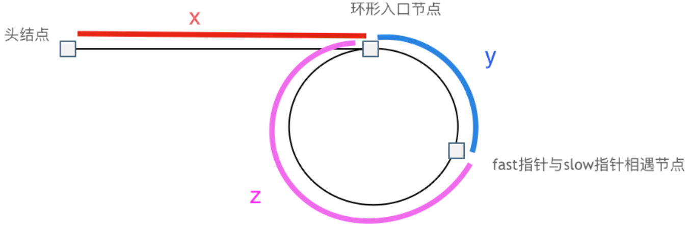

# 环形链表

## 题目

给定一个链表的头节点 `head` ，返回链表开始入环的第一个节点。 _如果链表无环，则返回 `null`。_

如果链表中有某个节点，可以通过连续跟踪 `next` 指针再次到达，则链表中存在环。 为了表示给定链表中的环，评测系统内部使用整数 `pos` 来表示链表尾连接到链表中的位置（**索引从 0 开始**）。如果 `pos` 是 `-1`，则在该链表中没有环。

> [!tip]
>
> **`pos` 不作为参数进行传递**，仅仅是为了标识链表的实际情况。

**不允许修改**链表。

**示例 1**：


```sh
输入：head = [3,2,0,-4], pos = 1
输出：返回索引为 1 的链表节点
解释：链表中有一个环，其尾部连接到第二个节点。
```

**示例 2**：


```sh
输入：head = [1,2], pos = 0
输出：返回索引为 0 的链表节点
解释：链表中有一个环，其尾部连接到第一个节点。
```

**示例 3**：


```sh
输入：head = [1], pos = -1
输出：返回 null
解释：链表中没有环。
```

**提示**：

- 链表中节点的数目范围在范围 `[0, 104]` 内
- `-105 <= Node.val <= 105`
- `pos` 的值为 `-1` 或者链表中的一个有效索引

**进阶**：你是否可以使用 `O(1)` 空间解决此题？

## 思路

主要考察知识点：

- 判断链表是否有环
- 若有环，如何找到这个环的入口

### 判断链表是否有环

可以使用<u>快慢指针法</u>，定义 `fast` 和 `slow` 指针，从头节点出发，`fast` 指针每次移动两个节点，`slow` 指针每次移动一个节点，若 `fast` 和 `slow` 指针在途中相遇，说明这个链表有环。

**为什么 `fast` 移动两个节点，`slow` 移动一个节点，有环的话，必定会在环中相遇呢？**

<span style="color:#CD2C58; font-weight:bold">首先明确，`fast` 指针必定先进入环中，若 `fast` 指针和 `slow` 指针相遇的话，必定是在环中相遇，这是毋庸置疑的。</span>

**为什么 `fast` 指针和 `slow` 指针一定会相遇呢？**

可以画一个环，而后让 `fast` 指针在任意一个节点追赶 `slow` 指针。

会发现：


`fast` 和 `slow` 各自再走一步，`fast` 和 `slow` 就相遇了。

因为 `fast` 移动两步，而· `slow` 移动一步，**其实相对于 `slow` 而言，`fast` 是一个节点、一个节点地靠近 `slow` 的**（可以类比相对速度），因此 `fast` 必定可以与 `slow` 重合。


### 若有环，如何找到这个环的入口

此时已经判断链表有环了，之后就要找到该环的入口了。

假设从头节点到环形入口节点的节点数为 `x`，环形入口节点到 `fast` 指针与 `slow` 指针相遇节点间的节点数为 `y`，从相遇节点到环形入口节点间的节点数为 `z`。



因此相遇时，`slow` 指针走过的节点数为 `x + y`，`fast` 指针走过的节点数为 `x + y + n * (y + z)`，`n` 为 `fast` 指针在环内走了 `n` 圈才遇到 `slow` 指针，`(y + z)` 为一圈内节点数 A。

因为 `fast` 指针是一次移动两个节点，而 `slow` 指针是一次移动一个节点，因此 <span style="color:#016B61; font-weight:bold">`fast` 指针移动的节点数</span>为 <span style="color:#FF3F7F; font-weight:bold">`slow` 指针移动的节点的两倍</span>。

$$
\begin{align*}
2(x + y) &= x + y + n(y + z) \\
(x + y) &= n(y + z) \\
x &= n(y + z) - y \\
x &= (n - 1)(y + z) + z \\
\end{align*}
$$

上述公式首先消去一个 `x + y`，而后因为题目中要求的是 `x`，因此提取出 `x`。

之后提取出一个 `y + z` 消去 `-y`，得到 `(n - 1) * (y + z) + z`。

> [!tip]
>
> 此处 `n` 必定大于等于 1，因为 `fast` 指针至少要多走一圈才可以遇到 `slow` 指针。

这个公式说明什么呢？

以 `n = 1` 举例，意味着 `fast` 指针在环形转了一圈后，就遇到了 `slow` 指针。

即公式化为 `x = z`。

这就意味着，**从头节点出发一个指针，从相遇节点出发一个指针，且这两个指针每次只走一个节点，那么当这两个指针相遇时，相遇处就是环形入口的节点**。

也就是在相遇节点处，定义一个 `index1`，在头节点出定义一个 `index2`。

让 `index1` 和 `index2` 同时移动，每次移动一个节点，那么它们相遇处就是环形入口的节点。


若 `n` 大于 1，即 `fast` 在环形中转 `n` 圈后才遇到 `slow` 指针，与 `n = 1` 的情况易知，可以通过相同的方法找到环形入口的入口节点。

只不过 `index1` 指针在环形中多转了 `n - 1` 圈，而后遇到 `index2`，相遇点依然是环形的入口节点。

```go
func detectCycle(head *ListNode) *ListNode {
	fast := head
	slow := head
	for fast != nil && fast.Next != nil {
		slow = slow.Next
		fast = fast.Next.Next
		if slow == fast {
			slow = head
			for slow != fast {
				slow = slow.Next
				fast = fast.Next
			}
			return slow
		}
	}
	return nil
}
```

- 时间复杂度：`O(n)`（在快慢指针相遇前，慢指针移动的步数小于链表长度 `n` ；相遇后，两个从头节点和相遇点出发的指针各自移动的步数也均小于 `n`。因此，整个过程的总移动次数不超过 `2n`）
- 空间复杂度：`O(1)`

### 补充

**为什么第一次在环中相遇，`slow` 的步数是 `x + y` 而非 `x + k * (y + z) + y` 呢？**


首先，在 `slow` 进入环形之前，`fast` 一定先进环形了。

若 `slow` 进环入口，`fast` 也位于环入口，将环展开后，有：



可以看出，若 `slow` 和 `fast` 同事在环入口开始走，必定会在环入口 3 相遇，此时 `slow` 走了一圈，而 `fast` 走了两圈。

推广，`slow` 进环时，`fast` 必定在环内的任意一个位置，此时有：



那么 `fast` 走到环入口 3 时，已经走了 `k + n` 个节点，而 `slow` 走了 `(k + n) / 2` 个节点。

因为 `k` 是小于 `n` 的，因此 `(k + n) / 2` 必定小于 `n`。

**也就是说，`slow` 一定没有走到环入口 3，而 `fast` 已经走到环入口 3 了。**

这就说明**在 `slow` 开始走的那一环已经与 `fast` 相遇了**。

而 `fast` 相对于 `slow` 是一次移动一个节点，必定无法跳过。
