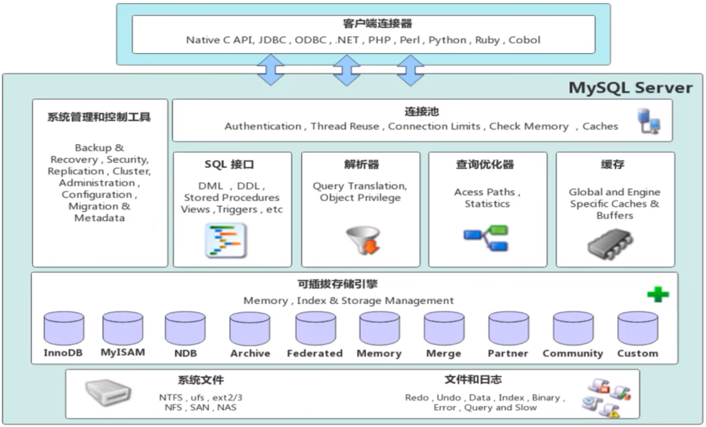
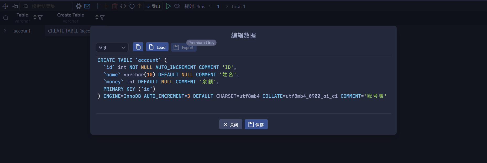
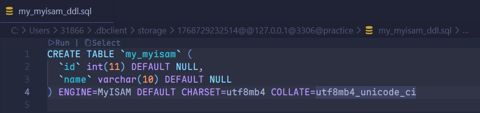
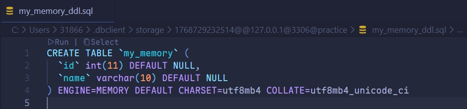
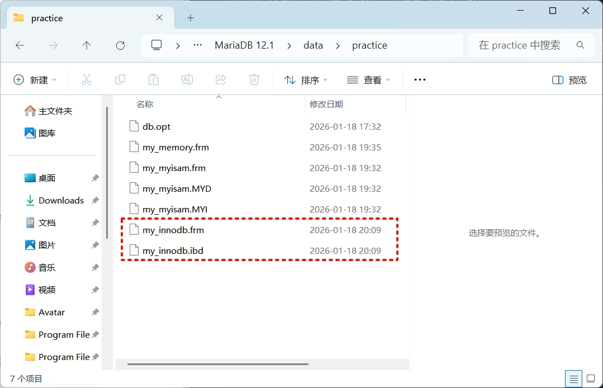
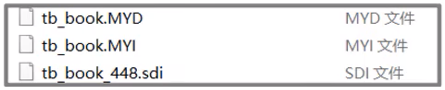
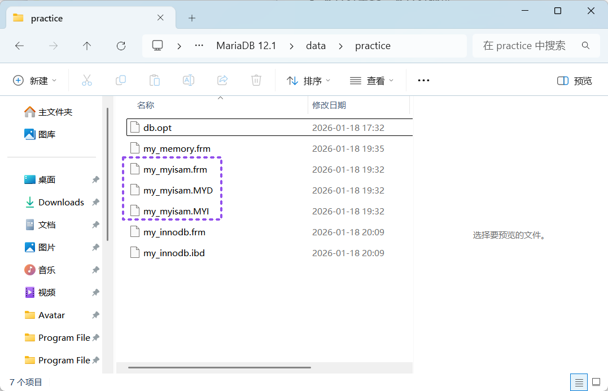
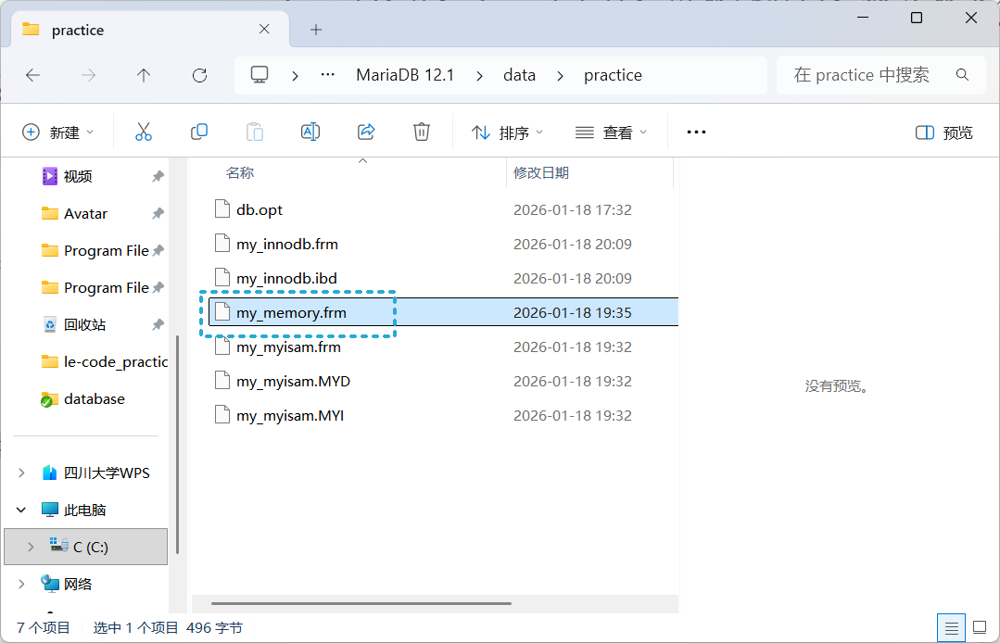

# 存储引擎

## MySQL 体系结构



- **连接层**：作为 MySQL 体系的最上层，负责对接客户端与各类连接服务，核心完成连接处理、授权认证及安全校验服务；并为每一个安全接入的客户端，验证其对应的数据库操作权限。
- **服务层**：第二层为核心服务层，承载了 MySQL 绝大多数的核心功能实现，包含提供 SQL 接口、查询缓存处理、SQL 语句的解析与优化，以及内置函数的执行；同时所有**跨存储引擎的统一功能**均在此层实现，例如存储过程、自定义函数等。
- **引擎层**：存储引擎是 MySQL 数据存储与提取的核心执行者，上层服务层通过统一的 API 接口与各类存储引擎完成通信交互；不同的存储引擎具备差异化的功能特性，可根据实际业务需求灵活选用适配的存储引擎。
- **存储层**：作为 MySQL 体系的最底层，核心将数据持久化存储至文件系统，并与上层存储引擎完成数据交互。

## 简介

**存储引擎**就是存储数据、建立索引、更新/查询数据等技术的实现方式。存储引擎是基于表的，而非基于库，因此存储引擎又可被称为表类型。

查询指定表的存储引擎：

```mysql
SHOW CREATE TABLE account;
```



在创建表时，指定存储引擎：

```mysql
CREATE TABLE 表名(
	字段1 字段1类型 [COMMENT 字段1注释],
  ...
  字段n 字段n类型 [COMMENT 字段n注释]
) ENGINE = InnoDB [COMMENT 表注释];
```

查看当前数据库支持的存储引擎：

```mysql
SHOW ENGINES;
```


创建表 `my_myisam`，并指定 MyISAM 存储引擎：

```mariadb
CREATE TABLE my_myisam (id INT, name VARCHAR(10)) ENGINE = MyISAM;
```



创建 `my_memory`，并指定 Memory 存储引擎：

```mariadb
CREATE TABLE my_memory (id INT, name VARCHAR(10)) ENGINE = Memory;
```



## 特点

### InnoDB

InnoDB 是一种兼顾高可靠性和高性能的通用存储引擎，在 MySQL 5.5 之后，InnoDB 是默认的 MySQL 存储引擎。

**特点**：

- DML 操作遵循 ACID 模型，支持<span style="color:#5B23FF">事务</span>。
- <span style="color:#5B23FF">行级锁</span>，提高并发访问性能。
- 支持<span style="color:#5B23FF">外键</span> `FOREIGN KEY` 约束，保证数据的完整性和正确性。

**文件**：

**`xxx.ibd`**：独立表空间文件（`xxx` 为表名）。当 `innodb_file_per_table=ON` 时，每张 InnoDB 表的数据和索引会单独存储于此。

> [!tip]
>
> MySQL 5.7 的表结构存放在独立的 `.frm` 文件中；而 MySQL 8.0 的表结构（SDI）已直接整合至 `.ibd` 文件内部。



> [!tip]
>
> MariaDB 是 MySQL 的开源分支，全程保留 `.frm` 文件，用于存储数据表结构。


### MyISAM

MyISAM 是 MySQL 早期默认的存储引擎。

**特点**：

- 不支持事务，不支持外键。
- 支持表锁，不支持行锁。
- 访问速度快。

**文件**：

- `xxx.sdi`：存储表结构信息
- `xxx.MYD`：存储数据
- `xxx.MYI`：存储索引





### Memory

Memory 存储引擎的表数据完全存储在内存中，受硬件故障、断电等影响会丢失数据，因此仅适合作为临时表或缓存使用。

**特点**：

- 内存存放
- Hash 索引（默认）

**文件**：

**`xxx.sdi`**：存储表结构信息。



---

|                      特点                       |        InnoDB        | MyISAM | Memory |
| :---------------------------------------------: | :------------------: | :----: | :----: |
|   <span style="color:#D02752">存储限制</span>   |         64TB         |   有   |   有   |
|   <span style="color:#D02752">事务安全</span>   |         支持         |   -    |   -    |
|    <span style="color:#D02752">锁机制</span>    |         行锁         |  表锁  |  表锁  |
| <span style="color:#D02752">B+Tree 索引</span>  |         支持         |  支持  |  支持  |
|  <span style="color:#D02752">Hash 索引</span>   |          -           |   -    |  支持  |
|   <span style="color:#D02752">全文索引</span>   | 支持（5.6 版本之后） |  支持  |   -    |
|   <span style="color:#D02752">空间使用</span>   |          高          |   低   |  N/A   |
|   <span style="color:#D02752">内存使用</span>   |          高          |   低   |  中等  |
| <span style="color:#D02752">批量插入速度</span> |          低          |   高   |   高   |
|   <span style="color:#D02752">支持外键</span>   |         支持         |   -    |   -    |

## 选择

在选择存储引擎时，应该根据应用系统的特点选择合适的存储引擎。对于复杂的应用系统，还可以根据实际情况选择多种存储引擎进行组合。

- **InnoDB**：是 MySQL 的默认存储引擎，支持事务、外键。若应用对事务的完整性有比较高的要求，在并发条件下要求数据的一致性，数据操作除了插入和查询之外，还包括很多的更新、删除操作，那么 InnoDB 存储引擎是比较合适的选择。
- **MyISAM**：若应用以读操作和插入操作为主，仅有很少的更新和删除操作，并且对事务的完整性、并发性要求不是很高，那么选择这个存储引擎是非常合适的。（被 MongoDB 替代）
- **Memory**：将所有数据保存在内存中，访问速度快，通常用于临时表及缓存。Memory 的缺陷就是对表的大小有限制，太大的表无法缓存在内存中，而且无法保障数据的安全性。（被 Redis 替代）

---

**知识回顾**：

1. **体系结构**：连接层、服务层、引擎层、存储层。

2. **存储引擎简介**：

   ```mariadb
   SHOW ENGINES;
   CREATE TABLE XXX(...) ENGINE=InnoDB;
   ```

3. **存储引擎特点**：

   **InnoDB 与 MyISAM**：事务、外键、行级锁。

4. **存储引擎应用**：

   - **InnoDB**：存储业务系统中对于事务、数据完整性要求极高的核心数据。
   - **MyISAM**：存储业务系统的非核心事务。
