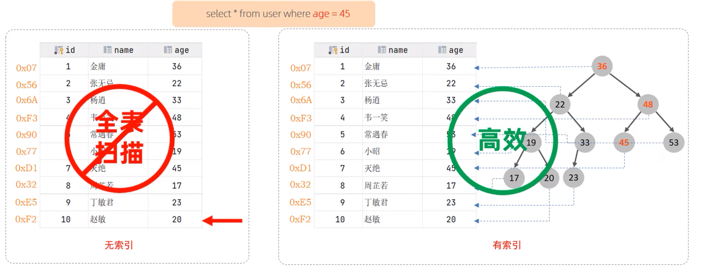
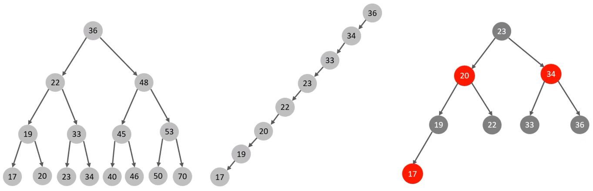
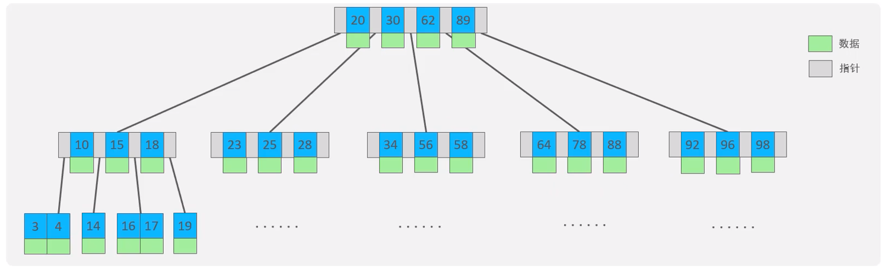
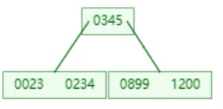
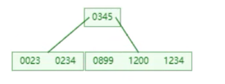
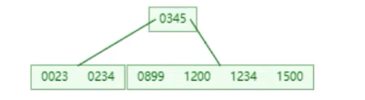
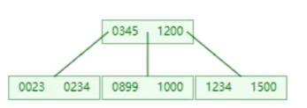

# 索引

## 概述

索引（index）是帮助 MySQL 高效获取数据的数据结构（有序）。在数据之外，数据库系统还维护着满足特定查找算法的数据结构，这些数据结构以某种方式引用（指向）数据，这样就可以在这些数据结构上实现高级查找算法，这种数据结构就是索引。

> [!tip]
>
> 上述二叉树索引结构仅为一个示意图，并非真实的索引结构。

|                             优势                             |                             劣势                             |
| :----------------------------------------------------------: | :----------------------------------------------------------: |
|          提高数据检索的效率，降低数据库的 I/O 成本           |                     索引列也需要占用空间                     |
| 通过索引列对数据表进行排序，降低数据排序的成本，降低 CPU 的消耗 | 索引大大提高了查询效率，同时却也降低更新表的速度，如对表进行 `INSERT`、`UPDATE`、`DELETE` 时，效率降低 |

## 结构

### 介绍

MySQL 的索引是在存储引擎层实现的，不同的存储引擎有不同的结构，主要包含以下几种：

|                    索引结构                    |                             描述                             |
| :--------------------------------------------: | :----------------------------------------------------------: |
| B+Tree 索引 | 最常见的索引，大部分引擎都支持 B+ 树索引 |
|                   Hash 索引                    | 底层数据结构是用哈希表实现的，只有精准匹配索引列的查询才有效，不支持范围查询 |
|               R-tree（空间索引）               | 空间索引是 MyISAM 引擎的一个特殊索引类型，主要用于地理空间数据类型，通常使用较少 |
|             Full-text（全文索引）              | 是一种通过建立倒排索引，快速匹配文档的方式；类似于 Lucene、Solr、ES |

|    索引     |      InnoDB      | MyISAM | Memory |
| :---------: | :--------------: | :----: | :----: |
| B+tree 索引 |       支持       |  支持  |  支持  |
|  Hash 索引  |      不支持      | 不支持 |  支持  |
| R-tree 索引 |      不支持      |  支持  | 不支持 |
|  Full-text  | 5.6 版本之后支持 |  支持  | 不支持 |

> [!tip]
>
> 无特别说明，索引均为 B+ 树结构组织。

### B-Tree

**二叉树**：

**缺点**：顺序插入时易退化为单链表，查询性能大幅下降；大数据量场景下树的层级过深，检索效率显著降低。

**红黑树**：大数据量情况下，层级较深，检索速度慢。

---

B-Tree，多路平衡查找树。

以最大度数（max-degree）为 5 的 5 阶 B-Tree 为例（每个节点最多存储 4 个 key、5 个指针）：

> [!tip]
>
> 树的度数指的是每一个节点的子节点个数。

插入 100、65、169、368、900、556、780、35、215、1200、234、888、158、90、1000、88、120、268、250 数据为例。

